# 复习#002 | 数字电路与逻辑设计

::: details
靠北，完全是预习欸😭所以软工学生为什么要学数字逻辑😵
:::

<embed src="/BemoDB/DLDoutline.pdf" type="application/pdf" width="100%" height="900px" />

- 以及第二章的列表化简法不考

## 概述

在第一章我们应该了解几个基础概念：数字系统、计数制及其转换、带符号的二进制数的代码表示以及编码。

### 数字系统

先从数字系统讲起：

数字系统是一个能对数字信号进行加工、传递和存储的实体，它由实现各种功能的数字逻辑电路相互连接而成，例如脉冲计数电路、测控系统、计算机等等。

上面我们引入了几个新概念：数字信号和数字逻辑电路，我们来分别阐述：

#### 数字信号

引入两个前置概念：

自然界中形形色色的物理量，尽管它们的性质各异，但就其变化规律的特点而言，分为两大类。

- 一类物理量的变化在时间上和数量上都是离散的。这类物理量常称为数字量。
- 另一类物理量的变化在时间上和数量上则是连续的。这类物理量常称为模拟量。

用来表示数字量的信号叫数字信号。我们把工作在数字信号下的电子电路叫做数字电路。

反之则称为模电，幸好不用学。

我们再来对数字信号进行一个详细的阐述：

**若信号的变化在时间上和数值上都是离散的，或者说断续的，则称为离散信号。离散信号的变化可以用不同的数字反映，所以又称为数字信号，简称为数字量。**

例如，学生成绩记录，工厂产品统计，电路开关的状态等。

数字系统要与模拟信号发生联系时则必须经过转换电路对信号类型进行变换。

#### 数字电路

用来处理数字信号的电子线路称为数字电路。由于数字电路的各种功能是通过`逻辑运算和逻辑判断`来实现的，所以数字电路又称为数字逻辑电路或者逻辑电路。

数字电路特点有三：

- 二进制：数字电路一般都中采用二进制来表征数字信号，也就是说数字信号只有"0"和"1"两个值。
- 稳定性好：凡具有两个稳态的器件均可用来实现数字电路，电路允许器件有较大的分散性。
- 抗干扰能力强：数字电路传递、加工和处理的是二值信息，且高低电平指的是一定的电压范围，FF不易受外界干扰。
                            
这些特点便于信号的长期存储且能赋予一定的加密，通用性较强，分析工具为逻辑运算、结构简单等等。

#### 数字电路的分类

从器件的物理特性可以分为：

- TTL
- CMOS

从器件的逻辑特性可以分为：

- 组合逻辑电路
- 时序逻辑电路

这是根据一个电路是否有记忆功能来分类的。

从器件的规模可以分为：

- SSI
- MSI
- LSI
- VLSI

从上到下依次为小、中、大、极大。

::: tip 对组合/时序逻辑电路的详细阐述：
如果一个逻辑电路`在任何时刻的稳定输出仅取决于该时刻的输入，而与电路过去的输入无关`，则称为组合逻辑电路，故而不需要记忆功能。

如果一个逻辑电路`在任何时刻的稳定输出不仅取决于该时刻的输入，而且与过去的输入相关`，则称为时序逻辑电路。需要一些特定的模块来进行记忆；而根据是否有统一的时钟信号进行同步则又可进一步分为同步/异步时序逻辑电路。
:::

#### 数字电路的研究方法

对数字系统中逻辑电路的研究有俩主要任务：

- 逻辑分析：对一个已有的数字逻辑电路，研究它的工作性能和逻辑功能称为逻辑分析。

- 逻辑设计：根据提出的逻辑功能，在给定条件下构造出实现预定功能的逻辑电路称为逻辑设计，或者逻辑综合。

现在有很多种设计方法，这里按过不表。我们需要学习的应该还是传统方法。

### 计数制及其转换

#### R进制

常用的进制有二/八/十/十六几种进制，它们都是R进制的情况之一。

广义地说，一种进位计数制包含着`基数和位权`两个基本的因素

基数指的是计数制中所用到的数字符号的个数。在基数为R计数制中，包含0、1、…、R-1共R个数字符号，进位规律是"逢R进一"。称为R进位计数制，简称R进制。

位权是指在一种进位计数制表示的数中，用来表明不同数位上数值大小的一个固定常数。不同数位有不同的位权，某一个数位的数值等于这一位的数字符号乘上与该位对应的位权。R进制数的位权是R的整数次幂。

例如，十进制数的位权是10的整数次幂，其个位的位权为10^0，十位的位权是10^1。

R进制数N可以两种方法表示，举个例子 10进制 的 123

- 并列表示法： 123
- 按权展开法： 1* 10 ^ 2 + 2 * 10 ^ 1 + 3 * 10 ^ 0

对于其它进制也一样。

关于不同数制的四则计算这里就省略了。

#### 数制转换

在这里主要讨论三种转换：十进制和二进制之间的转换、八进制和二进制之间的转换、十六进制和二进制之间的转换。

##### 十进制和二进制之间的转换

对于二进制数转换为十进制数，直接展开到十进制；

对于十进制数转换为二进制数，应该对整数和小数分别进行处理：对于整数直接除2取余；

对于小数部分则乘2直到小数部分为0或者达到规定精度要求。例子如下：

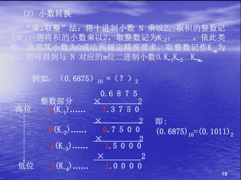

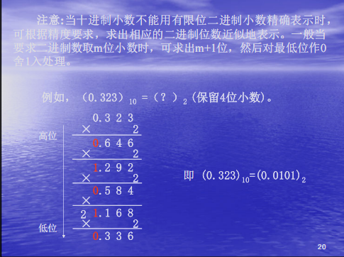

如果同时包含整数和小数的十进制数，则分别转换后合并即可。

##### 八进制和二进制之间的转换

由于八进制的基本数字符号0～7正好和3位二进制数的取值000～111对应。所以，二进制数与八进制数之间的转换可以按位进行。

二进制数转换成八进制数：以小数点为界，分别往高、往低每3位为一组，最后不足3位时用0补充，然后写出每组对应的八进制字符，即为相应八进制数。

举个例子：

二进制：11100101.010 -> 八进制：345.2

相反的，八进制转为二进制也是这么做

##### 十六进制和二进制之间的转换

方法和八进制和二进制之间的转换一样，举个例子：

十六进制：5A.B -> 二进制：1011010.1011

### 带符号的二进制数的代码表示

我们之前聊到数字系统中常用二进制来表示数，这被称作机器数/机器码。

常见的机器码有原码、反码和补码三种，权当复习一下：

#### 原码

符号位用0表示正，1表示负；数值位保持不变。原码表示法又称为符号—数值表示法。

对于二进制小数，举个例子就能明白：

`X = +0.1011 ; Y = -0.1011`

则它们的源码分别为：

`A = 0.1011 ; B = 1.1011`

对于整数是一样的：

`X = +1101 ; Y = -1101`

它们的原码分别为：

`A = 01101 ; B = 11101`

由于原码的加减运算需要考虑符号和大小，需要引入反码和补码来克服这个缺点。

#### 反码

带符号二进制数的反码表示为：

- 符号位
  - 用 0 表示 正
  - 用 1 表示 负

- 数值位
  - 正数反码的数值位和真值的数值位相同
  - 负数反码的数值位是真值的数值位逐个取反

也就是，对于一对相反数的真值，它们分别的反码，逐位都是相反数。

当我们利用反码进行真值加减法运算时，均可通过加法实现，也就是：

`X - Y = X + (-Y)`

运算时，符号位和数值位一样参加运算。**当符号位有进位产生时，应将进位加到运算结果的最低位，才能得到最后结果。**

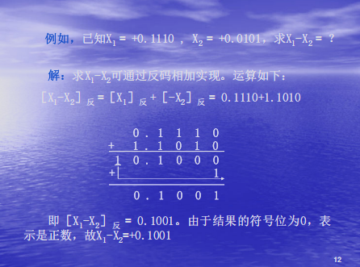

#### 补码

对于符号位和上面两种一样：

- 用 0 表示 正
- 用 1 表示 负

- 数值位
  - 正数反码的数值位和真值的数值位相同
  - 负数反码的数值位是真值的数值位逐个取反，**之后在最低位 +1**

同样的，运用补码进行加减运算时，也可以转换为加法，不过和反码有所不同：

运算时，符号位和数值位一样参加运算，若符号位有
进位产生，**则应将进位丢掉后才能得到正确结果。**

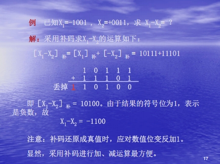

### 编码

#### 常用编码

用4位二进制代码对十进制数字符号进行编码，简称为二-十进制代码，也称为BCD码，常见的有8421码、2421码和余3码。

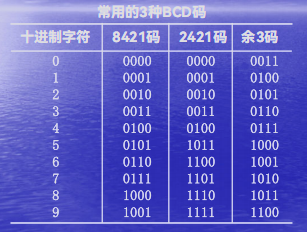

##### 8421码

8421码，是用4位二进制码表示一位十进制字符的一种有权码，4位二进制码从高位至低位的权依次为2^3、2^2、2^1、2^0，即为8、4、2、1

举个例子：

`10进制数：28 = 2进制数：11100 = 8421码：00101000`

##### 2421码

用4位二进制码表示一位十进制字符的另一种有权码，4位二进制码从高位至低位的权依次为2、4、2、1,故称为2421码。

举个例子：

`2421码：1101 = 10进制数：7`

2421码和十进制数之间的转换也是按位进行的。

::: warning 2421码的特性
- 2421码不具备单值性。例如，0101和1011都对应十进制数字5。为了与十进制字符一一对应，2421码不允许出现0101～1010的6种状态。

- 2421码是一种对9的自补代码。即一个数的2421码只要自身按位变反，便可得到该数对9的补数的2421码。

例如：

`4 - 0100 -> 5 - 1011`
:::

##### 余3码

是由8421码加上0011形成的一种无权码，由于它的每个字符编码比相应8421码多3，故称为余3码。

例如，十进制字符 5 的余3码是 5 的8421码 0101 加上 0011 ，为 1000.

::: warning 
- 余3码中不允许出现0000、0001、0010、1101、1110和1111六种状态
- 余3码与十进制数进行转换时，每位十进制数字的编码都应余3。
- 余3码是一种对9的自补代码
:::

#### 可靠性编码

为了减少或者发现代码在形成和传送过程中都可能发生的错误/提高系统的可靠性。形成了各种编码方法。下面，介绍两种常用的可靠性编码：

##### 格雷码

格雷码的特点是任意两个相邻的数，其格雷码仅有一位不同，这能避免代码形成或变换过程中产生的错误。

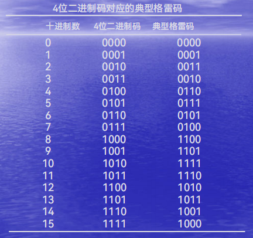

::: tip 为什么能避免代码在形成或者变换过程中产生错误?

数字系统中，数是用电子器件的状态表示的，数据的变化即器件状态的变化。如当数据按升序或降序变化时，若采用普通二进制数，则每次增1或者减1可能引起若干位发生变化。

比如 0111 变成 1000。

当电子器件变化速度不一致时，便会产生错误代码。

而格雷码因为相邻的数只有一位不同，从根本上杜绝了这种情况的发生。
:::

如果想要将二进制码转为格雷码可以参考下图：

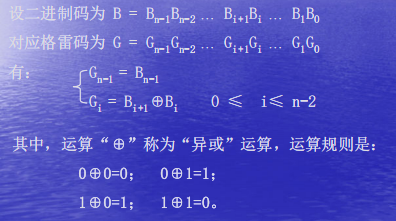


而将格雷码转为二进制码，则是使用格雷码的最高位作为二进制的最高位，二进制次高位产生过程是使用二进制的高位和次高位格雷码相异或得到，其他位的值与次高位产生过程类似。

##### 奇偶检验码

奇偶检验码是一种用来检验代码在传送过程中是否产生错误的代码。

由两部分组成：
- 信息位：位数不限的一组二进制代码
- 奇偶检验位：仅有一位

有两种编码方式如下：

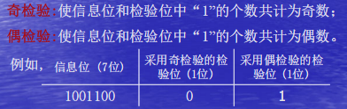

对于8421码的奇偶检验码：

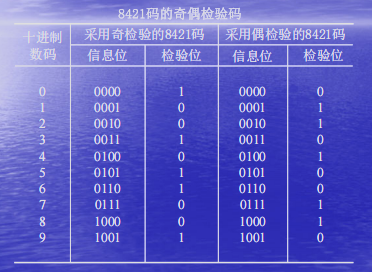

::: tip 奇偶检验码的特点
- 编码简单、容易实现

- 只有检验能力，无法纠错

- 只能发现任何奇数个错误，对任何偶数个错误无法处理
  - 举个例子，1011001，偶校验位为 0，则发送原信息为 10110010
    - 如果出现一个错误：变成了 10010010 ，经过校验可以发现；
    - 如果出现两个错误：变成了 10000010 ，经过校验发现还是偶数，则会通过。
:::

#### 字符编码

数字系统中处理的数据除了数字之外，还有字母、运算符号、标点符号以及其他特殊符号,人们将这些符号统称为字符。所有字符在数字系统中必须用二进制编码表示，通常将其称为字符编码。

最常见的就是 ASCII 码，它使用 7位二进制码 表示 128 种字符：

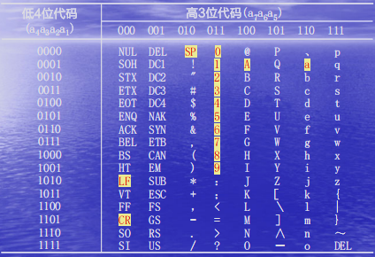

## 逻辑代数基础

### 逻辑代数基本概念

我们将从逻辑代数/逻辑变量/逻辑运算/逻辑函数来介绍。

#### 什么是逻辑代数？

逻辑代数L是一个封闭的代数系统，它由一个逻辑变量集K，常量0和1以及"或"、"与"、"非"三种基本运算所构成，记为`L={ K, +, ·, ', 0, 1 }`。该系统应满足下列公理:

- 交换律
- 结合律
- 分配律
- 0-1律
- 互补律
  
具体的公理描述可见 PPT2.1 P 3~4

#### 逻辑变量和逻辑运算

逻辑代数和普通代数一样，是用字母表示其值可以变化的量，即逻辑变量,在这里简称变量。所不同的是：

- 普通代数中，变量取值可为任意实数；而逻辑变量的取值只能为 0 或 1
- 逻辑值 0 或 1 是用来表示矛盾双方和判断真伪的形式符号，这也就意味着无大小和正负之分。数字系统中，开关状态、电压高低、晶体管导通状态均可用这两个逻辑值来表示。

--- 

逻辑代数种定义了 与、或、非 三种基本运算

##### 或运算

如果决定某一事件是否发生的多个条件中，只要有一个或一个以上条件成立，事件便可发生，则这种因果关系称之为"或"逻辑。

逻辑代数中，"或"逻辑用"或"运算描述。其运算符号为`+`。

表达式如下：

`F = A + B`

0和1的或运算法则显然，不做赘述。

实现或运算关系的逻辑电路称为或门。例如并联开关A、B控制灯F。

##### 与运算

如果决定某一事件发生的多个条件必须同时具备，事件才能发生，则这种因果关系称之为"与"逻辑。

在逻辑代数中，"与"逻辑关系用"与"运算描述。其运算符号为`·`。两变量"与"运算关系可表示为：

`F = A · B`

0和1的与运算法则显然，不做赘述。

实现与运算关系的逻辑电路称为与门，例如串联开关A、B控制灯F。

##### 非运算

如果某一事件的发生取决于条件的否定，即事件与事件发生的条件之间构成矛盾，则这种因果关系称为"非"逻辑。

在逻辑代数中，"非"逻辑用"非"运算描述。其运算符号为 `'` (撇号) 或在变量上方加一横杠 `¯`。"非"运算的逻辑关系可表示为：

`F = A'`

显然，0非等于1，1非等于0.

开关A和灯F并联，可以表示为非运算关系

#### 逻辑函数

逻辑代数中函数的定义与普通代数中函数的定义类似，
即随自变量变化的因变量。但和普通代数中函数的概念相
比，逻辑函数具有如下特点：

- 逻辑函数只能取 0 或 1
- 函数和变量之间的关系是由 与或非 三种基本运算决定的

逻辑函数有3种表示法，分别为逻辑表达式，真值表，卡诺图。

对于逻辑表达式：

- 非运算符下可以不加括号
- 与运算符一般可省略
- 运算优先规则：() > 非 > 与 > 或
  
对于真值表，有n个变量的逻辑函数，真值表有 2^n 行。

卡诺图是由表示逻辑变量所有取值组合的小方格所构成的平面图。卡诺图在函数简化问题很有用，后面会详细介绍，另外，下面是图例：

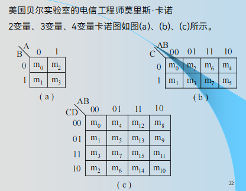

### 逻辑代数的基本定理和规则

#### 基本定理

根据前面我们给出的 5 个公理，我们可以推出 8 组常见的定理：

1.  **重叠律(等幂律)**
    *   `A + A = A`
    *   `A · A = A`

2.  **还原律(双重否定律)**
    *   `(A')' = A`

3.  **吸收律**
    *   `A + AB = A`
    *   `A(A + B) = A`

4.  **冗余律**
    *   `A + A'B = A + B`
    *   `A(A' + B) = AB`

5.  **并项律**
    *   `AB + AB' = A`
    *   `(A + B)(A + B') = A`

6.  **反演律(德摩根定律)**
    *   `(A + B)' = A' · B'`
    *   `(A · B)' = A' + B'`

7.  **推广的德摩根定律**
    *   `(A + B + C + ...)' = A' · B' · C' ...`
    *   `(A · B · C · ...)' = A' + B' + C' ...`

8.  **一致性定理**
    *   `AB + A'C + BC = AB + A'C`
    *   `(A + B)(A' + C)(B + C) = (A + B)(A' + C)`

::: tip 关于一致性定理的证明如下：

:::

#### 重要规则

逻辑代数有3条重要规则，即代入规则、反演规则和对偶规则。

##### 代入规则
在任何逻辑等式中，如果以一个逻辑函数（或者逻辑表达式）代替等式中的某个变量，则等式仍然成立。

例如，在 `A + A' = 1` 中，如果用 `B+C` 代替 `A`，则有 `(B+C) + (B+C)' = 1`，该等式仍然成立。

##### 反演规则
求一个逻辑函数 F 的反函数 F'，可以遵循以下步骤：
1. 将 F 表达式中的 `·` 换成 `+`，`+` 换成 `·`。
2. 将 F 表达式中的 `0` 换成 `1`，`1` 换成 `0`。
3. 将 F 表达式中的原变量换成反变量，反变量换成原变量。

::: tip
需要注意的是，在变换时必须保持原有的运算顺序，必要时需要加括号。
:::

例如，`F = A(B+C) + D'`，其反函数为 `F' = (A' + B'C')(D)`。

##### 对偶规则
求一个逻辑函数 F 的对偶式 F_D，可以遵循以下步骤：
1. 将 F 表达式中的 `·` 换成 `+`，`+` 换成 `·`。
2. 将 F 表达式中的 `0` 换成 `1`，`1` 换成 `0`。

::: tip
变量本身保持不变。对偶规则表明，若一个逻辑等式成立，则其对偶式也一定成立。
:::

例如 `A + 1 = 1` 的对偶式是 `A · 0 = 0`。
`A + BC = (A+B)(A+C)` 的对偶式是 `A(B+C) = AB+AC`。

#### 复合逻辑

实际应用中广泛采用"与非"门、"或非"门、"与或非"门、"异或"门等门电路。这些门电路输出和输入之间的逻辑关系可由3种基本运算构成的复合运算来描述，故通常将这种逻辑关系称为复合逻辑，相应的逻辑门则称为复合门。

##### 与非逻辑 (NAND)
"与非"逻辑是先对输入信号进行"与"运算，然后再对"与"运算的结果进行"非"运算。
其逻辑表达式为：`F = (A · B)'`

##### 或非逻辑 (NOR)
"或非"逻辑是先对输入信号进行"或"运算，然后再对"或"运算的结果进行"非"运算。
其逻辑表达式为：`F = (A + B)'`

##### 与或非逻辑 (AND-OR-INVERT)
"与或非"逻辑是先对某些输入信号进行"与"运算，再将这些"与"运算的结果与其他输入信号进行"或"运算，最后对整个结果进行"非"运算。
例如，两路两输入与或非门的逻辑表达式为：`F = (AB + CD)'`

##### 异或逻辑 (XOR)
"异或"逻辑的规则是：当两个输入变量的取值不同时，输出为1；当取值相同时，输出为0。
其逻辑表达式为：`F = A ⊕ B = A'B + AB'`
"异或"也称为"半加"运算。

#### 同或逻辑 (XNOR)
"同或"逻辑的规则是：当两个输入变量的取值相同时，输出为1；当取值不同时，输出为0。它与"异或"逻辑互补。
其逻辑表达式为：`F = A ⊙ B = A'B' + AB`

### 逻辑函数的表示形式

任何一个逻辑函数，其表达式的形式都不是唯一的。下面从分析与应用的角度出发，介绍逻辑函数表达式的基本形式、标准形式及其相互转换。

#### 逻辑函数表达式的两种基本形式

##### 与-或表达式 (SOP)
由若干个"与"项（乘积项）进行"或"运算构成的表达式。
例如： `F = AB + BC + AC`

##### 或-与表达式 (POS)
由若干个"或"项（和项）进行"与"运算构成的表达式。
例如： `F = (A+B)(B+C)(A+C)`

#### 逻辑函数表达式的标准形式

为了使逻辑函数的表示具有唯一性，引入了标准形式。

##### 最小项和标准与-或表达式
- **最小项**：对于一个n变量的逻辑函数，一个包含全部n个变量的乘积项称为最小项。每个变量以原变量或反变量的形式出现一次。n个变量共有 2^n 个最小项。
- **标准与-或表达式**：也称为**最小项规范式**，是由函数的全部最小项"或"运算构成的表达式。

例如，对于三变量函数 `F(A, B, C)`，最小项 `A'BC` (m3) 只有在 `A=0, B=1, C=1` 时值为1。一个函数的标准与-或表达式就是所有使其值为1的最小项之和。
`F(A,B,C) = ∑m(i1, i2, ...)`

##### 最大项和标准或-与表达式
- **最大项**：对于一个n变量的逻辑函数，一个包含全部n个变量的和项称为最大项。每个变量以原变量或反变量的形式出现一次。n个变量共有 2^n 个最大项。
- **标准或-与表达式**：也称为**最大项规范式**，是由函数的全部最大项"与"运算构成的表达式。

例如，对于三变量函数 `F(A, B, C)`，最大项 `A+B'+C'` (M3) 只有在 `A=0, B=1, C=1` 时值为0。一个函数的标准或-与表达式就是所有使其值为0的最大项之积。
`F(A,B,C) = ∏M(j1, j2, ...)`

::: tip 最小项与最大项的关系
同一个下标 i 的最小项 mi 和最大项 Mi 互为反函数，即 `mi' = Mi`。
:::

#### 逻辑函数表达式的转换

##### 任意表达式 → 标准与-或表达式
1.  首先将表达式化为与-或形式。
2.  检查每个与项，如果缺少某个变量 `X`，则将该项乘以 `(X+X')`。
3.  展开表达式，并删除重复的最小项。

例如，将 `F = A + B'C` 化为标准与-或式：
`F = A(B+B')(C+C') + (A+A')B'C`
`= (AB+AB')(C+C') + AB'C + A'B'C`
`= ABC+ABC'+AB'C+AB'C' + AB'C + A'B'C`
`= ABC+ABC'+AB'C+AB'C' + A'B'C`
`= ∑m(1, 4, 5, 6, 7)`

##### 任意表达式 → 标准或-与表达式
1.  首先将表达式化为或-与形式。
2.  检查每个或项，如果缺少某个变量 `X`，则将该项加上 `XX'`。
3.  利用分配律 `(X+YZ)=(X+Y)(X+Z)` 展开，并删除重复的最大项。

##### 标准与-或式 ↔ 标准或-与式
利用最小项和最大项的互补关系。
如果一个n变量函数 `F = ∑m(i...)`，那么它的反函数 `F' = ∑m(j...)`，其中 `j` 是在 `0` 到 `2^n - 1` 中所有未在 `i` 中出现的下标。
对 `F'` 应用德摩根定律，即可得到 `F` 的标准或-与表达式 `F = ∏M(j...)`。

例如，`F(A,B,C) = ∑m(1, 4, 5, 6, 7)`，则其最大项下标为 `0, 2, 3`。
所以 `F(A,B,C) = ∏M(0, 2, 3)`。
  
### 逻辑函数化简

一般来说，逻辑函数表达式越简单，设计出来的相应逻辑电路也就越简单。

我们有3种常用方法：代数化简法、卡诺图化简法、列表化简法。这里我们只介绍前两个方法。

#### 代数化简法

代数化简法是利用逻辑代数的基本定律和定理，对逻辑表达式进行合并、吸收、消去等操作，以得到最简表达式的方法。这种方法比较灵活，但需要一定的技巧和经验，且难以判断结果是否为最简。

常用的技巧有：
1.  **并项**：利用 `AB + AB' = A` 来合并项。
2.  **吸收**：利用 `A + AB = A` 来吸收项。
3.  **消去**：利用 `A + A'B = A + B` 或一致性定理 `AB + A'C + BC = AB + A'C` 来消去冗余项。
4.  **配项**：乘以 `(A+A')` 或加上 `AA'` 来创造可以化简的项。

**示例：**
化简逻辑函数 `F = A'B'C + A'BC + AB'C`
```
F = A'C(B' + B) + AB'C  // 提取公因式 A'C
  = A'C · 1 + AB'C       // B' + B = 1
  = A'C + AB'C         //
  = C(A' + AB')          // 提取公因式 C
  = C(A' + B')           // A' + AB' = A' + B'
  = A'C + B'C          // 展开
```

#### 卡诺图化简法

卡诺图化简法是一种高效的图形化工具，用于简化布尔函数。它利用图形的邻接性直观地找出可以合并的最小项，从而得到最简的"与-或"表达式。对于含有2到4个变量的函数，此方法尤为直观和便捷。

##### 卡诺图的核心思想：逻辑相邻性

卡诺图的巧妙之处在于它的布局。所有小方格都按照格雷码的顺序排列，这保证了任何两个在物理上相邻（上下、左右、甚至首尾相卷）的方格，其对应的最小项只有一个变量是不同的。

::: tip 为什么逻辑相邻性很重要？
根据布尔代数的基本定理 `XY + XY' = X`，两个只有一个变量不同的最小项可以合并，并消去那个不同的变量。卡诺图通过将这些"逻辑相邻"的项在图中"物理相邻"，使得我们可以通过"圈圈"这种直观的方式，快速完成合并与化简。
:::

##### 卡诺图的结构
- **三变量卡诺图**

| A\BC | 00 | 01 | 11 | 10 |
| :--: |:--:|:--:|:--:|:--:|
| **0**  | m0 | m1 | m3 | m2 |
| **1**  | m4 | m5 | m7 | m6 |

- **四变量卡诺图** (注意行列都是格雷码顺序 `00, 01, 11, 10`)

| AB\CD | 00 | 01 | 11 | 10 |
| :---: |:--:|:--:|:--:|:--:|
| **00**  | m0 | m1 | m3 | m2 |
| **01**  | m4 | m5 | m7 | m6 |
| **11**  | m12| m13| m15| m14|
| **10**  | m8 | m9 | m11| m10|

##### 化简步骤与策略

1.  **绘制与填充卡诺图**：根据逻辑函数的真值表或最小项表达式，在卡诺图对应的小方格中填入"1"。函数值为"0"的方格留空即可。

2.  **圈出相邻的"1"**：用矩形圈包围相邻的"1"。
    - **圈图规则**：
        - 圈必须是矩形。
        - 圈内"1"的个数必须是 2 的整数次幂（1, 2, 4, 8, ...）。
        - 圈越大越好。一个包含 2^k 个"1"的圈可以消去 k 个变量。
        - 圈的总数越少越好，这对应于最简表达式中更少的乘积项。
        - 所有的"1"都必须被至少一个圈覆盖。
        - 为了画出更大的圈，一个"1"可以被重复圈在不同的圈中。
        - 记住卡诺图的边界是"卷曲"的，即第一行与最后一行相邻，第一列与最后一列相邻。

3.  **从圈写出最简与项**：每一个圈对应一个化简后的"与"项。
    - 观察圈内的所有方格。
    - 如果某个变量在圈内所有方格中都保持为"1"，则将该原变量写入项中。
    - 如果某个变量在圈内所有方格中都保持为"0"，则将该反变量写入项中。
    - 如果某个变量在圈内既有"0"也有"1"，说明该变量已被消去，不用写入项中。

4.  **合并与项**：将所有从圈中得到的"与"项进行"或"运算，就得到了最终的最简"与-或"表达式。

**示例：**
化简 `F(A,B,C) = ∑m(1, 4, 5, 6, 7)`
1.  **填图**:
    | A\BC | 00 | 01 | 11 | 10 |
    | :--: |:--:|:--:|:--:|:--:|
    | **0**  |    | 1  |    |    |
    | **1**  | 1  | 1  | 1  | 1  |

2.  **圈"1"**:
    - **圈1 (大圈)**: 圈起第二行的四个"1" (`m4, m5, m7, m6`)。
    - **圈2 (竖圈)**: 圈起第二列的两个"1" (`m1, m5`)，注意 m5 被重复圈了。

3.  **写表达式**:
    - **分析圈1**: 覆盖了 `m4(100), m5(101), m7(111), m6(110)`。
        - 变量 `A` 始终为 **1**。
        - 变量 `B` 和 `C` 都有 0 和 1，被消去。
        - -> 得到与项：`A`
    - **分析圈2**: 覆盖了 `m1(001), m5(101)`。
        - 变量 `A` 有 0 和 1，被消去。
        - 变量 `B` 始终为 **0**。
        - 变量 `C` 始终为 **1**。
        - -> 得到与项：`B'C`

4.  **最终结果**: `F = A + B'C`

##### 处理无关项 (Don't Cares)

在某些实际电路中，一些输入组合永远不会出现，或者出现时输出是任意的，这些项称为**无关项**。
- 在卡诺图中，无关项通常用 `X` 或 `d` 标记。
- **策略**：在圈图时，你可以将 `X` 视为"1"来帮助你画出更大、更少的圈，以获得更简单的表达式。但是，你没有义务必须圈住任何一个 `X`。简单来说，**`X` 是你的"万能牌"，只在对你有利时使用它**。

##### 示例2：四变量函数的边角化简

化简逻辑函数 `F(A,B,C,D) = ∑m(0, 2, 5, 7, 8, 10, 13, 15)`

1.  **填图**:
    | AB\CD | 00 | 01 | 11 | 10 |
    | :---: |:--:|:--:|:--:|:--:|
    | **00**  | 1  |    |    | 1  |
    | **01**  |    | 1  | 1  |    |
    | **11**  |    | 1  | 1  |    |
    | **10**  | 1  |    |    | 1  |

2.  **圈"1"**:
    - **圈1 (四角)**: 将 `m0, m2, m8, m10` 四个角落的"1"圈起来。这是利用卡诺图上下、左右边界相邻的特性。
    - **圈2 (中间)**: 将 `m5, m7, m13, m15` 四个"1"圈起来。

3.  **写表达式**:
    - **分析圈1**: 覆盖了 `m0(0000), m2(0010), m8(1000), m10(1010)`。
        - 变量 `A` 和 `C` 都有 0 和 1，被消去。
        - 变量 `B` 始终为 **0**。
        - 变量 `D` 始终为 **0**。
        - -> 得到与项：`B'D'`
    - **分析圈2**: 覆盖了 `m5(0101), m7(0111), m13(1101), m15(1111)`。
        - 变量 `A` 和 `C` 都有 0 和 1，被消去。
        - 变量 `B` 始终为 **1**。
        - 变量 `D` 始终为 **1**。
        - -> 得到与项：`BD`

4.  **最终结果**: `F = B'D' + BD`。这实际上是变量B和D的"同或"(`B ⊙ D`)。

##### 示例3：含无关项的四变量函数化简

化简逻辑函数 `F(W,X,Y,Z) = ∑m(1,3,7,11,15)`，其中无关项为 `d(0,2,5)`。

1.  **填图 (1代表最小项，X代表无关项)**:
    | WX\YZ | 00 | 01 | 11 | 10 |
    | :---: |:--:|:--:|:--:|:--:|
    | **00**  | X  | 1  | 1  | X  |
    | **01**  |    | X  | 1  |    |
    | **11**  |    |    | 1  |    |
    | **10**  |    |    | 1  |    |

2.  **圈"1" (利用"X")**:
    - **圈1 (大圈)**: 为了覆盖 `m1, m3`，我们利用无关项 `X` 在 `m0, m2` 的位置，将 `m0, m1, m2, m3` 四个方格圈起来，形成一个更大的圈。
    - **圈2 (竖圈)**: 将 `YZ` 列为 `11` 的所有项 (`m3, m7, 15, 11`) 圈起来。这是一个天然的四"1"圈。

3.  **写表达式**:
    - **分析圈1**: 覆盖了 `m0(0000), m1(0001), m2(0010), m3(0011)`。
        - 变量 `W` 始终为 **0**。
        - 变量 `X` 始终为 **0**。
        - 变量 `Y` 和 `Z` 都有 0 和 1，被消去。
        - -> 得到与项：`W'X'`
    - **分析圈2**: 覆盖了 `m3(0011), m7(0111), m15(1111), m11(1011)`。
        - 变量 `W` 和 `X` 都有 0 和 1，被消去。
        - 变量 `Y` 始终为 **1**。
        - 变量 `Z` 始终为 **1**。
        - -> 得到与项：`YZ`

4.  **最终结果**: `F = W'X' + YZ`。通过利用无关项，我们得到了比不使用它们（例如，只圈 `m1,m3` 得到 `W'X'Z`）更简洁的表达式。

## 集成门电路与触发器

根据所采用的半导体器件，可将数字集成电路分为两大类。


