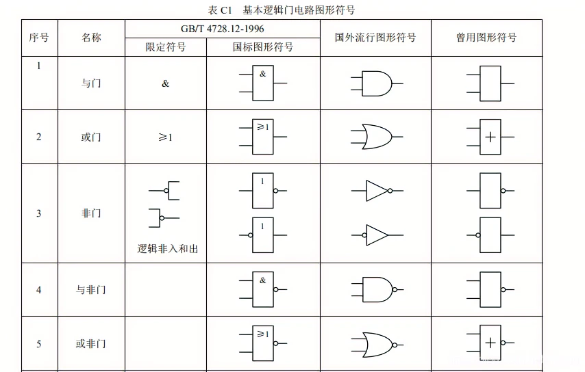
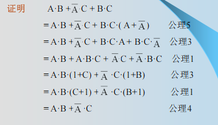

# 复习#002 | 数字电路与逻辑设计

::: details
靠北，完全是预习欸 😭 所以软工学生为什么要学数字逻辑 😵
:::

<embed src="/BemoDB/DLDoutline.pdf" type="application/pdf" width="100%" height="900px" />

- 以及第二章的列表化简法不考

## 图例




## 概述

在第一章我们应该了解几个基础概念：数字系统、计数制及其转换、带符号的二进制数的代码表示以及编码。

### 数字系统

先从数字系统讲起：

数字系统是一个能对数字信号进行加工、传递和存储的实体，它由实现各种功能的数字逻辑电路相互连接而成，例如脉冲计数电路、测控系统、计算机等等。

上面我们引入了几个新概念：数字信号和数字逻辑电路，我们来分别阐述：

#### 数字信号

引入两个前置概念：

自然界中形形色色的物理量，尽管它们的性质各异，但就其变化规律的特点而言，分为两大类。

- 一类物理量的变化在时间上和数量上都是离散的。这类物理量常称为数字量。
- 另一类物理量的变化在时间上和数量上则是连续的。这类物理量常称为模拟量。

用来表示数字量的信号叫数字信号。我们把工作在数字信号下的电子电路叫做数字电路。

反之则称为模电，幸好不用学。

我们再来对数字信号进行一个详细的阐述：

**若信号的变化在时间上和数值上都是离散的，或者说断续的，则称为离散信号。离散信号的变化可以用不同的数字反映，所以又称为数字信号，简称为数字量。**

例如，学生成绩记录，工厂产品统计，电路开关的状态等。

数字系统要与模拟信号发生联系时则必须经过转换电路对信号类型进行变换。

#### 数字电路

用来处理数字信号的电子线路称为数字电路。由于数字电路的各种功能是通过`逻辑运算和逻辑判断`来实现的，所以数字电路又称为数字逻辑电路或者逻辑电路。

数字电路特点有三：

- 二进制：数字电路一般都中采用二进制来表征数字信号，也就是说数字信号只有"0"和"1"两个值。
- 稳定性好：凡具有两个稳态的器件均可用来实现数字电路，电路允许器件有较大的分散性。
- 抗干扰能力强：数字电路传递、加工和处理的是二值信息，且高低电平指的是一定的电压范围，FF 不易受外界干扰。
                            
这些特点便于信号的长期存储且能赋予一定的加密，通用性较强，分析工具为逻辑运算、结构简单等等。

#### 数字电路的分类

从器件的物理特性可以分为：

- TTL
- CMOS

从器件的逻辑特性可以分为：

- 组合逻辑电路
- 时序逻辑电路

这是根据一个电路是否有记忆功能来分类的。

从器件的规模可以分为：

- SSI
- MSI
- LSI
- VLSI

从上到下依次为小、中、大、极大。

::: tip 对组合/时序逻辑电路的详细阐述：
如果一个逻辑电路`在任何时刻的稳定输出仅取决于该时刻的输入，而与电路过去的输入无关`，则称为组合逻辑电路，故而不需要记忆功能。

如果一个逻辑电路`在任何时刻的稳定输出不仅取决于该时刻的输入，而且与过去的输入相关`，则称为时序逻辑电路。需要一些特定的模块来进行记忆；而根据是否有统一的时钟信号进行同步则又可进一步分为同步/异步时序逻辑电路。
:::

#### 数字电路的研究方法

对数字系统中逻辑电路的研究有俩主要任务：

- 逻辑分析：对一个已有的数字逻辑电路，研究它的工作性能和逻辑功能称为逻辑分析。

- 逻辑设计：根据提出的逻辑功能，在给定条件下构造出实现预定功能的逻辑电路称为逻辑设计，或者逻辑综合。

现在有很多种设计方法，这里按过不表。我们需要学习的应该还是传统方法。

### 计数制及其转换

#### R 进制

常用的进制有二/八/十/十六几种进制，它们都是 R 进制的情况之一。

广义地说，一种进位计数制包含着`基数和位权`两个基本的因素

基数指的是计数制中所用到的数字符号的个数。在基数为 R 计数制中，包含 0、1、…、R-1 共 R 个数字符号，进位规律是"逢 R 进一"。称为 R 进位计数制，简称 R 进制。

位权是指在一种进位计数制表示的数中，用来表明不同数位上数值大小的一个固定常数。不同数位有不同的位权，某一个数位的数值等于这一位的数字符号乘上与该位对应的位权。R 进制数的位权是 R 的整数次幂。

例如，十进制数的位权是 10 的整数次幂，其个位的位权为 10^0，十位的位权是 10^1。

R 进制数 N 可以两种方法表示，举个例子 10 进制 的 123

- 并列表示法： 123
- 按权展开法： 1* 10 ^ 2 + 2 * 10 ^ 1 + 3 \* 10 ^ 0

对于其它进制也一样。

关于不同数制的四则计算这里就省略了。

#### 数制转换

在这里主要讨论三种转换：十进制和二进制之间的转换、八进制和二进制之间的转换、十六进制和二进制之间的转换。

##### 十进制和二进制之间的转换

对于二进制数转换为十进制数，直接展开到十进制；

对于十进制数转换为二进制数，应该对整数和小数分别进行处理：对于整数直接除 2 取余；

对于小数部分则乘 2 直到小数部分为 0 或者达到规定精度要求。例子如下：


如果同时包含整数和小数的十进制数，则分别转换后合并即可。

##### 八进制和二进制之间的转换

由于八进制的基本数字符号 0 ～ 7 正好和 3 位二进制数的取值 000 ～ 111 对应。所以，二进制数与八进制数之间的转换可以按位进行。

二进制数转换成八进制数：以小数点为界，分别往高、往低每 3 位为一组，最后不足 3 位时用 0 补充，然后写出每组对应的八进制字符，即为相应八进制数。

举个例子：

二进制：11100101.010 -> 八进制：345.2

相反的，八进制转为二进制也是这么做

##### 十六进制和二进制之间的转换

方法和八进制和二进制之间的转换一样，举个例子：

十六进制：5A.B -> 二进制：1011010.1011

### 带符号的二进制数的代码表示

我们之前聊到数字系统中常用二进制来表示数，这被称作机器数/机器码。

常见的机器码有原码、反码和补码三种，权当复习一下：

#### 原码

符号位用 0 表示正，1 表示负；数值位保持不变。原码表示法又称为符号—数值表示法。

对于二进制小数，举个例子就能明白：

`X = +0.1011 ; Y = -0.1011`

则它们的源码分别为：

`A = 0.1011 ; B = 1.1011`

对于整数是一样的：

`X = +1101 ; Y = -1101`

它们的原码分别为：

`A = 01101 ; B = 11101`

由于原码的加减运算需要考虑符号和大小，需要引入反码和补码来克服这个缺点。

#### 反码

带符号二进制数的反码表示为：

- 符号位

  - 用 0 表示 正
  - 用 1 表示 负

- 数值位
  - 正数反码的数值位和真值的数值位相同
  - 负数反码的数值位是真值的数值位逐个取反

也就是，对于一对相反数的真值，它们分别的反码，逐位都是相反数。

当我们利用反码进行真值加减法运算时，均可通过加法实现，也就是：

`X - Y = X + (-Y)`

运算时，符号位和数值位一样参加运算。**当符号位有进位产生时，应将进位加到运算结果的最低位，才能得到最后结果。**


#### 补码

对于符号位和上面两种一样：

- 用 0 表示 正
- 用 1 表示 负

- 数值位
  - 正数反码的数值位和真值的数值位相同
  - 负数反码的数值位是真值的数值位逐个取反，**之后在最低位 +1**

同样的，运用补码进行加减运算时，也可以转换为加法，不过和反码有所不同：

运算时，符号位和数值位一样参加运算，若符号位有
进位产生，**则应将进位丢掉后才能得到正确结果。**


### 编码

#### 常用编码

用 4 位二进制代码对十进制数字符号进行编码，简称为二-十进制代码，也称为 BCD 码，常见的有 8421 码、2421 码和余 3 码。


##### 8421 码

8421 码，是用 4 位二进制码表示一位十进制字符的一种有权码，4 位二进制码从高位至低位的权依次为 2^3、2^2、2^1、2^0，即为 8、4、2、1

举个例子：

`10进制数：28 = 2进制数：11100 = 8421码：00101000`

##### 2421 码

用 4 位二进制码表示一位十进制字符的另一种有权码，4 位二进制码从高位至低位的权依次为 2、4、2、1,故称为 2421 码。

举个例子：

`2421码：1101 = 10进制数：7`

2421 码和十进制数之间的转换也是按位进行的。

::: warning 2421 码的特性

- 2421 码不具备单值性。例如，0101 和 1011 都对应十进制数字 5。为了与十进制字符一一对应，2421 码不允许出现 0101 ～ 1010 的 6 种状态。

- 2421 码是一种对 9 的自补代码。即一个数的 2421 码只要自身按位变反，便可得到该数对 9 的补数的 2421 码。

例如：

`4 - 0100 -> 5 - 1011`
:::

##### 余 3 码

是由 8421 码加上 0011 形成的一种无权码，由于它的每个字符编码比相应 8421 码多 3，故称为余 3 码。

例如，十进制字符 5 的余 3 码是 5 的 8421 码 0101 加上 0011 ，为 1000.

::: warning 

- 余 3 码中不允许出现 0000、0001、0010、1101、1110 和 1111 六种状态
- 余 3 码与十进制数进行转换时，每位十进制数字的编码都应余 3。
- 余 3 码是一种对 9 的自补代码
:::

#### 可靠性编码

为了减少或者发现代码在形成和传送过程中都可能发生的错误/提高系统的可靠性。形成了各种编码方法。下面，介绍两种常用的可靠性编码：

##### 格雷码

格雷码的特点是任意两个相邻的数，其格雷码仅有一位不同，这能避免代码形成或变换过程中产生的错误。


::: tip 为什么能避免代码在形成或者变换过程中产生错误?

数字系统中，数是用电子器件的状态表示的，数据的变化即器件状态的变化。如当数据按升序或降序变化时，若采用普通二进制数，则每次增 1 或者减 1 可能引起若干位发生变化。

比如 0111 变成 1000。

当电子器件变化速度不一致时，便会产生错误代码。

而格雷码因为相邻的数只有一位不同，从根本上杜绝了这种情况的发生。
:::

如果想要将二进制码转为格雷码可以参考下图：


而将格雷码转为二进制码，则是使用格雷码的最高位作为二进制的最高位，二进制次高位产生过程是使用二进制的高位和次高位格雷码相异或得到，其他位的值与次高位产生过程类似。

##### 奇偶检验码

奇偶检验码是一种用来检验代码在传送过程中是否产生错误的代码。

由两部分组成：

- 信息位：位数不限的一组二进制代码
- 奇偶检验位：仅有一位

有两种编码方式如下：


对于 8421 码的奇偶检验码：


::: tip 奇偶检验码的特点

- 编码简单、容易实现

- 只有检验能力，无法纠错

- 只能发现任何奇数个错误，对任何偶数个错误无法处理
  - 举个例子，1011001，偶校验位为 0，则发送原信息为 10110010 - 如果出现一个错误：变成了 10010010 ，经过校验可以发现； - 如果出现两个错误：变成了 10000010 ，经过校验发现还是偶数，则会通过。
:::

#### 字符编码

数字系统中处理的数据除了数字之外，还有字母、运算符号、标点符号以及其他特殊符号,人们将这些符号统称为字符。所有字符在数字系统中必须用二进制编码表示，通常将其称为字符编码。

最常见的就是 ASCII 码，它使用 7 位二进制码 表示 128 种字符：


## 逻辑代数基础

### 逻辑代数基本概念

我们将从逻辑代数/逻辑变量/逻辑运算/逻辑函数来介绍。

#### 什么是逻辑代数？

逻辑代数 L 是一个封闭的代数系统，它由一个逻辑变量集 K，常量 0 和 1 以及"或"、"与"、"非"三种基本运算所构成，记为`L={ K, +, ·, ', 0, 1 }`。该系统应满足下列公理:

- 交换律
- 结合律
- 分配律
- 0-1 律
- 互补律
  
具体的公理描述可见 PPT2.1 P 3~4

#### 逻辑变量和逻辑运算

逻辑代数和普通代数一样，是用字母表示其值可以变化的量，即逻辑变量,在这里简称变量。所不同的是：

- 普通代数中，变量取值可为任意实数；而逻辑变量的取值只能为 0 或 1
- 逻辑值 0 或 1 是用来表示矛盾双方和判断真伪的形式符号，这也就意味着无大小和正负之分。数字系统中，开关状态、电压高低、晶体管导通状态均可用这两个逻辑值来表示。

--- 

逻辑代数种定义了 与、或、非 三种基本运算

##### 或运算

如果决定某一事件是否发生的多个条件中，只要有一个或一个以上条件成立，事件便可发生，则这种因果关系称之为"或"逻辑。

逻辑代数中，"或"逻辑用"或"运算描述。其运算符号为`+`。

表达式如下：

`F = A + B`

0 和 1 的或运算法则显然，不做赘述。

实现或运算关系的逻辑电路称为或门。例如并联开关 A、B 控制灯 F。

##### 与运算

如果决定某一事件发生的多个条件必须同时具备，事件才能发生，则这种因果关系称之为"与"逻辑。

在逻辑代数中，"与"逻辑关系用"与"运算描述。其运算符号为`·`。两变量"与"运算关系可表示为：

`F = A · B`

0 和 1 的与运算法则显然，不做赘述。

实现与运算关系的逻辑电路称为与门，例如串联开关 A、B 控制灯 F。

##### 非运算

如果某一事件的发生取决于条件的否定，即事件与事件发生的条件之间构成矛盾，则这种因果关系称为"非"逻辑。

在逻辑代数中，"非"逻辑用"非"运算描述。其运算符号为 `'` (撇号) 或在变量上方加一横杠 `¯`。"非"运算的逻辑关系可表示为：

`F = A'`

显然，0 非等于 1，1 非等于 0.

开关 A 和灯 F 并联，可以表示为非运算关系

#### 逻辑函数

逻辑代数中函数的定义与普通代数中函数的定义类似，
即随自变量变化的因变量。但和普通代数中函数的概念相
比，逻辑函数具有如下特点：

- 逻辑函数只能取 0 或 1
- 函数和变量之间的关系是由 与或非 三种基本运算决定的

逻辑函数有 3 种表示法，分别为逻辑表达式，真值表，卡诺图。

对于逻辑表达式：

- 非运算符下可以不加括号
- 与运算符一般可省略
- 运算优先规则：() > 非 > 与 > 或
  
对于真值表，有 n 个变量的逻辑函数，真值表有 2^n 行。

卡诺图是由表示逻辑变量所有取值组合的小方格所构成的平面图。卡诺图在函数简化问题很有用，后面会详细介绍，另外，下面是图例：


### 逻辑代数的基本定理和规则

#### 基本定理

根据前面我们给出的 5 个公理，我们可以推出 8 组常见的定理：

1.  **重叠律(等幂律)**

    - `A + A = A`
    - `A · A = A`

2.  **还原律(双重否定律)**

    - `(A')' = A`

3.  **吸收律**

    - `A + AB = A`
    - `A(A + B) = A`

4.  **冗余律**

    - `A + A'B = A + B`
    - `A(A' + B) = AB`

5.  **并项律**

    - `AB + AB' = A`
    - `(A + B)(A + B') = A`

6.  **反演律(德摩根定律)**

    - `(A + B)' = A' · B'`
    - `(A · B)' = A' + B'`

7.  **推广的德摩根定律**

    - `(A + B + C + ...)' = A' · B' · C' ...`
    - `(A · B · C · ...)' = A' + B' + C' ...`

8.  **一致性定理**
    - `AB + A'C + BC = AB + A'C`
    - `(A + B)(A' + C)(B + C) = (A + B)(A' + C)`

::: tip 关于一致性定理的证明如下：

:::

#### 重要规则

逻辑代数有 3 条重要规则，即代入规则、反演规则和对偶规则。

##### 代入规则

在任何逻辑等式中，如果以一个逻辑函数（或者逻辑表达式）代替等式中的某个变量，则等式仍然成立。

例如，在 `A + A' = 1` 中，如果用 `B+C` 代替 `A`，则有 `(B+C) + (B+C)' = 1`，该等式仍然成立。

##### 反演规则

求一个逻辑函数 F 的反函数 F'，可以遵循以下步骤：

1. 将 F 表达式中的 `·` 换成 `+`，`+` 换成 `·`。
2. 将 F 表达式中的 `0` 换成 `1`，`1` 换成 `0`。
3. 将 F 表达式中的原变量换成反变量，反变量换成原变量。

::: tip
需要注意的是，在变换时必须保持原有的运算顺序，必要时需要加括号。
:::

例如，`F = A(B+C) + D'`，其反函数为 `F' = (A' + B'C')(D)`。

##### 对偶规则

求一个逻辑函数 F 的对偶式 F_D，可以遵循以下步骤：

1. 将 F 表达式中的 `·` 换成 `+`，`+` 换成 `·`。
2. 将 F 表达式中的 `0` 换成 `1`，`1` 换成 `0`。

::: tip
变量本身保持不变。对偶规则表明，若一个逻辑等式成立，则其对偶式也一定成立。
:::

例如 `A + 1 = 1` 的对偶式是 `A · 0 = 0`。
`A + BC = (A+B)(A+C)` 的对偶式是 `A(B+C) = AB+AC`。

#### 复合逻辑

实际应用中广泛采用"与非"门、"或非"门、"与或非"门、"异或"门等门电路。这些门电路输出和输入之间的逻辑关系可由 3 种基本运算构成的复合运算来描述，故通常将这种逻辑关系称为复合逻辑，相应的逻辑门则称为复合门。

##### 与非逻辑 (NAND)

"与非"逻辑是先对输入信号进行"与"运算，然后再对"与"运算的结果进行"非"运算。
其逻辑表达式为：`F = (A · B)'`

##### 或非逻辑 (NOR)

"或非"逻辑是先对输入信号进行"或"运算，然后再对"或"运算的结果进行"非"运算。
其逻辑表达式为：`F = (A + B)'`

##### 与或非逻辑 (AND-OR-INVERT)

"与或非"逻辑是先对某些输入信号进行"与"运算，再将这些"与"运算的结果与其他输入信号进行"或"运算，最后对整个结果进行"非"运算。
例如，两路两输入与或非门的逻辑表达式为：`F = (AB + CD)'`

##### 异或逻辑 (XOR)

"异或"逻辑的规则是：当两个输入变量的取值不同时，输出为 1；当取值相同时，输出为 0。
其逻辑表达式为：`F = A ⊕ B = A'B + AB'`
"异或"也称为"半加"运算。

#### 同或逻辑 (XNOR)

"同或"逻辑的规则是：当两个输入变量的取值相同时，输出为 1；当取值不同时，输出为 0。它与"异或"逻辑互补。
其逻辑表达式为：`F = A ⊙ B = A'B' + AB`

### 逻辑函数的表示形式

任何一个逻辑函数，其表达式的形式都不是唯一的。下面从分析与应用的角度出发，介绍逻辑函数表达式的基本形式、标准形式及其相互转换。

#### 逻辑函数表达式的两种基本形式

##### 与-或表达式 (SOP)

由若干个"与"项（乘积项）进行"或"运算构成的表达式。
例如： `F = AB + BC + AC`

##### 或-与表达式 (POS)

由若干个"或"项（和项）进行"与"运算构成的表达式。
例如： `F = (A+B)(B+C)(A+C)`

#### 逻辑函数表达式的标准形式

为了使逻辑函数的表示具有唯一性，引入了标准形式。

##### 最小项和标准与-或表达式

- **最小项**：对于一个 n 变量的逻辑函数，一个包含全部 n 个变量的乘积项称为最小项。每个变量以原变量或反变量的形式出现一次。n 个变量共有 2^n 个最小项。
- **标准与-或表达式**：也称为**最小项规范式**，是由函数的全部最小项"或"运算构成的表达式。

例如，对于三变量函数 `F(A, B, C)`，最小项 `A'BC` (m3) 只有在 `A=0, B=1, C=1` 时值为 1。一个函数的标准与-或表达式就是所有使其值为 1 的最小项之和。
`F(A,B,C) = ∑m(i1, i2, ...)`

##### 最大项和标准或-与表达式

- **最大项**：对于一个 n 变量的逻辑函数，一个包含全部 n 个变量的和项称为最大项。每个变量以原变量或反变量的形式出现一次。n 个变量共有 2^n 个最大项。
- **标准或-与表达式**：也称为**最大项规范式**，是由函数的全部最大项"与"运算构成的表达式。

例如，对于三变量函数 `F(A, B, C)`，最大项 `A+B'+C'` (M3) 只有在 `A=0, B=1, C=1` 时值为 0。一个函数的标准或-与表达式就是所有使其值为 0 的最大项之积。
`F(A,B,C) = ∏M(j1, j2, ...)`

::: tip 最小项与最大项的关系
同一个下标 i 的最小项 mi 和最大项 Mi 互为反函数，即 `mi' = Mi`。
:::

#### 逻辑函数表达式的转换

##### 任意表达式 → 标准与-或表达式

1.  首先将表达式化为与-或形式。
2.  检查每个与项，如果缺少某个变量 `X`，则将该项乘以 `(X+X')`。
3.  展开表达式，并删除重复的最小项。

例如，将 `F = A + B'C` 化为标准与-或式：
`F = A(B+B')(C+C') + (A+A')B'C`
`= (AB+AB')(C+C') + AB'C + A'B'C`
`= ABC+ABC'+AB'C+AB'C' + AB'C + A'B'C`
`= ABC+ABC'+AB'C+AB'C' + A'B'C`
`= ∑m(1, 4, 5, 6, 7)`

##### 任意表达式 → 标准或-与表达式

1.  首先将表达式化为或-与形式。
2.  检查每个或项，如果缺少某个变量 `X`，则将该项加上 `XX'`。
3.  利用分配律 `(X+YZ)=(X+Y)(X+Z)` 展开，并删除重复的最大项。

##### 标准与-或式 ↔ 标准或-与式

利用最小项和最大项的互补关系。
如果一个 n 变量函数 `F = ∑m(i...)`，那么它的反函数 `F' = ∑m(j...)`，其中 `j` 是在 `0` 到 `2^n - 1` 中所有未在 `i` 中出现的下标。
对 `F'` 应用德摩根定律，即可得到 `F` 的标准或-与表达式 `F = ∏M(j...)`。

例如，`F(A,B,C) = ∑m(1, 4, 5, 6, 7)`，则其最大项下标为 `0, 2, 3`。
所以 `F(A,B,C) = ∏M(0, 2, 3)`。

### 逻辑函数化简

一般来说，逻辑函数表达式越简单，设计出来的相应逻辑电路也就越简单。

我们有 3 种常用方法：代数化简法、卡诺图化简法、列表化简法。这里我们只介绍前两个方法。

#### 代数化简法

代数化简法是利用逻辑代数的基本定律和定理，对逻辑表达式进行合并、吸收、消去等操作，以得到最简表达式的方法。这种方法比较灵活，但需要一定的技巧和经验，且难以判断结果是否为最简。

常用的技巧有：

1.  **并项**：利用 `AB + AB' = A` 来合并项。
2.  **吸收**：利用 `A + AB = A` 来吸收项。
3.  **消去**：利用 `A + A'B = A + B` 或一致性定理 `AB + A'C + BC = AB + A'C` 来消去冗余项。
4.  **配项**：乘以 `(A+A')` 或加上 `AA'` 来创造可以化简的项。

**示例：**
化简逻辑函数 `F = A'B'C + A'BC + AB'C`

```
F = A'C(B' + B) + AB'C  // 提取公因式 A'C
  = A'C · 1 + AB'C       // B' + B = 1
  = A'C + AB'C         //
  = C(A' + AB')          // 提取公因式 C
  = C(A' + B')           // A' + AB' = A' + B'
  = A'C + B'C          // 展开
```

#### 卡诺图化简法

卡诺图化简法是一种高效的图形化工具，用于简化布尔函数。它利用图形的邻接性直观地找出可以合并的最小项，从而得到最简的"与-或"表达式。对于含有 2 到 4 个变量的函数，此方法尤为直观和便捷。

##### 卡诺图的核心思想：逻辑相邻性

卡诺图的巧妙之处在于它的布局。所有小方格都按照格雷码的顺序排列，这保证了任何两个在物理上相邻（上下、左右、甚至首尾相卷）的方格，其对应的最小项只有一个变量是不同的。

::: tip 为什么逻辑相邻性很重要？
根据布尔代数的基本定理 `XY + XY' = X`，两个只有一个变量不同的最小项可以合并，并消去那个不同的变量。卡诺图通过将这些"逻辑相邻"的项在图中"物理相邻"，使得我们可以通过"圈圈"这种直观的方式，快速完成合并与化简。
:::

##### 卡诺图的结构

- **三变量卡诺图**

| A\BC  | 00  | 01  | 11  | 10  |
| :---: | :-: | :-: | :-: | :-: |
| **0** | m0  | m1  | m3  | m2  |
| **1** | m4  | m5  | m7  | m6  |

- **四变量卡诺图** (注意行列都是格雷码顺序 `00, 01, 11, 10`)

| AB\CD  | 00  | 01  | 11  | 10  |
| :----: | :-: | :-: | :-: | :-: |
| **00** | m0  | m1  | m3  | m2  |
| **01** | m4  | m5  | m7  | m6  |
| **11** | m12 | m13 | m15 | m14 |
| **10** | m8  | m9  | m11 | m10 |

##### 化简步骤与策略

1.  **绘制与填充卡诺图**：根据逻辑函数的真值表或最小项表达式，在卡诺图对应的小方格中填入"1"。函数值为"0"的方格留空即可。

2.  **圈出相邻的"1"**：用矩形圈包围相邻的"1"。

    - **圈图规则**：
      - 圈必须是矩形。
      - 圈内"1"的个数必须是 2 的整数次幂（1, 2, 4, 8, ...）。
      - 圈越大越好。一个包含 2^k 个"1"的圈可以消去 k 个变量。
      - 圈的总数越少越好，这对应于最简表达式中更少的乘积项。
      - 所有的"1"都必须被至少一个圈覆盖。
      - 为了画出更大的圈，一个"1"可以被重复圈在不同的圈中。
      - 记住卡诺图的边界是"卷曲"的，即第一行与最后一行相邻，第一列与最后一列相邻。

3.  **从圈写出最简与项**：每一个圈对应一个化简后的"与"项。

    - 观察圈内的所有方格。
    - 如果某个变量在圈内所有方格中都保持为"1"，则将该原变量写入项中。
    - 如果某个变量在圈内所有方格中都保持为"0"，则将该反变量写入项中。
    - 如果某个变量在圈内既有"0"也有"1"，说明该变量已被消去，不用写入项中。

4.  **合并与项**：将所有从圈中得到的"与"项进行"或"运算，就得到了最终的最简"与-或"表达式。

**示例：**
化简 `F(A,B,C) = ∑m(1, 4, 5, 6, 7)`

1.  **填图**:
    | A\BC | 00 | 01 | 11 | 10 |
    | :--: |:--:|:--:|:--:|:--:|
    | **0** | | 1 | | |
    | **1** | 1 | 1 | 1 | 1 |

2.  **圈"1"**:

    - **圈 1 (大圈)**: 圈起第二行的四个"1" (`m4, m5, m7, m6`)。
    - **圈 2 (竖圈)**: 圈起第二列的两个"1" (`m1, m5`)，注意 m5 被重复圈了。

3.  **写表达式**:

    - **分析圈 1**: 覆盖了 `m4(100), m5(101), m7(111), m6(110)`。
      - 变量 `A` 始终为 **1**。
      - 变量 `B` 和 `C` 都有 0 和 1，被消去。
      - -> 得到与项：`A`
    - **分析圈 2**: 覆盖了 `m1(001), m5(101)`。
      - 变量 `A` 有 0 和 1，被消去。
      - 变量 `B` 始终为 **0**。
      - 变量 `C` 始终为 **1**。
      - -> 得到与项：`B'C`

4.  **最终结果**: `F = A + B'C`

##### 处理无关项 (Don't Cares)

在某些实际电路中，一些输入组合永远不会出现，或者出现时输出是任意的，这些项称为**无关项**。

- 在卡诺图中，无关项通常用 `X` 或 `d` 标记。
- **策略**：在圈图时，你可以将 `X` 视为"1"来帮助你画出更大、更少的圈，以获得更简单的表达式。但是，你没有义务必须圈住任何一个 `X`。简单来说，**`X` 是你的"万能牌"，只在对你有利时使用它**。

##### 示例 2：四变量函数的边角化简

化简逻辑函数 `F(A,B,C,D) = ∑m(0, 2, 5, 7, 8, 10, 13, 15)`

1.  **填图**:
    | AB\CD | 00 | 01 | 11 | 10 |
    | :---: |:--:|:--:|:--:|:--:|
    | **00** | 1 | | | 1 |
    | **01** | | 1 | 1 | |
    | **11** | | 1 | 1 | |
    | **10** | 1 | | | 1 |

2.  **圈"1"**:

    - **圈 1 (四角)**: 将 `m0, m2, m8, m10` 四个角落的"1"圈起来。这是利用卡诺图上下、左右边界相邻的特性。
    - **圈 2 (中间)**: 将 `m5, m7, m13, m15` 四个"1"圈起来。

3.  **写表达式**:

    - **分析圈 1**: 覆盖了 `m0(0000), m2(0010), m8(1000), m10(1010)`。
      - 变量 `A` 和 `C` 都有 0 和 1，被消去。
      - 变量 `B` 始终为 **0**。
      - 变量 `D` 始终为 **0**。
      - -> 得到与项：`B'D'`
    - **分析圈 2**: 覆盖了 `m5(0101), m7(0111), m13(1101), m15(1111)`。
      - 变量 `A` 和 `C` 都有 0 和 1，被消去。
      - 变量 `B` 始终为 **1**。
      - 变量 `D` 始终为 **1**。
      - -> 得到与项：`BD`

4.  **最终结果**: `F = B'D' + BD`。这实际上是变量 B 和 D 的"同或"(`B ⊙ D`)。

##### 示例 3：含无关项的四变量函数化简

化简逻辑函数 `F(W,X,Y,Z) = ∑m(1,3,7,11,15)`，其中无关项为 `d(0,2,5)`。

1.  **填图 (1 代表最小项，X 代表无关项)**:
    | WX\YZ | 00 | 01 | 11 | 10 |
    | :---: |:--:|:--:|:--:|:--:|
    | **00** | X | 1 | 1 | X |
    | **01** | | X | 1 | |
    | **11** | | | 1 | |
    | **10** | | | 1 | |

2.  **圈"1" (利用"X")**:

    - **圈 1 (大圈)**: 为了覆盖 `m1, m3`，我们利用无关项 `X` 在 `m0, m2` 的位置，将 `m0, m1, m2, m3` 四个方格圈起来，形成一个更大的圈。
    - **圈 2 (竖圈)**: 将 `YZ` 列为 `11` 的所有项 (`m3, m7, 15, 11`) 圈起来。这是一个天然的四"1"圈。

3.  **写表达式**:

    - **分析圈 1**: 覆盖了 `m0(0000), m1(0001), m2(0010), m3(0011)`。
      - 变量 `W` 始终为 **0**。
      - 变量 `X` 始终为 **0**。
      - 变量 `Y` 和 `Z` 都有 0 和 1，被消去。
      - -> 得到与项：`W'X'`
    - **分析圈 2**: 覆盖了 `m3(0011), m7(0111), m15(1111), m11(1011)`。
      - 变量 `W` 和 `X` 都有 0 和 1，被消去。
      - 变量 `Y` 始终为 **1**。
      - 变量 `Z` 始终为 **1**。
      - -> 得到与项：`YZ`

4.  **最终结果**: `F = W'X' + YZ`。通过利用无关项，我们得到了比不使用它们（例如，只圈 `m1,m3` 得到 `W'X'Z`）更简洁的表达式。

## 集成门电路与触发器

根据所采用的半导体器件，可将数字集成电路分为两大类：双极型集成电路和单极型集成电路（MOS 管）。

在这两大类下又能分为更多小类，这里不做阐述。

### 半导体开关器件基础

数字电路中的晶体二极管、三极管和 MOS 管等器件一般是以开关方式运用的，其工作状态相当于开关的"接通"与"断开"。由于开关频率非常高，我们需要分析其在导通和截止两种状态下的静态和动态特性。

#### 晶体二极管 (Diode)

二极管是一个 PN 结，具有单向导电性，是实现逻辑运算最基础的元件之一。

- **导通 (ON)**: 当阳极(P)电压高于阴极(N)电压，且电压差超过开启电压（硅管约 0.5V~0.7V）时，二极管导通。此时可看作一个**闭合的开关**，并存在一个微小的正向压降 `V_F`。
- **截止 (OFF)**: 当阳极电压低于或等于阴极电压时，二极管截止。此时可看作一个**断开的开关**，仅有极小的反向漏电流通过。

| 状态           | 偏置条件                   | 等效模型        | 特点                   |
| :------------- | :------------------------- | :-------------- | :--------------------- |
| **导通 (ON)**  | 正向偏置 (`V_A > V_K`)     | 闭合开关 + 压降 | 电流较大，`V_F` ≈ 0.7V |
| **截止 (OFF)** | 反向或零偏置 (`V_A ≤ V_K`) | 断开开关        | 电流极小，`I_R` ≈ 0    |

#### 双极型晶体三极管 (BJT)

三极管（以 NPN 型为例）是电流控制器件，通过控制基极(b)电流 `I_B` 来控制集电极(c)和发射极(e)之间的通断。

- **截止状态 (Cutoff)**: 基极-发射极电压 `V_BE` 小于开启电压 (约 0.7V)，`I_B` ≈ 0。此时集电极电流 `I_C` ≈ 0，三极管相当于一个**断开的开关**。
- **饱和状态 (Saturation)**: `V_BE` > 0.7V，且有足够大的基极电流 `I_B` 流入，使三极管完全导通。此时集电极-发射极电压 `V_CE` 很小（约 0.2V~0.3V），三极管相当于一个**闭合的开关**。

在数字电路中，我们驱动三极管在截止和饱和两个极端状态之间切换，以避免工作在放大区而产生不确定的逻辑电平。

| 状态                  | 基极条件 (`I_B`)              | `V_CE`             | 等效模型 |
| :-------------------- | :---------------------------- | :----------------- | :------- |
| **截止 (Cutoff)**     | `I_B` ≈ 0                     | `V_CE` ≈ `V_CC`    | 断开开关 |
| **饱和 (Saturation)** | `I_B` > `I_BS` (饱和基极电流) | `V_CE(sat)` ≈ 0.3V | 闭合开关 |

#### MOS 场效应管 (MOSFET)

MOS 管是电压控制器件，通过控制栅极(G)和源极(S)之间的电压 `V_GS` 来控制漏极(D)和源极之间的通断。它是现代数字集成电路的核心。

- **截止状态 (Cutoff)**: 当栅源电压 `V_GS` 小于阈值电压 `V_T` 时，DS 之间没有导电沟道形成。此时 MOS 管相当于一个**断开的开关**。
- **导通状态 (ON)**: 当 `V_GS` 远大于阈值电压 `V_T` 时，DS 之间形成导电沟道，MOS 管导通。此时它相当于一个**闭合的开关**，其导通电阻 `R_on` 很小。

::: tip MOS 管的关键优势

1.  **电压控制**：栅极和沟道之间是绝缘的，输入阻抗极高，因此几乎不消耗静态驱动电流。
2.  **功耗低**：由 NMOS 和 PMOS 管构成的 CMOS（互补金属氧化物半导体）电路，在静态时总有一个管子截止，理论上静态功耗为零，这是它在超大规模集成电路中占主导地位的关键。

:::

### 逻辑门电路

实现基本和复合逻辑运算的电子电路被称为**逻辑门**。它们是构建任何数字系统的基础模块。在深入了解 TTL 和 CMOS 等集成电路家族之前，我们先看看如何用基础的分立元件搭建简单的逻辑门。

#### 0. 简单门电路的构建原理与符号

##### 二极管逻辑 (Diode Logic - DL)

用二极管和电阻可以搭建最简单的"与"门和"或"门。

- **二极管"与"门**:

  - **结构**: 多个输入通过各自的二极管连接到一个公共点，该点通过一个上拉电阻 `R` 连接到高电平 `VCC`。输出 `Y` 从该公共点取出。二极管的阳极是输入端，阴极连接到公共点。
  - **原理**: 只有当**所有**输入均为高电平时，所有二极管都截止，输出 `Y` 被上拉到高电平。只要有**任何一个**输入为低电平，对应的二极管就会导通，将输出 `Y` 拉到接近低电平。
  - **结论**: 实现了 `Y = A · B` 的"与"逻辑。

- **二极管"或"门**:
  - **结构**: 多个输入通过各自的二极管连接到一个公共点，该点通过一个下拉电阻 `R` 连接到地。输出 `Y` 从该公共点取出。二极管的阴极是输入端，阳极连接到公共点。
  - **原理**: 只要有**任何一个**输入为高电平，对应的二极管就会导通，将输出 `Y` 拉到接近高电平。只有当**所有**输入都为低电平时，所有二极管都截止，输出 `Y` 被下拉到低电平。
  - **结论**: 实现了 `Y = A + B` 的"或"逻辑。

##### 二极管-晶体管逻辑 (DTL)

DL 电路很简单但驱动能力差且会造成电平偏移。通过在后面加一个三极管反相器，就构成了更实用的 DTL 门电路，这也是 TTL 电路的雏形。

- **DTL"与非"门 (NAND)**:

  - **结构**: 一个二极管"与"门的输出，连接到一个 BJT 三极管的基极。三极管的发射极接地，集电极通过一个上拉电阻连接到 `VCC`，输出 `Y` 从集电极取出。
  - **原理**:
    1.  当**所有**输入都为高电平时，二极管"与"部分输出高电平，这个高电平使三极管**饱和导通**，于是集电极被拉到低电平，输出 `Y` 为**低**。
    2.  当**任何一个**输入为低电平时，二极管"与"部分输出低电平，三极管因基极电压过低而**截止**，于是输出 `Y` 被上拉电阻拉到高电平，输出 `Y` 为**高**。
  - **结论**: 实现了 `Y = (A · B · ...)'` 的"与非"逻辑。

- **DTL"或非"门 (NOR)**:
  - **结构**: 将前端的二极管"与"门换成二极管"或"门，再连接到三极管反相器。
  - **原理**: 任何一个输入为高，都会使三极管导通，输出为低。
  - **结论**: 实现了 `Y = (A + B)'` 的"或非"逻辑。

##### 常用逻辑门符号

| 门类型          | 逻辑功能       | 符号特征                             |
| :-------------- | :------------- | :----------------------------------- |
| **非 (NOT)**    | `Y = A'`       | 三角形后跟一个小圆圈                 |
| **与 (AND)**    | `Y = A · B`    | D 形                                 |
| **或 (OR)**     | `Y = A + B`    | 弧形输入边，尖头输出                 |
| **与非 (NAND)** | `Y = (A · B)'` | D 形后加小圆圈                       |
| **或非 (NOR)**  | `Y = (A + B)'` | 弧形输入边，尖头输出，后跟一个小圆圈 |
| **异或 (XOR)**  | `Y = A ⊕ B`    | 在"或"门符号前加一条弧线             |

本节将重点介绍两种主流的集成逻辑门电路技术：TTL 和 CMOS，以及一些特殊用途的门电路。

#### 1. 主要技术分类与特性参数

- **技术分类**:

  - **TTL (Transistor-Transistor Logic)**: 双极型集成电路，速度快，但功耗较大。在早期中小规模集成电路中广泛使用。
  - **CMOS (Complementary MOS)**: 单极型集成电路，功耗极低，集成度高，抗干扰能力强。是现代大规模和超大规模集成电路的主流技术。

- **关键特性参数**:
  - **高/低电平 (V_OH / V_OL)**: 门电路输出逻辑"1"和逻辑"0"时对应的电压。
  - **噪声容限 (Noise Margin)**: 电路抵抗噪声干扰的能力。容限越大，电路工作越可靠。
  - **传输延迟时间 (t_pd)**: 输入信号变化到输出信号相应变化所需的时间，决定了门电路的开关速度。
  - **功耗 (Power Dissipation)**: 门电路工作时消耗的能量。

#### 2. TTL 门电路

TTL 电路以 BJT 三极管为核心，通常使用 `+5V` 电源。

- **基本结构 (以与非门为例)**:
  - **输入级**: 采用一个多发射极三极管，实现输入的"与"逻辑。
  - **中间级 (相位倒相级)**: 提供电压放大和逻辑倒相。
  - **输出级 (推拉式)**: 提供足够的驱动能力，实现快速的电平转换。
- **工作原理总结 (与非门)**:
  - 当所有输入都为高电平时，输出为低电平。
  - 只要任一输入为低电平，输出就为高电平。
  - 逻辑功能: `F = (A · B · ...)'`
- **典型系列**: 74/54 系列，如 `74LS00` (四-2 输入与非门)。

#### 3. CMOS 门电路

CMOS 电路的核心是由一个 **P-MOS 管** 和一个 **N-MOS 管** 互补构成的单元。

- **基本结构 (以反相器为例)**:
  - P-MOS 管和 N-MOS 管的源极和漏极串联。
  - 输入信号 `A` 同时连接到两个管的栅极。
  - 当 `A` 为低电平 (0) 时: P-MOS 导通，N-MOS 截止，输出 `Y` 被上拉到高电平 (`V_DD`)。
  - 当 `A` 为高电平 (1) 时: N-MOS 导通，P-MOS 截止，输出 `Y` 被下拉到低电平 (GND)。
- **核心优势**:
  - **极低静态功耗**: 在稳定状态（输入为高或低），总有一个 MOS 管处于截止状态，几乎没有静态电流，非常省电。
  - **高抗干扰能力**: 噪声容限大。
  - **宽电源电压范围**: 可以在很宽的电压下工作（例如 3V-18V）。
- **典型系列**: 4000 系列 和 高速的 74HC/HCT 系列。

#### 4. 特殊用途的门电路

##### 集电极开路门 (OC/OD Gate)

- **结构**: 输出级没有内部的上拉电阻，集电极（或漏极）是开路的。
- **使用**: 必须外接一个上拉电阻到电源。
- **核心用途**:
  - **线与 (Wired-AND)**: 将多个 OC 门的输出直接连接在一起，可以实现"与"逻辑。只要有一个门的输出为低电平，就会将整条线拉低。`Y = Y1 · Y2 · Y3 ...`
  - **电平转换**: 通过选择合适的上拉电阻和电源，可以实现不同逻辑电平家族之间的接口。

##### 三态门 (Tri-state Gate)

- **三种状态**:
  - **高电平 (1)**
  - **低电平 (0)**
  - **高阻态 (Hi-Z)**: 输出端相当于与电路内部断开，既不输出高电平也不输出低电平。
- **控制**: 由一个额外的**使能端(Enable, EN)**控制。EN 有效时，门工作在正常逻辑状态；EN 无效时，门输出高阻态。
- **核心用途**:
  - **总线系统**: 计算机中的 CPU、内存、外设等需要共享同一组数据线（总线）。通过三态门，可以确保在任何时刻只有一个设备向总线发送数据，其他设备都处于高阻态，避免信号冲突。

#### 5. TTL 与 CMOS 的比较

| 特性         | TTL                                | CMOS                           |
| :----------- | :--------------------------------- | :----------------------------- |
| **功耗**     | 较大，特别是静态功耗               | 极低，主要在开关瞬间有动态功耗 |
| **速度**     | 早期速度快，但现代 CMOS 技术已超越 | 早期较慢，现已非常快           |
| **噪声容限** | 较小                               | 较大，抗干扰能力强             |
| **电源电压** | 严格，通常为 5V ± 5%               | 范围宽，如 3V ~ 18V            |
| **集成度**   | 较低                               | 非常高，适用于 LSI 和 VLSI     |

#### 6. 正逻辑和负逻辑

这是一个约定问题：

- **正逻辑** (常用): 高电平 (H) 代表逻辑 `1`，低电平 (L) 代表逻辑 `0`。
- **负逻辑**: 低电平 (L) 代表逻辑 `1`，高电平 (H) 代表逻辑 `0`。

同一个物理电路，在正逻辑和负逻辑约定下，其逻辑功能是不同的。例如，一个正逻辑的"与非"门，在负逻辑下就是一个"或非"门。除非特殊说明，否则我们总是默认使用**正逻辑**。

### 触发器

与任何时刻的输出仅取决于该时刻输入的组合逻辑电路不同，时序逻辑电路具有**记忆功能**，其输出不仅取决于当前输入，还与电路之前的状态有关。实现这种记忆功能的基本单元就是**触发器 (Flip-flop)**。

触发器是能够存储一位 (bit) 二进制信息的最小单元。它具有两个可以自我维持的稳定状态，通常用 `0` 和 `1` 来表示。触发器有两个互补的输出端：`Q` 和 `\overline{Q}`。在输入信号的作用下，触发器可以从一个状态转换到另一个状态。我们通常将触发器在输入信号作用前的状态称为**现态**（用 `Q^n` 表示），变化后的新状态称为**次态**（用 `Q^{n+1}` 表示）。

#### 1. 基本 R-S 锁存器 (Basic RS Latch)

基本 R-S 锁存器是构成各种复杂触发器的基础，也是最简单的记忆元件。它通常由两个与非门或或非门交叉耦合而成。

##### 由"与非"门构成的基本 R-S 锁存器

这种锁存器由两个与非门交叉连接构成。它的输入端是低电平有效的，通常记为 `\overline{S}` (置位 Set) 和 `\overline{R}` (复位 Reset)。

- **工作原理**:
  - **置位 (Set)**: 当 `\overline{S}=0`, `\overline{R}=1` 时，无论 `Q` 此前为何状态，输出 `Q` 都会被强制置为 `1`。
  - **复位 (Reset)**: 当 `\overline{S}=1`, `\overline{R}=0` 时，输出 `Q` 会被强制置为 `0`。
  - **保持 (Hold)**: 当 `\overline{S}=1`, `\overline{R}=1` 时，两个与非门的输入都依赖于另一门的输出。此时，电路会维持在之前的状态不变，即 `Q^{n+1} = Q^n`。这体现了锁存器的"记忆"功能。
  - **禁止 (Forbidden)**: 当 `\overline{S}=0`, `\overline{R}=0` 时，`Q` 和 `\overline{Q}` 的输出都会被强制为 `1`，这违反了它们互补的约定。并且，如果 `\overline{S}` 和 `\overline{R}` 同时跳回 `1`，锁存器的最终状态将不确定。因此，这个输入组合是被禁止使用的。

| \(\overline{S}\) | \(\overline{R}\) | \(Q^{n+1}\) | 功能说明 |
| :--------------: | :--------------: | :---------: | :------- |
|        0         |        0         |    不定     | 禁止     |
|        0         |        1         |      1      | 置位     |
|        1         |        0         |      0      | 复位     |
|        1         |        1         |   \(Q^n\)   | 保持     |

##### 由"或非"门构成的基本 R-S 锁存器

这种锁存器的输入端是高电平有效的，记为 `S` 和 `R`。其逻辑功能与与非门锁存器类似，但触发电平相反。它的禁止状态发生在 `S=1, R=1`。

|  S  |  R  | \(Q^{n+1}\) | 功能说明 |
| :-: | :-: | :---------: | :------- |
|  0  |  0  |   \(Q^n\)   | 保持     |
|  0  |  1  |      0      | 复位     |
|  1  |  0  |      1      | 置位     |
|  1  |  1  |    不定     | 禁止     |

其特性方程为：\(Q^{n+1} = S + \overline{R}Q^n\)，约束条件为 `S · R = 0`。

基本 R-S 锁存器结构简单，但它对输入信号的变化是即时响应的，这使得在复杂系统中难以精确控制状态翻转的时刻。

#### 2. 时钟控制与触发方式

为了让触发器只在特定的时刻（例如，在统一的**时钟 (Clock, CLK)** 信号控制下）才接收输入并改变状态，我们引入了同步触发器。

最简单的同步触发器是在基本 R-S 锁存器的输入端前增加两个控制门（与门）。只有当时钟信号 `CLK=1` 时，输入 `S` 和 `R` 才能影响锁存器；当 `CLK=0` 时，无论 `S` 和 `R` 如何变化，触发器都保持原状态。

然而，这种简单的**电平触发**同步方式存在"**空翻**" (Racing) 问题：在 `CLK=1` 的整个时间段内，如果输入信号 `S` 或 `R` 发生多次变化，输出 `Q` 也会跟着多次翻转，这使得电路的最终状态不可控。

为了解决这个问题，现代触发器采用**边沿触发 (Edge-Triggered)** 方式。这意味着触发器只在时钟信号的**上升沿** (从 0 到 1 的瞬间) 或**下降沿** (从 1 到 0 的瞬间) 才对输入进行采样并改变状态，而忽略在时钟电平保持稳定期间的任何输入变化。这确保了每个时钟周期只发生一次确定的状态转换。早期的**主从触发器 (Master-Slave Flip-flop)** 也是为了解决空翻问题而设计的，其效果类似于下降沿触发。

#### 3. 现代触发器类型

为了克服基本 R-S 触发器的输入约束和不确定性问题，人们设计出了功能更完善的触发器。

##### D 触发器 (D Flip-flop)

D 触发器通过在内部连接 `S` 和 `R` 输入，确保它们永远互补（`S=D`, `R=\overline{D}`），从而彻底解决了 `S=R=1` 的禁止状态问题。

- **核心功能**：在时钟的有效边沿，将输入 `D` 的值锁存到输出 `Q` 上，即 `Q^{n+1} = D`。
- **用途**：由于它能"延迟"一个时钟周期再输出数据，常被称为**数据 (Data)** 或**延迟 (Delay)** 触发器，是构建寄存器和存储单元的基础。

##### J-K 触发器 (J-K Flip-flop)

J-K 触发器是功能最全面的触发器。它不仅解决了 R-S 触发器的不确定状态，还增加了一个全新的功能。

- **工作原理**：它有两个输入端 `J` 和 `K`，其功能可以看作是 R-S 触发器的增强版 (`J` 对应 `S`, `K` 对应 `R`)。
  - `J=0, K=0`：**保持**状态。
  - `J=1, K=0`：**置位** (Set)，`Q` 置为 `1`。
  - `J=0, K=1`：**复位** (Reset)，`Q` 置为 `0`。
  - `J=1, K=1`：**翻转 (Toggle)**，`Q` 的状态取反，即 `Q^{n+1} = \overline{Q^n}`。这是它独有的功能。
- **特性方程**：`Q^{n+1} = J\overline{Q^n} + \overline{K}Q^n`。

##### T 触发器 (T Flip-flop)

T 触发器是 J-K 触发器的一个简化特例，将 `J` 和 `K` 输入连接在一起，形成单个输入 `T`。

- **核心功能**：
  - `T=0`：**保持**状态。
  - `T=1`：**翻转**状态。
- **特性方程**：`Q^{n+1} = T \oplus Q^n = T\overline{Q^n} + \overline{T}Q^n`。
- **用途**：由于其便捷的翻转功能，T 触发器是构建**计数器**的理想选择。

## 组合逻辑电路

我们将从 4 个小节来学习组合逻辑电路：

- 基本概念
- 分析和设计的基本方法
- 设计中的几个常见问题及处理
- 竞争与险象问题

### 1. 基本概念

**组合逻辑电路 (Combinational Logic Circuit)** 是指在任何时刻，电路的稳定输出仅仅取决于该时刻的输入信号组合，而与电路过去的状态无关。简而言之，它是一个**没有记忆功能**的电路。

这与我们之前讨论的触发器构成的**时序逻辑电路**形成了鲜明对比。组合逻辑电路的基本构成单元是各种逻辑门，其结构特点是：

- 电路中不包含任何反馈回路（即任何门的输出都不会再经过一系列门后回到其输入端）。
- 任何一组确定的输入，都对应一组唯一确定的输出。

因此，任何一个组合逻辑电路的功能都可以用一个或一组布尔函数来完全描述。

### 2. 分析和设计的基本方法

#### 组合逻辑电路的分析

分析是指对于一个给定的逻辑电路图，确定其逻辑功能的过程。基本步骤如下：

1.  **写出逻辑表达式**：从电路的输入端开始，逐级向输出端写出每个逻辑门的输出表达式，直到得到最终输出 `F` 关于所有输入变量的完整表达式。
2.  **化简表达式**：利用逻辑代数或卡诺图等方法，将得到的逻辑表达式化为最简形式。
3.  **列出真值表**：根据最终的逻辑表达式，列出所有输入组合对应的输出值，从而得到电路的真值表。
4.  **描述逻辑功能**：根据真值表或最简表达式，用文字描述该电路所实现的逻辑功能（例如："三输入多数表决器"或"两位二进制数比较器"等）。

**示例：**
分析下图所示电路的功能（此处假设一个电路图）：
一个电路，输入为 A, B, C。A 和 B 输入一个与门 G1，B 和 C 输入一个与门 G2，G1 和 G2 的输出再输入一个或门 G3，G3 的输出为 F。

1.  **写表达式**：`F = (A · B) + (B · C)`
2.  **化简**：该表达式已为最简"与-或"式。
3.  **真值表**:

| A   | B   | C   | F   |
| --- | --- | --- | --- |
| 0   | 0   | 0   | 0   |
| 0   | 0   | 1   | 0   |
| 0   | 1   | 0   | 0   |
| 0   | 1   | 1   | 1   |
| 1   | 0   | 0   | 0   |
| 1   | 0   | 1   | 0   |
| 1   | 1   | 0   | 1   |
| 1   | 1   | 1   | 1   |

1.  **功能描述**：当输入 B 为 1，且 A 或 C 中至少有一个为 1 时，输出 F 为 1。

#### 组合逻辑电路的设计

设计是分析的逆过程，即根据提出的逻辑需求，设计出实现该功能的电路。这是数字系统设计的核心环节之一。

1.  **逻辑抽象**：这是最关键的一步。分析实际问题，确定输入和输出变量，并用真值表、逻辑表达式或文字描述等方式，准确定义输入和输出之间的逻辑关系。
2.  **写出逻辑表达式**：根据真值表，写出标准"与-或"（SOP）或"或-与"（POS）表达式。通常选择 SOP 形式，即所有使输出为 1 的最小项之和。
3.  **化简逻辑表达式**：使用卡诺图或代数法，将表达式化为最简形式，以减少所需逻辑门的数量和成本。
4.  **画出逻辑图**：根据最简表达式，选用合适的逻辑门（如与门、或门、非门，或仅用与非门/或非门），画出电路连接图。

**示例：设计一个三输入多数表决器**
需求：有三个裁判 A, B, C。当有两个或两个以上赞成时（以'1'代表赞成），表决结果 F 为通过('1')。

1.  **逻辑抽象（真值表）**:

| A   | B   | C   | F   |
| --- | --- | --- | --- |
| 0   | 0   | 0   | 0   |
| 0   | 0   | 1   | 0   |
| 0   | 1   | 0   | 0   |
| 0   | 1   | 1   | 1   |
| 1   | 0   | 0   | 0   |
| 1   | 0   | 1   | 1   |
| 1   | 1   | 0   | 1   |
| 1   | 1   | 1   | 1   |

1.  **写表达式 (SOP)**:
    `F = A'BC + AB'C + ABC' + ABC`

2.  **卡诺图化简**:

    | A\BC  | 00  | 01  | 11  | 10  |
    | :---: | :-: | :-: | :-: | :-: |
    | **0** |     |     |  1  |     |
    | **1** |     |  1  |  1  |  1  |

    - 圈 `m3, m7` -> `BC`
    - 圈 `m5, m7` -> `AC`
    - 圈 `m6, m7` -> `AB`
      化简后得到：`F = AB + BC + AC`

3.  **画逻辑图**：用三个二输入与门和一个三输入或门即可实现。

### 3. 常用组合逻辑电路模块

在实际的数字系统设计中，我们通常不会从最底层的逻辑门开始搭建所有东西，而是使用功能更强、已经封装好的**中规模集成(MSI)电路**。这些模块是构成更复杂系统的积木。下面介绍几种最核心的组合逻辑器件。

#### 加法器 (Adder)

加法器是实现二进制数加法运算的电路。

- **半加器 (Half Adder)**:

  - **功能**: 对两个 1 位二进制数 `A` 和 `B` 进行相加。
  - **外部特性**:
    - 输入: `A`, `B` (两个加数)。
    - 输出: `S` (和), `C_o` (向高位的进位)。
  - **逻辑表达式**: `S = A ⊕ B`, `C_o = A · B`。

- **全加器 (Full Adder)**:

  - **功能**: 对两个 1 位二进制数 `A`、`B` 以及来自低位的进位 `C_i` 进行相加。
  - **外部特性**:
    - 输入: `A`, `B` (两个加数), `C_i` (低位进位)。
    - 输出: `S` (和), `C_o` (向高位的进位)。
  - **逻辑表达式**: `S = A ⊕ B ⊕ C_i`, `C_o = AB + (A ⊕ B)C_i = AB + AC_i + BC_i`。
  - **实现**: 可以用两个半加器和一个或门构成一个全加器。

- **多位加法器**: 将多个全加器串联起来，就可以实现多位二进制数的加法，例如，用 4 个全加器可以构成一个 4 位加法器。这种将前一级的进位输出 `C_o` 连接到后一级的进位输入 `C_i` 的方式称为**行波进位加法器 (Ripple-Carry Adder)**。

#### 数字比较器 (Comparator)

数字比较器用于比较两个二进制数 `A` 和 `B` 的大小。

- **功能**: 判断 `A > B`, `A = B`, `A < B` 哪种关系成立。
- **外部特性**:
  - 输入: 两个 n 位二进制数 `A (A_{n-1}...A_0)` 和 `B (B_{n-1}...B_0)`。
  - 输出: 通常有三个输出 `Y_{A>B}`, `Y_{A=B}`, `Y_{A<B}`。在任何时候，这三个输出中只有一个为高电平。
- **基本原理**:
  - `A=B` 的条件是所有对应位都相等： `A_i = B_i` (同或) 对所有 `i` 成立。
  - `A>B` 的判断是从最高位开始，找到第一个不相等的位，如果该位 `A_i=1` 且 `B_i=0`，则 `A>B`。

#### 译码器 (Decoder)

译码器是一种将输入的二进制代码翻译成其对应输出信号的电路。

- **功能**: n 个输入，最多 2^n 个输出。对于任意一个输入代码，只有一个对应的输出端被激活（变为有效电平，通常是低电平）。
- **外部特性**:
  - 输入: `A_{n-1}...A_0` (地址/数据输入), `EN` (使能输入, Enable)。
  - 输出: `Y_0, Y_1, ..., Y_{2^n-1}`。
- **工作原理**: 当使能端 `EN` 有效时，译码器工作。输入地址为 `k`，则输出 `Y_k` 被激活。当 `EN` 无效时，所有输出端都处于非激活状态。
- **应用**:
  - **地址译码**: 在存储器系统中，用于选中特定的存储单元。
  - **实现组合逻辑**: 用一个 n 输入译码器和或门可以实现任何 n 变量的逻辑函数。
- **特殊类型：七段显示译码器**: 这是一种专门的译码器，用于将 BCD 码（如 8421 码）转换为驱动七段数码管（就是计算器上显示数字的那种）所需的 a,b,c,d,e,f,g 七个段的控制信号。此部分内容在后续的《计算机组成原理》中会更为关键。

#### 编码器 (Encoder)

编码器执行与译码器相反的操作。

- **功能**: 将多个输入信号中的某一个（通常是处于激活状态的那个）翻译成对应的二进制代码。
- **外部特性**:
  - 输入: `I_0, I_1, ..., I_{2^n-1}`。
  - 输出: `Y_{n-1}...Y_0` (二进制代码)。
- **优先编码器 (Priority Encoder)**: 普通编码器要求在任何时候只有一个输入被激活。而优先编码器允许同时有多个输入，但它只对其中**优先级最高**的那个输入进行编码。例如，`74LS148` 是一个 8-3 线优先编码器。

#### 数据选择器 (Multiplexer, MUX)

数据选择器，又称多路选择器，作用是从多路输入信号中选择一路，并将其传送到唯一的输出端。

- **功能**: 类似于一个多档位的选择开关。
- **外部特性**:
  - 输入: `D_0, ..., D_{2^n-1}` (多路数据输入), `S_{n-1}...S_0` (地址选择输入), `EN` (使能输入)。
  - 输出: `Y` (唯一的输出)。
- **工作原理**: 当 `EN` 有效时，地址选择线 `S` 的值为 `k`，则数据输入 `D_k` 的信号被传送到输出 `Y`。
- **应用**:
  - **数据路由**: 在不同数据源之间进行切换。
  - **实现组合逻辑**: 利用 MUX 可以非常灵活地实现任意逻辑函数。
  - **并-串转换**: 将并行数据按顺序逐个送到输出端。

#### 数据分配器 (Demultiplexer, DEMUX)

数据分配器执行与数据选择器相反的操作。

- **功能**: 将一路输入信号，根据地址选择，分配到多个输出端中的某一个。
- **外部特性**:
  - 输入: `D` (单一数据输入), `S_{n-1}...S_0` (地址选择输入), `EN` (使能输入)。
  - 输出: `Y_0, ..., Y_{2^n-1}` (多路输出)。
- **实现**: 一个带有使能端的译码器就可以用作数据分配器。将数据信号 `D` 接到译码器的使能端 `EN`，地址码接到译码器的地址输入端。当地址选择 `k` 时，输出 `Y_k` 将跟随 `D` 的变化。

### 4. 竞争与险象问题

#### 险象产生的背景

在理想的逻辑电路中，我们假设信号的传递是瞬间完成的。然而，在物理世界中，任何逻辑门和导线都存在**传输延迟**。当一个输入信号的变化需要通过不同延迟的路径才能到达同一个输出门时，就会发生**竞争(Race)**。这种竞争现象可能导致电路的输出端产生不应有的、短暂的错误信号毛刺，这种毛刺就称为**险象(Hazard)**。

#### 判断与消除方法

- **判断方法**:

  - **代数法**: 检查逻辑表达式，看是否存在形如 `A + A'` 或 `A · A'` 的互补项对。
  - **卡诺图法 (最常用)**:
    - 对于"与-或"式产生的**静态-1 险象**：在卡诺图中，如果存在两个**相邻的"1"** 但它们**没有被同一个卡诺圈所覆盖**，则当输入变量在代表这两个"1"的最小项之间转换时，就可能产生险象。
    - 对于"或-与"式产生的**静态-0 险象**：在卡诺图中，如果存在两个**相邻的"0"** 但它们**没有被同一个卡诺圈（用于圈 0 化简）所覆盖**，则可能产生险象。

- **消除方法**:
  - **增加冗余项**: 这是消除静态险象最根本的方法。在卡诺图上，通过**增加一个冗余的圈**，将那些可能产生险象的相邻"1"（或"0"）圈在一起。这个新增的项在逻辑上是冗余的（可以被吸收律消掉），但在电路中提供了一个稳定的过渡路径，从而消除了毛刺。
  - **输出端加滤波电容**: 利用电容的充放电特性来平滑掉短暂的毛刺。
  - **采用同步设计**: 在时序电路中，使用边沿触发的触发器对输出进行采样，只要毛刺在时钟有效沿到来之前消失，就不会对系统造成影响。

## 同步时序逻辑电路

- 时序逻辑电路的基本概念
- 同步时序逻辑电路的分析和设计方法
- 典型同步时序逻辑电路的分析和设计

### 概述

#### 时序逻辑电路的定义、结构和特点

- **定义**: 与组合逻辑电路不同，时序逻辑电路在任何时刻的输出不仅取决于**当前的输入信号**，还取决于电路**过去的状态**（即它所记忆的信息）。简而言之，时序逻辑电路是**具有记忆功能**的电路。

- **通用结构**: 一个时序逻辑电路通常可以看作由两部分构成：

  1.  **组合逻辑部分**: 负责根据外部输入和电路的当前状态，产生外部输出和下一步要存储的新状态。
  2.  **存储电路部分 (记忆元件)**: 通常由触发器（Flip-flops）阵列构成，用于存储电路的"状态"。它的状态只在时钟信号的特定时刻（例如上升沿）才会更新。

  电路的当前状态会从存储元件的输出端，通过一个**反馈回路(Feedback Loop)**，送回到组合逻辑部分的输入端，参与下一状态和输出的决定。

- **特点**:
  - 包含存储元件（如触发器）。
  - 包含从存储元件到组合逻辑的反馈路径。
  - 输出与当前输入和当前状态都有关。
  - 其行为可以用状态转换来描述。

#### 时序逻辑电路的分类

根据存储电路中各触发器状态更新的同步方式，时序逻辑电路可分为两大类：

1.  **同步时序逻辑电路 (Synchronous Sequential Circuits)**:

    - 电路中所有的触发器都由一个**统一的时钟信号(Clock, CLK)** 控制。
    - 所有状态的改变都严格地在时钟信号的有效边沿（上升沿或下降沿）同步发生。
    - 设计和分析相对简单、规范，是绝大多数数字系统的构建方式。

2.  **异步时序逻辑电路 (Asynchronous Sequential Circuits)**:
    - 电路中**没有统一的时钟信号**。
    - 状态的改变由输入信号的变化直接触发。
    - 设计和分析更为复杂，容易出现竞争-险象问题，但响应速度可能更快。

本章主要讨论**同步时序逻辑电路**。

#### 同步时序逻辑电路的描述方法

为了分析和设计同步时序逻辑电路，我们需要一套标准的方法来描述它的逻辑功能。

1.  **逻辑方程组**:

    - **驱动方程 (Excitation Equations)**: 描述了驱动每个触发器输入端（如 D、J、K、T）的组合逻辑。例如 `D_A = X · Q_B`。
    - **状态方程 (State Equations)**: 描述了电路的**次态**(`Q^{n+1}`)与**现态**(`Q^n`)和**输入**(`X`)之间的关系。它由驱动方程和触发器的特性方程共同确定。例如，对于 D 触发器，状态方程就是驱动方程：`Q_A^{n+1} = D_A = X · Q_B`。
    - **输出方程 (Output Equations)**: 描述了电路的输出(`Y`)与现态(`Q^n`)和输入(`X`)之间的关系。
      - **米利型(Mealy Machine)**: 输出与**现态和输入**都有关。`Y = f(Q^n, X)`。
      - **摩尔型(Moore Machine)**: 输出只与**现态**有关。`Y = g(Q^n)`。

2.  **状态转换表 (State Table)**:

    - 这是逻辑方程组的表格化表示。
    - 表格清晰地列出了电路在每个**现态**下，对于各种**输入**组合，其对应的**次态**和**输出**是什么。

3.  **状态转换图 (State Diagram)**:
    - 这是状态转换表最直观的图形化表示。
    - 每个**状态**用一个圆圈表示。
    - 状态之间的**转换**用带箭头的弧线表示。
    - 弧线旁的标注格式为 `输入/输出`。对于摩尔型电路，由于输出仅与状态有关，也可以将输出标记在圆圈内。

这三种描述方法可以相互转换，是分析和设计同步时序逻辑电路的有力工具。

#### 同步时序逻辑电路分析

分析同步时序逻辑电路，是指对于一个给定的逻辑电路图，通过一系列固定的步骤，最终确定其完整的逻辑功能。这个过程与组合逻辑电路的分析类似，但因为状态的存在而更为系统化。

其基本步骤如下：

1.  **写出逻辑方程组**：根据电路图，写出两个关键的方程组：

    - **各触发器的驱动方程**：确定每个触发器（D, J-K, T 等）的输入信号是由哪些外部输入和现态决定的。
    - **电路的输出方程**：确定整个电路的输出是由哪些外部输入和现态决定的。

2.  **求出状态方程**：将驱动方程代入对应触发器的特性方程（例如 D 触发器的特性方程为 `Q^{n+1} = D`），从而得到描述电路**次态**与**现态**及**外部输入**之间关系的**状态方程**。

3.  **列出状态转换表**：根据状态方程和输出方程，制作一张表格。该表格列出了电路在**所有可能的现态**下，针对**所有可能的输入**组合，其对应的**次态**和**电路输出**。这是对电路功能最精确、最无歧义的描述。

4.  **画出状态转换图**：将状态转换表图形化，得到状态转换图。这使得电路的状态变迁路径和行为模式一目了然。

5.  **描述逻辑功能**：通过分析状态转换图或状态转换表，用文字总结出电路的整体逻辑功能。例如："这是一个带有使能控制的、能检测'101'序列的序列检测器"或"这是一个 2 位的同步二进制加法计数器"。

##### 分析示例：一个二位同步二进制计数器

假设我们有如下电路（由两个 T 触发器构成）：

- 外部输入：`EN` (计数使能)
- 状态变量 (触发器输出)：`Q1`, `Q0`
- 驱动方程为：
  - `T0 = EN`
  - `T1 = EN · Q0`
- 输出就是电路的状态：`Y1 = Q1`, `Y0 = Q0` (这是一个摩尔型电路)

让我们按照上述步骤来分析它：

1.  **逻辑方程组**:

    - 驱动方程: `T0 = EN`, `T1 = EN · Q0`

    * 输出方程: `Y1 = Q1`, `Y0 = Q0`

2.  **状态方程**: (T 触发器的特性方程为 `Q^{n+1} = T ⊕ Q^n`)

    - `Q0^{n+1} = T0 ⊕ Q0^n = EN ⊕ Q0^n`
    - `Q1^{n+1} = T1 ⊕ Q1^n = (EN · Q0^n) ⊕ Q1^n`

3.  **状态转换表**:
    | 现态 (Q1 Q0) | 输入 (EN) | 次态 (Q1⁺ Q0⁺) | 输出 (Y1 Y0) |
    | :---: | :---: | :---: | :---: |
    | 00 | 0 | 00 | 00 |
    | 00 | 1 | 01 | 00 |
    | 01 | 0 | 01 | 01 |
    | 01 | 1 | 10 | 01 |
    | 10 | 0 | 10 | 10 |
    | 10 | 1 | 11 | 10 |
    | 11 | 0 | 11 | 11 |
    | 11 | 1 | 00 | 11 |

4.  **状态转换图**:

    - 我们可以画出四个圈，分别代表状态 `00`, `01`, `10`, `11`。
    - 当 `EN=0` 时，每个状态都有一条指向自身的箭头。
    - 当 `EN=1` 时，状态转换路径为 `00 → 01 → 10 → 11 → 00`，形成一个环。

5.  **逻辑功能描述**:
    - 当使能输入 `EN=0` 时，电路的次态等于现态，电路**保持**当前状态不变。
    - 当使能输入 `EN=1` 时，电路随着时钟信号，状态会按照 0, 1, 2, 3 的二进制顺序循环递增。
    - **结论**：这是一个带同步使能控制的 2 位二进制加法计数器。

#### 同步时序逻辑电路设计

设计是分析的逆过程。我们从一个描述逻辑功能的说明（例如"设计一个能检测特定序列的电路"）开始，目标是得到一个完整的逻辑电路图。

其基本步骤如下：

1.  **逻辑抽象，建立原始状态图和状态表**: 这是最关键、最考验逻辑思维的一步。

    - 仔细分析设计需求，确定需要多少个"状态"来记忆过程中的关键信息。
    - 画出状态转换图的草图，定义每个状态的含义、状态之间在不同输入下如何跳转、以及在何时产生怎样的输出。
    - 将状态图整理为原始的状态转换表。

2.  **状态化简 (State Minimization)**: 检查原始状态表中是否存在等价的状态。如果两个状态在所有可能的输入序列下，其输出都完全相同，那么它们就是等价的，可以合并为一个状态。这有助于得到最简的电路。

3.  **状态分配 (State Assignment)**: 用唯一的二进制码来表示每个状态。如果有个 N 个状态，则至少需要 `k` 个触发器，其中 `2^k ≥ N`。状态码的分配方式会影响最终逻辑电路的复杂度。

4.  **选择触发器类型，求驱动方程和输出方程**:

    - 确定使用 D、J-K 还是 T 型触发器。D 触发器通常让设计过程最简单。
    - 根据状态转换表和所选触发器的特性，列出每个触发器的**激励表**（或称驱动表）。
    - 使用卡诺图等工具，从激励表中推导出最简的**驱动方程**和**输出方程**。

5.  **画出逻辑电路图**: 根据最终的驱动方程和输出方程，画出完整的电路图，包括触发器和实现组合逻辑所需的各种门电路。

6.  **检查自启动能力 (Self-Correction)**: 检查电路从未使用过的状态（如果有）开始时，能否在时钟作用下最终进入正常的状态循环。如果不能，可能需要额外设计。

##### 设计示例：101 序列检测器 (Mealy 型)

**需求**: 设计一个电路，有一个输入 `X` 和一个输出 `Y`。每当输入序列 `X` 中出现 "101" 时，输出 `Y` 就在最后一个 "1" 到来的同时输出一个时钟周期的高电平 `1`，否则输出 `0`。允许序列重叠（例如 "10101" 应被检测为两次）。

1.  **逻辑抽象与状态图**:

    - 我们需要几个状态来记住序列的进展：
      - `S0`: 初始状态，或者说没检测到"1"。
      - `S1`: 已经检测到 "1"。
      - `S2`: 已经检测到 "10"。
    - **状态图**:
      - 在 `S0`，来 `0` 保持 `S0`；来 `1` 则进入 `S1`。
      - 在 `S1`，来 `0` 则进入 `S2`；来 `1` 则保持 `S1` (因为这个`1`可以是新序列的开始)。
      - 在 `S2`，来 `0` 则序列中断，回到 `S0`；来 `1` 则**序列匹配成功**，输出 `Y=1`，同时因为这个 `1` 也是新序列的开始，所以进入 `S1`。

2.  **状态化简**: 3 个状态，功能各不相同，无等价状态可化简。

3.  **状态分配**: 3 个状态需要 `ceil(log2(3)) = 2` 个触发器 (`Q1`, `Q0`)。

    - `S0` = `00`
    - `S1` = `01`
    - `S2` = `10`
    - 状态 `11` 为未使用状态。

4.  **选择触发器，推导方程**:

    - 选择最简单的 **D 触发器**。其特性是 `D = Q^{n+1}`，即 D 输入什么，下一个状态就是什么。
    - **状态/激励/输出表**:
      | 现态(Q1Q0) | 输入(X) | 次态(Q1⁺Q0⁺) | 驱动(D1 D0) | 输出(Y) |
      | :---: | :---: | :---: | :---: | :---: |
      | 00 | 0 | 00 | 0 0 | 0 |
      | 00 | 1 | 01 | 0 1 | 0 |
      | 01 | 0 | 10 | 1 0 | 0 |
      | 01 | 1 | 01 | 0 1 | 0 |
      | 10 | 0 | 00 | 0 0 | 0 |
      | 10 | 1 | 01 | 0 1 | **1** |
      | 11 | 0 | XX | X X | X |
      | 11 | 1 | XX | X X | X |

    - **卡诺图化简**:
      - **D1 的 K-map**: `D1 = Q1' · Q0 · X'`
      - **D0 的 K-map**: `D0 = X`
      - **Y 的 K-map**: `Y = Q1 · Q0' · X`

5.  **画出逻辑电路图**:
    - 使用两个 D 触发器。
    - `Q1` 的 D 输入端连接到 `Q1' AND Q0 AND X'` 的输出。
    - `Q0` 的 D 输入端直接连接到输入 `X`。
    - 输出 `Y` 由 `Q1 AND Q0' AND X` 产生。
    - 所有触发器的时钟端连接到同一个 `CLK`。

## 异步时序逻辑电路

异步时序逻辑电路不使用统一的时钟信号，其状态的转换是由输入信号的变化直接引起的。这使得它们的行为更难分析和预测，但也赋予了它们在某些应用中潜在的速度优势。

### 1. 异步时序逻辑电路的结构与特点

- **结构**: 异步电路的模型通常由一个**组合逻辑网络**和一个**延迟元件(Delay)**组成。延迟元件可以看作是电路内部固有的门延迟，它起到了类似同步电路中触发器的"状态存储"作用。反馈信号直接从输出端送回输入端，没有时钟的门控。
- **特点**:
  - **无统一时钟**: 这是最根本的特点。
  - **输入驱动**: 状态变化由输入信号的边沿直接触发。
  - **稳定与不稳定**: 电路在一个输入下会进入一个**稳定状态**，即电路的次态等于现态，不再变化。当输入改变时，电路会进入一个或多个**不稳定状态**，然后最终达到一个新的稳定状态。
  - **速度**: 理论上可以更快，因为它不需要等待时钟脉冲，一旦输入变化就可以立即开始响应。

### 2. 分析方法与关键问题

异步电路的分析围绕着**流程表(Flow Table)**展开，它类似于同步电路的状态表，但描述的是在输入变化下，电路如何从一个稳定状态过渡到另一个稳定状态。

分析中的核心挑战是处理**竞争与险象**问题，这在异步电路中尤为突出和危险。

- **竞争 (Race)**: 当两个或多个状态变量（反馈信号）因一个输入变化而需要同时改变时，由于电路中各条路径的延迟不同，这些变量到达组合逻辑输入端的时间有先有后，这种现象称为竞争。
  - **非临界竞争 (Non-critical Race)**: 如果无论哪个变量先变化，电路最终都能达到相同的稳定状态，则这种竞争是无害的。
  - **临界竞争 (Critical Race)**: 如果变量变化的先后顺序导致电路进入不同的稳定状态，那么电路的行为将变得不确定。**这是设计中必须避免的严重错误。**
- **险象 (Hazard)**: 与组合逻辑中的险象类似，但它可能导致电路进入错误的状态，从而产生永久性的错误，而不仅仅是输出一个短暂的毛刺。

### 3. 设计挑战与应用场景

- **设计挑战**:

  - 必须精心设计状态分配（状态编码），以避免临界竞争。
  - 必须仔细消除组合逻辑部分的所有功能险象和逻辑险象。
  - 对时序和延迟的分析要求极高。

- **优缺点**:
  - **优点**: 响应速度快、无时钟偏斜问题、在某些情况下功耗可能更低。
  - **缺点**: 设计极其复杂、调试困难、可靠性难以保证。

由于上述挑战，在绝大多数数字系统中，**同步设计**仍然是主流和首选的方法。异步设计更多地用于一些对速度要求极高或者需要与外部异步信号接口的特定场合。

## 大纲与习题

### P1

#### 芯片和数字电路的基本概念

- **数字信号与模拟信号**:

  - **模拟信号**: 在时间和数值上都连续变化的信号。
  - **数字信号**: 在时间和数值上都是离散的、不连续的信号。

- **数字电路**:

  - **定义**: 用于处理数字信号的电子电路。由于其功能基于逻辑运算，也称为**数字逻辑电路**。
  - **特点**: ① **采用二进制**（用高/低电平表示'1'/'0'）；② **稳定性好**；③ **抗干扰能力强**。
  - **分类**:
    - 按功能：**组合逻辑电路**（无记忆，输出仅取决于当前输入）和**时序逻辑电路**（有记忆，输出与当前输入和过去状态都有关）。
    - 按集成度：小(SSI)、中(MSI)、大(LSI)、超大规模(VLSI)集成电路。

- **芯片**: 通常指**集成电路(IC)**，是将大量晶体管、电阻、电容等元件集成在一小块半导体晶片上的电子元件。是数字电路的物理实现载体。

#### 什么是可靠性编码？

- **定义**: 可靠性编码是一种为了在数据形成、处理或传输过程中**发现**（有时甚至**纠正**）可能发生的错误，从而提高整个系统工作可靠性而设计的编码方案。

- **目的**: 确保数据的完整性和准确性，抵抗噪声等外部干扰。

- **常见例子**:
  - **格雷码**: 其特点是任意两个相邻的代码之间只有一位二进制数不同。这可以有效防止在机械或电子系统状态顺序切换时，由于各个位变化速度不一致而产生的短暂的、灾难性的中间错误状态。
  - **奇偶校验码**: 通过在原始数据码（信息位）后附加一位**校验位**，使得整个码字中'1'的个数始终为奇数（奇校验）或偶数（偶校验）。在接收端，通过检查'1'的个数是否符合约定，就可以检测出是否有单个比特发生了错误。它是一种简单有效的**检错码**，但不能纠错，也无法检测出偶数个比特的错误。

### P2

习题会做、掌握 8 个定理、了解各种图的画法就行。

### P3

#### 1. 半导体开关器件宏观特性 (二极管、三极管、MOS 管)

- **核心概念**: 在数字电路中，这些器件不工作在线性放大区，而是被用作高速的**电子开关**，只在**导通(ON/闭合)**和**截止(OFF/断开)**两种极端状态之间切换。

- **静态特性 (工作在稳定状态时)**:

  - **二极管**: 具有单向导电性。正向偏置时**导通**，等效于一个有微小压降(约 0.7V)的闭合开关；反向偏置时**截止**，等效于断开的开关。
  - **三极管 (BJT)**: 电流控制器件。基极有足够大的电流时进入**饱和**状态，`V_CE`很小(约 0.3V)，完全**导通**；基极无电流时进入**截止**状态，`I_C`极小，完全**断开**。
  - **MOS 管**: 电压控制器件。栅源电压`V_GS`远大于阈值电压`V_T`时**导通**，`DS`间电阻很小；`V_GS`小于`V_T`时**截止**，`DS`间电阻极大。这是现代集成电路的核心。

- **动态特性 (开关状态转换时)**:
  - 由于结电容等物理因素，开关转换需要时间，这决定了电路的速度。
  - **传输延迟时间 (`t_pd`)**: 衡量门电路速度的核心指标。指从输入信号变化到输出信号相应地变化到其最终值一半时所经过的时间。通常分为 `t_pHL` (高到低延迟) 和 `t_pLH` (低到高延迟) 两种。
  - **上升/下降时间 (`t_r`/`t_f`)**: 指输出信号从其幅值的 10%上升到 90%（上升时间）或从 90%下降到 10%（下降时间）所需的时间。它反映了信号边沿的陡峭程度。

#### 2. 逻辑门的基本构建与符号

- **构建原理**:

  - **二极管逻辑 (DL)**: 可以用二极管和电阻搭建最简单的**与门**（上拉电阻，阳极输入）和**或门**（下拉电阻，阴极输入）。缺点是驱动能力弱且有电平偏移。
  - **二极管-晶体管逻辑 (DTL)**: 在二极管逻辑门后增加一个三极管反相器，可以构成功能更完整的**与非门**或**或非门**。这是早期 TTL 电路的雏形。例如，一个二极管"与"门后面接一个三极管反相器，就构成了 DTL"与非"门。

- **常用门电路符号**:
  - **与(AND)**: D 形。
  - **或(OR)**: 弧形输入边。
  - **非(NOT)**: 三角形后加小圆圈。
  - **与非(NAND)**: D 形后加小圆圈。
  - **或非(NOR)**: 弧形输入边后加小圆圈。

#### 3. OC 门与三态门(TS)

- **集电极开路门 (Open Collector, OC)**:

  - **结构**: 输出级内部没有上拉电阻，集电极是"开路"的。
  - **用法**: 必须外接一个上拉电阻才能正常工作。
  - **核心用途**: 实现"线与"(Wired-AND)。将多个 OC 门的输出直接连接在一起，可以实现"与"逻辑。只要有一个门的输出为低电平，就会将整条线拉低。只有当所有 OC 门都输出高电平（即内部都截止）时，线路才通过外接上拉电阻呈现高电平。

- **三态门 (Tri-state, TS)**:
  - **三种状态**: 除了逻辑 `1` 和 `0` 之外，还有第三种状态——**高阻态(Hi-Z)**。
  - **控制**: 由一个额外的**使能端(Enable, EN)**控制。EN 有效时，门正常工作；EN 无效时，门输出高阻态，相当于输出端与电路内部完全断开。
  - **核心用途**: **总线(Bus)连接**。在计算机等系统中，多个设备（如 CPU、内存）需要共享数据总线。通过三态门，可以确保在任何时刻只有一个设备向总线发送数据，其他设备的输出都处于高阻态，避免信号冲突。

#### 4. CMOS 门电路逻辑功能分析

- **基本单元**: 由一个**PMOS 管**（上拉）和一个**NMOS 管**（下拉）互补构成。
- **分析方法**:
  1.  **识别上拉和下拉网络**: CMOS 门的结构通常分为上方的**上拉网络**（由 PMOS 管构成，连接到`V_DD`）和下方的**下拉网络**（由 NMOS 管构成，连接到`GND`）。
  2.  **分析下拉网络 (决定何时输出'0')**: NMOS 管在输入为`1`时导通。分析下拉网络中 NMOS 管的连接方式（串联/并联），即可知道在何种输入组合下，输出`Y`到`GND`的通路会导通，从而使输出为 `0`。
      - NMOS **串联**实现**与非**的"与"逻辑 (`A·B`)。
      - NMOS **并联**实现**或非**的"或"逻辑 (`A+B`)。
  3.  **分析上拉网络 (决定何时输出'1')**: PMOS 管在输入为`0`时导通。上拉网络的结构与下拉网络**互为对偶**。
      - PMOS **并联**对应 NMOS **串联**。
      - PMOS **串联**对应 NMOS **并联**。
  4.  **写出逻辑表达式**: 根据下拉网络分析出的输出为`0`的条件，取反即可得到整个门的逻辑功能。例如，如果下拉网络在 `A·B=1` 时导通（使输出为 0），则整个门的功能就是 `(A·B)'`，即与非门。

### P4

#### 1. 常用组合逻辑电路模块

- **核心要求**: 掌握加法器、编码器、译码器、多路选择器、数据分配器、数字比较器的总体功能和器件的外部特性。
  - **加法器 (Adder)**: 实现二进制数加法。外部特性区分半加器（2 输入，和+进位输出）和全加器（3 输入，和+进位输出）。
  - **编码器 (Encoder)**: 将多个输入线中有效的那个（如 `I_k`）转换为二进制代码输出。
  - **译码器 (Decoder)**: 将输入的二进制代码转换为唯一的有效输出线（如 `Y_k`）。
  - **数据选择器 (Multiplexer, MUX)**: 根据地址选择，从多路数据输入中选一路输出（多选一）。
  - **数据分配器 (Demultiplexer, DEMUX)**: 根据地址选择，将单一数据输入送到指定的一路输出（一分多）。
  - **数字比较器 (Comparator)**: 比较两个二进制数的大小，输出 `A>B`, `A=B`, `A<B` 信号。

#### 2. 竞争与险象

- **背景**: 在物理电路中，逻辑门存在传输延迟。当一个输入信号的变化通过不同延迟的路径到达同一个输出门时，就会发生**竞争 (Race)**。这种竞争可能导致输出端产生不应有的、短暂的错误信号毛刺，即**险象 (Hazard)**。

- **判断方法**:

  - **代数法**: 检查逻辑表达式中是否存在可以产生 `A  A'` 或 `A·A'` 形式的项对。当 `A` 翻转时，由于延迟，可能出现两个项同时为 `0` (对于 `A+A'`) 或 `1` (对于 `A·A'`) 的瞬间，从而导致输出产生毛刺。
  - **卡诺图法 (核心)**: 在为"与-或"表达式画出的卡诺图中，如果存在两个**相邻的"1"** 分别被不同的卡诺圈覆盖，而**没有被一个更大的圈同时覆盖**，那么在这两个"1"对应的输入之间转换时，就存在产生静态 1 险象的风险。

- **消除方法**:
  - **增加冗余项 (主要方法)**: 在卡诺图上，**增加一个新的、跨接于两个独立圈之间的冗余圈**。这个冗余项在逻辑上是多余的（可被吸收律化简），但它确保了在输入转换期间，总有一个乘积项为 `1`，从而消除输出的毛刺，起到"桥梁"作用。
  - **其他方法**: 包括在输出端并联小电容进行滤波，或在同步电路中依靠时钟采样来忽略毛刺。

### P5

#### **1. 基本R-S触发器**  
（最原始的"记忆细胞"）  
- **组成**：用两个与非门（或或非门）交叉连接，形成一个"死循环"电路。  
- **输入**：  
  - **S=1**：置1（强行让输出Q=1）。  
  - **R=1**：置0（强行让输出Q=0）。  
- **神奇之处**：  
  - 如果同时S=0、R=0，输出会保持原来的状态（记住：这就是"记忆"功能）。  
  - 如果S和R同时=1，输出会"懵圈"（不确定状态，不能用！）。  
- **口诀**：  
  - **S=1置1，R=1置0，都不动就保持原样，都动就懵逼**！

---

#### **2. 时钟控制R-S触发器**  
（给R-S加个"定时开关"）  
- **改进点**：加了个"时钟C"信号，只有C=1时，R和S才能起作用。  
- **功能**：  
  - C=0：无论R、S怎么变，输出Q都不变（像闹钟没响，谁也叫不醒）。  
  - C=1：R、S控制置1或置0，和基本R-S一样。  
- **问题**：  
  - **"空翻"**：C=1期间，如果R、S反复变，Q也会反复变（像电灯开关抖动）。  

---

#### **3. D触发器**  
（"单输入"的R-S升级版）  
- **设计初衷**：解决R-S触发器S和R不能同时=1的问题。  
- **输入**：只有一个D（数据），内部自动转换成互补信号（S=D，R=反D）。  
- **功能**：  
  - C=1时，Q=D（输入D的值直接传给输出Q）。  
  - C=0时，Q保持不变。  
- **口诀**：  
  - **"D是啥，C一响，Q就记住啦！"**  

---

#### **4. J-K触发器**  
（R-S的"终极进化版"）  
- **改进点**：把R和S改成J和K，还加了反馈线，彻底解决"不确定状态"。  
- **功能**：  
  - J=1、K=0：置1。  
  - J=0、K=1：置0。  
  - J=K=1：Q翻转（原来是1变0，原来是0变1）。  
  - J=K=0：保持原状。  
- **口诀**：  
  - **"J=K=1，疯狂翻转停不下来！"**  
- **应用**：常用于计数器（翻转次数就是计数）。  

---

#### **5. T触发器**  
（J-K的"懒人模式"）  
- **设计**：把J和K连在一起，变成一个T输入。  
- **功能**：  
  - T=0：保持原状。  
  - T=1：每次时钟C来，Q都翻转一次。  
- **口诀**：  
  - **"T=1，C一响，Q就翻个身！"**  
- **应用**：做二进制计数器（比如1秒翻一次就是计数1）。  

---

#### **6. 主从触发器**  
（解决"空翻"的神器）  
- **原理**：用两个触发器"接力"工作：  
  - **主触发器**：C=1时记录输入，C=0时锁住。  
  - **从触发器**：C=0时接收主触发器的值，C=1时锁住。  
- **效果**：整个时钟周期内，输出Q只变一次，彻底解决"空翻"。  


#### **总结：触发器家族关系**  
1. **R-S触发器**：最基础，但容易懵。  
2. **D触发器**：单输入，适合存数据。  
3. **J-K触发器**：全能型，能翻转。  
4. **T触发器**：专攻计数。  
5. **主从结构**：给所有触发器加个"稳定器"。  

## P9

想象一下，你想搭一个电路，但又不想每次都用烙铁去焊一堆门电路芯片。可编程逻辑器件（PLD）就是来解决这个问题的！它就像一块**可以反复擦写的电路板**，你用代码告诉它你想变成什么电路，它就变成什么电路。

---

### 这玩意儿到底是个啥？—— 三种主流"万能芯片"

#### 1. PROM：最早的"一次性"可编程芯片

-   **这是啥？**：全名叫"可编程只读存储器"。你可以把它想象成一本**出厂时全写满了的电话簿**。
-   **怎么用？**：你想实现一个功能，就是把这本电话簿里你**不需要**的电话号码（逻辑功能）用笔划掉。
-   **特点**：
    -   **一次性**：划掉了就再也恢复不了了，所以叫"一次性编程"。
    -   **笨重**：不管你的功能多简单，这本电话簿都那么厚，浪费了很多纸（芯片资源）。所以现在很少用它来做逻辑设计了。

---

#### 2. CPLD：聪明的"模块化"组合芯片

-   **这是啥？**：全名叫"复杂可编程逻辑器件"。你可以把它看作是一盒**乐高**，但这盒乐高里不是小积木块，而是**好几个已经搭好的、功能固定的小模型**（比如房顶、车轮、窗户）。
-   **怎么用？**：你的任务是用一些"万能胶水"（可编程连线）把这些现成的小模型组合起来，搭成一个更复杂的东西。
-   **特点**：
    -   **速度快，很靠谱**：因为模型都是现成的，所以组合起来之后，信号跑起来速度很快，时间也很好预测。
    -   **断电了也记得**：它有"永久记忆"，断电再开，它还记得自己是什么电路，不需要重新教。
    -   **适合干啥**：非常适合做一些**控制类**的工作，比如当一个"交通警察"，管理其他芯片的沟通。

---

#### 3. FPGA：究极的"自由"逻辑芯片

-   **这是啥？**：全名叫"现场可编程门阵列"。如果说 CPLD 是一盒乐高模型，那 FPGA 就是一整箱**最最基础的、一模一样的乐高小颗粒**。
-   **怎么用？**：你可以用这些小颗粒自由地拼装出任何你想要的东西，从一个简单的机器人到一座巨大的城堡，自由度极高。
-   **特点**：
    -   **超灵活，超强大**：因为颗粒够小够多，所以能实现的功能也极其复杂，比如处理视频、跑人工智能算法等等。
    -   **断电就失忆**：它是"临时记忆"，每次断电后，它就把自己是什么给忘了。所以需要一个旁边的小伙伴（外部存储芯片）在每次上电时重新告诉它："嘿，醒醒，你是个CPU！"
    -   **适合干啥**：适合做**大规模、高算力**的任务，比如当计算机的"大脑"或者"显卡"。

---

### 一句话总结

-   **CPLD**：像一个**聪明的管理员**，用现成的模块快速、可靠地完成控制任务，而且记性好（断电不忘）。
-   **FPGA**：像一个**拥有无限创造力的建筑师**，用最基础的材料搭建出无比复杂的系统，但记性差（断电就忘）。

## P6


