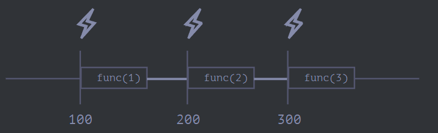
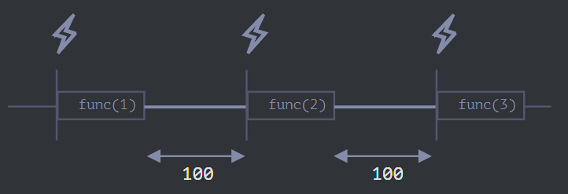

# 函数高阶

让我们回到函数，进行更深入的研究。

## 递归和堆栈

我们先来讨论一下递归（recursion），它是一种编程模式，在一个任务可以自然地拆分成多个相同类型但更简单的任务的情况下非常有用。或者，在一个任务可以简化为一个简单的行为加上该任务的一个更简单的变体的时候可以使用。或者，就像我们很快会看到的那样，处理某些数据结构。

当一个函数解决一个任务时，在解决的过程中它可以调用很多其它函数。在部分情况下，函数会调用 自身。这就是所谓的 `递归`。

### 两种思考方式

简单起见，让我们写一个函数 pow(x, n)，它可以计算 x 的 n 次方。换句话说就是，x 乘以自身 n 次。

```javascript
pow(2, 2) = 4
pow(2, 3) = 8
pow(2, 4) = 16
```

有两种实现方式。

1. 迭代思路：使用 for 循环：

```javascript
function pow(x, n) {
  let result = 1;

  // 在循环中，用 x 乘以 result n 次
  for (let i = 0; i < n; i++) {
    result *= x;
  }

  return result;
}

alert(pow(2, 3)); // 8
```

2. 递归思路：简化任务，调用自身：

```javascript
function pow(x, n) {
  if (n == 1) {
    return x;
  } else {
    return x * pow(x, n - 1);
  }
}

alert(pow(2, 3)); // 8
```

请注意，递归变体在本质上是不同的。

当 pow(x, n) 被调用时，执行分为两个分支：

```javascript
              if n==1  = x
             /
pow(x, n) =
             \
              else     = x * pow(x, n - 1)
```

- 如果 n == 1，所有事情都会很简单，这叫做 基础 的递归，因为它会立即产生明显的结果：pow(x, 1) 等于 x。
- 否则，我们可以用 x _ pow(x, n - 1) 表示 pow(x, n)。在数学里，可能会写为 xn = x _ xn-1。这叫做 一个递归步骤：我们将任务转化为更简单的行为（x 的乘法）和更简单的同类任务的调用（带有更小的 n 的 pow 运算）。接下来的步骤将其进一步简化，直到 n 达到 1。

我们也可以说 pow 递归地调用自身 直到 n == 1。

比如，为了计算 pow(2, 4)，递归变体经过了下面几个步骤：

1. pow(2, 4) = 2 \* pow(2, 3)
2. pow(2, 3) = 2 \* pow(2, 2)
3. pow(2, 2) = 2 \* pow(2, 1)
4. pow(2, 1) = 2

因此，递归将函数调用简化为一个更简单的函数调用，然后再将其简化为一个更简单的函数，以此类推，直到结果变得显而易见。

最大的嵌套调用次数（包括首次）被称为 递归深度。在我们的例子中，它正好等于 n。

最大递归深度受限于 JavaScript 引擎。对我们来说，引擎在最大迭代深度为 10000 及以下时是可靠的，有些引擎可能允许更大的最大深度，但是对于大多数引擎来说，100000 可能就超出限制了。有一些自动优化能够帮助减轻这种情况（尾部调用优化），但目前它们还没有被完全支持，只能用于简单场景。

这就限制了递归的应用，但是递归仍然被广泛使用。有很多任务中，递归思维方式会使代码更简单，更容易维护。

### 执行上下文和堆栈

现在我们来研究一下递归调用是如何工作的。为此，我们会先看看函数底层的工作原理。

有关正在运行的函数的执行过程的相关信息被存储在其 执行上下文 中。

执行上下文 是一个内部数据结构，它包含有关函数执行时的详细细节：当前控制流所在的位置，当前的变量，this 的值（此处我们不使用它），以及其它的一些内部细节。

一个函数调用仅具有一个与其相关联的执行上下文。

当一个函数进行嵌套调用时，将发生以下的事儿：

- 当前函数被暂停；
- 与它关联的执行上下文被一个叫做 执行上下文堆栈 的特殊数据结构保存；
- 执行嵌套调用；
- 嵌套调用结束后，从堆栈中恢复之前的执行上下文，并从停止的位置恢复外部函数。

我们看看执行 `pow(2, 3)` 调用期间都发生了什么：

`pow(2, 3)`

在调用 pow(2, 3) 的开始，执行上下文（context）会存储变量：x = 2, n = 3，执行流程在函数的第 1 行。

我们将其描绘如下：

```javascript
Context: { x: 2, n: 3, at line 1 } call:pow(2, 3)
```

这是函数开始执行的时候。条件 n == 1 结果为假，所以执行流程进入 if 的第二分支。变量相同，但是行改变了，因此现在的上下文是：

```javascript
Context: { x: 2, n: 3, at line 5 } call:pow(2, 3)
```

为了计算 x \* pow(x, n - 1)，我们需要使用带有新参数的新的 pow 子调用 pow(2, 2)。

`pow(2, 2)`

为了执行嵌套调用，JavaScript 会在 执行上下文堆栈 中记住当前的执行上下文。

这里我们调用相同的函数 pow，但这绝对没问题。所有函数的处理都是一样的：

1. 当前上下文被“记录”在堆栈的顶部。
2. 为子调用创建新的上下文。
3. 当子调用结束后 —— 前一个上下文被从堆栈中弹出，并继续执行。

下面是进入子调用 pow(2, 2) 时的上下文堆栈：

```javascript
Context: { x: 2, n: 2, at line 1 } call:pow(2, 2)
Context: { x: 2, n: 3, at line 5 } call:pow(2, 3)
```

新的当前执行上下文位于顶部（粗体显示），之前记住的上下文位于下方。

当我们完成子调用后 —— 很容易恢复上一个上下文，因为它既保留了变量，也保留了当时所在代码的确切位置。

`pow(2, 1)`

重复该过程：在第 5 行生成新的子调用，现在的参数是 x=2, n=1。

新的执行上下文被创建，前一个被压入堆栈顶部：

```javascript
Context: { x: 2, n: 1, at line 1 } call:pow(2, 1)
Context: { x: 2, n: 2, at line 5 } call:pow(2, 2)
Context: { x: 2, n: 3, at line 5 } call:pow(2, 3)
```

此时，有 2 个旧的上下文和 1 个当前正在运行的 pow(2, 1) 的上下文。

在执行 pow(2, 1) 时，与之前的不同，条件 n == 1 为真，因此 if 的第一个分支生效：

```javascript
function pow(x, n) {
  if (n == 1) {
    return x;
  } else {
    return x * pow(x, n - 1);
  }
}
```

此时不再有更多的嵌套调用，所以函数结束，返回 2。

函数完成后，就不再需要其执行上下文了，因此它被从内存中移除。前一个上下文恢复到堆栈的顶部

恢复执行 pow(2, 2)。它拥有子调用 pow(2, 1) 的结果，因此也可以完成 x \* pow(x, n - 1) 的执行，并返回 4。

然后，前一个上下文被恢复

当它结束后，我们得到了结果 pow(2, 3) = 8。

本示例中的递归深度为：3。

从上面的插图我们可以看出，递归深度等于堆栈中上下文的最大数量。

请注意内存要求。上下文占用内存，在我们的示例中，求 n 次方需要存储 n 个上下文，以供更小的 n 值进行计算使用。

而循环算法更节省内存：

```javascript
function pow(x, n) {
  let result = 1;

  for (let i = 0; i < n; i++) {
    result *= x;
  }

  return result;
}
```

迭代 pow 的过程中仅使用了一个上下文用于修改 i 和 result。它的内存要求小，并且是固定了，不依赖于 n。

任何递归都可以用循环来重写。通常循环变体更有效。

……但有时重写很难，尤其是函数根据条件使用不同的子调用，然后合并它们的结果，或者分支比较复杂时。而且有些优化可能没有必要，完全不值得。

递归可以使代码更短，更易于理解和维护。并不是每个地方都需要优化，大多数时候我们需要一个好代码，这就是为什么要使用它。

### 递归遍历

递归的一个重要应用就是递归遍历。

假设我们有一家公司。人员结构可以表示为一个对象：

```javascript
let company = {
  sales: [
    {
      name: "John",
      salary: 1000,
    },
    {
      name: "Alice",
      salary: 1600,
    },
  ],

  development: {
    sites: [
      {
        name: "Peter",
        salary: 2000,
      },
      {
        name: "Alex",
        salary: 1800,
      },
    ],

    internals: [
      {
        name: "Jack",
        salary: 1300,
      },
    ],
  },
};
```

换句话说，一家公司有很多部门。

- 一个部门可能有一 数组 的员工，比如，sales 部门有 2 名员工：John 和 Alice。

- 或者，一个部门可能会划分为几个子部门，比如 development 有两个分支：sites 和 internals，它们都有自己的员工。

- 当一个子部门增长时，它也有可能被拆分成几个子部门（或团队）。例如，sites 部门在未来可能会分为 siteA 和 siteB。并且，它们可能会被再继续拆分。

现在，如果我们需要一个函数来获取所有薪资的总数。我们该怎么做？

迭代方式并不容易，因为结构比较复杂。首先想到的可能是在 company 上使用 for 循环，并在第一层部分上嵌套子循环。但是，之后我们需要更多的子循环来遍历像 sites 这样的二级部门的员工…… 然后，将来可能会出现在三级部门上的另一个子循环？如果我们在代码中写 3-4 级嵌套的子循环来遍历单个对象， 那代码得多丑啊。

我们试试递归吧。

我们可以看到，当我们的函数对一个部门求和时，有两种可能的情况：

- 要么是由一个人员 数组 构成的“简单”的部门 —— 这样我们就可以通过一个简单的循环来计算薪资的总和。

- 或者它是一个有 N 个子部门的 对象 —— 那么我们可以通过 N 层递归调用来求每一个子部门的薪资，然后将它们合并起来。

第一种情况是由人员数组构成的部门，这种情况很简单，是最基础的递归。

第二种情况是我们得到的是对象。那么可将这个复杂的任务拆分成适用于更小部门的子任务。它们可能会被继续拆分，但很快或者不久就会拆分到第一种情况那样。

这个算法从代码来看可能会更简单：

```javascript
let company = {
  sales: [
    { name: "John", salary: 1000 },
    { name: "Alice", salary: 1600 },
  ],
  development: {
    sites: [
      { name: "Peter", salary: 2000 },
      { name: "Alex", salary: 1800 },
    ],
    internals: [{ name: "Jack", salary: 1300 }],
  },
};

// 用来完成任务的函数
function sumSalaries(department) {
  if (Array.isArray(department)) {
    // 情况（1）
    return department.reduce((prev, current) => prev + current.salary, 0); // 求数组的和
  } else {
    // 情况（2）
    let sum = 0;
    for (let subdep of Object.values(department)) {
      sum += sumSalaries(subdep); // 递归调用所有子部门，对结果求和
    }
    return sum;
  }
}

alert(sumSalaries(company)); // 7700
```

我们可以很容易地看到其原理：对于对象 {...} 会生成子调用，而数组 [...] 是递归树的“叶子”，它们会立即给出结果。

请注意，该代码使用了我们之前讲过的智能特性（smart features）：

- 在 数组方法 中我们介绍过的数组求和方法 arr.reduce。
- 使用循环 for(val of Object.values(obj)) 遍历对象的（属性）值：Object.values 返回它们组成的数组。

### 递归结构

递归（递归定义的）数据结构是一种部分复制自身的结构。

我们刚刚在上面的公司结构的示例中看过了它。

一个公司的 部门 是：

- 人员数组。
- 或一个 部门 对象。
- 对于 Web 开发者而言，有更熟知的例子：HTML 和 XML 文档。

在 HTML 文档中，一个 HTML 标签 可能包括以下内容：

- 文本片段。
- HTML 注释。
- 其它 HTML 标签（它有可能又包括文本片段、注释或其它标签等）。

这又是一个递归定义。

为了更好地理解递归，我们再讲一个递归结构的例子——“链表”，在某些情况下，它可能是优于数组的选择。

想象一下，我们要存储一个有序的对象列表。

正常的选择会是一个数组：

```javascript
let arr = [obj1, obj2, obj3];
```

……但是用数组有个问题。“删除元素”和“插入元素”的操作代价非常大。例如，arr.unshift(obj) 操作必须对所有元素重新编号以便为新的元素 obj 腾出空间，而且如果数组很大，会很耗时。arr.shift() 同理。

唯一对数组结构做修改而不需要大量重排的操作就是对数组末端的操作：arr.push/pop。因此，对于大队列来说，当我们必须对数组首端的元素进行操作时，数组会很慢。（译注：此处的首端操作其实指的是在尾端以外的数组内的元素进行插入/删除操作。）

如果我们确实需要快速插入/删除，则可以选择另一种叫做 **链表** 的数据结构。

`链表元素` 是一个使用以下元素通过递归定义的对象：

- `value`
- `next` 属性引用下一个 `链表元素` 或者代表末尾的 `null`

例如：

```javascript
let list = {
  value: 1,
  next: {
    value: 2,
    next: {
      value: 3,
      next: {
        value: 4,
        next: null,
      },
    },
  },
};
```

一段用来创建链表的代码：

```javascript
let list = { value: 1 };
list.next = { value: 2 };
list.next.next = { value: 3 };
list.next.next.next = { value: 4 };
list.next.next.next.next = null;
```

在这儿我们可以清楚地看到，这里有很多个对象，每一个都有 value 和指向邻居的 next。变量 list 是链条中的第一个对象，因此顺着 next 指针，我们可以抵达任何元素。

该链表可以很容易被拆分为多个部分，然后再重新组装回去：

```javascript
let secondList = list.next.next;
list.next.next = null;
```

合并：

```javascript
list.next.next = secondList;
```

当然，我们可以在任何位置插入或移除元素。

比如，要添加一个新值，我们需要更新链表的头：

```javascript
let list = { value: 1 };
list.next = { value: 2 };
list.next.next = { value: 3 };
list.next.next.next = { value: 4 };

// 将新值添加到链表头部
list = { value: "new item", next: list };
```

要从中间删除一个值，可以修改前一个元素的 next：

```javascript
list.next = list.next.next;
```

与数组不同，链表没有大规模重排，我们可以很容易地重新排列元素。

当然，链表也不总是优于数组的。不然大家就都去使用链表了。

链表主要的缺点就是我们无法很容易地通过元素的编号获取元素。但在数组中却很容易：arr[n] 是一个直接引用。而在链表中，我们需要从起点元素开始，顺着 next 找 N 次才能获取到第 N 个元素。

……但是我们也并不是总需要这样的操作。比如，当我们需要一个队列甚至一个 双向队列 —— 有序结构必须可以快速地从两端添加/移除元素，无需访问中间元素。

链表可以得到增强：

- 我们可以在 next 之外，再添加 prev 属性来引用前一个元素，以便轻松地往回移动。
- 我们还可以添加一个名为 tail 的变量，该变量引用链表的最后一个元素（并在从末尾添加/删除元素时对该引用进行更新）。
- ……数据结构可能会根据我们的需求而变化。

## Rest 参数与 Spread 语法

在 JavaScript 中，很多内建函数都支持传入任意数量的参数。

例如：

- `Math.max(arg1, arg2, ..., argN)` —— 返回参数中的最大值。
- `Object.assign(dest, src1, ..., srcN)` —— 依次将属性从 src1..N 复制到 dest。
  ……等。
  在本章中，我们将学习如何编写支持传入任意数量参数的函数，以及如何将数组作为参数传递给这类函数。

### Rest 参数 `...`

在 JavaScript 中，无论函数是如何定义的，你都可以在调用它时传入任意数量的参数。

例如：

```javascript
function sum(a, b) {
  return a + b;
}

alert(sum(1, 2, 3, 4, 5));
```

虽然这里这个函数不会因为传入过多的参数而报错。但是，当然，只有前两个参数被求和了。

我们可以在函数定义中声明一个数组来收集参数。语法是这样的：`...变量名`，这将会声明一个数组并指定其名称，其中存有剩余的参数。这三个点的语义就是“收集剩余的参数并存进指定数组中”。

例如，我们需要把所有的参数都放到数组 `args` 中：

```javascript
function sumAll(...args) {
  // 数组名为 args
  let sum = 0;

  for (let arg of args) sum += arg;

  return sum;
}

alert(sumAll(1)); // 1
alert(sumAll(1, 2)); // 3
alert(sumAll(1, 2, 3)); // 6
```

我们也可以选择将第一个参数获取为变量，并将剩余的参数收集起来。

下面的例子把前两个参数获取为变量，并把剩余的参数收集到 titles 数组中

```javascript
function showName(firstName, lastName, ...titles) {
  alert(firstName + " " + lastName); // Julius Caesar

  // 剩余的参数被放入 titles 数组中
  // i.e. titles = ["Consul", "Imperator"]
  alert(titles[0]); // Consul
  alert(titles[1]); // Imperator
  alert(titles.length); // 2
}

showName("Julius", "Caesar", "Consul", "Imperator");
```

::: warning Rest 参数必须放到参数列表的末尾
Rest 参数会收集剩余的所有参数，因此下面这种用法没有意义，并且会导致错误：

```javascript
function f(arg1, ...rest, arg2) { // arg2 在 ...rest 后面？！
  // error
}
```

`...rest` 必须写在参数列表最后。
:::

### “arguments” 变量

有一个名为 `arguments` 的`特殊类数组对象`可以在函数中被访问，该对象以参数在参数列表中的索引作为键，存储所有参数。

例如：

```javascript
function showName() {
  alert(arguments.length);
  alert(arguments[0]);
  alert(arguments[1]);

  // 它是可遍历的
  // for(let arg of arguments) alert(arg);
}

// 依次显示：2，Julius，Caesar
showName("Julius", "Caesar");

// 依次显示：1，Ilya，undefined（没有第二个参数）
showName("Ilya");
```

在过去，JavaScript 中不支持 rest 参数语法，而使用 arguments 是获取函数所有参数的唯一方法。现在它仍然有效，我们可以在一些老代码里找到它。

但缺点是，尽管 arguments 是一个类数组，也是可迭代对象，但它终究不是数组。它不支持数组方法，因此我们不能调用 arguments.map(...) 等方法。

此外，它始终包含所有参数，我们不能像使用 rest 参数那样只截取参数的一部分。

因此，当我们需要这些功能时，**最好使用 rest 参数**。

::: tip 箭头函数没有 `"arguments"`
如果我们在箭头函数中访问 arguments，访问到的 arguments 并不属于箭头函数，而是属于箭头函数外部的“普通”函数。

举个例子：

```javascript
function f() {
  let showArg = () => alert(arguments[0]);
  showArg();
}

f(1); // 1
```

我们已经知道，箭头函数没有自身的 this。现在我们知道了它们也没有特殊的 arguments 对象。
:::

### Spread 语法

我们刚刚看到了如何从参数列表中获取数组。

有时候我们也需要做与之相反的事。

例如，内建函数 Math.max 会返回参数中最大的值：

```javascript
alert(Math.max(3, 5, 1)); // 5
```

如果我们有一个数组 [3, 5, 1]，我们该如何用它调用 Math.max 呢？

直接“原样”传入这个数组是不会奏效的，因为 Math.max 期望的是**列表形式的数值型参数**，而不是一个数组：

```javascript
let arr = [3, 5, 1];

alert(Math.max(arr)); // NaN
```

`Spread 语法` 可以解决这个问题！它看起来和 rest 参数很像，也使用 ...，但是二者的用途完全相反。

当在函数调用中使用 ...arr 时，它会把可迭代对象 arr “展开”到参数列表中。

以 Math.max 为例：

```javascript
let arr = [3, 5, 1];

alert(Math.max(arr)); // NaN
```

我们还可以通过这种方式传入多个可迭代对象：

```javascript
let arr1 = [1, -2, 3, 4];
let arr2 = [8, 3, -8, 1];

alert(Math.max(...arr1, ...arr2)); // 8
```

我们甚至还可以将 spread 语法与常规值结合使用：

```javascript
let arr1 = [1, -2, 3, 4];
let arr2 = [8, 3, -8, 1];

alert(Math.max(1, ...arr1, 2, ...arr2, 25)); // 25
```

并且，我们还可以使用 spread 语法来合并数组：

```javascript
let arr = [3, 5, 1];
let arr2 = [8, 9, 15];

let merged = [0, ...arr, 2, ...arr2];

alert(merged); // 0,3,5,1,2,8,9,15（0，然后是 arr，然后是 2，然后是 arr2）
```

在上面的示例中，我们使用数组展示了 spread 语法，其实我们可以用 spread 语法这样操作任何可迭代对象。

例如，在这儿我们使用 spread 语法将字符串转换为字符数组：

```javascript
let str = "Hello";

alert([...str]); // H,e,l,l,o
```

Spread 语法内部使用了迭代器来收集元素，与 for..of 的方式相同。

因此，对于一个字符串，for..of 会逐个返回该字符串中的字符，...str 也同理会得到 "H","e","l","l","o" 这样的结果。随后，字符列表被传递给数组初始化器` [...str]`。

对于这个特定任务，我们还可以使用 Array.from 来实现，因为该方法会将一个可迭代对象（如字符串）转换为数组：

```javascript
let str = "Hello";

// Array.from 将可迭代对象转换为数组
alert(Array.from(str)); // H,e,l,l,o
```

运行结果与 `[...str]` 相同。

不过 Array.from(obj) 和 `[...obj]` 存在一个细微的差别：

- Array.from 适用于类数组对象也适用于可迭代对象。
- Spread 语法只适用于可迭代对象。

因此，对于将一些“东西”转换为数组的任务，Array.from 往往更通用。

### 复制 array/object

对于浅拷贝，我们之前讲到了 `Object.assign()` 可以实现，其实 Spread 也可以实现浅拷贝。

```javascript
let arr = [1, 2, 3];

let arrCopy = [...arr]; // 将数组 spread 到参数列表中
// 然后将结果放到一个新数组

// 两个数组中的内容相同吗？
alert(JSON.stringify(arr) === JSON.stringify(arrCopy)); // true

// 两个数组相等吗？
alert(arr === arrCopy); // false（它们的引用是不同的）

// 修改我们初始的数组不会修改副本：
arr.push(4);
alert(arr); // 1, 2, 3, 4
alert(arrCopy); // 1, 2, 3
```

并且，也可以通过相同的方式来复制一个对象：

```javascript
let obj = { a: 1, b: 2, c: 3 };

let objCopy = { ...obj }; // 将对象 spread 到参数列表中
// 然后将结果返回到一个新对象

// 两个对象中的内容相同吗？
alert(JSON.stringify(obj) === JSON.stringify(objCopy)); // true

// 两个对象相等吗？
alert(obj === objCopy); // false (not same reference)

// 修改我们初始的对象不会修改副本：
obj.d = 4;
alert(JSON.stringify(obj)); // {"a":1,"b":2,"c":3,"d":4}
alert(JSON.stringify(objCopy)); // {"a":1,"b":2,"c":3}
```

这种方式比使用 `let arrCopy = Object.assign([], arr)` 复制数组，或使用 `let objCopy = Object.assign({}, obj)` 复制对象来说更为简便。因此，只要情况允许，我们倾向于使用它。

### 总而言之：

区分：

- 若 ... 出现在函数参数列表的最后，那么它就是 rest 参数，它会把参数列表中剩余的参数收集到一个数组中。
- 若 ... 出现在函数调用或类似的表达式中，那它就是 spread 语法，它会把一个数组展开为列表。

使用场景：

- Rest 参数用于创建可接受任意数量参数的函数。
- Spread 语法用于将数组传递给通常需要含有许多参数的函数。

我们可以使用这两种语法轻松地互相转换列表与参数数组。

旧式的 arguments（类数组且可迭代的对象）也依然能够帮助我们获取函数调用中的所有参数。

## 变量作用域，闭包

JavaScript 是一种非常面向函数的语言。它给了我们很大的自由度。在 JavaScript 中，我们可以随时创建函数，可以将函数作为参数传递给另一个函数，并在完全不同的代码位置进行调用。

我们已经知道函数可以访问其外部的变量。

但是，如果在函数被创建之后，外部变量发生了变化会怎样？函数会获得新值还是旧值？

如果将函数作为参数（argument）传递并在代码中的另一个位置调用它，该函数将访问的是新位置的外部变量吗？

让我们来学习这些相关知识，以了解在这些场景以及更复杂的场景下到底会发生什么。

::: tip 我们将在这探讨一下 `let/const`

```txt
**在本文的示例中，我们将使用 let 声明变量**。
```

在 JavaScript 中，有三种声明变量的方式：let，const（现代方式），var（过去留下来的方式）。

- 用 const 声明的变量的行为也相同（译注：与 let 在作用域等特性上是相同的），因此，本文也涉及用 const 进行变量声明。
- 旧的 var 与上面两个有着明显的区别，我们将在 下一篇文章 老旧的 "var" 中详细介绍。
  :::

### 代码块

如果在代码块 `{...}` 内使用 let 声明了一个变量，那么这个变量只在该代码块内可见。

```javascript
{
  // 使用在代码块外不可见的局部变量做一些工作

  let message = "Hello"; // 只在此代码块内可见

  alert(message); // Hello
}

alert(message); // Error: message is not defined
```

我们可以使用它来隔离一段代码，该段代码执行自己的任务，并使用仅属于自己的变量：

```javascript
{
  // 显示 message
  let message = "Hello";
  alert(message);
}

{
  // 显示另一个 message
  let message = "Goodbye";
  alert(message);
}
```

::: warning 如果没有代码块则会报错
请注意，如果我们使用 let 对已存在的变量进行重复声明，如果对应的变量没有单独的代码块，则会出现错误：

```javascript
// 显示 message
let message = "Hello";
alert(message);

// 显示另一个 message
let message = "Goodbye"; // Error: variable already declared
alert(message);
```

:::

`对于 if，for 和 while 等，在 {...} 中声明的变量也仅在内部可见：`

```javascript
if (true) {
  let phrase = "Hello!";

  alert(phrase); // Hello!
}

alert(phrase); // Error, no such variable!
```

在这儿，当 if 执行完毕，则下面的 alert 将看不到 phrase，因此会出现错误。（译注：就算下面的 alert 想在 if 没执行完成时去取 phrase（虽然这种情况不可能发生）也是取不到的，因为 let 声明的变量在代码块外不可见。）

太好了，因为这就允许我们创建特定于 if 分支的块级局部变量。

对于 for 和 while 循环也是如此：

```javascript
for (let i = 0; i < 3; i++) {
  // 变量 i 仅在这个 for 循环的内部可见
  alert(i); // 0，然后是 1，然后是 2
}

alert(i); // Error, no such variable
```

**从视觉上看，let i 位于 {...} 之外。但是 for 构造在这里很特殊：在其中声明的变量被视为块的一部分。**

### 嵌套函数

如果一个函数是在另一个函数中创建的，该函数就被称为“嵌套”函数。

在 JavaScript 中很容易实现这一点。

我们可以使用嵌套来组织代码，比如这样：

```javascript
function sayHiBye(firstName, lastName) {
  // 辅助嵌套函数使用如下
  function getFullName() {
    return firstName + " " + lastName;
  }

  alert("Hello, " + getFullName());
  alert("Bye, " + getFullName());
}
```

这里创建的 嵌套 函数 getFullName() 是为了更加方便。它可以访问外部变量，因此可以返回全名。嵌套函数在 JavaScript 中很常见。

更有意思的是，可以返回一个嵌套函数：作为一个新对象的属性或作为结果返回。之后可以在其他地方使用。不论在哪里调用，它仍然可以访问相同的外部变量。

下面的 makeCounter 创建了一个 “counter” 函数，该函数在每次调用时返回下一个数字：

```javascript
function makeCounter() {
  let count = 0;

  return function () {
    return count++;
  };
}

let counter = makeCounter();

alert(counter()); // 0
alert(counter()); // 1
alert(counter()); // 2
```

尽管很简单，但稍加变型就具有很强的实际用途，比如，用作 **随机数生成器** 以生成用于自动化测试的随机数值。

这是如何运作的呢？如果我们创建多个计数器，它们会是独立的吗？这里的变量是怎么回事？

理解这些内容对于掌握 JavaScript 的整体知识很有帮助，并且对于应对更复杂的场景也很有益处。因此，让我们继续深入探究。

### 词法环境

一大波深入的技术讲解即将到来。

#### Step 1. 变量

在 JavaScript 中，每个运行的函数，代码块 {...} 以及整个脚本，都有一个被称为 **词法环境（Lexical Environment）** 的内部（隐藏）的关联对象。

词法环境对象由两部分组成：

1. 环境记录（Environment Record） —— 一个存储所有局部变量作为其属性（包括一些其他信息，例如 this 的值）的对象。
2. 对 外部词法环境 的引用，与外部代码相关联。

一个“变量”只是 **环境记录** 这个特殊的内部对象的一个属性。**“获取或修改变量”意味着“获取或修改词法环境的一个属性”**。

举个例子，这段没有函数的简单的代码中只有一个词法环境：

```javascript
let phrase = "Hello";
alert(phrase);

// Lexical Environment
// phrase:"Hello" -> outer:null
```

这就是所谓的与整个脚本相关联的 全局 词法环境。

注释表示环境记录（变量存储），箭头表示外部引用。全局词法环境没有外部引用，所以箭头指向了 null。

随着代码开始并继续运行，词法环境发生了变化。

这是更长的代码：

```javascript
let phrase;
phrase = "Hello";
phrase = "Bye";

// Lexical Environment
// 1 execution start : phrase : <uninitialized> -> outer : null
// 2 phrase: undefined
// 3 phrase: "Hello"
// 4 phrase: "Bye"
```

上面的注释演示了执行过程中全局词法环境的变化：

1. 当脚本开始运行，词法环境预先填充了所有声明的变量。
   - 最初，它们处于“未初始化（Uninitialized）”状态。这是一种特殊的内部状态，这意味着引擎知道变量，但是在用 let 声明前，不能引用它。几乎就像变量不存在一样。
2. 然后 let phrase 定义出现了。它尚未被赋值，因此它的值为 undefined。从这一刻起，我们就可以使用变量了。
3. phrase 被赋予了一个值。
4. phrase 的值被修改。

现在看起来都挺简单的：

- 变量是特殊内部对象的属性，与当前正在执行的（代码）块/函数/脚本有关。

- 操作变量实际上是操作该对象的属性。

::: tip 词法环境是一个规范对象
“词法环境”是一个规范对象（specification object）：它只存在于 语言规范 的“理论”层面，用于描述事物是如何工作的。我们无法在代码中获取该对象并直接对其进行操作。

但 JavaScript 引擎同样可以优化它，比如清除未被使用的变量以节省内存和执行其他内部技巧等，但显性行为应该是和上述的无差。
:::

#### Step 2. 函数声明

一个函数其实也是一个值，就像变量一样。

**不同之处在于函数声明的初始化会被立即完成,它在词法环境中是没有`<unintialized>`这一状态的**。

当创建了一个词法环境（Lexical Environment）时，函数声明会立即变为即用型函数（不像 let 那样直到声明处才可用）。

这就是为什么我们甚至可以在声明自身之前调用一个以函数声明（Function Declaration）的方式声明的函数。

例如，这是添加一个函数时全局词法环境的初始状态：

```javascript
let phrase = "Hello";

function say(name) {
  alert(`${phrase},${name}`);
}

// Lexical Environment
// 1 execution start : phrase:<uninitialized> -> outer : null
//                     say:funtion -> outer : null
// 2 ...
// 3 ...
```

正常来说，这种行为仅适用于函数声明，而不适用于我们将函数分配给变量的函数表达式，例如 `let say = function(name)...`。

#### Step 3. 内部和外部的词法环境

在一个函数运行时，在调用刚开始时，会自动创建一个新的词法环境以存储这个调用的局部变量和参数。

例如，对于 say("John")，它看起来像这样（当前执行位置在箭头标记的那一行上）：

```javascript
let phrase = "Hello";

function say(name) {
  alert(`${phrase},${name}`);
}

// Lexical Environment
// 1 execution start : phrase:<uninitialized> -> outer : null
//                     say:funtion -> outer : null

// (调用函数，例如 say("John") )
// 2 Lexical Environment of the call
// name:"John" -> outer: say:funtcion -> outer:null
//                phrase:Hello" -> outer:null
```

在这个函数调用期间，我们有两个词法环境：内部一个（用于函数调用）和外部一个（全局）：

- 内部词法环境与 say 的当前执行相对应。它具有一个单独的属性：name，函数的参数。我们调用的是 say("John")，所以 name 的值为 "John"。
- 外部词法环境是全局词法环境。它具有 phrase 变量和函数本身。

内部词法环境引用了 outer。

**当代码要访问一个变量时 —— 首先会搜索内部词法环境，然后搜索外部环境，然后搜索更外部的环境，以此类推，直到全局词法环境**。

如果在任何地方都找不到这个变量，那么在严格模式下就会报错（在非严格模式下，为了向下兼容，给未定义的变量赋值会创建一个全局变量）。

在这个示例中，搜索过程如下：

- 对于 name 变量，当 say 中的 alert 试图访问 name 时，会立即在内部词法环境中找到它。
- 当它试图访问 phrase 时，然而内部没有 phrase，所以它顺着对外部词法环境的引用找到了它。

#### Step 4. 返回函数

让我们回到 makeCounter 这个例子。

```javascript
function makeCounter() {
  let count = 0;

  return function () {
    return count++;
  };
}

let counter = makeCounter();
```

在每次 makeCounter() 调用的开始，都会创建一个新的词法环境对象，以存储该 makeCounter 运行时的变量。

因此，我们有两层嵌套的词法环境，就像上面的示例一样：

```javascript
// count : LexicalEnvironment of makeCounter() call
// makeCounter、counter : global LexicalEnvironment

// count: 0 -> outer: makeCounter:function -> outer:null
//             counter: undefined
```

不同的是，在执行 makeCounter() 的过程中创建了一个仅占一行的嵌套函数：return count++。我们尚未运行它，仅创建了它。

所有的函数在“诞生”时都会记住创建它们的词法环境。从技术上讲，这里没有什么魔法：所有函数都有名为 `[[Environment]]` 的隐藏属性，该属性保存了对创建该函数的词法环境的引用。

因此，`counter.[[Environment]]` 有对 {count: 0} 词法环境的引用。这就是函数记住它创建于何处的方式，与函数被在哪儿调用无关。`[[Environment]]` 引用在函数创建时被设置并永久保存。

稍后，当调用 counter() 时，会为该调用创建一个新的词法环境，并且其外部词法环境引用获取于 `counter.[[Environment]]`：

```javascript
// <empty> -> outer: count: 0   -> outer: makeCounter:function -> outer:null
//                   counter: undefined
```

现在，当 counter() 中的代码查找 count 变量时，它首先搜索自己的词法环境（为空，因为那里没有局部变量），然后是外部 makeCounter() 的词法环境，并且在哪里找到就在哪里修改。

**在变量所在的词法环境中更新变量**。

如果我们调用 counter() 多次，count 变量将在同一位置增加到 2，3 等。

::: tip 闭包
开发者通常应该都知道“闭包”这个通用的编程术语。

闭包 是指一个函数可以记住其外部变量并可以访问这些变量。在某些编程语言中，这是不可能的，或者应该以一种特殊的方式编写函数来实现。但如上所述，在 JavaScript 中，所有函数都是天生闭包的（只有一个例外，将在 `"new Function" 语法` 中讲到）。

也就是说：JavaScript 中的函数会自动通过隐藏的 `[[Environment]]` 属性记住创建它们的位置，所以它们都可以访问外部变量。

在面试时，前端开发者通常会被问到“什么是闭包？”，正确的回答应该是闭包的定义，并解释清楚为什么 JavaScript 中的所有函数都是闭包的，以及可能的关于 `[[Environment]]` 属性和词法环境原理的技术细节。
:::

### 垃圾收集

通常，函数调用完成后，会将词法环境和其中的所有变量从内存中删除。因为现在没有任何对它们的引用了。与 JavaScript 中的任何其他对象一样，词法环境仅在可达时才会被保留在内存中。

但是，如果有一个嵌套的函数在函数结束后仍可达，则它将具有引用词法环境的 `[[Environment]]` 属性。

在下面这个例子中，即使在（外部）函数执行完成后，它的词法环境仍然可达。因此，此词法环境仍然有效。

例如：

```javascript
function f() {
  let value = 123;

  return function () {
    alert(value);
  };
}

let g = f(); // g.[[Environment]] 存储了对相应 f() 调用的词法环境的引用
```

请注意，如果多次调用 f()，并且返回的函数被保存，那么所有相应的词法环境对象也会保留在内存中。下面代码中有三个这样的函数：

```javascript
function f() {
  let value = Math.random();

  return function () {
    alert(value);
  };
}

// 数组中的 3 个函数，每个都与来自对应的 f() 的词法环境相关联
let arr = [f(), f(), f()];
```

当词法环境对象变得不可达时，它就会死去（就像其他任何对象一样）。换句话说，它仅在至少有一个嵌套函数引用它时才存在。

在下面的代码中，嵌套函数被删除后，其封闭的词法环境（以及其中的 value）也会被从内存中删除：

```javascript
function f() {
  let value = 123;

  return function () {
    alert(value);
  };
}

let g = f(); // 当 g 函数存在时，该值会被保留在内存中

g = null; // ……现在内存被清理了
```

#### 实际开发中的优化

正如我们所看到的，理论上当函数可达时，它外部的所有变量也都将存在。

但在实际中，JavaScript 引擎会试图优化它。它们会分析变量的使用情况，如果从代码中可以明显看出有未使用的外部变量，那么就会将其删除。

在 V8（Chrome，Edge，Opera）中的一个重要的副作用是，此类变量在调试中将不可用。

打开 Chrome 浏览器的开发者工具，并尝试运行下面的代码。

当代码执行暂停时，在控制台中输入 alert(value)。

```javascript
function f() {
  let value = Math.random();

  function g() {
    debugger; // 在 Console 中：输入 alert(value); No such variable!
  }

  return g;
}

let g = f();
g();
```

正如你所见的 —— No such variable! 理论上，它应该是可以访问的，但引擎把它优化掉了。

这可能会导致有趣的（如果不是那么耗时的）调试问题。其中之一 —— 我们可以看到的是一个同名的外部变量，而不是预期的变量。

V8 引擎的这个特性你真的应该知道。如果你要使用 Chrome/Edge/Opera 进行代码调试，迟早会遇到这样的问题。

这不是调试器的 bug，而是 V8 的一个特别的特性。也许以后会被修改。你始终可以通过运行本文中的示例来进行检查。

::: tip 函数会选择最新的内容吗？

```javascript
let name = "John";

function sayHi() {
  alert("Hi, " + name);
}

name = "Pete";

sayHi(); // 会显示什么："John" 还是 "Pete"？
```

Pete。

函数将从内到外依次在对应的词法环境中寻找目标变量，它使用最新的值。

旧变量值不会保存在任何地方。当一个函数想要一个变量时，它会从自己的词法环境或外部词法环境中获取当前值。
:::

这一章中有很多有意思的小 Task ，可以看看：https://zh.javascript.info/closure

## 老旧的 "var"

在本教程最开始那部分的 变量 这章中，我们提到了变量声明的三种方式：

- let
- const
- var

var 声明与 let 相似。var 却是一头非常不同的，源自远古时代的怪兽。在现代脚本中一般不再使用它，但它仍然潜伏在旧脚本中。

### “var” 没有块级作用域

用 var 声明的变量，不是函数作用域就是全局作用域。它们在代码块外也是可见的（也就是说，var 声明的变量只有函数作用域和全局作用域，没有块级作用域）。

举个例子：

```javascript
if (true) {
  var test = true; // 使用 "var" 而不是 "let"
}

alert(test); // true，变量在 if 结束后仍存在
```

由于 var 会忽略代码块，因此我们有了一个全局变量 test。

如果我们在第二行使用 let test 而不是 var test，那么该变量将仅在 if 内部可见：

对于循环也是这样的，var 声明的变量没有块级作用域也没有循环局部作用域：

```javascript
for (var i = 0; i < 10; i++) {
  var one = 1;
  // ...
}

alert(i); // 10，"i" 在循环结束后仍可见，它是一个全局变量
alert(one); // 1，"one" 在循环结束后仍可见，它是一个全局变量
```

如果一个代码块位于函数内部，那么 var 声明的变量的作用域将为函数作用域：

```javascript
function sayHi() {
  if (true) {
    var phrase = "Hello";
  }

  alert(phrase); // 能正常工作
}

sayHi();
alert(phrase); // ReferenceError: phrase is not defined
```

可以看到，var 穿透了 if，for 和其它代码块。这是因为在早期的 JavaScript 中，块没有词法环境，而 var 就是这个时期的代表之一。

### “var” 允许重新声明

如果我们用 let 在同一作用域下将同一个变量声明两次，则会出现错误。

使用 var，我们可以重复声明一个变量，不管多少次都行。如果我们对一个已经声明的变量使用 var，这条新的声明语句会被忽略：

```javascript
var user = "Pete";

var user = "John"; // 这个 "var" 无效（因为变量已经声明过了）
// ……不会触发错误

alert(user); // John
```

### “var” 声明的变量，可以在其声明语句前被使用

当函数开始的时候，就会处理 var 声明（脚本启动对应全局变量）。

换言之，var 声明的变量会在函数开头被定义，与它在代码中定义的位置无关（这里不考虑定义在嵌套函数中的情况）。

那么看一下这段代码：

```javascript
function sayHi() {
  phrase = "Hello";

  alert(phrase);

  var phrase;
}
sayHi();
```

……从技术上讲，它与下面这种情况是一样的（var phrase 被上移至函数开头）：

```javascript
function sayHi() {
  var phrase;

  phrase = "Hello";

  alert(phrase);
}
sayHi();
```

……甚至与这种情况也一样（记住，代码块是会被忽略的）：

```javascript
function sayHi() {
  phrase = "Hello"; // (*)

  if (false) {
    var phrase;
  }

  alert(phrase);
}
sayHi();
```

人们将这种行为称为“提升”（英文为 “hoisting” 或 “raising”），因为所有的 var 都被“提升”到了函数的顶部。

所以，在上面的例子中，if (false) 分支永远都不会执行，但没关系，它里面的 var 在函数刚开始时就被处理了，所以在执行 (\*) 那行代码时，变量是存在的。

**声明会被提升，但是赋值不会**。

我们最好用例子来说明：

```javascript
function sayHi() {
  alert(phrase);

  var phrase = "Hello";
}

sayHi();
```

`var phrase = "Hello"` 这行代码包含两个行为：

- 使用 var 声明变量
- 使用 = 给变量赋值。

声明在函数刚开始执行的时候（“提升”）就被处理了，但是赋值操作始终是在它出现的地方才起作用。所以这段代码实际上是这样工作的：

```javascript
function sayHi() {
  var phrase; // 在函数刚开始时进行变量声明

  alert(phrase); // undefined

  phrase = "Hello"; // ……赋值 — 当程序执行到这一行时。
}

sayHi();
```

因为所有的 var 声明都是在函数开头处理的，我们可以在任何地方引用它们。但是在它们被赋值之前都是 undefined。

上面两个例子中，alert 运行都不会报错，因为变量 phrase 是存在的。但是它还没有被赋值，所以显示 undefiend。

### IIFE 立即调用函数表达式

在之前，JavaScript 中只有 var 这一种声明变量的方式，并且这种方式声明的变量没有块级作用域，程序员们就发明了一种模仿块级作用域的方法。这种方法被称为“立即调用函数表达式”（immediately-invoked function expressions，IIFE）。

如今，我们不应该再使用 IIFE 了，但是你可以在旧脚本中找到它们。

IIFE 看起来像这样：

```javascript
(function () {
  var message = "Hello";

  alert(message); // Hello
})();
```

这里，创建了一个函数表达式并立即调用。因此，代码立即执行并拥有了自己的私有变量。

函数表达式被括号 (function {...}) 包裹起来，因为当 JavaScript 引擎在主代码中遇到 "function" 时，它会把它当成一个函数声明的开始。但函数声明必须有一个函数名，所以这样的代码会导致错误：

```javascript
// 尝试声明并立即调用一个函数
function() { // <-- SyntaxError: Function statements require a function name

  var message = "Hello";

  alert(message); // Hello

}();
```

即使我们说：“好吧，那我们加一个名称吧”，但它仍然不工作，因为 JavaScript 不允许立即调用函数声明：

```javascript
// 下面的括号会导致语法错误
function go() {

}(); // <-- 不能立即调用函数声明
```

因此，需要使用圆括号把该函数表达式包起来，以告诉 JavaScript，这个函数是在另一个表达式的上下文中创建的，因此它是一个函数表达式：它不需要函数名，可以立即调用。

除了使用括号，还有其他方式可以告诉 JavaScript 在这我们指的是函数表达式：

```javascript
// 创建 IIFE 的方法

(function () {
  alert("Parentheses around the function");
})();

(function () {
  alert("Parentheses around the whole thing");
})();

!(function () {
  alert("Bitwise NOT operator starts the expression");
})();

+(function () {
  alert("Unary plus starts the expression");
})();
```

在上面的所有情况中，我们都声明了一个函数表达式并立即运行它。请再注意一下：**如今我们没有理由来编写这样的代码**。

## 全局对象

全局对象提供可在任何地方使用的变量和函数。默认情况下，这些全局变量内建于语言或环境中。

在浏览器中，它的名字是 “window”，对 Node.js 而言，它的名字是 “global”，其它环境可能用的是别的名字。

globalThis 被作为全局对象的标准名称加入到了 JavaScript 中，所有环境都应该支持该名称。所有主流浏览器都支持它。

假设我们的环境是浏览器，我们将在这儿使用 “window”。如果你的脚本可能会用来在其他环境中运行，则最好使用 globalThis。

全局对象的所有属性都可以被直接访问：

```javascript
alert("Hello");
// 等同于
window.alert("Hello");
```

**在浏览器中**，使用 var（而不是 let/const！）声明的全局函数和变量会成为全局对象的属性。

```javascript
var gVar = 5;

alert(window.gVar); // 5（成为了全局对象的属性）
```

函数声明（特指在主代码流中具有 function 关键字的语句，而不是函数表达式）也有这样的效果。

请不要依赖它！这种行为是出于兼容性而存在的。现代脚本使用 JavaScript modules（我们后面会讲） 所以不会发生这种事情。

如果我们使用 let，就不会发生这种情况：

```javascript
let gLet = 5;

alert(window.gLet); // undefined（不会成为全局对象的属性）
```

如果一个值非常重要，以至于你想使它在全局范围内可用，那么可以直接将其作为属性写入：

```javascript
// 将当前用户信息全局化，以允许所有脚本访问它
window.currentUser = {
  name: "John",
};

// 代码中的另一个位置
alert(currentUser.name); // John

// 或者，如果我们有一个名为 "currentUser" 的局部变量
// 从 window 显式地获取它（这是安全的！）
alert(window.currentUser.name); // John
```

也就是说，一般不建议使用全局变量。全局变量应尽可能的少。与使用外部变量或全局变量相比，函数获取“输入”变量并产生特定“输出”的代码设计更加清晰，不易出错且更易于测试。

### 使用 polyfills

我们使用全局对象来测试对现代语言功能的支持。

例如，测试是否存在内建的 Promise 对象（在版本特别旧的浏览器中不存在）：

```javascript
if (!window.Promise) {
  alert("Your browser is really old!");
}
```

如果没有（例如，我们使用的是旧版浏览器），那么我们可以创建 “polyfills”：添加环境不支持但在现代标准中存在的功能。

```javascript
if (!window.Promise) {
  window.Promise = ... // 定制实现现代语言功能
}
```

## 函数对象，NFE

我们已经知道，在 JavaScript 中，函数也是一个值。

而 JavaScript 中的每个值都有一种类型，那么函数是什么类型呢？

在 JavaScript 中，**函数的类型是对象**。

一个容易理解的方式是把函数想象成可被调用的“行为对象（action object）”。我们不仅可以调用它们，还能把它们当作对象来处理：增/删属性，按引用传递等。

### 属性 “name”

函数对象包含一些便于使用的属性。

比如，一个函数的名字可以通过属性 “name” 来访问：

```javascript
function sayHi() {
  alert("Hi");
}

alert(sayHi.name); // sayHi
```

更有趣的是，名称赋值的逻辑很智能。即使函数被创建时没有名字，名称赋值的逻辑也能给它赋予一个正确的名字，然后进行赋值：

```javascript
let sayHi = function () {
  alert("Hi");
};

alert(sayHi.name); // sayHi（有名字！）
```

当以默认值的方式完成了赋值时，它也有效：

```javascript
function f(sayHi = function () {}) {
  alert(sayHi.name); // sayHi（生效了！）
}

f();
```

规范中把这种特性叫做「上下文命名」。如果函数自己没有提供，那么在赋值中，会根据上下文来推测一个。

对象方法也有名字：

```javascript
let user = {
  sayHi() {
    // ...
  },

  sayBye: function () {
    // ...
  },
};

alert(user.sayHi.name); // sayHi
alert(user.sayBye.name); // sayBye
```

这没有什么神奇的。有时会出现无法推测名字的情况。此时，属性 name 会是空，像这样：

```javascript
// 函数是在数组中创建的
let arr = [function () {}];

alert(arr[0].name); // <空字符串>
// 引擎无法设置正确的名字，所以没有值
```

而实际上，大多数函数都是有名字的。

### 属性 “length”

还有另一个内建属性 “length”，它返回函数入参的个数，比如：

```javascript
function f1(a) {}
function f2(a, b) {}
function many(a, b, ...more) {}

alert(f1.length); // 1
alert(f2.length); // 2
alert(many.length); // 2
```

可以看到，rest 参数不参与计数。

属性 length 有时在操作其它函数的函数中用于做 内省/运行时检查（introspection）。

比如，下面的代码中函数 ask 接受一个询问答案的参数 question 和可能包含任意数量 handler 的参数 ...handlers。

当用户提供了自己的答案后，函数会调用那些 handlers。我们可以传入两种 handlers：

- 一种是无参函数，它仅在用户给出肯定回答时被调用。
- 一种是有参函数，它在两种情况都会被调用，并且返回一个答案。

为了正确地调用 handler，我们需要检查 handler.length 属性。

我们的想法是，我们用一个简单的无参数的 handler 语法来处理积极的回答（最常见的变体），但也要能够提供通用的 handler：

```javascript
function ask(question, ...handlers) {
  let isYes = confirm(question);

  for (let handler of handlers) {
    if (handler.length == 0) {
      if (isYes) handler();
    } else {
      handler(isYes);
    }
  }
}

// 对于肯定的回答，两个 handler 都会被调用
// 对于否定的回答，只有第二个 handler 被调用
ask(
  "Question?",
  () => alert("You said yes"),
  (result) => alert(result)
);
```

这就是所谓的 多态性 的一个例子 —— 根据参数的类型，或者根据在我们的具体情景下的 length 来做不同的处理。这种思想在 JavaScript 的库里有应用。

### 自定义属性

我们也可以添加我们自己的属性。

这里我们添加了 counter 属性，用来跟踪总的调用次数：

```javascript
function sayHi() {
  alert("Hi");

  // 计算调用次数
  sayHi.counter++;
}
sayHi.counter = 0; // 初始值

sayHi(); // Hi
sayHi(); // Hi

alert(`Called ${sayHi.counter} times`); // Called 2 times
```

::: warning 属性不是变量
被赋值给函数的属性，比如 sayHi.counter = 0，不会 在函数内定义一个局部变量 counter。换句话说，属性 counter 和变量 let counter 是毫不相关的两个东西。

我们可以把函数当作对象，在它里面存储属性，但是这对它的执行没有任何影响。变量不是函数属性，反之亦然。它们之间是平行的。
:::
函数属性有时会用来替代闭包。例如，我们可以使用函数属性将 变量作用域，闭包 章节中 counter 函数的例子进行重写：

```javascript
function makeCounter() {
  // 不需要这个了
  // let count = 0

  function counter() {
    return counter.count++;
  }

  counter.count = 0;

  return counter;
}

let counter = makeCounter();
alert(counter()); // 0
alert(counter()); // 1
```

现在 count 被直接存储在函数里，而不是它外部的词法环境。

那么它和闭包谁好谁赖？

两者最大的不同就是如果 count 的值位于外层（函数）变量中，那么外部的代码无法访问到它，只有嵌套的那些函数可以修改它。而如果它是绑定到函数的，那么就可以这样：

```javascript
function makeCounter() {
  function counter() {
    return counter.count++;
  }

  counter.count = 0;

  return counter;
}

let counter = makeCounter();

counter.count = 10;
alert(counter()); // 10
```

所以，选择哪种实现方式取决于我们的需求是什么。

### 命名函数表达式

命名函数表达式（NFE，Named Function Expression），指带有名字的函数表达式的术语。

例如，让我们写一个普通的函数表达式：

```javascript
let sayHi = function (who) {
  alert(`Hello, ${who}`);
};
```

然后给它加一个名字：

```javascript
let sayHi = function func(who) {
  alert(`Hello, ${who}`);
};
```

我们这里得到了什么吗？为它添加一个 "func" 名字的目的是什么？

首先请注意，它仍然是一个函数表达式。在 function 后面加一个名字 "func" 没有使它成为一个函数声明，因为它仍然是作为赋值表达式中的一部分被创建的。

添加这个名字当然也没有打破任何东西。

函数依然可以通过 sayHi() 来调用：

```javascript
let sayHi = function func(who) {
  alert(`Hello, ${who}`);
};

sayHi("John"); // Hello, John
```

关于名字 func 有两个特殊的地方，这就是添加它的原因：

1. 它允许函数在内部引用自己。
2. 它在函数外是不可见的。

例如，下面的函数 sayHi 会在没有入参 who 时，以 "Guest" 为入参调用自己：

```javascript
let sayHi = function func(who) {
  if (who) {
    alert(`Hello, ${who}`);
  } else {
    func("Guest"); // 使用 func 再次调用函数自身
  }
};

sayHi(); // Hello, Guest

// 但这不工作：
func(); // Error, func is not defined（在函数外不可见）
```

我们为什么使用 func 呢？为什么不直接使用 sayHi 进行嵌套调用？

当然，在大多数情况下我们可以这样做：

```javascript
let sayHi = function (who) {
  if (who) {
    alert(`Hello, ${who}`);
  } else {
    sayHi("Guest");
  }
};
```

上面这段代码的问题在于 sayHi 的值可能会被函数外部的代码改变。如果该函数被赋值给另外一个变量（也就是原变量被修改），那么函数就会开始报错：

```javascript
let sayHi = function (who) {
  if (who) {
    alert(`Hello, ${who}`);
  } else {
    sayHi("Guest"); // Error: sayHi is not a function
  }
};

let welcome = sayHi;
sayHi = null;

welcome(); // Error，嵌套调用 sayHi 不再有效！
```

发生这种情况是因为该函数从它的外部词法环境获取 sayHi。没有局部的 sayHi 了，所以使用外部变量。而当调用时，外部的 sayHi 是 null。

我们给函数表达式添加的可选的名字，正是用来解决这类问题的。

让我们使用它来修复我们的代码：

```javascript
let sayHi = function func(who) {
  if (who) {
    alert(`Hello, ${who}`);
  } else {
    func("Guest"); // 现在一切正常
  }
};

let welcome = sayHi;
sayHi = null;

welcome(); // Hello, Guest（嵌套调用有效）
```

现在它可以正常运行了，因为名字 func 是函数局部域的。它不是从外部获取的（而且它对外部也是不可见的）。规范确保它只会引用当前函数。

外部代码仍然有该函数的 sayHi 或 welcome 变量。而且 func 是一个“内部函数名”，是函数可以可靠地调用自身的方式。
::: tip
这里所讲的“内部名”特性只针对函数表达式，而不是函数声明。对于函数声明，没有用来添加“内部”名的语法。

有时，当我们需要一个可靠的内部名时，这就成为了你把函数声明重写成函数表达式的理由了。
:::

## "new Function" 语法

还有一种创建函数的方法。它很少被使用，但**有些时候只能选择它**。

### 语法

创建函数的语法：

```javascript
let func = new Function([arg1, arg2, ...argN], functionBody);
```

该函数是通过使用参数 arg1...argN 和给定的 functionBody 创建的。

下面这个例子可以帮助你理解创建语法。这是一个带有两个参数的函数：

```javascript
let sum = new Function("a", "b", "return a + b");

alert(sum(1, 2)); // 3
```

这里有一个没有参数的函数，只有函数体：

```javascript
let sayHi = new Function('alert("Hello")');

sayHi(); // Hello
```

与我们已知的其他方法相比，这种方法最大的不同在于，它实际上是通过运行时通过参数传递过来的字符串创建的。

以前的所有声明方法都需要我们 —— 程序员，在脚本中编写函数的代码。

但是 new Function 允许我们将任意字符串变为函数。例如，我们可以从服务器接收一个新的函数并执行它：

```javascript
let str = ... 动态地接收来自服务器的代码 ...

let func = new Function(str);
func();
```

使用 new Function 创建函数的应用场景非常特殊，**比如在复杂的 Web 应用程序中，我们需要从服务器获取代码或者动态地从模板编译函数时才会使用**。

### 闭包

通常，闭包是指使用一个特殊的属性 [[Environment]] 来记录函数自身的创建时的环境的函数。它具体指向了函数创建时的词法环境。（我们在 变量作用域，闭包 一章中对此进行了详细的讲解）。

但是如果我们使用 new Function 创建一个函数，那么该函数的 [[Environment]] 并不指向当前的词法环境，而是指向全局环境。

因此，**此类函数无法访问外部（outer）变量，只能访问全局变量**。

```javascript
function getFunc() {
  let value = "test";

  let func = new Function("alert(value)");

  return func;
}

getFunc()(); // error: value is not defined
```

将其与常规行为进行比较：

```javascript
function getFunc() {
  let value = "test";

  let func = function () {
    alert(value);
  };

  return func;
}

getFunc()(); // "test"，从 getFunc 的词法环境中获取的
```

new Function 的这种特性看起来有点奇怪，不过在实际中却非常实用。

想象一下我们必须通过一个字符串来创建一个函数。在编写脚本时我们不会知道该函数的代码（这也就是为什么我们不用常规方法创建函数），但在执行过程中会知道了。我们可能会从服务器或其他来源获取它。

我们的新函数需要和主脚本进行交互。

如果这个函数能够访问外部（outer）变量会怎么样？

问题在于，在将 JavaScript 发布到生产环境之前，需要使用 压缩程序（minifier） 对其进行压缩 —— 一个特殊的程序，通过删除多余的注释和空格等压缩代码 —— 更重要的是，将局部变量命名为较短的变量。

例如，如果一个函数有 let userName，压缩程序会把它替换为 let a（如果 a 已被占用了，那就使用其他字符），剩余的局部变量也会被进行类似的替换。一般来说这样的替换是安全的，毕竟这些变量是函数内的局部变量，函数外的任何东西都无法访问它。在函数内部，压缩程序会替换所有使用了这些变量的代码。压缩程序很聪明，它会分析代码的结构，而不是呆板地查找然后替换，因此它不会“破坏”你的程序。

但是在这种情况下，如果使 new Function 可以访问自身函数以外的变量，它也很有可能无法找到重命名的 userName，这是因为新函数的创建发生在代码压缩以后，变量名已经被替换了。

即使我们可以在 new Function 中访问外部词法环境，我们也会受挫于压缩程序。

此外，这样的代码在架构上很差并且容易出错。

当我们需要向 new Function 创建出的新函数传递数据时，我们必须显式地通过参数进行传递。

## 调度：setTimeout 和 setInterval

有时我们并不想立即执行一个函数，而是等待特定一段时间之后再执行。这就是所谓的“计划调用（scheduling a call）”。

目前有两种方式可以实现：

- setTimeout 允许我们将函数推迟到一段时间间隔之后再执行。
- setInterval 允许我们重复运行一个函数，从一段时间间隔之后开始运行，之后以该时间间隔连续重复运行该函数。

这两个方法并不在 JavaScript 的规范中。但是大多数运行环境都有内建的调度程序，并且提供了这些方法。目前来讲，所有浏览器以及 Node.js 都支持这两个方法。

### setTimeout

语法：

```javascript
let timerId = setTimeout(func|code, [delay], [arg1], [arg2], ...)
```

- func|code 是要执行的函数或要执行的代码字符串，一般传入的都是函数。由于某些历史原因，支持传入代码字符串，但是不建议这样做。
- delay 是可选的，最小的时间间隔为 4 毫秒（低于这个时间间隔的请求将被忽略）以毫秒为单位（1000 毫秒 = 1 秒），默认值是 0。
- arg1, arg2... 是可选的，传递给函数 func 的参数。

例如，在下面这个示例中，sayHi() 方法会在 1 秒后执行：

```javascript
function sayHi() {
  alert("Hello");
}

setTimeout(sayHi, 1000);
```

带参数的情况：

```javascript
function sayHi(phrase, who) {
  alert(phrase + ", " + who);
}

setTimeout(sayHi, 1000, "Hello", "John"); // Hello, John
```

如果第一个参数位传入的是字符串，JavaScript 会自动为其创建一个函数。

所以这么写也是可以的：

```javascript
setTimeout("alert('Hello')", 1000);
```

但是，不建议使用字符串，我们可以使用箭头函数代替它们，如下所示：

```javascript
setTimeout(() => alert("Hello"), 1000);
```

::: tip 传入一个函数，但不要执行它
新手开发者有时候会误将一对括号 () 加在函数后面，这样不行，因为 setTimeout 期望得到一个对函数的引用。而这里的 sayHi() 很明显是在执行函数，所以实际上传入 setTimeout 的是 函数的执行结果。在这个例子中，sayHi() 的执行结果是 undefined（也就是说函数没有返回任何结果），所以实际上什么也没有调度。
:::

#### 用 clearTimeout 来取消调度

setTimeout 在调用时会返回一个“定时器标识符（timer identifier）”，在我们的例子中是 timerId，我们可以使用它来取消执行。

取消调度的语法：

```javascript
let timerId = setTimeout(...);
clearTimeout(timerId);
```

在下面的代码中，我们对一个函数进行了调度，紧接着取消了这次调度（中途反悔了）。所以最后什么也没发生：

```javascript
let timerId = setTimeout(() => alert("never happens"), 1000);
alert(timerId); // 定时器标识符

clearTimeout(timerId);
alert(timerId); // 还是这个标识符（并没有因为调度被取消了而变成 null）
```

从 alert 的输出来看，在浏览器中，定时器标识符是一个数字。在其他环境中，可能是其他的东西。例如 Node.js 返回的是一个定时器对象，这个对象包含一系列方法。

针对浏览器环境，定时器在 HTML5 的标准中有详细描述，详见 timers section。

### setInterval

语法：

```javascript
let timerId = setInterval(func|code, [delay], [arg1], [arg2], ...)
```

所有参数的意义也是相同的。不过与 setTimeout 只执行一次不同，setInterval 是每间隔给定的时间周期性执行。

想要阻止后续调用，我们需要调用 clearInterval(timerId)。

下面的例子将每间隔 2 秒就会输出一条消息。5 秒之后，输出停止：

```javascript
// 每 2 秒重复一次
let timerId = setInterval(() => alert("tick"), 2000);

// 5 秒之后停止
setTimeout(() => {
  clearInterval(timerId);
  alert("stop");
}, 5000);
```

::: tip alert 弹窗显示的时候计时器依然在进行计时
在大多数浏览器中，包括 Chrome 和 Firefox，在显示 alert/confirm/prompt 弹窗时，内部的定时器仍旧会继续“嘀嗒”。

所以，在运行上面的代码时，如果在一定时间内没有关掉 alert 弹窗，那么在你关闭弹窗后，下一个 alert 会立即显示。两次 alert 之间的时间间隔将小于 2 秒。
:::

### 嵌套的 setTimeout

周期性调度有两种方式。

一种是使用 setInterval，另外一种就是嵌套的 setTimeout，就像这样：

```javascript
/** instead of:
let timerId = setInterval(() => alert('tick'), 2000);
*/

let timerId = setTimeout(function tick() {
  alert("tick");
  timerId = setTimeout(tick, 2000); // (*)
}, 2000);
```

上面这个 setTimeout 在当前这一次函数执行完时 (\*) 立即调度下一次调用。

嵌套的 setTimeout 要比 setInterval 灵活得多。采用这种方式可以根据当前执行结果来调度下一次调用，因此下一次调用可以与当前这一次不同。

例如，我们要实现一个服务（server），每间隔 5 秒向服务器发送一个数据请求，但如果服务器过载了，那么就要降低请求频率，比如将间隔增加到 10、20、40 秒等。

以下是伪代码：

```javascript
let delay = 5000;

let timerId = setTimeout(function request() {
  ...发送请求...

  if (request failed due to server overload) {
    // 下一次执行的间隔是当前的 2 倍
    delay *= 2;
  }

  timerId = setTimeout(request, delay);

}, delay);
```

并且，如果我们调度的函数占用大量的 CPU，那么我们可以测量执行所需要花费的时间，并安排下次调用是应该提前还是推迟。

嵌套的 setTimeout 相较于 setInterval 能够更精确地设置两次执行之间的延时。

下面来比较这两个代码片段。第一个使用的是 setInterval：

```javascript
let i = 1;
setInterval(function () {
  func(i++);
}, 100);
```

第二个使用的是嵌套的 setTimeout：

```javascript
let i = 1;
setTimeout(function run() {
  func(i++);
  setTimeout(run, 100);
}, 100);
```

对 setInterval 而言，内部的调度程序会每间隔 100 毫秒执行一次 func(i++)：


注意到了吗？

使用 setInterval 时，func 函数的实际调用间隔要比代码中设定的时间间隔要短！

这也是正常的，因为 func 的执行所花费的时间“消耗”了一部分间隔时间。

也可能出现这种情况，就是 func 的执行所花费的时间比我们预期的时间更长，并且超出了 100 毫秒。

在这种情况下，JavaScript 引擎会等待 func 执行完成，然后检查调度程序，如果时间到了，则 立即 再次执行它。

极端情况下，如果函数每次执行时间都超过 delay 设置的时间，那么每次调用之间将完全没有停顿。

这是嵌套的 setTimeout 的示意图：


嵌套的 setTimeout 就能确保延时的固定（这里是 100 毫秒）。

这是因为下一次调用是在前一次调用完成时再调度的。

::: tip 垃圾回收和 setInterval/setTimeout 回调（callback）
当一个函数传入 setInterval/setTimeout 时，将为其创建一个内部引用，并保存在调度程序中。这样，即使这个函数没有其他引用，也能防止垃圾回收器（GC）将其回收。
```javascript
let i = 1;
setTimeout(function run() {
  func(i++);
  setTimeout(run, 100);
}, 100);
```
对于 setInterval，传入的函数也是一直存在于内存中，直到 clearInterval 被调用。

这里还要提到一个副作用。如果函数引用了外部变量（闭包），那么只要这个函数还存在，外部变量也会随之存在。它们可能比函数本身占用更多的内存。因此，当我们不再需要调度函数时，最好取消它，即使这是个（占用内存）很小的函数。
:::

### 零延时的 setTimeout
这儿有一种特殊的用法：setTimeout(func, 0)，或者仅仅是 setTimeout(func)。

这样调度可以让 func 尽快执行。但是只有在当前正在执行的脚本执行完成后，调度程序才会调用它。

也就是说，该函数被调度在当前脚本执行完成“之后”立即执行。

例如，下面这段代码会先输出 “Hello”，然后立即输出 “World”：
```javascript
setTimeout(() => alert("World"));

alert("Hello");
```
第一行代码“将调用安排到日程（calendar）0 毫秒处”。但是调度程序只有在当前脚本执行完毕时才会去“检查日程”，所以先输出 "Hello"，然后才输出 "World"。

此外，还有与浏览器相关的 0 延时 timeout 的高级用例，我们将在 事件循环：微任务和宏任务 一章中详细讲解。
::: tip 零延时实际上不为零（在浏览器中）
在浏览器环境下，嵌套定时器的运行频率是受限制的。根据 HTML5 标准 所讲：“经过 5 重嵌套定时器之后，时间间隔被强制设定为至少 4 毫秒”。

让我们用下面的示例来看看这到底是什么意思。其中 setTimeout 调用会以零延时重新调度自身的调用。每次调用都会在 times 数组中记录上一次调用的实际时间。那么真正的延迟是什么样的？让我们来看看：
```javascript
let start = Date.now();
let times = [];

setTimeout(function run() {
  times.push(Date.now() - start); // 保存前一个调用的延时

  if (start + 100 < Date.now()) alert(times); // 100 毫秒之后，显示延时信息
  else setTimeout(run); // 否则重新调度
});

// 输出示例：
// 1,1,1,1,9,15,20,24,30,35,40,45,50,55,59,64,70,75,80,85,90,95,100
```
第一次，定时器是立即执行的（正如规范里所描述的那样），接下来我们可以看到 9, 15, 20, 24...。两次调用之间必须经过 4 毫秒以上的强制延时。（译注：这里作者没说清楚，timer 数组里存放的是每次定时器运行的时刻与 start 的差值，所以数字只会越来越大，实际上前后调用的延时是数组值的差值。示例中前几次都是 1，所以延时为 0）

如果我们使用 setInterval 而不是 setTimeout，也会发生类似的情况：setInterval(f) 会以零延时运行几次 f，然后以 4 毫秒以上的强制延时运行。

这个限制来自“远古时代”，并且许多脚本都依赖于此，所以这个机制也就存在至今。

对于服务端的 JavaScript，就没有这个限制，并且还有其他调度即时异步任务的方式。例如 Node.js 的 setImmediate。因此，这个提醒只是针对浏览器环境的。
:::

请注意，所有的调度方法都不能 保证 确切的延时。

例如，浏览器内的计时器可能由于许多原因而变慢：

- CPU 过载。
- 浏览器页签处于后台模式。
- 笔记本电脑用的是省电模式。

所有这些因素，可能会将定时器的最小计时器分辨率（最小延迟）增加到 300ms 甚至 1000ms，具体以浏览器及其设置为准。

## 装饰器模式和转发，call/apply
JavaScript 在处理函数时提供了非凡的灵活性。它们可以被传递，用作对象，现在我们将看到如何在它们之间 `转发（forward）` 调用并 `装饰（decorate）` 它们。

### 透明缓存
假设我们有一个 CPU 重负载的函数 slow(x)，但它的结果是稳定的。换句话说，对于相同的 x，它总是返回相同的结果。

如果经常调用该函数，我们可能希望将结果缓存（记住）下来，以避免在重新计算上花费额外的时间。

但是我们不是将这个功能添加到 slow() 中，而是创建一个包装器（wrapper）函数，该函数增加了缓存功能。正如我们将要看到的，这样做有很多好处。

下面是代码和解释：

```javascript
function slow(x) {
  // 这里可能会有重负载的 CPU 密集型工作
  alert(`Called with ${x}`);
  return x;
}

function cachingDecorator(func) {
  let cache = new Map();

  return function(x) {
    if (cache.has(x)) {    // 如果缓存中有对应的结果
      return cache.get(x); // 从缓存中读取结果
    }

    let result = func(x);  // 否则就调用 func

    cache.set(x, result);  // 然后将结果缓存（记住）下来
    return result;
  };
}

slow = cachingDecorator(slow);

alert( slow(1) ); // slow(1) 被缓存下来了，并返回结果
alert( "Again: " + slow(1) ); // 返回缓存中的 slow(1) 的结果

alert( slow(2) ); // slow(2) 被缓存下来了，并返回结果
alert( "Again: " + slow(2) ); // 返回缓存中的 slow(2) 的结果
```

在上面的代码中，`cachingDecorator` 是一个 `装饰器（decorator）`：一个特殊的函数，它接受另一个函数并改变它的行为。

其思想是，我们可以为任何函数调用 `cachingDecorator`，它将返回缓存包装器。这很棒啊，因为我们有很多函数可以使用这样的特性，而我们需要做的就是将 `cachingDecorator` 应用于它们。

通过将缓存与主函数代码分开，我们还可以使主函数代码变得更简单。

`cachingDecorator(func)` 的结果是一个“包装器”：function(x) 将 func(x) 的调用“包装”到缓存逻辑中：

从外部代码来看，包装的 slow 函数执行的仍然是与之前相同的操作。它只是在其行为上添加了缓存功能。

总而言之，使用分离的 cachingDecorator 而不是改变 slow 本身的代码有几个好处：

- cachingDecorator 是可重用的。我们可以将它应用于另一个函数。
- 缓存逻辑是独立的，它没有增加 slow 本身的复杂性（如果有的话）。
- 如果需要，我们可以组合多个装饰器（其他装饰器将遵循同样的逻辑）。

### 使用 “func.call” 设定上下文
上面提到的缓存装饰器不适用于对象方法。

例如，在下面的代码中，worker.slow() 在装饰后停止工作：

```javascript
// 我们将对 worker.slow 的结果进行缓存
let worker = {
  someMethod() {
    return 1;
  },

  slow(x) {
    // 可怕的 CPU 过载任务
    alert("Called with " + x);
    return x * this.someMethod(); // (*)
  }
};

// 和之前例子中的代码相同
function cachingDecorator(func) {
  let cache = new Map();
  return function(x) {
    if (cache.has(x)) {
      return cache.get(x);
    }
    let result = func(x); // (**)
    cache.set(x, result);
    return result;
  };
}

alert( worker.slow(1) ); // 原始方法有效

worker.slow = cachingDecorator(worker.slow); // 现在对其进行缓存

alert( worker.slow(2) ); // Error: Cannot read property 'someMethod' of undefined
```

错误发生在试图访问 this.someMethod 并失败了的 (*) 行中。你能看出来为什么吗？

原因是包装器将原始函数调用为 (**) 行中的 func(x)。并且，当这样调用时，函数将得到 this = undefined。

如果尝试运行下面这段代码，我们会观察到类似的问题：

```javascript
let func = worker.slow;
func(2);
```
因此，包装器将调用传递给原始方法，但没有上下文 this。因此，发生了错误。

让我们来解决这个问题。

有一个特殊的内建函数方法 `func.call(context, …args)`，它允许调用一个显式设置 this 的函数。

语法如下：
```javascript
func.call(context, arg1, arg2, ...)
```
它运行 func，提供的第一个参数作为 this，后面的作为参数（arguments）。

简单地说，这两个调用几乎相同：

```javascript
func(1, 2, 3);
func.call(obj, 1, 2, 3)
```
它们调用的都是 func，参数是 1、2 和 3。唯一的区别是 func.call 还会将 this 设置为 obj。

例如，在下面的代码中，我们在不同对象的上下文中调用 `sayHi：sayHi.call(user) `运行 sayHi 并提供了 `this=user`，然后下一行设置 `this=admin`：

```javascript
function sayHi() {
  alert(this.name);
}

let user = { name: "John" };
let admin = { name: "Admin" };

// 使用 call 将不同的对象传递为 "this"
sayHi.call( user ); // John
sayHi.call( admin ); // Admin
```
在这里我们用带有给定上下文和 phrase 的 call 调用 say：

```javascript
function say(phrase) {
  alert(this.name + ': ' + phrase);
}

let user = { name: "John" };

// user 成为 this，"Hello" 成为第一个参数
say.call( user, "Hello" ); // John: Hello
```
在我们的例子中，我们可以在包装器中使用 call 将上下文传递给原始函数：
```javascript
let worker = {
  someMethod() {
    return 1;
  },

  slow(x) {
    alert("Called with " + x);
    return x * this.someMethod(); // (*)
  }
};

function cachingDecorator(func) {
  let cache = new Map();
  return function(x) {
    if (cache.has(x)) {
      return cache.get(x);
    }
    let result = func.call(this, x); // 现在 "this" 被正确地传递了
    cache.set(x, result);
    return result;
  };
}

worker.slow = cachingDecorator(worker.slow); // 现在对其进行缓存

alert( worker.slow(2) ); // 工作正常
alert( worker.slow(2) ); // 工作正常，没有调用原始函数（使用的缓存）
```

现在一切都正常工作了。

为了让大家理解地更清晰一些，让我们更深入地看看 this 是如何被传递的：

- 在经过装饰之后，worker.slow 现在是包装器 `function (x) { ... }`。
- 因此，当 `worker.slow(2)` 执行时，包装器将 2 作为参数，并且 this=worker（它是点符号 . 之前的对象）。
- 在包装器内部，假设结果尚未缓存，`func.call(this, x)` 将当前的 `this（=worker）`和当前的参数（=2）传递给原始方法。

### 传递多个参数
现在让我们把 cachingDecorator 写得更加通用。到现在为止，它只能用于单参数函数。

现在如何缓存多参数 worker.slow 方法呢？

``` javascript
let worker = {
  slow(min, max) {
    return min + max; // scary CPU-hogger is assumed
  }
};

// 应该记住相同参数的调用
worker.slow = cachingDecorator(worker.slow);
```
之前，对于单个参数 x，我们可以只使用 cache.set(x, result) 来保存结果，并使用 cache.get(x) 来检索并获取结果。但是现在，我们需要记住 参数组合 (min,max) 的结果。原生的 Map 仅将单个值作为键（key）。

这儿有许多解决方案可以实现：

- 实现一个新的（或使用第三方的）类似 map 的更通用并且允许多个键的数据结构。
- 使用嵌套 `map：cache.set(min)` 将是一个存储（键值）对 `(max, result)` 的 Map。所以我们可以使用 `cache.get(min).get(max)` 来获取 result。
- 将两个值合并为一个。为了灵活性，我们可以允许为装饰器提供一个“哈希函数”，该函数知道如何将多个值合并为一个值。

对于许多实际应用，第三种方式就足够了，所以我们就用这个吧。

当然，我们需要传入的不仅是 x，还需要传入 func.call 的所有参数。让我们回想一下，在 function() 中我们可以得到一个包含所有参数的伪数组（pseudo-array）arguments，那么 `func.call(this, x)` 应该被替换为` func.call(this, ...arguments)`。

这是一个更强大的 cachingDecorator：

``` javascript
let worker = {
  slow(min, max) {
    alert(`Called with ${min},${max}`);
    return min + max;
  }
};

function cachingDecorator(func, hash) {
  let cache = new Map();
  return function() {
    let key = hash(arguments); // (*)
    if (cache.has(key)) {
      return cache.get(key);
    }

    let result = func.call(this, ...arguments); // (**)

    cache.set(key, result);
    return result;
  };
}

function hash(args) {
  return args[0] + ',' + args[1];
}

worker.slow = cachingDecorator(worker.slow, hash);

alert( worker.slow(3, 5) ); // works
alert( "Again " + worker.slow(3, 5) ); // same (cached)
```
现在这个包装器可以处理任意数量的参数了（尽管哈希函数还需要被进行调整以允许任意数量的参数。一种有趣的处理方法将在下面讲到）。

这里有两个变化：
- 在 (*) 行中它调用 hash 来从 arguments 创建一个单独的键。这里我们使用一个简单的“连接”函数，将参数 (3, 5) 转换为键 "3,5"。更复杂的情况可能需要其他哈希函数。
- 然后 (**) 行使用 func.call(this, ...arguments) 将包装器获得的上下文和所有参数（不仅仅是第一个参数）传递给原始函数。

### func.apply
我们可以使用 func.apply(this, arguments) 代替 func.call(this, ...arguments)。

内建方法 func.apply 的语法是：

``` javascript
func.apply(context, args)
```
它运行 func 设置 this=context，并使用类数组对象 args 作为参数列表（arguments）。

call 和 apply 之间唯一的语法区别是，call 期望一个参数列表，而 apply 期望一个包含这些参数的类数组对象。

因此，这两个调用几乎是等效的：

``` javascript
func.call(context, ...args);
func.apply(context, args);
```
它们使用给定的上下文和参数执行相同的 func 调用。

只有一个关于 args 的细微的差别：

- Spread 语法 ... **允许将 可迭代对象 args 作为列表传递给 call**。
- apply 只接受 **类数组 args**。

……对于即可迭代又是类数组的对象，例如一个真正的数组，我们使用 call 或 apply 均可，但是 apply 可能会更快，因为大多数 JavaScript 引擎在内部对其进行了优化。

将所有参数连同上下文一起传递给另一个函数被称为“呼叫转移（call forwarding）”。

这是它的最简形式：

``` javascript
let wrapper = function() {
  return func.apply(this, arguments);
};
```
当外部代码调用这种包装器 wrapper 时，它与原始函数 func 的调用是无法区分的。

### 借用一种方法

现在，让我们对哈希函数再做一个较小的改进：

``` javascript
function hash(args) {
  return args[0] + ',' + args[1];
}
```
截至目前，它仅适用于两个参数。如果它可以适用于任何数量的 args 就更好了。

自然的解决方案是使用 arr.join 方法：
``` javascript
function hash(args) {
  return args.join();
}
```
……不幸的是，这不行。因为我们正在调用 hash(arguments)，arguments 对象既是可迭代对象又是类数组对象，但它并不是真正的数组。

所以在它上面调用 join 会失败，我们可以在下面看到：
``` javascript
function hash() {
  alert( arguments.join() ); // Error: arguments.join is not a function
}

hash(1, 2);
```

不过，有一种简单的方法可以使用数组的 join 方法：
``` javascript
function hash() {
  alert( [].join.call(arguments) ); // 1,2
}

hash(1, 2);
```
这个技巧被称为 方法借用（method borrowing）。

我们从常规数组 [].join 中获取（借用）join 方法，并使用 [].join.call 在 arguments 的上下文中运行它。

它为什么有效？

那是因为原生方法 arr.join(glue) 的内部算法非常简单。

从规范中几乎“按原样”解释如下：

- 让 glue 成为第一个参数，如果没有参数，则使用逗号 ","。
- 让 result 为空字符串。
- 将 `this[0]` 附加到 result。
- 附加 glue 和 `this[1]`。
- 附加 glue 和 `this[2]`。
- ……以此类推，直到 this.length 项目被粘在一起。
- 返回 result。

因此，从技术上讲，它需要 this 并将 `this[0]，this[1] ……`等 join 在一起。它的编写方式是故意允许任何类数组的 this 的（不是巧合，很多方法都遵循这种做法）。这就是为什么它也可以和 this=arguments 一起使用。

### 装饰器和函数属性

通常，用装饰的函数替换一个函数或一个方法是安全的，除了一件小东西。如果原始函数有属性，例如 func.calledCount 或其他，则装饰后的函数将不再提供这些属性。因为这是装饰器。因此，如果有人使用它们，那么就需要小心。

例如，在上面的示例中，如果 slow 函数具有任何属性，而 cachingDecorator(slow) 则是一个没有这些属性的包装器。

一些包装器可能会提供自己的属性。例如，装饰器会计算一个函数被调用了多少次以及花费了多少时间，并通过包装器属性公开（expose）这些信息。

存在一种创建装饰器的方法，该装饰器可保留对函数属性的访问权限，但这需要使用特殊的 Proxy 对象来包装函数。我们将在后面的 Proxy 和 Reflect 中学习它。

## 函数绑定
当将对象方法作为回调进行传递，例如传递给 setTimeout，这儿会存在一个常见的问题：“丢失 this”。

在本章中，我们会学习如何去解决这个问题。

### 丢失 “this”
我们已经看到了丢失 this 的例子。一旦方法被传递到与对象分开的某个地方 —— this 就丢失。

下面是使用 setTimeout 时 this 是如何丢失的：

``` javascript
let user = {
  firstName: "John",
  sayHi() {
    alert(`Hello, ${this.firstName}!`);
  }
};

setTimeout(user.sayHi, 1000); // Hello, undefined!
```
正如我们所看到的，输出没有像 this.firstName 那样显示 “John”，而显示了 undefined！

这是因为 setTimeout 获取到了函数 user.sayHi，但它和对象分离开了。最后一行可以被重写为：

``` javascript
let f = user.sayHi;
setTimeout(f, 1000); // 丢失了 user 上下文
```
浏览器中的 setTimeout 方法有些特殊：它为函数调用设定了 this=window（对于 Node.js，this 则会变为计时器（timer）对象，但在这儿并不重要）。所以对于 this.firstName，它其实试图获取的是 window.firstName，这个变量并不存在。在其他类似的情况下，通常 this 会变为 undefined。

这个需求很典型 —— 我们想将一个对象方法传递到别的地方（这里 —— 传递到调度程序），然后在该位置调用它。如何确保在正确的上下文中调用它？

### 解决方案 1：包装器

最简单的解决方案是使用一个包装函数：

``` javascript
let user = {
  firstName: "John",
  sayHi() {
    alert(`Hello, ${this.firstName}!`);
  }
};

setTimeout(function() {
  user.sayHi(); // Hello, John!
}, 1000);
```
现在它可以正常工作了，因为它从外部词法环境中获取到了 user，就可以正常地调用方法了。

相同的功能，但是更简短：
``` javascript
setTimeout(() => user.sayHi(), 1000); // Hello, John!
```

看起来不错，但是我们的代码结构中出现了一个小漏洞。

如果在 setTimeout 触发之前（有一秒的延迟！）user 的值改变了怎么办？那么，突然间，它将调用错误的对象！
``` javascript
let user = {
  firstName: "John",
  sayHi() {
    alert(`Hello, ${this.firstName}!`);
  }
};

setTimeout(() => user.sayHi(), 1000);

// ……user 的值在不到 1 秒的时间内发生了改变
user = {
  sayHi() { alert("Another user in setTimeout!"); }
};

// Another user in setTimeout!
```

### 解决方案 2：bind

函数提供了一个内建方法 bind，它可以绑定 this。

基本的语法是：

``` javascript
// 稍后将会有更复杂的语法
let boundFunc = func.bind(context);
```
func.bind(context) 的结果是一个特殊的类似于函数的“外来对象（exotic object）”，它可以像函数一样被调用，并且透明地（transparently）将调用传递给 func 并设定 this=context。

换句话说，boundFunc 调用就像绑定了 this 的 func。

举个例子，这里的 funcUser 将调用传递给了 func 同时 this=user：
``` javascript
// 稍后将会有更复杂的语法
let user = {
  firstName: "John"
};

function func() {
  alert(this.firstName);
}

let funcUser = func.bind(user);
funcUser(); // John
```
这里的 func.bind(user) 作为 func 的“绑定的（bound）变体”，绑定了 this=user。

所有的参数（arguments）都被“原样”传递给了初始的 func，例如：

``` javascript
let user = {
  firstName: "John"
};

function func(phrase) {
  alert(phrase + ', ' + this.firstName);
}

// 将 this 绑定到 user
let funcUser = func.bind(user);

funcUser("Hello"); // Hello, John（参数 "Hello" 被传递，并且 this=user）
```
现在我们来尝试一个对象方法：
``` javascript
let user = {
  firstName: "John",
  sayHi() {
    alert(`Hello, ${this.firstName}!`);
  }
};

let sayHi = user.sayHi.bind(user); // (*)

// 可以在没有对象（与对象分离）的情况下运行它
sayHi(); // Hello, John!

setTimeout(sayHi, 1000); // Hello, John!

// 即使 user 的值在不到 1 秒内发生了改变
// sayHi 还是会使用预先绑定（pre-bound）的值，该值是对旧的 user 对象的引用
user = {
  sayHi() { alert("Another user in setTimeout!"); }
};
```

在 (*) 行，我们取了方法 user.sayHi 并将其绑定到 user。sayHi 是一个“绑定后（bound）”的方法，它可以被单独调用，也可以被传递给 setTimeout —— 都没关系，函数上下文都会是正确的。

这里我们能够看到参数（arguments）都被“原样”传递了，只是 this 被 bind 绑定了：

``` javascript
let user = {
  firstName: "John",
  say(phrase) {
    alert(`${phrase}, ${this.firstName}!`);
  }
};

let say = user.say.bind(user);

say("Hello"); // Hello, John!（参数 "Hello" 被传递给了 say）
say("Bye"); // Bye, John!（参数 "Bye" 被传递给了 say）
```

::: tip 便捷方法：`bindAll`
如果一个对象有很多方法，并且我们都打算将它们都传递出去，那么我们可以在一个循环中完成所有方法的绑定：
``` javascript
for (let key in user) {
  if (typeof user[key] == 'function') {
    user[key] = user[key].bind(user);
  }
}
```
原生并没有提供这个方法，但是JavaScript 库提供了方便批量绑定的函数，例如 lodash 中的 _.bindAll(object, methodNames)。
:::


### 部分（应用）函数（Partial functions）

到现在为止，我们只在谈论绑定 this。让我们再深入一步。

我们不仅可以绑定 this，还可以绑定参数（arguments）。虽然很少这么做，但有时它可以派上用场。

bind 的完整语法如下：

``` javascript
let bound = func.bind(context, [arg1], [arg2], ...);
```
它允许将上下文绑定为 this，以及绑定函数的部分参数。

例如，我们有一个乘法函数 mul(a, b)：

``` javascript
function mul(a, b) {
  return a * b;
}
```
让我们使用 bind 在该函数基础上创建一个 double 函数：
``` javascript
function mul(a, b) {
  return a * b;
}

let double = mul.bind(null, 2);

alert( double(3) ); // = mul(2, 3) = 6
alert( double(4) ); // = mul(2, 4) = 8
alert( double(5) ); // = mul(2, 5) = 10
```
对 mul.bind(null, 2) 的调用创建了一个新函数 double，它将调用传递到 mul，将 null 绑定为上下文，并将 2 绑定为第一个参数。并且，参数（arguments）均被“原样”传递。

它被称为 函数的部分应用（partial function application） —— 我们通过绑定先有函数的一些参数来创建一个新函数。

请注意，这里我们实际上没有用到 this。但是 bind 需要它，所以我们必须传入 null 之类的东西。

下面这段代码中的 triple 函数将值乘了三倍：

``` javascript
function mul(a, b) {
  return a * b;
}

let triple = mul.bind(null, 3);

alert( triple(3) ); // = mul(3, 3) = 9
alert( triple(4) ); // = mul(3, 4) = 12
alert( triple(5) ); // = mul(3, 5) = 15
```
为什么我们通常会创建一个部分应用函数？

好处是我们可以创建一个具有可读性高的名字（double，triple）的独立函数。我们可以使用它，并且不必每次都提供一个参数，因为参数是被绑定了的。

另一方面，当我们有一个非常灵活的函数，并希望有一个不那么灵活的变型时，部分应用函数会非常有用。

例如，我们有一个函数 send(from, to, text)。然后，在一个 user 对象的内部，我们可能希望对它使用 send 的部分应用函数变型：从当前 user 发送 sendTo(to, text)。
### 在没有上下文情况下的 partial
当我们想绑定一些参数（arguments），但是不想绑定上下文 this，应该怎么办？例如，对于一个对象方法。

原生的 bind 不允许这种情况。我们不可以省略上下文直接跳到参数（arguments）。

幸运的是，仅绑定参数（arguments）的函数 partial 比较容易实现。

像这样：

``` javascript
function partial(func, ...argsBound) {
  return function(...args) { // (*)
    return func.call(this, ...argsBound, ...args);
  }
}

// 用法：
let user = {
  firstName: "John",
  say(time, phrase) {
    alert(`[${time}] ${this.firstName}: ${phrase}!`);
  }
};

// 添加一个带有绑定时间的 partial 方法
user.sayNow = partial(
  user.say,
  new Date().getHours() + ':' + new Date().getMinutes()
);

user.sayNow("Hello");
// 类似于这样的一些内容：
// [10:00] John: Hello!
```
partial(func[, arg1, arg2...]) 调用的结果是一个包装器 (*)，它调用 func 并具有以下内容：

- 与它获得的函数具有相同的 this（对于 user.sayNow 调用来说，它是 user）
- 然后给它 ...argsBound —— 来自于 partial 调用的参数（"10:00"）
- 然后给它 ...args —— 给包装器的参数（"Hello"）

使用 spread 可以很容易实现这些操作，对吧？

此外，还有来自 lodash 库的现成的 _.partial 实现。
::: tip 偏函数
偏函数（Partial Function）是一种函数式编程的概念，它是指固定一个函数的某些参数，然后生成一个新的函数，新函数只需要传入剩余的参数即可。这可以帮助减少重复代码，提高代码的复用性和可读性。
:::
## 深入理解箭头函数
让我们深入研究一下箭头函数。

箭头函数不仅仅是编写简洁代码的“捷径”。它还具有非常特殊且有用的特性。

JavaScript 充满了我们需要编写在其他地方执行的小函数的情况。

例如：

- arr.forEach(func) —— forEach 对每个数组元素都执行 func。
- setTimeout(func) —— func 由内建调度器执行。
- ……还有更多。

JavaScript 的精髓在于创建一个函数并将其传递到某个地方。

在这样的函数中，我们通常不想离开当前上下文。这就是箭头函数的主战场啦。

### 箭头函数没有 “this”
正如我们在 对象方法，"this" 一章中所学到的，箭头函数没有 this。如果访问 this，则会从外部获取。

例如，我们可以使用它在对象方法内部进行迭代：

``` javascript
let group = {
  title: "Our Group",
  students: ["John", "Pete", "Alice"],

  showList() {
    this.students.forEach(
      student => alert(this.title + ': ' + student)
    );
  }
};

group.showList();
```
这里 forEach 中使用了箭头函数，所以其中的 this.title 其实和外部方法 showList 的完全一样。那就是：group.title。

如果我们使用正常的函数，则会出现错误：

``` javascript
let group = {
  title: "Our Group",
  students: ["John", "Pete", "Alice"],

  showList() {
    this.students.forEach(function(student) {
      // Error: Cannot read property 'title' of undefined
      alert(this.title + ': ' + student);
    });
  }
};

group.showList();
```
报错是因为 forEach 运行它里面的这个函数，但是这个函数的 this 为默认值 this=undefined，因此就出现了尝试访问 undefined.title 的情况。

但箭头函数就没事，因为它们没有 this。
::: warning 不能对箭头函数进行 new 操作
不具有 this 自然也就意味着另一个限制：箭头函数不能用作构造器（constructor）。不能用 new 调用它们。
:::
::: tip 箭头函数 VS bind
箭头函数 => 和使用 .bind(this) 调用的常规函数之间有细微的差别：

- .bind(this) 创建了一个该函数的“绑定版本”。
- 箭头函数 => 没有创建任何绑定。箭头函数只是没有 this。this 的查找与常规变量的搜索方式完全相同：在外部词法环境中查找。
:::

### 箭头函数没有 “arguments”

箭头函数也没有 arguments 变量。

当我们需要使用当前的 this 和 arguments 转发一个调用时，这对装饰器（decorators）来说非常有用。

例如，defer(f, ms) 获得了一个函数，并返回一个包装器，该包装器将调用延迟 ms 毫秒：
``` javascript
function defer(f, ms) {
  return function() {
    setTimeout(() => f.apply(this, arguments), ms);
  };
}

function sayHi(who) {
  alert('Hello, ' + who);
}

let sayHiDeferred = defer(sayHi, 2000);
sayHiDeferred("John"); // 2 秒后显示：Hello, John
```
不用箭头函数的话，可以这么写：

``` javascript
function defer(f, ms) {
  return function(...args) {
    let ctx = this;
    setTimeout(function() {
      return f.apply(ctx, args);
    }, ms);
  };
}
```

总而言之，箭头函数：

- 没有 this
- 没有 arguments
- 不能使用 new 进行调用
- 它们也没有 super，但目前我们还没有学到它。我们将在 类继承 一章中学习它。


