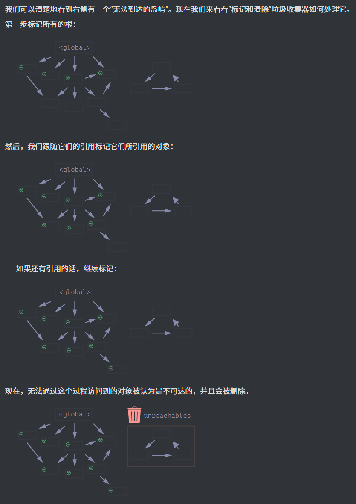

# Object（对象）

我们在 数据类型 一章学到的，JavaScript 中有八种数据类型。有七种原始类型，因为它们的值只包含一种东西（字符串，数字或者其他），它们不能再被原子化。

对象则用来存储键值对和更复杂的实体。在 JavaScript 中，对象几乎渗透到了这门编程语言的方方面面。所以，在我们深入理解这门语言之前，必须先理解对象。

## 基础

我们可以用下面两种语法中的任一种来创建一个空的对象

```javascript
let user = new Object(); // “构造函数” 的语法
let user = {}; // “字面量” 的语法
```

通常用字面量的语法来创建对象，可以在创建对象的时候，立即将一些属性以键值对的形式放到 {...} 中。

```javascript
let user = {
  // 一个对象,包含两个属性
  name: "John", // 键 "name"，值 "John"
  age: 30, // 键 "age"，值 30
};
```

- 访问属性：可以使用点符号访问属性值 belike：`user.name`
- 声明属性：可以直接在字面量里声明，也可以像`user.isAdmin = true;`这样来声明或者修改 user 对象里的键
- 移除属性：可以用 delete 操作符移除属性`delete user.age;`
- 使用多字词语作为属性名：可以用多字词语来作为属性名，但**必须给它们加上引号**belike：`"likes birds": true`
  ::: tip 一个代码规范
  列表中的最后一个属性应以逗号结尾：

```javascript
let user = {
  name: "John",
  age: 30,
};
```

这叫做尾随（trailing）或悬挂（hanging）逗号。这样便于我们添加、删除和移动属性，因为所有的行都是相似的。
:::

::: warning 方括号的使用
对于多词属性，点操作就不能用了，点符号要求 key 是有效的变量标识符。这意味着：不包含空格，不以数字开头，也不包含特殊字符（允许使用 $ 和 \_）。需要使用方括号 belike：

```javascript
user["likes birds"] = true;
```

方括号同样提供了一种可以通过任意表达式来获取属性名的方式 belike：

```javascript
let user = {
  name: "John",
  age: 30,
};

let key = prompt("What do you want to know about the user?", "name");

// 访问变量
alert(user[key]); // John（如果输入 "name"）
```

当创建一个对象时，我们可以在对象字面量中使用方括号。这叫做 `计算属性`。belike：

```javascript
let fruit = prompt("Which fruit to buy?", "apple");

let bag = {
  [fruit]: 5, // 属性名是从 fruit 变量中得到的
};

alert(bag.apple); // 5 如果 fruit="apple"

// 本质上，这跟下面的语法效果相同：
let fruit = prompt("Which fruit to buy?", "apple");
let bag = {};

// 从 fruit 变量中获取值
bag[fruit] = 5;
```

可以在方括号中使用更复杂的表达式：

```javascript
let fruit = "apple";
let bag = {
  [fruit + "Computers"]: 5, // bag.appleComputers = 5
};
```

**大部分时间里，当属性名是已知且简单的时候，就使用点符号。如果我们需要一些更复杂的内容，那么就用方括号。**
:::

### 属性值的简写

在实际开发中，我们通常用已存在的变量当做属性名。belike：

```javascript
function makeUser(name, age) {
  return {
    name: name,
    age: age,
    // ……其他的属性
  };
}

let user = makeUser("John", 30);
alert(user.name); // John
```

在上面的例子中，属性名跟变量名一样。这种通过变量生成属性的应用场景很常见，在这有一种特殊的 `属性值缩写` 方法，使属性名变得更短。

```javascript
function makeUser(name, age) {
  return {
    name, // 与 name: name 相同
    age, // 与 age: age 相同
    // ...
  };
}
```

### 属性名称限制

变量名不能是编程语言的某个保留字，如 “for”、“let”、“return” 等……

但对象的属性名并不受此限制：

```javascript
// 这些属性都没问题
let obj = {
  for: 1,
  let: 2,
  return: 3,
};

alert(obj.for + obj.let + obj.return); // 6
```

**属性名可以是任何字符串或者 symbol**，其他类型会被自动地转换为字符串。当数字 0 被用作对象的属性的键时，会被转换为字符串 "0"，例如：

```javascript
let obj = {
  0: "test", // 等同于 "0": "test"
};

// 都会输出相同的属性（数字 0 被转为字符串 "0"）
alert(obj["0"]); // test
alert(obj[0]); // test (相同的属性)
```

::: danger 名为 **proto** 的属性
名为 **proto** 的属性。我们不能将它设置为一个非对象的值，后面我们会在原型继承里面讲一下它的特殊性质，然后给出如何解决这个问题的方法：

```javascript
let obj = {};
obj.__proto__ = 5; // 分配一个数字
alert(obj.__proto__); // [object Object] —— 值为对象，与预期结果不同
```

:::

### 属性存在性测试

JavaScript 的对象有一个需要注意的特性：能够被访问任何属性。即使属性不存在也不会报错！

读取不存在的属性只会得到 undefined。所以我们可以很容易地判断一个属性是否存在：

```javascript
let user = {};

alert(user.noSuchProperty === undefined); // true 意思是没有这个属性
```

另外，我们有一个检查属性是否存在的操作符 `in` ，例如：

```javascript
"key" in object;

let user = { name: "John", age: 30 };

alert("age" in user); // true，user.age 存在
alert("blabla" in user); // false，user.blabla 不存在。
```

::: warning
in 的左边必须是 属性名。通常是一个带引号的字符串。如果我们省略引号，就意味着左边是一个变量，它应该包含要判断的实际属性名。
:::

啊那有人就要问了：为何会有 in 运算符呢？与 undefined 进行比较来判断还不够吗？属性存在，但存储的值是 undefined 的时候，那么比较运算就失效了，但是这种情况很少发生，因为通常情况下不应该给对象赋值 undefined。我们通常会用 null 来表示未知的或者空的值。

### "for..in" 循环

为了遍历一个对象的所有键（key），可以使用一个特殊形式的循环：for..in。语法为：

```javascript
for (key in object) {
  // 对此对象属性中的每个键执行的代码
}

// 举个详细点的例子：

let user = {
  name: "John",
  age: 30,
  isAdmin: true,
};

for (let key in user) {
  // keys
  alert(key); // name, age, isAdmin
  // 属性键的值
  alert(user[key]); // John, 30, true
}
```

::: tip 对象的顺序
对象有顺序吗？换句话说，如果我们遍历一个对象，我们获取属性的顺序是和属性添加时的顺序相同吗？这靠谱吗？
简短的回答是：“有特别的顺序”：整数属性会被进行排序以升序排列。所以我们看到的是 1, 41, 44, 49，其他属性则按照创建的顺序显示。详情如下：

```javascript
let codes = {
  49: "Germany",
  41: "Switzerland",
  44: "Great Britain",
  // ..,
  1: "USA",
};

for (let code in codes) {
  alert(code); // 1, 41, 44, 49
}
```

所以，为了解决电话号码的问题，我们可以使用非整数属性名来 欺骗 程序。只需要给每个键名加一个加号 "+" 前缀就行了。

```javascript
let codes = {
  "+49": "Germany",
  "+41": "Switzerland",
  "+44": "Great Britain",
  // ..,
  "+1": "USA",
};

for (let code in codes) {
  alert(+code); // 49, 41, 44, 1
}
```

:::

## 对象引用和复制

对象与原始类型的根本区别之一是，对象是“通过引用”存储和复制的，而原始类型：字符串、数字、布尔值等 —— 总是“作为一个整体”复制。简单地说，对象是**引用类型**。

我们来看看复制值的时候会发生什么：

```javascript
let message = "Hello!";
let phrase = message;
```

我们就有了两个独立的变量，每个都存储着字符串 "Hello!"。但是，对象不是这样的，赋值了对象的变量存储的不是对象本身，而是该对象“在内存中的地址” —— 换句话说就是对该对象的“引用”。

```javascript
let user = { name: "John" };

let admin = user; // 复制引用
```

我们可以通过其中任意一个变量来访问该对象并修改它的内容：

```javascript
let user = { name: "John" };

let admin = user;

admin.name = "Pete"; // 通过 "admin" 引用来修改

alert(user.name); // 'Pete'，修改能通过 "user" 引用看到
```

### 对象间的比较

- 仅当两个对象为同一对象时，两者才相等。例如， a 和 b 两个变量都引用同一个对象，它们相等
- 而两个独立的对象则并不相等，即使它们看起来很像（都为空）：

```javascript
let a = {};
let b = {}; // 两个独立的对象

alert(a == b); // false
```

### 克隆与合并，Object.assign

拷贝一个对象变量会又创建一个对相同对象的引用。如果我们想要全新地复制一个对象，那该怎么做呢？

1. 可以创建一个新对象，通过遍历已有对象的属性，并在原始类型值的层面复制它们，以实现对已有对象结构的复制。

```javascript
let user = {
  name: "John",
  age: 30,
};
let clone = {}; // 新的空对象
// 将 user 中所有的属性拷贝到其中
for (let key in user) {
  clone[key] = user[key];
}
// 现在 clone 是带有相同内容的完全独立的对象
clone.name = "Pete"; // 改变了其中的数据
alert(user.name); // 原来的对象中的 name 属性依然是 John
```

2. 但是这样显得笨重，可以使用 `Object.assign` 方法来达成同样的效果，这就是所谓的`浅拷贝`（嵌套对象被通过引用进行拷贝）,除了复制对象，还能合并多个对象，但是需要注意的是：**如果被拷贝的属性的属性名已经存在，那么它会被覆盖**：

```javascript
Object.assign(dest, [src1, src2, src3...])

// - 第一个参数 dest 是指目标对象。
// - 更后面的参数 src1, ..., srcN（可按需传递多个参数）是源对象。
// - 该方法将所有源对象的属性拷贝到目标对象 dest 中。
//   换句话说，从第二个开始的所有参数的属性都被拷贝到第一个参数的对象中。
// - 调用结果返回 dest。
```

所以要进行一个简单克隆的时候，我们就可以这样做：

```javascript
let user = {
  name: "John",
  age: 30,
};

// 将 user 中的所有属性拷贝到了一个空对象中，并返回这个新的对象。
let clone = Object.assign({}, user);
```

3. Spread 语法也能实现克隆对象的功能，我们将会在后面的章节：Rest 和 Spread 中讲到

### 深层克隆

到现在为止，我们都假设 user 的所有属性均为原始类型。但属性可以是对其他对象的引用。比如：

```javascript
let user = {
  name: "John",
  sizes: {
    height: 182,
    width: 50,
  },
};

alert(user.sizes.height); // 182
```

如果我们用上面的 `Object.assign` 的方法来克隆它，那么克隆出来的新对象和原来的 user 对象会共用一个 sizes，因为 user.sizes 是个对象，它会以引用形式被拷贝。

为了解决这个问题，并让 user 和 clone 成为两个真正独立的对象，我们应该使用一个拷贝循环来检查 user[key] 的每个值，如果它是一个对象，那么也复制它的结构。这就是所谓的`深拷贝`。我们可以使用递归来实现它，可以采用现有的实现，例如 `lodash` 库的 `_.cloneDeep(obj)`。
::: tip
可以参考：https://blog.csdn.net/cc18868876837/article/details/114918262
:::

::: tip 使用 const 声明的对象也是可以被修改的
通过引用对对象进行存储的一个重要的副作用是声明为 `const` 的对象 **可以** 被修改。

```javascript
const user = {
  name: "John",
};

user.name = "Pete"; // (*)

alert(user.name); // Pete
```

也就是说：user 的值是一个常量，它必须始终引用同一个对象，**但该对象的属性可以被自由修改**。换句话说，只有当我们尝试将 `user=...` 作为**一个整体**进行赋值时，`const user` 才会报错。

如果我们真的需要创建常量对象属性，也可以，但使用的是完全不同的方法。我们将在 `属性标志和属性描述符` 中学习它。
:::

## 简单理解垃圾回收机制

原始值、对象、函数……这一切都会占用内存。当我们不再需要某个东西时会发生什么？JavaScript 引擎如何发现它并清理它？这就要提到 JavaScript 的垃圾回收机制。

### 可达性（Reachability）

JavaScript 中主要的内存管理概念是 可达性。简而言之，“可达”值是那些以某种方式可访问或可用的值。它们被存储在内存中。

- 什么值不能被释放？
  - 当前执行的函数，它的局部变量和参数
  - 当前嵌套调用链上的其他函数、它们的局部变量和参数
  - 全局变量
  - （还有一些其他的，内部实现）

这些值被称作 `根（roots）`。

- 如果一个值可以从根通过引用或者引用链进行访问，则认为该值是可达的。比方说，如果全局变量中有一个对象，并且该对象有一个属性引用了另一个对象，则 `该` 对象被认为是可达的。而且它引用的内容也是可达的。

举个例子：

```javascript
// user 具有对这个对象的引用
let user = {
  name: "John",
};
```

全局变量 "user" 引用了对象 `{name："John"}`（为简洁起见，我们称它为 John）。John 的 "name" 属性存储一个原始值，所以它被写在对象内部。如果 user 的值被重写了，这个引用就没了：垃圾回收器会认为 John 是垃圾数据并进行回收，然后释放内存。

### 两个引用

如果我们把 user 的引用复制给 admin：

```javascript
// user 具有对这个对象的引用
let user = {
  name: "John",
};

let admin = user;
```

如果我们又去尝试重写 user 的值，对象**仍然可以被通过 admin 这个全局变量访问到，因此它必须被保留在内存中**。如果我们又重写了 admin，对象就会被删除。

### 对于相互关联的对象···

我们来看一个更为复杂的例子：

```javascript
function marry(man, woman) {
  woman.husband = man;
  man.wife = woman;

  return {
    father: man,
    mother: woman,
  };
}

let family = marry(
  {
    name: "John",
  },
  {
    name: "Ann",
  }
);

// 其实，得到的对象是：

family = {
  father: {
    name: "John",
    wife: "Ann",
  },
  mother: {
    name: "Ann",
    husband: "John",
  },
};
```

marry 函数通过让两个对象相互引用使它们“结婚”了，并返回了一个包含这两个对象的新对象。所有对象都是可达的。

如果我们去删除两个引用：

```javascript
delete family.father;
delete family.mother.husband;

// 那么对象会变成：

family = {
  mother: {
    name: "Ann",
  },
};
```

那么我们可以看到再也没有对 John 的引用了：对外引用不重要，只有传入引用才可以使对象可达。所以，John 现在是不可达的，并且将被从内存中删除，同时 John 的所有数据也将变得不可达。

### 几个对象相互引用但是没有外部引用

几个对象相互引用，但外部没有对其任意对象的引用，这些对象也可能是不可达的，并被从内存中删除。

```javascript
// 比如我们还是有这个对象

family = {
  father: {
    name: "John",
    wife: "Ann",
  },
  mother: {
    name: "Ann",
    husband: "John",
  },
};

// 现在我们修改 family 的值

family = null;
```

John 和 Ann 仍然连着，都有传入的引用。但是，这样还不够。

前面说的 "family" 对象已经不再与根相连，没有了外部对其的引用，所以它变成了一座“孤岛”，并且将被从内存中删除。

### 垃圾回收的基本算法

垃圾回收的基本算法被称为 “mark-and-sweep”。

定期执行以下“垃圾回收”步骤：

- 垃圾收集器找到所有的根，并“标记”（记住）它们。
- 然后它遍历并“标记”来自它们的所有引用。
- 然后它遍历标记的对象并标记 它们的 引用。所有被遍历到的对象都会被记- 住，以免将来再次遍历到同一个对象。
- ……如此操作，直到所有可达的（从根部）引用都被访问到。
- 没有被标记的对象都会被删除。



::: tip 基础算法之外···
JavaScript 引擎做了许多优化，使垃圾回收运行速度更快，并且不会对代码执行引入任何延迟。

- 分代收集（Generational collection）—— 对象被分成两组：“新的”和“旧的”。在典型的代码中，许多对象的生命周期都很短：它们出现、完成它们的工作并很快死去，因此在这种情况下跟踪新对象并将其从内存中清除是有意义的。那些长期存活的对象会变得“老旧”，并且被检查的频次也会降低。

- 增量收集（Incremental collection）—— 如果有许多对象，并且我们试图一次遍历并标记整个对象集，则可能需要一些时间，并在执行过程中带来明显的延迟。因此，引擎将现有的整个对象集拆分为多个部分，然后将这些部分逐一清除。这样就会有很多小型的垃圾收集，而不是一个大型的。这需要它们之间有额外的标记来追踪变化，但是这样会带来许多微小的延迟而不是一个大的延迟。

- 闲时收集（Idle-time collection）—— 垃圾收集器只会在 CPU 空闲时尝试运行，以减少可能对代码执行的影响。
  :::

当需要底层的优化时，对引擎有深入了解将很有帮助。在熟悉了这门编程语言之后，把熟悉引擎作为下一步计划是明智之选，届时，我们可能才会去深入理解垃圾回收机制。

## 对象方法 与 this 关键字

对象往往是现实世界的实体抽象，这其实就是所谓的 `面向对象编程`，简称为 “OOP”。我们对实体进行操作，那么对象中的操作，我们则用属性中的函数来表示。

### 创建方法

我们给出一个简单的例子：

```javascript
let user = {
  name: "John",
  age: 30,
};

user.sayHi = function () {
  alert("Hello!");
};

user.sayHi(); // Hello!
```

这里我们使用函数表达式创建了一个函数，并将其指定给对象的 user.sayHi 属性。作为对象属性的函数被称为 `方法`。

我们还可以怎么去声明一个对象方法：

- 使用预先声明的函数：

```javascript
let user = {
  // ...
};

// 首先，声明函数
function sayHi() {
  alert("Hello!");
}

// 然后将其作为一个方法添加
user.sayHi = sayHi;

user.sayHi(); // Hello!
```

- 简写

```javascript
user = {
  sayHi: function () {
    alert("Hello");
  },
};

// 方法简写看起来更好，对吧？
let user = {
  sayHi() {
    // 与 "sayHi: function(){...}" 一样
    alert("Hello");
  },
};
```

::: tip
这种表示法还是有些不同。在对象继承方面有一些细微的差别（稍后将会介绍），但目前它们并不重要。在几乎所有的情况下，更短的语法是首选的。
:::

### 关于 this

通常，对象方法需要访问对象中存储的信息才能完成其工作。例如，user.sayHi() 中的代码可能需要用到 user 的 name 属性。为了访问该对象，方法中可以使用 this 关键字。

```javascript
let user = {
  name: "John",
  age: 30,

  sayHi() {
    // "this" 指的是“当前的对象”
    alert(this.name);
  },
};

user.sayHi(); // John
```

::: warning
也可以在不使用 this 的情况下，通过外部变量名来引用 sayHi() 方法：

```javascript
let user = {
  name: "John",
  age: 30,

  sayHi() {
    alert(user.name); // "user" 替代 "this"
  },
};
```

但这样的代码是不可靠的。如果我们决定将 user 复制给另一个变量，例如 admin = user，并赋另外的值给 user，那么它将访问到错误的对象。比如：

```javascript
let user = {
  name: "John",
  age: 30,

  sayHi() {
    alert(user.name); // 导致错误
  },
};

let admin = user;
user = null; // 重写让其更明显

admin.sayHi(); // TypeError: Cannot read property 'name' of null
```

如果我们在 alert 中以 this.name 替换 user.name，那么代码就会正常运行。
:::

### this 不受限制

在 JavaScript 中，this 关键字与其他大多数编程语言中的不同。JavaScript 中的 this 可以用于任何函数，即使它不是对象的方法。比如

```javascript
// 这也并不会有语法错误

function sayHi() {
  alert(this.name);
}
```

**this 的值是在代码运行时计算出来的，它取决于代码上下文。**例如：

```javascript
let user = { name: "John" };
let admin = { name: "Admin" };

function sayHi() {
  alert(this.name);
}

// 在两个对象中使用相同的函数
user.f = sayHi;
admin.f = sayHi;

// 这两个调用有不同的 this 值
// 函数内部的 "this" 是“点符号前面”的那个对象
user.f(); // John（this == user）
admin.f(); // Admin（this == admin）

admin["f"](); // Admin（使用点符号或方括号语法来访问这个方法，都没有关系。）
```

也就是：如果 obj.f() 被调用了，则 this 在 f 函数调用期间是 obj。所以在上面的例子中 this 先是 user，之后是 admin。

::: warning 在没有对象的情况下调用：this == undefined
我们甚至可以在没有对象的情况下调用函数：

```javascript
function sayHi() {
  alert(this);
}

sayHi(); // undefined
```

在这种情况下，严格模式下的 this 值为 undefined。如果我们尝试访问 this.name，将会报错。

在非严格模式的情况下，this 将会是 全局对象（浏览器中的 window）。这是一个历史行为，"use strict" 已经将其修复了。

通常这种调用是程序出错了。如果在一个函数内部有 this，那么通常意味着它是在对象上下文环境中被调用的。
:::
::: tip 解除 this 绑定的后果
如果你经常使用其他的编程语言，那么你可能已经习惯了“绑定 this”的概念，即在对象中定义的方法总是有指向该对象的 this。

在 JavaScript 中，this 是“自由”的，它的值是在调用时计算出来的，它的值并不取决于方法声明的位置，而是取决于在“点符号前”的是什么对象。

在运行时对 this 求值的这个概念既有优点也有缺点。一方面，函数可以被重用于不同的对象。另一方面，更大的灵活性造成了更大的出错的可能。

这里我们的立场并不是要评判编程语言的这个设计是好是坏。而是要了解怎样使用它，如何趋利避害。
:::

### 箭头函数没有自己的 “this”

箭头函数有些特别：它们没有自己的 this。如果我们在这样的函数中引用 this，this 值取决于外部“正常的”函数。

举个例子，这里的 arrow() 使用的 this 来自于外部的 user.sayHi() 方法：

```javascript
let user = {
  firstName: "Ilya",
  sayHi() {
    let arrow = () => alert(this.firstName);
    arrow();
  }
};

user.sayHi(); // Ilya
```
这是箭头函数的一个特性，当我们并不想要一个独立的 this，反而想从外部上下文中获取时，它很有用。后面再讲到箭头函数的时候我们会再讨论一下。

另外，JavaScript INFO后面的三个小 Task 都挺有意思的：https://zh.javascript.info/object-methods 可以加深对 this 的理解。

## 构造器和操作符 new


