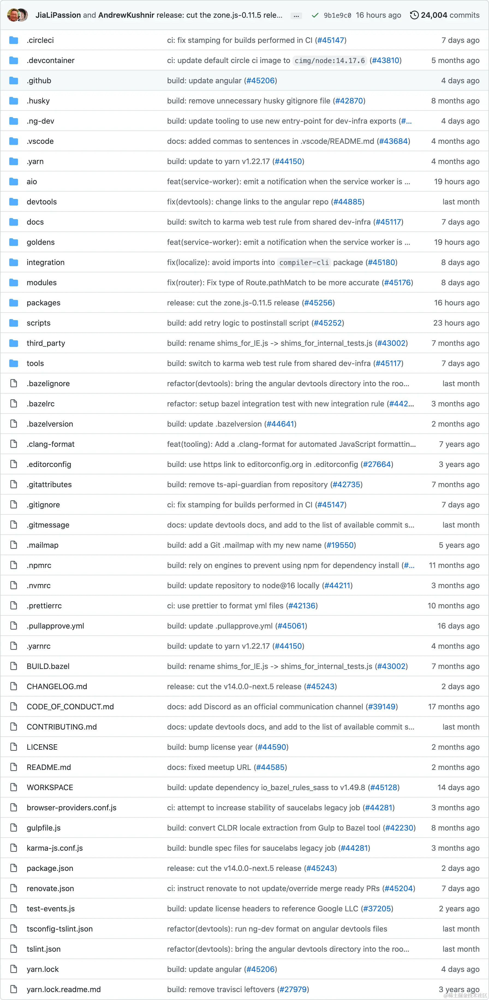
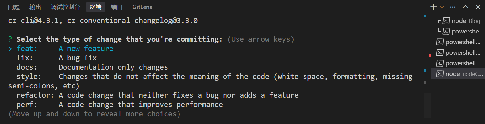

# FEE#004 - Lint | 提交规范

在我们完成了对代码本身的规范化之后，还有一个同样重要的领域需要约束—— Git 提交。混乱、随意的 `git commit` 信息会给项目维护带来巨大的困难。一个规范化的提交历史，则像一本清晰可读的"项目成长日记"，让每一次变更都有迹可循。

## 为什么需要规范的提交信息？

1.  **提高可读性**：清晰的提交历史能让协作者快速理解每个提交的目的，尤其是在进行 Code Review 或追溯问题时。
2.  **自动化生成 CHANGELOG**：遵循特定格式的提交信息，可以让我们使用工具自动生成项目的更新日志（CHANGELOG）。
3.  **触发构建和发布**：在持续集成（CI）流程中，可以根据提交信息的 `type`（如 `feat`, `fix`）来触发不同的操作，例如自动构建、版本发布等。
4.  **便于快速定位**：当需要回滚某个功能或修复某个 bug 时，规范的提交信息能帮助我们快速定位到相关的提交。

目前，社区中最广泛采用的是 **Angular 团队的提交规范**，下面就是一个典型的提交信息，美轮美奂：



## Angular 提交规范详解

Angular 规范将一条提交信息分为三个部分：**标题 (Header)**、**正文 (Body)** 和 **页脚 (Footer)**。

```
<type>(<scope>): <subject>
<-- 空一行 -->
<body>
<-- 空一行 -->
<footer>
```

其中，**标题是必需的**，正文和页脚是可选的。

### 标题 (Header)

标题是提交信息中最核心的部分，只有一行，包含三个字段：`type`, `scope`, `subject`。

#### **Type**

`type` 用于说明本次提交的类别，必须是以下关键字之一：

- **feat**: 新功能 (feature)
- **fix**: 修复 Bug
- **docs**: 文档 (documentation) 的变更
- **style**: 代码风格的调整（不影响代码运行的变动，如空格、格式化、缺少分号等）
- **refactor**: 代码重构（既不是新增功能，也不是修改 bug 的代码变动）
- **perf**: 性能优化 (performance improvement)
- **test**: 增加或修改测试
- **build**: 影响构建系统或外部依赖的更改（例如：gulp, broccoli, npm）
- **ci**: CI/CD 配置文件和脚本的更改
- **chore**: 其他不修改 `src` 或测试文件的更改，如构建流程、辅助工具的变动
- **revert**: 撤销之前的某个提交

#### **Scope** (可选)

`scope` 用于说明本次提交影响的范围，例如数据层、控制层、视图层，或者更具体的功能模块名（如 `user`, `cart`, `login`）。

#### **Subject**

`subject` 是本次提交目的的简短描述，不超过 50 个字符。有一些编写 `subject` 的最佳实践：

- 以动词开头，使用第一人称现在时，例如 `change`，而不是 `changed` 或 `changes`。
- 第一个字母小写。
- 结尾不加句号 (`.`)。

**好的标题示例：**
```
feat(user): add user login and registration page
fix(cart): resolve issue where item count could not be negative
docs(readme): update project setup instructions
```

**坏的标题示例：**
```
Fixed a bug // 缺少 type 和 subject
New feature // 过于模糊
feat: User login // subject 首字母大写
```

### 正文 (Body) (可选)

如果一次提交的改动比较复杂，可以在正文中进行更详细的描述，解释代码变动的背景、目的和实现细节。

### 页脚 (Footer) (可选)

页脚主要用于两种情况：

1.  **不兼容的变动 (Breaking Change)**：如果当前代码与上一个版本不兼容，则在页脚以 `BREAKING CHANGE:` 开头，后面是对变动的描述、理由和迁移方法。
2.  **关闭 Issue**：如果本次提交修复了某个 GitHub Issue，可以在这里关闭它，例如：`Closes #123, #456`。

## 使用 commitlint 自动化校验

和代码规范一样，提交规范也需要工具来自动强制执行。**commitlint** 就是为此而生的。它能与 Husky 结合，在 `git commit` 时自动检查你的提交信息是否符合规范。

1.  **安装依赖**
    ```shell
    # 安装 commitlint 命令行工具和 Angular 规范的配置包
    pnpm add @commitlint/cli @commitlint/config-conventional -D
    ```

2.  **创建配置文件**
    在项目根目录创建 `commitlint.config.js` 文件：
    ```js
    // commitlint.config.js
    module.exports = {
      extends: ['@commitlint/config-conventional'],
    };
    ```
    这里我们直接继承了社区维护的 `config-conventional` 规则集，它与 Angular 规范完全兼容。

3.  **与 Husky 联动**
    我们需要创建一个新的 Git 钩子 `commit-msg`，它会在你完成提交信息后被触发。
    ```shell
    # 创建 commit-msg 钩子文件
    pnpm dlx husky add .husky/commit-msg 'pnpm dlx commitlint --edit "$1"'
    ```
    这条命令会在 `.husky/` 目录下创建一个 `commit-msg` 文件。现在，每当你尝试 `git commit` 时，`commitlint` 都会自动检查你的提交信息，如果不符合规范，commit 将会失败。

## 使用 Commitizen 优化提交体验

每次都手动编写符合规范的提交信息可能会有些繁琐。**Commitizen** 是一个交互式的命令行工具，它会像问卷调查一样，通过提问引导你创建出完全符合规范的提交信息。

1.  **安装依赖**
    ```shell
    # 安装 commitizen 及其适配器
    pnpm add commitizen cz-conventional-changelog -D
    ```

2.  **在 `package.json` 中配置**
    告诉 Commitizen 我们要使用哪一个适配器。
    ```json
    // package.json
    "config": {
      "commitizen": {
        "path": "./node_modules/cz-conventional-changelog"
      }
    }
    ```

3.  **添加 scripts 命令**
    在 `package.json` 的 `scripts` 中添加一个 `commit` 命令，方便我们使用。
    ```json
    // package.json
    "scripts": {
      "commit": "cz"
    }
    ```


现在，当你想要提交代码时，不再需要使用 `git commit`，而是运行 `pnpm commit`。终端会立即出现一个交互式界面，引导你选择 `type`、填写 `scope`、`subject` 等信息，自动生成一条完美的提交信息。这极大地降低了遵循规范的门槛，提升了开发体验。


