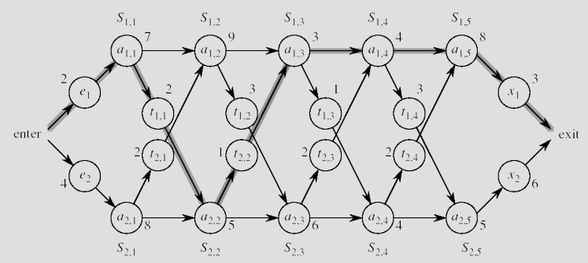
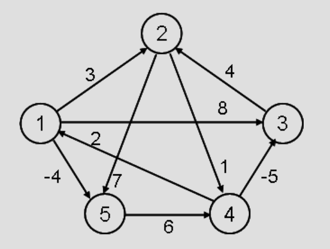
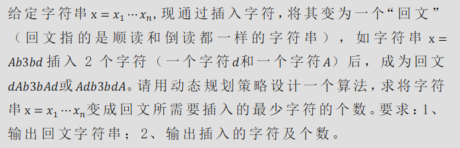

# 实验二：动态规划

## 一、 实验目的： 

理解动态规划算法设计思想，实现动态规划算法。

## 二、 实验条件 

计算机及程序语言开发平台（如 C、C++、Java 等）。

## 三、 实验内容及要求 

1. 描述并实现动态规划的作业排程算法，并显示下图的排程结果。要求输
出：1、最短时间；2、对应的排程方案。

2. 描述并实现全点对最短路径算法，显示在下图上的运算结果。要求输出
1、所有点对之间的最短路径的长度；2、所有点对之间最短路径。

3. 求插入的最少字符的个数

