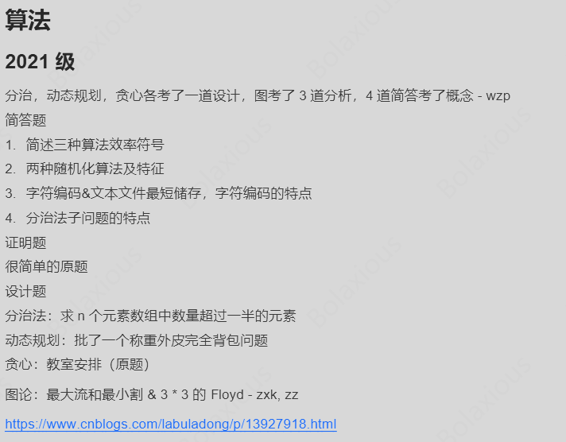

---
head:
  - - link
    - rel: stylesheet
      href: https://cdnjs.cloudflare.com/ajax/libs/KaTeX/0.5.1/katex.min.css
title: 算法设计与分析归纳
date: 2024-06-01
tags:
  - 算法
  - 学习笔记
---

# 算法设计与分析归纳

参考资料为算法黑皮书和红皮书第四版，任教老师为邱德红，作者Bolaxious。这门课的重点并不在于讲为了实现某种算法要怎么去写代码，而是讲一讲算法背后的设计和考虑。课程主要内容都在上一篇文章复习材料中提到并做了扩展，这里则进一步简化

## 2021年考试题解答



根据题目要求，我们需要解答 2021 年的算法相关问题，并结合知识点进行分析。以下是针对每个问题的详细解答：

### 简述三种算法效率符号
#### 知识点：算法时间复杂度分析
算法效率通常用大 O、Ω 和 Θ 符号来描述：
1. **大 O 符号 (O)**：
   - 描述算法在最坏情况下的上界。
   - 表示算法运行时间不会超过某个增长速率。
   - 例如，如果一个算法的时间复杂度是 $O(n^2)$，表示其运行时间在最坏情况下不会超过 $n^2$ 的常数倍。

2. **Ω 符号 (Ω)**：
   - 描述算法在最好情况下的下界。
   - 表示算法运行时间至少会达到某个增长速率。
   - 例如，如果一个算法的时间复杂度是 $\Omega(n)$，表示其运行时间在最好情况下至少是 $n$ 的常数倍。

3. **Θ 符号 (Θ)**：
   - 描述算法在平均情况或确切情况下的紧确界。
   - 表示算法运行时间既不会低于某个增长速率，也不会高于另一个增长速率。
   - 例如，如果一个算法的时间复杂度是 $\Theta(n \log n)$，表示其运行时间在所有情况下都与 $n \log n$ 同阶。

**总结**
- **大 O**：最坏情况的上界。
- **Ω**：最好情况的下界。
- **Θ**：平均或确切情况的紧确界。

### 两种随机化算法及特征

#### Las Vegas 算法

Las Vegas 算法是一类**总是返回正确结果**的随机化算法，但其运行时间是**随机的**。

##### 核心特征：
- **结果正确**。
- **运行时间不确定**，可能因随机选择而变长或变短。

##### 示例：
- **随机快速排序**：每次划分的基准值是随机选取的，虽然运行时间可能不同，但最终结果始终有序。
- **随机化哈希查找**：在冲突处理中使用随机探测策略。

##### 时间复杂度：
- 通常分析其**期望运行时间**，例如 $O(n \log n)$。

---

#### Monte Carlo 算法

Monte Carlo 算法是一类**运行时间固定或有界**的随机化算法，但它**可能返回错误的结果**，不过可以通过多次运行来降低出错概率。

##### 核心特征：
- **运行时间可预测**。
- **结果可能不正确**，但错误概率可以控制。

##### 示例：
- **Miller-Rabin 素性测试**：用于判断一个大整数是否为素数，有一定的误判率，但可通过多轮测试将错误概率降到极低。
- **Freivalds 算法**：用于验证矩阵乘积是否正确，通过随机向量近似判断，具有一定的错误概率。

##### 时间复杂度：
- 通常是固定的，如 $O(n^2)$ 或 $O(1)$。

**总结**
- **快速选择**：基于随机 pivot 的分治算法，用于寻找第 k 小的元素。
- **哈希表**：利用随机哈希函数实现高效的键值对存储和检索。

### 字符编码 & 文本文件最短储存，字符编码的特点
#### 知识点：字符编码与文本压缩
1. **字符编码**：
   - **ASCII 编码**：
     - 每个字符占用 8 位（1 字节），支持 256 种不同的字符。
     - 特点：简单、固定长度，但无法表示中文等多字节字符。
   - **Unicode 编码**：
     - 支持全球范围内的字符集，包括中文、日文等。
     - 常见的 Unicode 编码方式有 UTF-8、UTF-16 等。
     - 特点：可变长度编码，兼容 ASCII，适合国际化需求。

2. **文本文件最短储存**：
   - **霍夫曼编码（Huffman Coding）**：
     - 根据字符出现频率动态分配码长，频率高的字符使用短码，频率低的字符使用长码。
     - 特点：无损压缩，适用于文本文件的高效存储。
   - **LZW 压缩（Lempel-Ziv-Welch Compression）**：
     - 基于字典的压缩方法，通过构建字符串字典来减少重复数据。
     - 特点：适用于具有大量重复模式的文本文件。

**总结**
- **字符编码**：ASCII 和 Unicode 是常用的字符编码方式，分别适用于简单的英文字符和国际化需求。
- **文本压缩**：霍夫曼编码和 LZW 压缩是常用的文本压缩算法，能够有效减少存储空间。

### 分治法子问题的特点
#### 知识点：分治法的核心思想
分治法（Divide and Conquer）的基本步骤包括：
1. **分解（Divide）**：
   - 将原问题分解为若干个规模较小的子问题。
   - 子问题应相互独立，且与原问题形式相同。

2. **解决（Conquer）**：
   - 递归地求解各个子问题。
   - 如果子问题足够小，则直接求解。

3. **合并（Combine）**：
   - 将子问题的解合并为原问题的解。

**子问题的特点**：
1. **独立性**：
   - 子问题之间没有重叠，可以并行求解。
2. **同构性**：
   - 子问题与原问题具有相同的结构，便于递归求解。
3. **可合并性**：
   - 子问题的解可以通过某种方式合并为原问题的解。

**例子：归并排序（Merge Sort）**
- **分解**：将数组分成两半。
- **解决**：递归地对两半分别排序。
- **合并**：将两个有序子数组合并成一个有序数组。

**总结**
- 分治法的子问题应具备独立性、同构性和可合并性，以便高效地解决问题。

### 证明题：很简单的问题
#### 知识点：算法正确性的证明
以快速选择算法为例，证明其正确性：
1. **快速选择算法**：
   - 目标：在未排序数组中找到第 k 小的元素。
   - 步骤：
     1. 随机选择一个 pivot。
     2. 将数组分为小于 pivot 的部分和大于 pivot 的部分。
     3. 根据 pivot 的位置判断目标元素在哪一部分，递归求解。

2. **证明思路**：
   - **归纳法**：
     - 假设对于大小为 $n-1$ 的数组，快速选择算法能正确找到第 k 小的元素。
     - 对于大小为 $n$ 的数组，随机选择 pivot 后，根据 pivot 的位置调整 k 的值，递归求解。
   - **正确性保证**：
     - 每次划分后，pivot 的位置确定了它在数组中的排名。
     - 根据 pivot 的位置，可以准确判断目标元素在左半部分还是右半部分。

**总结**
- 快速选择算法的正确性可以通过归纳法证明，关键在于每次划分后 pivot 的位置能够准确反映其排名。

### 设计题：分治法求 n 元素数组中数量超过一半的元素
#### 知识点：Boyer-Moore 投票算法
1. **问题描述**：
   - 在一个包含 $n$ 个元素的数组中，找出一个出现次数超过 $\frac{n}{2}$ 的元素（若存在）。

2. **算法设计**：
   - **Boyer-Moore 投票算法**：
     1. 初始化候选者 `candidate` 和计数器 `count`。
     2. 遍历数组：
        - 如果当前元素等于 `candidate`，则 `count++`。
        - 如果当前元素不等于 `candidate`，则 `count--`。
        - 如果 `count == 0`，则更新 `candidate` 为当前元素。
     3. 验证 `candidate` 是否满足条件（即是否出现超过 $\frac{n}{2}$ 次）。

3. **时间复杂度**：
   - 第一遍遍历数组：$O(n)$。
   - 第二遍验证：$O(n)$。
   - 总复杂度：$O(n)$。

**总结**
- Boyer-Moore 投票算法是一种线性时间的分治思想应用，用于解决多数元素问题。

### 动态规划：批了一个称重外皮完全背包问题
#### 知识点：完全背包问题
1. **问题描述**：
   - 给定 $n$ 种物品，每种物品有无限供应，重量为 $w_i$，价值为 $v_i$，背包容量为 $W$。求装入背包的最大总价值。

2. **动态规划状态定义**：
   - 设 $dp[i][j]$ 表示前 $i$ 种物品中，背包容量为 $j$ 时的最大价值。
   - 状态转移方程：
     $dp[i][j] = \max(dp[i-1][j], dp[i][j-w_i] + v_i)$
   - 初始条件：
     $dp[0][j] = 0, \quad dp[i][0] = 0$

3. **优化空间复杂度**：
   - 由于状态转移只依赖于当前行和上一行，可以用一维数组实现：
     $dp[j] = \max(dp[j], dp[j-w_i] + v_i)$

**总结**
- 完全背包问题可以通过动态规划解决，状态转移方程的关键在于允许重复选取同一种物品。

### 贪心：教室安排（原题）
#### 知识点：区间调度问题
1. **问题描述**：
   - 有多个教室安排请求，每个请求包含开始时间和结束时间，求最多能安排多少个不重叠的教室。

2. **贪心策略**：
   - 按照结束时间从小到大排序。
   - 依次选择结束时间最早的请求，只要其开始时间不早于当前已安排的最后一个请求的结束时间。

3. **正确性证明**：
   - 贪心选择局部最优（最早结束的请求），全局最优（最多安排的请求）。
   - 可以通过交换论证证明贪心策略的正确性。

**总结**
- 教室安排问题可以通过贪心算法解决，核心是按照结束时间排序并选择不重叠的区间。

### 图论：最大流和最小割 & 3 * 3 的 Floyd
#### 知识点：最大流与最小割
1. **最大流问题**：
   - 使用 Ford-Fulkerson 方法或 Edmonds-Karp 算法求解。
   - 关键步骤：
     - 构建残余网络。
     - 寻找增广路径。
     - 更新流量直到找不到增广路径。

2. **最小割问题**：
   - 最大流最小割定理：最大流的值等于最小割的容量。
   - 可以通过最大流算法间接求解最小割。

#### 知识点：Floyd-Warshall 算法
1. **问题描述**：
   - 求解所有顶点对之间的最短路径。
   - 输入是一个带权有向图，输出是一个 $n \times n$ 的矩阵，表示任意两点间的最短距离。

2. **算法步骤**：
   - 初始化距离矩阵 $D$。
   - 迭代更新：
     $D_{ij} = \min(D_{ij}, D_{ik} + D_{kj})$
   - 时间复杂度：$O(n^3)$。

**总结**
- 最大流和最小割问题可以通过 Ford-Fulkerson 或 Edmonds-Karp 算法求解。
- Floyd-Warshall 算法用于求解所有顶点对的最短路径，时间复杂度为 $O(n^3)$。

## 主方法（Master Method）的三种情况

主方法是一种用于求解形如 $T(n)=aT(n/b)+f(n)$ 的递归式的方法，其中：
- $a \geq 1$ 和 $b > 1$ 是常数，
- $f(n)$ 是一个渐进正函数。

主方法的核心是通过比较 $f(n)$ 和 $n^{\log_b a}$ 的增长速度来确定递归式的解。以下是三种情况的简洁说明：

### 1. 情况 1：$f(n)=O(n^{\log_b a-\epsilon})$
- **条件**：存在某个常数 $\epsilon>0$，使得 $f(n)$ 的增长速度远慢于 $n^{\log_b a}$。
- **解释**：$f(n)$ 被 $n^{\log_b a}$ 多项式地压制，即 $f(n)$ 的增长速度远远小于 $n^{\log_b a}$。
- **结果**：递归式的解为：
  $$
  T(n) = \Theta(n^{\log_b a})
  $$
- **直观理解**：递归部分 $aT(n/b)$ 的贡献主导了整个递归式，因此解的阶取决于 $n^{\log_b a}$。

### 2. 情况 2：$f(n)=\Theta(n^{\log_b a})$
- **条件**：$f(n)$ 的增长速度与 $n^{\log_b a}$ 相同。
- **解释**：$f(n)$ 和 $n^{\log_b a}$ 的阶相同，即它们的增长速度相近。
- **结果**：递归式的解为：
  $$
  T(n) = \Theta(n^{\log_b a} \log n)
  $$
- **直观理解**：递归部分和非递归部分 $f(n)$ 的贡献相当，因此解的阶需要额外乘以一个对数因子 $\log n$。

### 3. 情况 3：$f(n)=\Omega(n^{\log_b a+\epsilon})$
- **条件**：存在某个常数 $\epsilon>0$，使得 $f(n)$ 的增长速度远快于 $n^{\log_b a}$。
- **解释**：$f(n)$ 多项式地支配 $n^{\log_b a}$，即 $f(n)$ 的增长速度远远大于 $n^{\log_b a}$。
- **附加条件**：还需满足"正则性条件"（regularity condition），即对于某个常数 $c<1$ 和所有足够大的 $n$，有：
  $$
  af(n/b) \leq cf(n)
  $$
- **结果**：递归式的解为：
  $$
  T(n) = \Theta(f(n))
  $$
- **直观理解**：非递归部分 $f(n)$ 的贡献主导了整个递归式，因此解的阶取决于 $f(n)$。

### 实例分析

考虑递归式：
$$
T(n) = 9T(n/3) + n
$$
- 参数：$a=9$，$b=3$，$f(n)=n$。
- 计算 $n^{\log_b a}$：
  $$
  n^{\log_3 9} = n^2
  $$
- 比较 $f(n)=n$ 和 $n^2$：
  - 显然，$f(n)=n$ 的增长速度远慢于 $n^2$，即 $f(n)=O(n^{2-\epsilon})$（取 $\epsilon=1$）。
- 根据情况 1，递归式的解为：
  $$
  T(n) = \Theta(n^2)
  $$

### 总结

| **情况** | **条件** | **结果** |
|----------|----------|----------|
| **1**    | $f(n)=O(n^{\log_b a-\epsilon})$ | $T(n)=\Theta(n^{\log_b a})$ |
| **2**    | $f(n)=\Theta(n^{\log_b a})$     | $T(n)=\Theta(n^{\log_b a}\log n)$ |
| **3**    | $f(n)=\Omega(n^{\log_b a+\epsilon})$ 且满足正则性条件 | $T(n)=\Theta(f(n))$ |

## 基于比较的排序算法的理论下界 简要证明思路

我们使用**决策树（Decision Tree）**来分析比较排序的下界：

#### 1. **决策树是什么？**

- 决策树是一棵**二叉树**，表示排序算法在所有可能输入下的所有比较路径。
- 树中的每个内部节点表示一次比较（如 `a < b`），两个子节点表示比较结果（左为真，右为假）。
- 每个叶子节点代表一个可能的输出排列。

#### 2. **有多少种可能的排列？**

- 对于 n 个不同的元素，有 **n!** 种不同的排列方式。
- 所以决策树必须至少有 **n!** 个叶子节点。

#### 3. **决策树的高度是多少？**

- 一棵高度为 h 的二叉树最多有 $2^h$ 个叶子。
- 因此为了表示所有 n! 个排列，必须满足：
  $$
  2^h \geq n!
  $$
- 取对数得：
  $$
  h \geq \log_2(n!)
  $$

#### 4. **估计 $\log_2(n!)$ 的下界**

利用**斯特林公式（Stirling's approximation）**：
$$
\log_2(n!) = \Theta(n \log n)
$$

所以：
$$
h = \Omega(n \log n)
$$

---

### ✅ 结论

- 任何基于比较的排序算法，在最坏情况下至少需要 **Ω(n log n)** 次比较。
- 这意味着像**归并排序**和**堆排序**这样的算法已经是最优的（渐近意义上）。
- 快速排序的平均情况也是 Θ(n log n)，但在最坏情况下是 O(n²)。

## 6种排序算法比较和示例

当然可以！我们先将原表格中的 **示例输入输出** 去掉，再在表格下方分别给出每种排序算法的 **具体实例说明**。

### 排序算法对比表

| 排序算法 | 时间复杂度（最/平/最坏） | 空间复杂度 | 是否稳定 | 是否原地 | 适用场景 | 简要分析 |
|----------|----------------------------|--------------|------------|-------------|----------------|----------------|
| **插入排序** | $O(n)/O(n^2)/O(n^2)$ | $O(1)$ | ✅| ✅  | 小数组或基本有序数据 | 简单直观，适合小规模数据 |
| **归并排序** | $O(n\log n)$ 均等 | $O(n)$ | ✅ | ❌  | 大数据、需要稳定性的场合 | 分治策略，稳定且高效，但空间开销大 |
| **快速排序** | $O(n\log n)/O(n\log n)/O(n^2)$ | $O(\log n)$~$O(n)$ | ❌  | ✅  | 一般排序首选算法 | 分治策略，平均最快，但最坏情况差 |
| **基数排序** | $O(d(n+k))$ | $O(n+k)$ | ✅ | ❌  | 固定位数整数或字符串 | 不基于比较，适合位数固定的数据 |
| **计数排序** | $O(n+k)$ | $O(k)$ | ✅ | ❌  | 整数范围较小的数据 | 高效但受范围限制 |
| **桶排序** | 平均$O(n)$，最坏$O(n^2)$ | $O(n+k)$ | ✅  | ❌  | 浮点数、分布均匀的数据 | 数据分布影响性能 |

### 1. 插入排序（Insertion Sort）

- **例子**：对 `[5, 2, 4, 6, 1, 3]` 进行排序
- **过程**：
  - 初始：[5, 2, 4, 6, 1, 3]
  - 第一轮：[2, 5, 4, 6, 1, 3]
  - 第二轮：[2, 4, 5, 6, 1, 3]
  - 第三轮：[2, 4, 5, 6, 1, 3]
  - 第四轮：[1, 2, 4, 5, 6, 3]
  - 第五轮：[1, 2, 3, 4, 5, 6]

---

### 2. 归并排序（Merge Sort）

- **例子**：对 `[38, 27, 43, 3, 9, 82, 10]` 进行排序
- **过程**：
  - 分解成单个元素：[38], [27], [43], [3], [9], [82], [10]
  - 两两合并：[27, 38], [3, 43], [9, 82], [10]
  - 继续合并：[3, 27, 38, 43], [9, 10, 82]
  - 最终合并：[3, 9, 10, 27, 38, 43, 82]

---

### 3. 快速排序（Quick Sort）

- **例子**：对 `[5, 3, 8, 4, 2]` 进行排序
- **过程**：
  - 选最后一个元素 `2` 作为 pivot，分区后左边为空，右边为 `[5, 3, 8, 4]`
  - 对右边递归选择 pivot，比如选 `4`，分区为 `[3]` 和 `[5, 8]`
  - 最终合并：[2, 3, 4, 5, 8]

---

### 4. 基数排序（Radix Sort）

- **例子**：对 `[170, 45, 75, 90, 802, 24, 2, 66]` 进行排序
- **过程**：
  - 按个位排序：[170, 90, 802, 2, 24, 45, 75, 66]
  - 按十位排序：[802, 2, 24, 45, 66, 170, 75, 90]
  - 按百位排序：[2, 24, 45, 66, 75, 90, 170, 802]

---

### 5. 计数排序（Counting Sort）

- **例子**：对 `[4, 2, 2, 8, 3, 3, 1]` 进行排序
- **过程**：
  - 创建计数数组，统计每个数字出现次数
  - 按顺序还原：1 出现 1 次，2 出现 2 次，3 出现 2 次，4 出现 1 次，8 出现 1 次
  - 输出结果：[1, 2, 2, 3, 3, 4, 8]

---

### 6. 桶排序（Bucket Sort）

- **例子**：对 `[0.78, 0.17, 0.39, 0.26, 0.72, 0.94, 0.21]` 进行排序
- **过程**：
  - 创建 10 个桶，按小数点第一位分配数据
  - 每个桶内排序（如使用插入排序）
  - 合并所有桶数据得到最终有序序列：[0.17, 0.21, 0.26, 0.39, 0.72, 0.78, 0.94]

好的，以下是关于**分治法**及其**开销**的简要介绍，不再使用任何 emoji 或分割线。

---

## 分治法

分治法是一种重要的算法设计策略，其核心思想是：

将一个复杂的问题划分为若干个规模较小但结构相似的子问题，分别求解这些子问题，再将它们的解合并以得到原问题的解。

通常包括三个步骤：
1. **划分（Divide）**：将原问题分解为多个子问题。
2. **求解（Conquer）**：递归地解决每个子问题。当子问题足够小时，直接求解。
3. **合并（Combine）**：将子问题的解组合起来，形成原问题的解。

---

### 分治法的开销分析

分治法的时间复杂度通常可以用递归式来表示：

$$
T(n) = aT\left(\frac{n}{b}\right) + f(n)
$$

其中：
- $n$ 是问题的规模，
- $a \geq 1$ 是递归调用的子问题数量，
- $b > 1$ 是子问题的规模缩小比例，
- $ f(n)$ 是划分问题和合并解所需的额外时间。

可以使用主定理（Master Theorem）来分析这类递归式的渐进行为。

---

### 常见分治算法及时间复杂度

| 算法 | 分治方式 | 时间复杂度 |
|------|----------|-------------|
| 归并排序 | 将数组分成两半，分别排序后合并 | $T(n) = 2T(n/2) + O(n) \Rightarrow O(n \log n)$ |
| 快速排序 | 按基准值将数组划分为左右两部分 | 平均 $O(n \log n) $，最坏 $ O(n^2)$ |
| 二分查找 | 每次将搜索区间减半 | $T(n) = T(n/2) + O(1) \Rightarrow O(\log n)$ |
| 快速幂 | 将指数不断减半计算幂值 | $T(n) = T(n/2) + O(1) \Rightarrow O(\log n)$ |

---

### 优缺点分析

**优点：**
- 结构清晰，逻辑简单，易于理解和实现。
- 可以高效处理大规模数据。
- 支持并行化计算。

**缺点：**
- 递归可能带来较大的函数调用开销。
- 合并阶段有时会引入额外的时间或空间开销。
- 不一定适用于所有类型的问题。

好的，以下是关于**二分搜索、标准定义与朴素分治矩阵乘法、Strassen矩阵乘法算法、大整数乘法、最近点对问题**的简要介绍。每个内容均使用三级标题。

---

### 二分搜索

二分搜索是一种在有序数组中查找特定元素的高效算法。它通过不断将搜索区间减半来缩小可能的位置范围，直到找到目标值或确定其不存在。

#### 算法思想：
1. 比较中间元素与目标值。
2. 如果相等，则返回中间位置。
3. 如果中间元素大于目标值，则在左半部分继续搜索。
4. 如果中间元素小于目标值，则在右半部分继续搜索。
5. 重复上述步骤，直到找到目标或搜索区间为空。

#### 时间复杂度：
- 最坏情况和平均情况均为 $O(\log n)$。

#### 空间复杂度：
- 使用递归实现时为 $O(\log n)$，迭代实现为 $O(1)$。

---

### 标准定义与朴素分治矩阵乘法

矩阵乘法的标准定义是：对于两个 $n \times n$ 的矩阵 $A$ 和 $B$，它们的乘积 $C = AB$ 中的每个元素 $C[i][j]$ 是 $A$ 的第 $i$ 行与 $B$ 的第 $j$ 列对应元素乘积之和。

#### 标准矩阵乘法定义：

对于 $n \times n$ 矩阵 $A$ 和 $B$，其乘积 $C = A \times B$ 中的元素计算为：

$$C[i][j] = \sum_{k=0}^{n-1} A[i][k] \times B[k][j]$$

其中 $0 \leq i, j < n$。

#### 朴素分治策略详解：

1. **分解步骤**：将 $n \times n$ 矩阵划分为四个 $\frac{n}{2} \times \frac{n}{2}$ 的子矩阵：

   $$A = \begin{pmatrix} A_{11} & A_{12} \\ A_{21} & A_{22} \end{pmatrix}, \quad
   B = \begin{pmatrix} B_{11} & B_{12} \\ B_{21} & B_{22} \end{pmatrix}, \quad
   C = \begin{pmatrix} C_{11} & C_{12} \\ C_{21} & C_{22} \end{pmatrix}$$

2. **递归计算**：根据矩阵乘法定义，子矩阵乘积为：

   $$C_{11} = A_{11}B_{11} + A_{12}B_{21}$$
   $$C_{12} = A_{11}B_{12} + A_{12}B_{22}$$
   $$C_{21} = A_{21}B_{11} + A_{22}B_{21}$$
   $$C_{22} = A_{21}B_{12} + A_{22}B_{22}$$

3. **计算量分析**：需要进行8次子矩阵乘法和4次子矩阵加法。

#### 递归式推导：

- 子矩阵乘法：$8T(\frac{n}{2})$
- 矩阵加法：$O(n^2)$
- 总递归式：$T(n) = 8T(\frac{n}{2}) + O(n^2)$

#### 时间复杂度：

根据主定理，$a=8$, $b=2$, $f(n)=O(n^2)$，有 $n^{\log_2 8} = n^3 > n^2$，属于第一种情况，因此：
$T(n) = \Theta(n^{\log_2 8}) = \Theta(n^3)$

这与标准的三重循环实现的时间复杂度相同，说明朴素分治方法并未带来渐近性能提升。

### Strassen矩阵乘法算法

Strassen算法是对矩阵乘法的一种优化，通过减少递归调用次数（从8次减到7次）来降低时间复杂度。关键在于巧妙构造中间矩阵，减少乘法运算次数。

#### 算法详细步骤：

1. **矩阵分块**：与朴素分治相同，将矩阵 $A$ 和 $B$ 分为四个子矩阵。

2. **计算七个中间矩阵**：
   
   $$M_1 = (A_{11} + A_{22})(B_{11} + B_{22})$$
   $$M_2 = (A_{21} + A_{22})B_{11}$$
   $$M_3 = A_{11}(B_{12} - B_{22})$$
   $$M_4 = A_{22}(B_{21} - B_{11})$$
   $$M_5 = (A_{11} + A_{12})B_{22}$$
   $$M_6 = (A_{21} - A_{11})(B_{11} + B_{12})$$
   $$M_7 = (A_{12} - A_{22})(B_{21} + B_{22})$$

3. **组合计算结果矩阵**：
   
   $$C_{11} = M_1 + M_4 - M_5 + M_7$$
   $$C_{12} = M_3 + M_5$$
   $$C_{21} = M_2 + M_4$$
   $$C_{22} = M_1 - M_2 + M_3 + M_6$$

#### 正确性证明：

通过展开上述公式，可以验证结果与标准矩阵乘法相同：

$$C_{11} = A_{11}B_{11} + A_{12}B_{21}$$
$$C_{12} = A_{11}B_{12} + A_{12}B_{22}$$
$$C_{21} = A_{21}B_{11} + A_{22}B_{21}$$
$$C_{22} = A_{21}B_{12} + A_{22}B_{22}$$

#### 计算量分析：

- 子矩阵乘法：7次（而非朴素分治的8次）
- 矩阵加减法：18次（比朴素分治的4次多）

#### 递归式推导：

$$T(n) = 7T\left(\frac{n}{2}\right) + O(n^2)$$

#### 时间复杂度：

根据主定理，$a=7$, $b=2$, $f(n)=O(n^2)$，有 $n^{\log_2 7} \approx n^{2.81} > n^2$，属于第一种情况，因此：
$$T(n) = \Theta(n^{\log_2 7}) \approx \Theta(n^{2.81})$$

#### 实际应用考量：

1. **常数因子**：虽然渐近复杂度更低，但Strassen算法的常数因子较大，在矩阵规模较小时可能不如标准算法高效。

2. **实际应用阈值**：通常在实际应用中，会设置一个阈值，当矩阵规模小于该阈值时，使用标准算法；大于该阈值时，使用Strassen算法。

3. **数值稳定性**：由于涉及更多的加减运算，Strassen算法在处理浮点数时可能导致更大的舍入误差。

4. **进一步优化**：Strassen算法后来被进一步改进，如Coppersmith-Winograd算法，理论复杂度可达到$O(n^{2.376})$，但实际应用价值有限。

#### 实例演示：

以两个 $2 \times 2$ 矩阵为例：

$$A = \begin{pmatrix} 1 & 3 \\ 7 & 5 \end{pmatrix}, \quad
B = \begin{pmatrix} 6 & 8 \\ 4 & 2 \end{pmatrix}$$

计算七个中间矩阵：
- $M_1 = (1+5)(6+2) = 6 \times 8 = 48$
- $M_2 = (7+5)6 = 12 \times 6 = 72$
- $M_3 = 1(8-2) = 1 \times 6 = 6$
- $M_4 = 5(4-6) = 5 \times (-2) = -10$
- $M_5 = (1+3)2 = 4 \times 2 = 8$
- $M_6 = (7-1)(6+8) = 6 \times 14 = 84$
- $M_7 = (3-5)(4+2) = (-2) \times 6 = -12$

计算结果矩阵：
- $C_{11} = 48 + (-10) - 8 + (-12) = 18$
- $C_{12} = 6 + 8 = 14$
- $C_{21} = 72 + (-10) = 62$
- $C_{22} = 48 - 72 + 6 + 84 = 66$

因此：
$$C = \begin{pmatrix} 18 & 14 \\ 62 & 66 \end{pmatrix}$$

可以验证，这与标准矩阵乘法得到的结果相同。

---

### 大整数乘法

大整数乘法用于处理超出机器字长限制的整数相乘问题。一种经典的方法是 Karatsuba 算法，它采用分治策略将乘法拆解为更少的递归乘法。

#### Karatsuba算法详解

##### 基本思想

传统的大整数乘法需要 $O(n^2)$ 的时间复杂度，而Karatsuba算法通过减少乘法次数，将时间复杂度降至 $O(n^{\log_2 3}) \approx O(n^{1.585})$。

##### 算法详细步骤

1. **分解**：将两个 $n$ 位大整数 $x$ 和 $y$ 分成两部分：
   $$x = a \cdot 10^{n/2} + b$$
   $$y = c \cdot 10^{n/2} + d$$
   
   其中 $a$, $b$, $c$, $d$ 都是约 $n/2$ 位的整数。

2. **传统乘法**：直接计算 $x \cdot y$ 需要四次乘法：
   $$x \cdot y = (a \cdot 10^{n/2} + b)(c \cdot 10^{n/2} + d) = ac \cdot 10^n + (ad + bc) \cdot 10^{n/2} + bd$$

3. **Karatsuba优化**：只需三次乘法，通过以下步骤：
   - 计算 $z_1 = a \cdot c$
   - 计算 $z_3 = b \cdot d$
   - 计算 $z_2 = (a+b)(c+d) - z_1 - z_3 = ac + ad + bc + bd - ac - bd = ad + bc$
   
4. **合并结果**：
   $$x \cdot y = z_1 \cdot 10^n + z_2 \cdot 10^{n/2} + z_3$$

##### 递归实现

```
function karatsuba(x, y):
    // 基本情况
    if x < 10 or y < 10:
        return x * y
        
    // 计算位数
    n = max(size(x), size(y))
    m = n/2
    
    // 分解数字
    a = floor(x / 10^m)
    b = x mod 10^m
    c = floor(y / 10^m)
    d = y mod 10^m
    
    // 三次递归乘法
    z1 = karatsuba(a, c)
    z3 = karatsuba(b, d)
    z2 = karatsuba(a+b, c+d) - z1 - z3
    
    // 合并结果
    return z1 * 10^(2*m) + z2 * 10^m + z3
```

##### 时间复杂度分析

每次递归调用将问题规模减半，但需要进行三次递归调用，因此递归式为：
$$T(n) = 3T(n/2) + O(n)$$

根据主定理，$a=3$, $b=2$, $f(n)=O(n)$，有 $n^{\log_2 3} \approx n^{1.585} > n$，属于第一种情况，因此：
$$T(n) = \Theta(n^{\log_2 3}) \approx \Theta(n^{1.585})$$

这明显优于传统的 $O(n^2)$ 算法。

##### 实例演示

计算 $123 \times 456$：

1. 分解：
   - $x = 123 = 1 \cdot 10^2 + 23$，所以 $a = 1$, $b = 23$
   - $y = 456 = 4 \cdot 10^2 + 56$，所以 $c = 4$, $d = 56$

2. 计算三个乘积：
   - $z_1 = a \cdot c = 1 \cdot 4 = 4$
   - $z_3 = b \cdot d = 23 \cdot 56 = 1288$
   - $z_2 = (a+b)(c+d) - z_1 - z_3$

3. 合并结果：
   - $x \cdot y = 56088$

验证：$123 \times 456 = 56088$，结果正确。

##### 优化与应用

1. **阈值选择**：当整数位数较少时，传统乘法可能更快。实践中通常设置一个阈值，低于该阈值时使用传统乘法。

2. **内存优化**：可以使用原地算法减少内存开销。

3. **应用场景**：
   - 大数密码学（如RSA算法）
   - 高精度计算
   - 科学计算中的大数运算

### 最近点对问题

最近点对问题是给定平面上 $n$ 个点，找出其中距离最小的两个点。该问题通常使用分治法求解，避免暴力枚举所有点对带来的 $O(n^2)$ 时间开销。

#### 问题定义

**输入**：平面上 $n$ 个点的集合 $P = \{p_1, p_2, ..., p_n\}$，其中 $p_i = (x_i, y_i)$。

**输出**：点集 $P$ 中距离最小的一对点 $(p_i, p_j)$ 及其距离 $d(p_i, p_j)$。

**距离定义**：两点 $p_i = (x_i, y_i)$ 和 $p_j = (x_j, y_j)$ 之间的欧几里得距离：
$$d(p_i, p_j) = \sqrt{(x_i - x_j)^2 + (y_i - y_j)^2}$$

#### 分治算法详解

##### 基本思想

1. 将点集按 $x$ 坐标排序
2. 将点集划分为左右两部分，递归求解
3. 合并阶段处理跨越中线的点对

##### 详细算法步骤

1. **预处理**：将所有点按 $x$ 坐标排序，得到排序后的点集 $P$。

2. **基本情况**：
   - 如果点数 $n \leq 3$，直接计算所有点对距离，返回最小值。

3. **分治**：
   - 找到中点 $mid = \lfloor n/2 \rfloor$，将点集分为左半部分 $P_L$ 和右半部分 $P_R$。
   - 递归计算 $P_L$ 中的最近点对距离 $\delta_L$。
   - 递归计算 $P_R$ 中的最近点对距离 $\delta_R$。
   - 取 $\delta = \min(\delta_L, \delta_R)$。

4. **合并**：
   - 考虑跨越中线的点对，即一个点在 $P_L$ 中，另一个点在 $P_R$ 中。
   - 创建一个点集 $S$，包含所有与中线的距离不超过 $\delta$ 的点。
   - 将 $S$ 中的点按 $y$ 坐标排序。
   - 对于 $S$ 中的每个点 $p$，只需检查其后的最多6个点，计算它们之间的距离，更新 $\delta$ 如果找到更小的距离。

5. **返回结果**：最终的 $\delta$ 即为所求的最小距离。

##### 关键优化：带状区域搜索

最关键的优化在于合并阶段，我们只需考虑中线附近宽度为 $2\delta$ 的带状区域内的点，并且对于每个点，只需检查其后的最多6个点。

**为什么只需检查6个点？**

在带状区域内，对于任意一个点 $p$，如果另一个点 $q$ 与 $p$ 的距离小于 $\delta$，则 $q$ 必须位于以 $p$ 为中心、边长为 $2\delta$ 的正方形内。

这个正方形可以被划分为4个边长为 $\delta$ 的小正方形。根据鸽巢原理，如果在同一个小正方形中有两个点，它们之间的距离必然小于 $\delta$，这与 $\delta$ 是左右两部分内的最小距离矛盾。

因此，每个小正方形中最多只能有一个点，整个正方形中最多有4个点。考虑到排序后的顺序，我们只需向后检查最多6个点。

##### 伪代码实现

```
function closestPair(P):
    // 按x坐标排序
    sort P by x-coordinate
    
    // 调用递归函数
    return closestPairRec(P, 0, |P|-1)

function closestPairRec(P, start, end):
    // 基本情况
    if end - start <= 3:
        return bruteForceClosestPair(P, start, end)
    
    // 分治
    mid = (start + end) / 2
    midPoint = P[mid]
    
    // 递归求解左右两部分
    leftMin = closestPairRec(P, start, mid)
    rightMin = closestPairRec(P, mid+1, end)
    
    // 取两部分的最小值
    delta = min(leftMin, rightMin)
    
    // 合并阶段 - 处理跨越中线的情况
    // 创建带状区域内的点集
    strip = []
    for i = start to end:
        if |P[i].x - midPoint.x| < delta:
            strip.append(P[i])
    
    // 按y坐标排序
    sort strip by y-coordinate
    
    // 在带状区域内寻找最小距离
    for i = 0 to |strip|-1:
        for j = i+1 to min(i+7, |strip|-1):
            delta = min(delta, distance(strip[i], strip[j]))
    
    return delta
```

##### 时间复杂度分析

- 排序：$O(n \log n)$
- 递归调用：$T(n) = 2T(n/2) + O(n)$，根据主定理解得 $T(n) = O(n \log n)$
- 合并阶段：$O(n)$（带状区域内的点数为 $O(n)$，且每个点只与常数个点比较）

总时间复杂度：$O(n \log n)$

##### 实例演示

考虑平面上的点集：
$P = \{(1,1), (2,3), (3,4), (4,2), (5,7), (6,1)\}$

1. 按 $x$ 坐标排序：
   $P = \{(1,1), (2,3), (3,4), (4,2), (5,7), (6,1)\}$

2. 分治：
   - 左半部分：$P_L = \{(1,1), (2,3), (3,4)\}$
   - 右半部分：$P_R = \{(4,2), (5,7), (6,1)\}$

3. 递归求解左半部分：
   - 计算所有点对距离：
     $d((1,1), (2,3)) = \sqrt{5} \approx 2.236$
     $d((1,1), (3,4)) = \sqrt{13} \approx 3.606$
     $d((2,3), (3,4)) = \sqrt{2} \approx 1.414$
   - 左半部分最小距离：$\delta_L = \sqrt{2} \approx 1.414$，点对为 $(2,3)$ 和 $(3,4)$

4. 递归求解右半部分：
   - 计算所有点对距离：
     $d((4,2), (5,7)) = \sqrt{26} \approx 5.099$
     $d((4,2), (6,1)) = \sqrt{5} \approx 2.236$
     $d((5,7), (6,1)) = \sqrt{37} \approx 6.083$
   - 右半部分最小距离：$\delta_R = \sqrt{5} \approx 2.236$，点对为 $(4,2)$ 和 $(6,1)$

5. 取 $\delta = \min(\delta_L, \delta_R) = \sqrt{2} \approx 1.414$

6. 合并阶段：
   - 中线 $x = 3.5$
   - 带状区域：$x \in [2.086, 4.914]$
   - 带状区域内的点：$\{(2,3), (3,4), (4,2)\}$
   - 按 $y$ 坐标排序：$\{(4,2), (2,3), (3,4)\}$
   - 计算带状区域内的点对距离：
     $d((4,2), (2,3)) = \sqrt{5} \approx 2.236 > \delta$
     $d((4,2), (3,4)) = \sqrt{5} \approx 2.236 > \delta$
     $d((2,3), (3,4)) = \sqrt{2} \approx 1.414 = \delta$
   - 没有找到更小的距离

7. 最终结果：最近点对为 $(2,3)$ 和 $(3,4)$，距离为 $\sqrt{2} \approx 1.414$

#### 算法正确性证明

最近点对算法的正确性主要在于证明合并阶段不会漏掉可能的最近点对。关键在于证明：

1. 如果最近点对跨越中线，则两点必然都在中线附近 $\delta$ 距离内。
2. 对于带状区域内的每个点，只需检查其后的最多6个点。

**定理1**：如果点对 $(p, q)$ 是最近点对且跨越中线，则 $p$ 和 $q$ 到中线的距离均不超过 $\delta$。

**证明**：假设 $p$ 在左半部分，$q$ 在右半部分，且它们的距离小于 $\delta$。
- 如果 $p$ 到中线的距离大于 $\delta$，则 $p$ 和 $q$ 之间的距离必然大于 $\delta$，矛盾。
- 同理可证 $q$ 到中线的距离不超过 $\delta$。

**定理2**：在带状区域内，对于按 $y$ 坐标排序的点序列中的任意点 $p$，只需检查其后的最多6个点。

**证明**：
- 考虑以点 $p$ 为中心，边长为 $2\delta$ 的正方形。
- 将此正方形划分为4个边长为 $\delta$ 的小正方形。
- 根据鸽巢原理，每个小正方形中最多只能有一个点，否则这两个点之间的距离将小于 $\delta$，与 $\delta$ 是左右两部分内的最小距离矛盾。
- 因此，在 $p$ 的 $2\delta \times 2\delta$ 方格内，除 $p$ 外最多有4个点。
- 考虑到按 $y$ 坐标排序的顺序，我们只需向后检查最多6个点。

### 分治算法的时间与空间复杂度对比表

| 算法名称             | 时间复杂度                          | 空间复杂度               | 备注 |
|----------------------|-------------------------------------|--------------------------|------|
| 二分搜索             | $O(\log n)$                        | $O(1)$（迭代）或 $O(\log n)$（递归） | 在有序数组中查找目标值 |
| 朴素分治矩阵乘法     | $O(n^3)$                           | $O(\log n)$（递归栈）    | 划分为子矩阵，8次递归 |
| Strassen矩阵乘法     | $O(n^{\log_2 7}) \approx O(n^{2.81})$ | $O(n^{\log_2 7})$       | 减少递归次数到7次 |
| 大整数乘法（Karatsuba） | $O(n^{\log_2 3}) \approx O(n^{1.585})$ | $O(n^{\log_2 3})$       | 使用分治减少乘法次数 |
| 最近点对问题         | $O(n \log n)$                      | $O(n)$                   | 平面中找出距离最小的两个点 |

## 随机化算法

随机化算法是一种在执行过程中引入**随机性**（如随机选择、随机划分等）的算法。它通过引入随机决策来改善算法的平均性能或简化实现方式，常用于解决最坏情况下的效率瓶颈问题。

#### 特点：
- 依赖于**随机数生成器**。
- 可能产生不同的结果（取决于随机选择）。
- 在某些问题上比确定性算法更高效或更容易实现。

#### 应用场景：
- 快速排序中的随机选主元（随机快速排序）
- 大整数素性测试（如 Miller-Rabin）
- 图论中的随机游走
- 哈希冲突处理、负载均衡等

---

### Las Vegas 算法

Las Vegas 算法是一类**总是返回正确结果**的随机化算法，但其运行时间是**随机的**。

#### 核心特征：
- **结果正确**。
- **运行时间不确定**，可能因随机选择而变长或变短。

#### 示例：
- **随机快速排序**：每次划分的基准值是随机选取的，虽然运行时间可能不同，但最终结果始终有序。
- **随机化哈希查找**：在冲突处理中使用随机探测策略。

#### 时间复杂度：
- 通常分析其**期望运行时间**，例如 $O(n \log n)$。

---

### Monte Carlo 算法

Monte Carlo 算法是一类**运行时间固定或有界**的随机化算法，但它**可能返回错误的结果**，不过可以通过多次运行来降低出错概率。

#### 核心特征：
- **运行时间可预测**。
- **结果可能不正确**，但错误概率可以控制。

#### 示例：
- **Miller-Rabin 素性测试**：用于判断一个大整数是否为素数，有一定的误判率，但可通过多轮测试将错误概率降到极低。
- **Freivalds 算法**：用于验证矩阵乘积是否正确，通过随机向量近似判断，具有一定的错误概率。

#### 时间复杂度：
- 通常是固定的，如 $O(n^2)$ 或 $O(1)$。

---

### 雇佣问题

雇佣问题是一个经典的算法问题，用于说明随机化方法的优势。

#### 问题描述：

假设一家公司需要雇佣一名员工，有 $n$ 个应聘者按顺序前来面试。每面试完一个人后，公司必须立即决定是否雇佣。如果决定雇佣，则解雇之前雇佣的人（如果有）。目标是雇佣最优秀的应聘者，但面试顺序是预先确定的。

#### 确定性算法分析：

1. **贪心策略**：每次遇到比当前雇员更优秀的应聘者就雇佣。
2. **成本分析**：
   - 每次雇佣成本为 $c_h$
   - 每次面试成本为 $c_i$
   - 总成本 = 面试成本 + 雇佣成本 = $c_i \cdot n + c_h \cdot h$，其中 $h$ 是雇佣次数

3. **最坏情况**：如果应聘者按能力递增排序，则每个人都会被雇佣，总雇佣次数 $h = n$，总成本为 $c_i \cdot n + c_h \cdot n = (c_i + c_h) \cdot n$。

#### 问题挑战：

在应聘者顺序固定的情况下，无法避免最坏情况。这就引出了随机化雇佣问题的思路。

### 随机化雇佣问题

随机化雇佣问题通过打乱应聘者的面试顺序来改善算法的期望性能。

#### 算法思路：

1. 将所有应聘者随机排序，打破可能的不利顺序。
2. 按照随机顺序进行面试，仍采用贪心策略（雇佣更优秀的应聘者）。

#### 期望成本分析：

1. **指示器随机变量**：
   - 定义 $X_i$ 表示第 $i$ 个应聘者是否被雇佣（1表示雇佣，0表示不雇佣）。
   - 雇佣总次数 $X = \sum_{i=1}^{n} X_i$。

2. **概率分析**：
   - 应聘者 $i$ 被雇佣的条件是：他是前 $i$ 个应聘者中最优秀的。
   - 由于随机排序，应聘者 $i$ 是前 $i$ 个人中最优秀的概率为 $\frac{1}{i}$。
   - 因此 $E[X_i] = \frac{1}{i}$。

3. **期望雇佣次数**：
   $$E[X] = E\left[\sum_{i=1}^{n} X_i\right] = \sum_{i=1}^{n} E[X_i] = H_n \approx \ln n$$
   
   其中 $H_n$ 是第 $n$ 个调和数，近似为 $\ln n$。

4. **期望总成本**：
   $$E[\text{C}] = c_i \cdot n + c_h \cdot E[X] \approx c_i \cdot n + c_h \cdot \ln n$$

#### 结论：

随机化将雇佣次数从最坏情况的 $O(n)$ 降低到期望 $O(\ln n)$，显著降低了总成本。

### 生成随机排列的两种方法

随机排列生成是许多随机化算法的基础，包括上述的随机化雇佣问题。以下介绍两种常用的生成方法。

#### 方法一：随机排序法

这种方法基于排序算法，通过为每个元素分配一个随机优先级，然后按优先级排序。

##### 算法步骤：
1. 为数组 $A[1...n]$ 中的每个元素 $A[i]$ 分配一个随机优先级 $P[i]$。
2. 根据优先级 $P$ 对数组 $A$ 进行排序。

##### 伪代码：
```
RANDOM-SORT(A)
    n = A.length
    let P[1..n] be a new array
    for i = 1 to n
        P[i] = RANDOM()  // 生成[0,1)之间的随机数
    sort A according to the priorities in P
    return A
```

##### 时间复杂度：
- 生成随机数：$O(n)$
- 排序：$O(n \log n)$
- 总时间复杂度：$O(n \log n)$

#### 方法二：原地随机排列法（Fisher-Yates 洗牌算法）

这种方法更高效，直接在原数组上进行操作，不需要额外的排序步骤。

##### 算法步骤：
1. 从数组末尾开始，逐步向前处理。
2. 对于位置 $i$，随机选择 $[1,i]$ 范围内的一个位置 $j$。
3. 交换 $A[i]$ 和 $A[j]$。

##### 伪代码：
```
RANDOMIZE-IN-PLACE(A)
    n = A.length
    for i = n downto 2
        j = RANDOM(1, i)  // 生成1到i之间的随机整数
        exchange A[i] with A[j]
    return A
```

##### 正确性证明：

需要证明每个可能的排列出现的概率都是 $\frac{1}{n!}$。

1. **归纳假设**：在第 $i$ 次迭代开始时，$A[i+1...n]$ 的每个排列出现的概率都是 $\frac{1}{(n-i)!}$。
2. **基础情况**：$i=n$，显然成立。
3. **归纳步骤**：
   - 第 $i$ 次迭代将 $A[j]$ 放到位置 $i$，概率为 $\frac{1}{i}$。
   - 结合归纳假设，$A[i...n]$ 的每个排列出现的概率为 $\frac{1}{i} \cdot \frac{1}{(n-i)!} = \frac{1}{(n-(i-1))!}$。
4. **结论**：当 $i=1$ 时，整个数组 $A[1...n]$ 的每个排列出现的概率为 $\frac{1}{n!}$。

##### 时间复杂度：
- $O(n)$，明显优于第一种方法。

### 随机化快速排序

快速排序是一种经典的分治排序算法，其性能高度依赖于选择的枢轴（pivot）。随机化快速排序通过随机选择枢轴来避免最坏情况。

#### 标准快速排序的问题：

1. **最坏情况**：当输入数组已经排序或接近排序时，如果总是选择第一个或最后一个元素作为枢轴，时间复杂度退化为 $O(n^2)$。
2. **攻击可能性**：如果算法的选择枢轴策略是确定的，可能被恶意构造的输入所攻击。

#### 随机化快速排序算法：

##### 核心思想：
随机选择枢轴，打破输入数据可能存在的不利模式。

##### 算法步骤：
1. 随机选择一个元素作为枢轴。
2. 将数组划分为小于枢轴和大于枢轴的两部分。
3. 递归地对两个子数组进行排序。

##### 伪代码：
```
RANDOMIZED-QUICKSORT(A, p, r)
    if p < r
        q = RANDOMIZED-PARTITION(A, p, r)
        RANDOMIZED-QUICKSORT(A, p, q-1)
        RANDOMIZED-QUICKSORT(A, q+1, r)

RANDOMIZED-PARTITION(A, p, r)
    i = RANDOM(p, r)  // 随机选择枢轴
    exchange A[r] with A[i]
    return PARTITION(A, p, r)  // 标准的划分过程
```

#### 性能分析：

1. **期望时间复杂度**：
   - 平均情况：$O(n \log n)$
   - 最坏情况仍为 $O(n^2)$，但概率极低

2. **优势**：
   - 对任何输入数据，期望性能都是 $O(n \log n)$
   - 不易受到恶意构造的输入攻击
   - 实现简单，只需在标准快速排序基础上做小改动

3. **实际应用**：
   - 大多数实际实现的快速排序都采用随机化策略
   - 通常与其他优化（如三数取中、小数组使用插入排序等）结合使用

#### 随机化分析：

随机化快速排序的关键在于，通过随机选择枢轴，使得任何输入数据的期望运行时间都接近平均情况，而不是最坏情况。

具体来说，对于长度为 $n$ 的数组，随机选择枢轴将数组划分为比例为 $1:9$ 的两部分的概率是 $\frac{1}{5}$。这种"不太平衡"的划分仍然能保证 $O(n \log n)$ 的时间复杂度，因为递归树的高度仍然是 $O(\log n)$。

只有当连续多次都出现极度不平衡的划分（如 $99\%:1\%$）时，才会导致性能接近 $O(n^2)$，而这种情况的概率随着数组大小的增加而迅速减小。

---

### Las Vegas 与 Monte Carlo 对比

| 特征               | Las Vegas 算法                    | Monte Carlo 算法                   |
|--------------------|----------------------------------|------------------------------------|
| 结果是否正确       | 总是正确                         | 可能错误                           |
| 运行时间           | 不确定（随机）                   | 固定或有界                         |
| 是否可重复         | 可重复以提高效率                 | 可重复以降低错误概率               |
| 典型应用           | 排序、搜索、哈希冲突处理         | 素性测试、矩阵乘法验证、模拟实验   |
| 优点               | 正确性强                         | 效率高，适用于实时系统             |
| 缺点               | 最坏情况下可能耗时过长             | 存在一定错误概率                   |

### 使用指纹法进行串相等性测试

**Las Vegas的一个典型实例就是 随机化快速排序；而 Monte Carlo 算法我们也有个实例：**

**Monte Carlo 算法**是一种**运行时间固定或有界、但可能返回错误结果**的随机化算法。其核心思想是：

- 通过引入随机性，以**概率方式近似解决问题**。
- 错误的概率可以通过重复执行来降低。

在某些情况下，**允许一定小概率出错**可以极大地提高效率，例如在网络传输中验证文件一致性、数据库同步等场景。

给定两个长度为 $n$ 的字符串 $A$ 和 $B$，我们想判断它们是否完全相等。

如果直接逐字符比较，时间复杂度为 $O(n)$。但如果这两个字符串分布在不同的节点上（如网络通信），传输整个字符串进行比较代价很高。

于是我们希望：
- **只传输少量信息（指纹）**
- **以高概率正确判断字符串是否相等**

这就是**指纹法**的应用场景。

---

#### 指纹法的基本思路（Fingerprinting）

将字符串映射成一个**短整数（指纹）**，然后仅比较指纹即可判断字符串是否相等。

若指纹相同，则认为字符串相等；否则肯定不同。

虽然存在极小概率"碰撞"（即不同字符串指纹相同），但这种错误概率可以通过参数控制到极低。

#### 具体实现步骤（Monte Carlo 风格）

1. **选择一个大素数 $p$**（比如从某个范围内随机选取）。
2. **定义指纹函数**：
  $F(A) = (A_1 \cdot b^{n-1} + A_2 \cdot b^{n-2} + \cdots + A_n) \mod p$其中 $b$ 是一个固定的基数（如 256 或 10），$A_i$ 是字符的 ASCII 值。
3. **计算字符串 $A$ 和 $B$ 的指纹值 $F(A), F(B)$**
4. **比较指纹值**：
   - 如果 $F(A) \neq F(B)$，则 $A \neq B$（确定）
   - 如果 $F(A) = F(B)$，则认为 $A = B$（有一定错误概率）

#### 错误概率分析

设：
- 所有字符串长度为 $n$
- 字符集大小为 $|\Sigma|$
- 随机选一个素数 $p$ 在 $[2, P]$ 范围内

那么：
- 不同字符串产生相同指纹的概率约为 $\frac{1}{p}$

只要选择足够大的 $p$（如 $p \approx 10^9$），错误概率就非常小（约十亿分之一）。

简而言之就是把大数除以一个素数变成一个比较小的数再比较。

## 选择与统计算法

在计算机科学中，**选择与统计算法**用于从一个无序或部分有序的序列中找出特定顺序统计量（order statistic），例如：

- 最小值（first order statistic）
- 最大值（maximum）
- 第 k 小元素（k-th smallest element）

这类问题广泛应用于数据库查询、数据挖掘、算法优化等领域。

常见问题包括：
- 找出数组中的最大值、最小值
- 同时找出最大值和最小值
- 在线性时间内找到第 k 小元素（如快速选择算法）

### 求序列中的最大值和最小值

#### 问题描述：

给定一个包含 $n$ 个不同元素的数组 $A[1..n]$，要求找出其中的最大值和最小值。

#### 方法一：朴素比较法

逐个比较每个元素，分别更新当前最大值和最小值。

时间复杂度：
- 比较次数：$2(n - 1)$

空间复杂度：
- $O(1)$，仅需存储 max 和 min 变量

#### 方法二：成对比较法（优化）

将数组中的元素两两配对，先比较每一对，再分别与当前最大值和最小值比较。

步骤：
1. 成对比较相邻元素。
2. 较大的那个与当前最大值比较。
3. 较小的那个与当前最小值比较。

时间复杂度：
- 比较次数：约 $\frac{3}{2}n$

#### 示例代码（Python）：

```python
def find_min_max(A):
    n = len(A)
    if n % 2 == 0:
        min_val = min(A[0], A[1])
        max_val = max(A[0], A[1])
        i = 2
    else:
        min_val = max_val = A[0]
        i = 1

    while i < n:
        if A[i] < A[i + 1]:
            min_val = min(min_val, A[i])
            max_val = max(max_val, A[i + 1])
        else:
            min_val = min(min_val, A[i + 1])
            max_val = max(max_val, A[i])
        i += 2

    return min_val, max_val
```

---

### 问题二：选择第 k 小元素

#### 问题描述：

给定一个大小为 $n$ 的数组 $A$ 和一个整数 $k$（$1 \leq k \leq n$），找出数组中第 $k$ 小的元素。

#### 方法一：排序后直接取（确定性）

思路：
- 对数组进行排序（如归并排序、快速排序）
- 返回排序后数组的第 $k-1$ 项

时间复杂度：
- $O(n \log n)$

#### 方法二：快速选择算法（Quickselect）——期望线性时间

思路：
- 类似于快速排序的分治策略
- 随机选取一个主元（pivot）
- 分区后判断 pivot 是否是第 k 小元素
- 若不是，则递归查找左子数组或右子数组

时间复杂度：
- 平均情况：$O(n)$
- 最坏情况：$O(n^2)$

Python 示例：

```python
import random

def partition(A, left, right):
    pivot_idx = random.randint(left, right)
    A[pivot_idx], A[right] = A[right], A[pivot_idx]
    pivot = A[right]
    i = left
    for j in range(left, right):
        if A[j] <= pivot:
            A[i], A[j] = A[j], A[i]
            i += 1
    A[i], A[right] = A[right], A[i]
    return i

def quickselect(A, left, right, k):
    if left == right:
        return A[left]

    pivot_idx = partition(A, left, right)

    if k == pivot_idx:
        return A[k]
    elif k < pivot_idx:
        return quickselect(A, left, pivot_idx - 1, k)
    else:
        return quickselect(A, pivot_idx + 1, right, k)
```

---

#### 方法三：BFPRT 算法（最坏情况线性时间的选择算法）

核心思想：
- 使用"中位数的中位数"方法来选择 pivot
- 保证最坏情况下也能达到 $O(n)$ 时间复杂度

步骤简述：
1. 将数组划分为若干个 5 元素小组。
2. 对每个小组排序，取出中位数。
3. 递归求这些中位数的中位数作为 pivot。
4. 使用该 pivot 进行分区，并根据位置决定递归方向。

时间复杂度：
- 最坏情况：$O(n)$

### 总结对比表

| 问题 | 方法 | 时间复杂度 | 是否随机 | 备注 |
|------|------|-------------|----------|------|
| 最大/最小值 | 成对比较法 | $O(n)$ | ❌ 否 | 比较次数约 $\frac{3}{2}n$ |
| 第 k 小元素 | 排序法 | $O(n \log n)$ | ❌ 否 | 简单但效率低 |
| 第 k 小元素 | 快速选择（Quickselect） | 平均 $O(n)$，最坏 $O(n^2)$ | ✅ 是 | 期望线性时间 |
| 第 k 小元素 | BFPRT 算法 | $O(n)$ | ❌ 否 | 最坏情况线性时间 |


