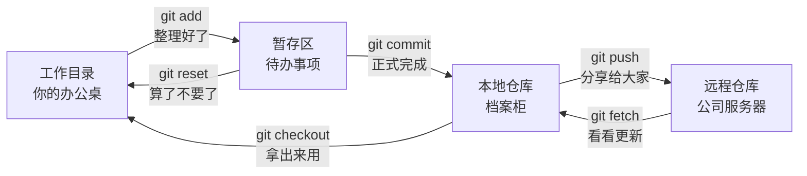
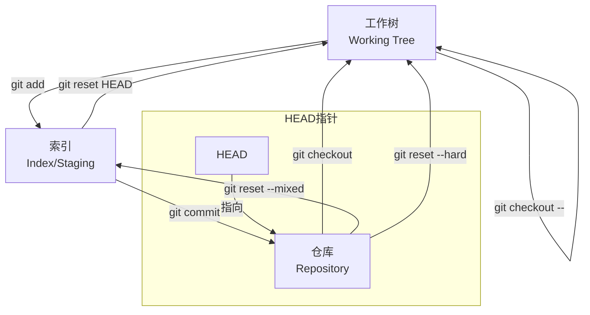
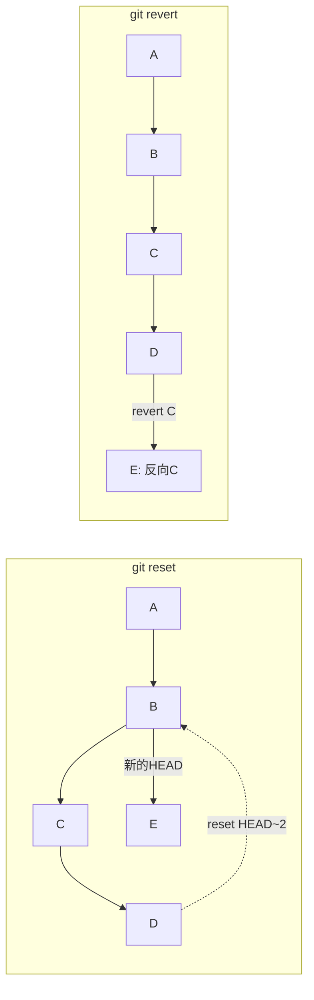
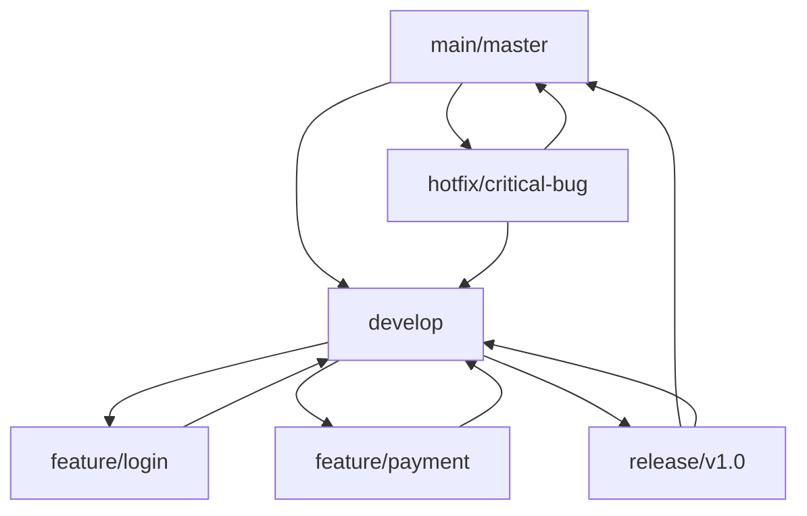
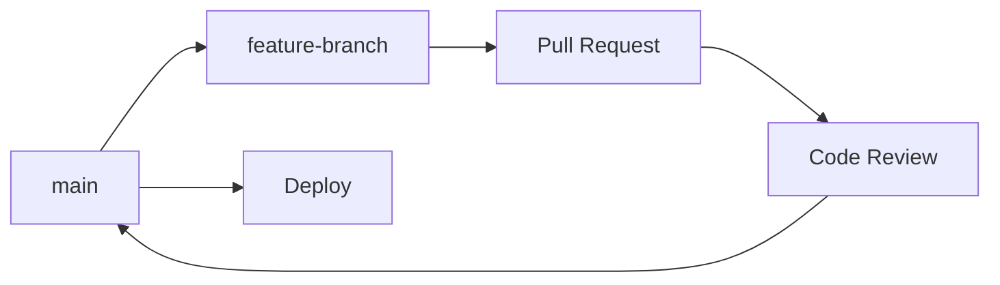

# FrontTalk#009 | Git完全通关指南

> Written by Claude Sonnet 4

作为一名前端开发者，你是否曾经遇到过这样的场景：

- 🤔 代码写到一半，突然需要紧急修复线上bug，但又不想丢失当前的工作进度
- 😰 团队协作时频繁出现代码冲突，不知道该如何优雅地解决
- 🤷‍♂️ 对于 `git pull` 和 `git fetch` 的区别总是模模糊糊
- 😵 想要回滚某个提交，但不确定用 `reset` 还是 `revert`

如果你有过类似的困扰，那么这篇文章就是为你准备的。我将用最接地气的方式，带你彻底搞懂Git的方方面面。

## 写在前面

这不是一篇入门教程，而是一份进阶指南。我假设你已经会基本的 `git add`、`git commit`、`git push` 操作，现在想要更深入地理解Git的工作原理，掌握更高级的技巧。

文章会比较长，但我保证每一个知识点都配有实际的使用场景和代码示例。建议你边看边实践，这样效果会更好。

## 目录

1. [为什么我们需要版本管理？](#1-为什么我们需要版本管理)
2. [Git的设计哲学：为什么它如此强大？](#2-git的设计哲学为什么它如此强大)
3. [Fork、Clone、Branch：三个容易混淆的概念](#3-forkclonebranch三个容易混淆的概念)
4. [Git命令速查手册](#4-git命令速查手册)
5. [深入理解Git的三个工作区域](#5-深入理解git的三个工作区域)
6. [git pull vs git fetch：一场关于安全性的讨论](#6-git-pull-vs-git-fetch一场关于安全性的讨论)
7. [git stash：你的代码"保险箱"](#7-git-stash你的代码保险箱)
8. [git rebase vs git merge：两种不同的合并哲学](#8-git-rebase-vs-git-merge两种不同的合并哲学)
9. [冲突不可怕：系统性解决Git冲突](#9-冲突不可怕系统性解决git冲突)
10. [撤销操作的艺术：reset vs revert](#10-撤销操作的艺术reset-vs-revert)
11. [团队协作：构建高效的Git工作流](#11-团队协作构建高效的git工作流)

---

## 1. 为什么我们需要版本管理？

让我先给你讲个故事。

想象一下，你正在开发一个电商网站。昨天你刚完成了购物车功能，今天产品经理又要求你添加优惠券功能。你兴致勃勃地开始编码，结果写到一半发现逻辑有问题，想要回到昨天的版本重新开始。

如果没有版本管理，你可能会这样做：
```
project_v1.0/
project_v1.1_backup/
project_v1.2_final/
project_v1.2_final_final/
project_v1.2_really_final/
```

是不是很熟悉？😅

这就是为什么我们需要版本管理系统。它不仅仅是一个"保存"功能，更是一个时光机，让你可以：

**回到过去**：任何时候都能回到之前的任何一个版本
```bash
# 哎呀，刚才的修改把网站搞崩了，赶紧回到昨天的版本
git log --oneline -10  # 看看最近的提交记录
git revert HEAD        # 安全地撤销最新的修改
```

**并行开发**：同时进行多个功能的开发而不互相干扰
```bash
# 我可以同时开发购物车和用户中心，互不影响
git checkout -b feature/shopping-cart
git checkout -b feature/user-profile
```

**团队协作**：多个人同时修改代码而不会覆盖彼此的工作
```bash
# 小明在开发登录功能，小红在开发支付功能
# 最后可以完美地合并在一起
git merge feature/login
git merge feature/payment
```

**找到罪魁祸首**：当出现bug时，快速定位是哪次修改引入的问题
```bash
# 用二分查找快速定位引入bug的提交
git bisect start
git bisect bad HEAD    # 当前版本有bug
git bisect good v1.0   # v1.0版本是好的
# Git会自动帮你找到问题提交
```

### 为什么选择Git？

在众多版本管理工具中，为什么Git能够脱颖而出？让我们来看看它与其他工具的对比：

| 特性 | Git | SVN | Mercurial |
|------|-----|-----|-----------|
| **架构** | 分布式 | 集中式 | 分布式 |
| **性能** | 🚀 极快 | 🐌 较慢 | 🏃‍♂️ 快 |
| **分支** | 💪 超强 | 😰 复杂 | 👍 不错 |
| **离线工作** | ✅ 完全支持 | ❌ 不支持 | ✅ 支持 |
| **学习难度** | 🤯 有点难 | 😊 简单 | 😐 中等 |
| **生态** | 🌟 最丰富 | 📚 成熟 | 🤏 较小 |

Git之所以成为主流，主要有三个原因：

**1. 分布式的天然优势**
想象一下，如果你在飞机上想要查看代码历史或者创建分支，SVN就歇菜了，但Git完全没问题：
```bash
# 即使没有网络，你也可以做任何事情
git log --graph --oneline    # 查看完整历史
git checkout -b new-feature  # 创建新分支
git commit -m "离线开发"      # 提交代码
```

**2. 分支管理的艺术**
在Git中，创建分支就像复制一个文件一样简单：
```bash
# 创建分支几乎是瞬间完成的
git checkout -b feature/awesome-feature
# 在SVN中，这可能需要几分钟甚至更长时间
```

**3. 强大的生态系统**
GitHub、GitLab、Bitbucket等平台的存在，让Git不仅仅是一个工具，更是一个生态：
```bash
# 一键部署到各种平台
git push heroku main         # 部署到Heroku
git push origin main         # 触发GitHub Actions
```

---

## 2. Git的设计哲学：为什么它如此强大？

### Git的核心思想：一切皆快照

很多人以为Git存储的是文件的"差异"，但实际上Git存储的是"快照"。这个设计决定了Git的强大之处。

**传统方式（差异存储）：**
```
版本1: 完整的 index.html
版本2: index.html 的第10行改了
版本3: index.html 的第25行改了
```

**Git方式（快照存储）：**
```
提交1: [index.html的完整快照, style.css的完整快照]
提交2: [index.html的新快照, style.css的快照(未变化，指向提交1)]
提交3: [index.html的新快照, style.css的新快照]
```

这样做的好处是什么？**速度！** 当你要查看某个版本的完整状态时，Git不需要从第一个版本开始逐步应用所有差异，而是直接给你完整的快照。

```bash
# 瞬间切换到任何版本，因为每个版本都是完整的快照
git checkout v1.0.0    # 瞬间回到v1.0.0
git checkout main      # 瞬间回到最新版本
```

### Git的四种对象类型

Git的内部世界其实很简单，只有四种对象：

1. **Blob对象**：存储文件内容
2. **Tree对象**：存储目录结构
3. **Commit对象**：存储提交信息
4. **Tag对象**：存储标签信息

你可以把它们想象成：
- Blob = 文件的内容
- Tree = 文件夹
- Commit = 一次保存操作
- Tag = 书签

```bash
# 想看看Git内部是怎么存储的吗？
git cat-file -t HEAD        # 查看HEAD的类型 (commit)
git cat-file -p HEAD        # 查看HEAD的内容
git cat-file -t HEAD^{tree} # 查看目录树的类型 (tree)
```

### 分布式的魅力

Git最大的创新就是"分布式"。什么意思呢？

在传统的SVN中，有一个中央服务器，所有人都要连接到这个服务器才能工作：

```
开发者A ←→ 中央服务器 ←→ 开发者B
```

但在Git中，每个人的电脑上都有完整的代码历史：

```
开发者A的完整仓库 ←→ GitHub ←→ 开发者B的完整仓库
```

这意味着什么？

**离线工作无压力**：
```bash
# 即使断网了，你也可以正常工作
git log                    # 查看完整历史
git checkout -b feature    # 创建分支
git commit -m "离线开发"    # 提交代码
# 等有网了再 git push
```

**没有单点故障**：
如果GitHub挂了，你的代码不会丢失，因为每个开发者的电脑上都有完整备份。

**灵活的协作方式**：
```bash
# 你甚至可以直接从同事的电脑拉取代码
git remote add colleague git@colleague-ip:project.git
git fetch colleague
git merge colleague/awesome-feature
```

### 2.2 Git的数据模型：快照vs差异

Git采用快照模型而非差异模型，这是其高性能的关键：

**差异模型（传统方式）：**
```
版本1: 文件A的完整内容
版本2: 文件A的差异1 + 文件B的完整内容
版本3: 文件A的差异2 + 文件B的差异1
```

**快照模型（Git方式）：**
```
提交1: [文件A快照, 文件B快照]
提交2: [文件A快照, 文件B快照, 文件C快照]
提交3: [文件A快照, 文件B快照, 文件C快照]
```

**Git对象模型详解：**

```bash
# 查看Git对象类型
git cat-file -t HEAD        # commit
git cat-file -t HEAD^{tree} # tree
git cat-file -t HEAD:README.md # blob

# 查看对象内容
git cat-file -p HEAD        # 查看提交对象
git cat-file -p HEAD^{tree} # 查看树对象
```

**四种Git对象类型：**

1. **Blob对象**：存储文件内容
2. **Tree对象**：存储目录结构
3. **Commit对象**：存储提交信息
4. **Tag对象**：存储标签信息

### 2.3 Git的"三室一厅"：工作区域详解

Git就像一个三室一厅的房子，每个房间都有不同的用途。理解这个"房间布局"，你就掌握了Git的精髓！



**三个房间的作用：**

1. **工作目录（你的办公桌）**
   - 这里是你"干活"的地方，随便改，随便试
   - 改坏了也不怕，随时可以"重新开始"

2. **暂存区（待办事项清单）**
   - 把做好的东西先放这里"排队"
   - 可以精确控制哪些改动要一起提交

3. **本地仓库（你的档案柜）**
   - 正式"归档"的地方，记录了所有历史
   - 这里的东西就比较"正式"了

**实际操作就像这样：**
```bash
# 看看各个"房间"的状态
git status                    # 办公桌和待办清单怎么样？
git diff                      # 办公桌 vs 待办清单有啥区别？
git diff --staged            # 待办清单 vs 档案柜有啥区别？
git log --oneline            # 档案柜里都有啥？

# 文件的"搬家"过程
echo "新功能" >> feature.js   # 在办公桌上干活
git add feature.js           # 放到待办清单
git commit -m "添加新功能"    # 正式归档
```

---

## 3. Fork、Clone、Branch：三个容易混淆的概念

刚开始学Git的时候，我经常搞混这三个概念。Fork是什么？Clone又是什么？Branch呢？它们之间有什么关系？

让我用一个生活化的比喻来解释：

### 想象你要学做菜

**Fork** = 你看到一个很棒的菜谱，决定复制一份到自己的菜谱本里
**Clone** = 把菜谱本从书架上拿到厨房里
**Branch** = 在原菜谱基础上尝试不同的做法

| 操作 | 比喻 | 实际含义 | 使用场景 |
|------|------|----------|----------|
| **Fork** | 复制别人的菜谱本 | 在GitHub上复制别人的仓库 | 贡献开源项目 |
| **Clone** | 把菜谱本拿到厨房 | 把远程仓库下载到本地 | 开始开发工作 |
| **Branch** | 尝试不同做法 | 在同一仓库内创建分支 | 开发新功能 |

### Fork：站在巨人的肩膀上

Fork主要用于开源项目贡献。当你想要为一个开源项目做贡献时，你不能直接修改别人的仓库，所以需要先Fork一份到自己账户下。

**典型的开源贡献流程：**

```bash
# 1. 在GitHub上点击Fork按钮（这一步在网页上完成）

# 2. 把你Fork的仓库克隆到本地
git clone https://github.com/你的用户名/awesome-project.git
cd awesome-project

# 3. 添加原仓库作为上游仓库（这很重要！）
git remote add upstream https://github.com/原作者/awesome-project.git

# 4. 查看远程仓库配置
git remote -v
# 输出：
# origin    https://github.com/你的用户名/awesome-project.git (fetch)
# origin    https://github.com/你的用户名/awesome-project.git (push)
# upstream  https://github.com/原作者/awesome-project.git (fetch)
# upstream  https://github.com/原作者/awesome-project.git (push)

# 5. 保持你的Fork与原仓库同步
git fetch upstream
git checkout main
git merge upstream/main
git push origin main
```

**为什么要添加upstream？**

因为原仓库可能会不断更新，你需要定期同步这些更新到你的Fork中，否则你的Fork就会越来越"过时"。

### Clone：把代码搬到本地

Clone就是把远程仓库完整地复制到你的电脑上。这个操作会：

- 下载所有的代码文件
- 下载完整的Git历史记录
- 自动设置origin远程仓库

```bash
# 最常见的克隆方式
git clone https://github.com/user/repo.git

# 克隆到指定目录
git clone https://github.com/user/repo.git my-project

# 只克隆最新版本（浅克隆，速度更快）
git clone --depth 1 https://github.com/user/repo.git

# 克隆特定分支
git clone -b develop https://github.com/user/repo.git
```

**HTTPS vs SSH：选择哪种方式？**

```bash
# HTTPS方式（推荐新手）
git clone https://github.com/user/repo.git
# 优点：简单，不需要配置
# 缺点：每次push都要输入用户名密码

# SSH方式（推荐有经验的开发者）
git clone git@github.com:user/repo.git
# 优点：配置好后无需输入密码
# 缺点：需要先配置SSH密钥
```

### Branch：平行宇宙的艺术

Branch（分支）是Git最强大的功能之一。你可以把它想象成平行宇宙：

- 在主宇宙（main分支）里，你的项目是稳定的
- 在平行宇宙（feature分支）里，你可以大胆实验
- 实验成功了，就把平行宇宙合并到主宇宙
- 实验失败了，就删掉这个平行宇宙

```bash
# 查看所有分支
git branch -a

# 创建新分支
git checkout -b feature/user-login
# 这相当于：
# git branch feature/user-login  # 创建分支
# git checkout feature/user-login  # 切换到分支

# 在新分支上开发
echo "登录功能代码" > login.js
git add login.js
git commit -m "完成用户登录功能"

# 切换回主分支
git checkout main

# 合并功能分支
git merge feature/user-login

# 删除已合并的分支
git branch -d feature/user-login
```

**分支命名的最佳实践：**

```bash
# 功能分支
feature/user-authentication
feature/shopping-cart
feat/payment-integration

# 修复分支
bugfix/login-error
fix/memory-leak
hotfix/security-issue

# 发布分支
release/v2.1.0
release/2024-q1
```

### 3.3 Clone详解

**Clone的核心功能：**
Clone是将远程仓库完整复制到本地的操作，包括：
- 所有提交历史
- 所有分支信息
- 远程仓库配置

**Clone的多种方式：**

```bash
# 1. HTTPS克隆（推荐新手）
git clone https://github.com/user/repo.git

# 2. SSH克隆（推荐有经验开发者）
git clone git@github.com:user/repo.git

# 3. 浅克隆（只获取最新提交）
git clone --depth 1 https://github.com/user/repo.git

# 4. 克隆特定分支
git clone -b develop https://github.com/user/repo.git

# 5. 克隆到指定目录
git clone https://github.com/user/repo.git my-project
```

**Clone后的初始配置：**
```bash
# 查看克隆后的配置
git remote -v                    # 查看远程仓库
git branch -a                    # 查看所有分支
git config --list --local        # 查看本地配置

# 配置用户信息（如果未全局配置）
git config user.name "Your Name"
git config user.email "your.email@example.com"
```

### 3.4 Branch详解

**Branch的设计哲学：**
Git的分支是指向特定提交的可移动指针，创建分支的成本极低：

```bash
# 分支的本质：查看.git/refs/heads/目录
ls .git/refs/heads/              # 查看本地分支文件
cat .git/refs/heads/main         # 查看分支指向的提交SHA

# 创建分支实际上只是创建一个新的指针
git branch feature-login         # 创建分支
git checkout feature-login       # 切换分支
# 或者合并为一条命令
git checkout -b feature-login    # 创建并切换分支
```

**分支的生命周期管理：**

1. **创建和切换分支**
   ```bash
   # 基于当前分支创建新分支
   git checkout -b feature/user-auth

   # 基于特定提交创建分支
   git checkout -b hotfix/bug-123 abc1234

   # 基于远程分支创建本地分支
   git checkout -b local-feature origin/remote-feature
   ```

2. **分支信息查看**
   ```bash
   git branch                    # 查看本地分支
   git branch -r                 # 查看远程分支
   git branch -a                 # 查看所有分支
   git branch -v                 # 查看分支及最后一次提交
   git branch --merged           # 查看已合并分支
   git branch --no-merged        # 查看未合并分支
   ```

3. **分支删除和清理**
   ```bash
   # 删除已合并的本地分支
   git branch -d feature/completed

   # 强制删除未合并分支
   git branch -D feature/abandoned

   # 删除远程分支
   git push origin --delete feature/old-feature

   # 清理已删除的远程分支引用
   git remote prune origin
   ```

**分支命名规范最佳实践：**

```bash
# 功能分支
feature/user-authentication
feature/payment-integration

# 修复分支
bugfix/login-error
hotfix/critical-security-issue

# 发布分支
release/v2.1.0
release/2024-q1

# 实验分支
experiment/new-ui-framework
spike/performance-optimization
```

### 3.5 三者在团队协作中的配合使用

**完整的协作流程示例：**

```bash
# 1. Fork原项目（在GitHub上操作）
# 2. Clone你的Fork
git clone https://github.com/yourusername/project.git
cd project

# 3. 配置上游仓库
git remote add upstream https://github.com/original/project.git

# 4. 创建功能分支
git checkout -b feature/new-component

# 5. 开发和提交
echo "新组件代码" > component.js
git add component.js
git commit -m "feat: 添加新组件"

# 6. 推送到你的Fork
git push origin feature/new-component

# 7. 在GitHub上创建Pull Request
# 8. 代码审查和合并后，清理本地分支
git checkout main
git pull upstream main
git branch -d feature/new-component
```

**团队内部协作模式：**

```bash
# 共享仓库模式（团队成员有写权限）
git clone https://github.com/company/project.git
git checkout -b feature/team-feature
# 开发完成后直接推送
git push origin feature/team-feature
# 创建Pull Request进行代码审查
```

---

## 4. Git常用命令大全

### 4.1 仓库初始化与配置

**初始化仓库：**
```bash
# 在当前目录初始化Git仓库
git init

# 初始化裸仓库（用于服务器）
git init --bare

# 克隆远程仓库
git clone <url>
git clone <url> <directory-name>
git clone --depth 1 <url>  # 浅克隆
```

**基础配置：**
```bash
# 全局配置
git config --global user.name "Your Name"
git config --global user.email "your.email@example.com"
git config --global init.defaultBranch main

# 项目级配置
git config user.name "Project Name"
git config user.email "project@company.com"

# 查看配置
git config --list
git config --global --list
git config user.name

# 配置别名
git config --global alias.st status
git config --global alias.co checkout
git config --global alias.br branch
git config --global alias.ci commit
```

### 4.2 文件操作命令

**文件状态管理：**
```bash
# 查看文件状态
git status
git status -s              # 简洁输出
git status --porcelain     # 脚本友好输出

# 添加文件到暂存区
git add <file>             # 添加特定文件
git add .                  # 添加当前目录所有文件
git add -A                 # 添加所有修改（包括删除）
git add -u                 # 只添加已跟踪文件的修改
git add -p                 # 交互式添加（部分添加）

# 从暂存区移除文件
git reset HEAD <file>      # 取消暂存
git rm <file>              # 删除文件并暂存删除操作
git rm --cached <file>     # 只从Git中删除，保留本地文件
```

**查看文件差异：**
```bash
# 查看工作目录与暂存区的差异
git diff

# 查看暂存区与最后一次提交的差异
git diff --staged
git diff --cached

# 查看工作目录与最后一次提交的差异
git diff HEAD

# 查看两个提交之间的差异
git diff commit1 commit2
git diff HEAD~2 HEAD

# 查看特定文件的差异
git diff <file>
git diff HEAD~1 HEAD <file>
```

### 4.3 提交相关命令

**基础提交操作：**
```bash
# 提交暂存区的文件
git commit -m "提交信息"

# 提交所有已跟踪文件的修改
git commit -am "提交信息"

# 修改最后一次提交
git commit --amend
git commit --amend -m "新的提交信息"
git commit --amend --no-edit  # 只修改文件，不修改提交信息

# 空提交（用于触发CI/CD）
git commit --allow-empty -m "触发构建"
```

**提交历史查看：**
```bash
# 查看提交历史
git log
git log --oneline          # 简洁格式
git log --graph            # 图形化显示
git log --all --graph --oneline  # 所有分支的图形化历史

# 查看特定数量的提交
git log -n 5               # 最近5次提交
git log --since="2 weeks ago"
git log --until="2024-01-01"

# 查看特定作者的提交
git log --author="张三"
git log --grep="修复"       # 搜索提交信息

# 查看文件的修改历史
git log -p <file>          # 显示文件的详细修改
git log --follow <file>    # 跟踪文件重命名
git blame <file>           # 查看文件每行的最后修改者
```

### 4.4 分支管理命令

**分支基础操作：**
```bash
# 查看分支
git branch                 # 本地分支
git branch -r              # 远程分支
git branch -a              # 所有分支
git branch -v              # 显示最后一次提交

# 创建分支
git branch <branch-name>
git checkout -b <branch-name>  # 创建并切换
git switch -c <branch-name>    # 新语法

# 切换分支
git checkout <branch-name>
git switch <branch-name>       # 新语法

# 重命名分支
git branch -m <old-name> <new-name>
git branch -m <new-name>       # 重命名当前分支

# 删除分支
git branch -d <branch-name>    # 删除已合并分支
git branch -D <branch-name>    # 强制删除分支
```

**分支合并操作：**
```bash
# 合并分支
git merge <branch-name>
git merge --no-ff <branch-name>  # 禁用快进合并
git merge --squash <branch-name> # 压缩合并

# 变基操作
git rebase <branch-name>
git rebase -i HEAD~3           # 交互式变基
git rebase --continue          # 继续变基
git rebase --abort             # 取消变基
```

### 4.5 远程仓库命令

**远程仓库管理：**
```bash
# 查看远程仓库
git remote
git remote -v              # 显示详细信息
git remote show origin     # 显示远程仓库详情

# 添加远程仓库
git remote add <name> <url>
git remote add upstream https://github.com/original/repo.git

# 修改远程仓库URL
git remote set-url origin <new-url>

# 删除远程仓库
git remote remove <name>
```

**同步操作：**
```bash
# 获取远程更新
git fetch                  # 获取所有远程分支更新
git fetch origin           # 获取特定远程仓库更新
git fetch origin main      # 获取特定分支更新

# 拉取并合并
git pull                   # 等于 git fetch + git merge
git pull --rebase          # 等于 git fetch + git rebase
git pull origin main       # 从特定远程分支拉取

# 推送到远程
git push                   # 推送当前分支
git push origin main       # 推送到特定远程分支
git push -u origin main    # 设置上游分支并推送
git push --force-with-lease # 安全的强制推送
```

### 4.6 标签管理命令

**标签操作：**
```bash
# 查看标签
git tag
git tag -l "v1.*"          # 列出匹配模式的标签

# 创建标签
git tag v1.0.0             # 轻量标签
git tag -a v1.0.0 -m "版本1.0.0"  # 附注标签
git tag -a v1.0.0 abc1234   # 为特定提交创建标签

# 查看标签信息
git show v1.0.0

# 推送标签
git push origin v1.0.0     # 推送特定标签
git push origin --tags     # 推送所有标签

# 删除标签
git tag -d v1.0.0          # 删除本地标签
git push origin --delete v1.0.0  # 删除远程标签
```

### 4.7 实用工具命令

**文件恢复和重置：**
```bash
# 恢复工作目录文件
git checkout -- <file>     # 恢复文件到最后提交状态
git restore <file>          # 新语法

# 恢复暂存区文件
git reset HEAD <file>
git restore --staged <file> # 新语法

# 重置到特定提交
git reset --soft HEAD~1     # 软重置
git reset --mixed HEAD~1    # 混合重置（默认）
git reset --hard HEAD~1     # 硬重置
```

**搜索和查找：**
```bash
# 在代码中搜索
git grep "搜索内容"
git grep -n "搜索内容"      # 显示行号
git grep --count "搜索内容" # 显示匹配数量

# 查找引入bug的提交
git bisect start
git bisect bad HEAD
git bisect good v1.0.0

# 查看引用日志
git reflog                 # 查看HEAD的移动历史
git reflog show main       # 查看特定分支的引用历史
```

---

## 5. HEAD、工作树、索引详解

### 5.1 HEAD的深度解析

**HEAD的本质：**
HEAD是Git中的一个特殊指针，它指向当前分支的最新提交。理解HEAD是掌握Git工作原理的关键。

```bash
# 查看HEAD指向
cat .git/HEAD              # 通常显示：ref: refs/heads/main
cat .git/refs/heads/main   # 显示具体的提交SHA值

# HEAD的不同表示方法
git log HEAD               # 当前提交
git log HEAD~1             # 父提交
git log HEAD~2             # 祖父提交
git log HEAD^              # 第一个父提交（等同于HEAD~1）
git log HEAD^2             # 第二个父提交（合并提交时）
```

**HEAD的状态类型：**

1. **正常状态（Attached HEAD）**
   ```bash
   git checkout main          # HEAD指向main分支
   cat .git/HEAD             # 输出：ref: refs/heads/main
   ```

2. **分离状态（Detached HEAD）**
   ```bash
   git checkout abc1234      # 直接检出某个提交
   cat .git/HEAD             # 输出：abc1234...（具体的SHA值）

   # 在分离状态下的操作
   echo "临时修改" > temp.txt
   git add temp.txt
   git commit -m "临时提交"

   # 保存分离状态的工作
   git branch temp-work      # 创建分支保存当前工作
   git checkout main         # 切换回主分支
   ```

**HEAD移动的场景：**
```bash
# 1. 切换分支时HEAD移动
git checkout feature-branch

# 2. 提交时HEAD移动
git commit -m "新提交"

# 3. 重置时HEAD移动
git reset --hard HEAD~1

# 4. 变基时HEAD移动
git rebase main

# 查看HEAD移动历史
git reflog                # 显示HEAD的完整移动记录
```

### 5.2 工作树（Working Tree）详解

**工作树的定义：**
工作树是你当前能看到和编辑的文件系统状态，它反映了某个特定版本的项目文件。

**工作树的文件状态：**

```bash
# 查看工作树状态
git status

# 可能的文件状态：
# - Untracked: 未跟踪的新文件
# - Modified: 已修改但未暂存
# - Staged: 已暂存待提交
# - Committed: 已提交到仓库
```

**工作树操作实例：**

```bash
# 1. 创建新文件（Untracked状态）
echo "console.log('Hello');" > hello.js
git status  # 显示 Untracked files

# 2. 修改已跟踪文件（Modified状态）
echo "// 添加注释" >> existing-file.js
git status  # 显示 Changes not staged for commit

# 3. 查看工作树与不同版本的差异
git diff                    # 工作树 vs 暂存区
git diff HEAD              # 工作树 vs 最新提交
git diff HEAD~1            # 工作树 vs 上一个提交

# 4. 恢复工作树文件
git checkout -- hello.js   # 恢复单个文件
git checkout .             # 恢复所有文件
git clean -fd              # 删除未跟踪的文件和目录
```

**工作树的高级操作：**

```bash
# 1. 工作树的备份和恢复
git stash                  # 备份当前工作树状态
git stash pop              # 恢复备份的工作树状态

# 2. 部分文件的操作
git checkout HEAD~1 -- specific-file.js  # 恢复特定文件到某个版本
git show HEAD:file.js > file.js.backup   # 导出某个版本的文件

# 3. 工作树的比较
git diff --name-only       # 只显示修改的文件名
git diff --stat            # 显示修改统计信息
```

### 5.3 索引（Index/Staging Area）详解

**索引的核心作用：**
索引是Git独有的概念，它是工作树和仓库之间的缓冲区，允许精确控制每次提交的内容。

**索引的内部结构：**
```bash
# 查看索引内容
git ls-files               # 显示索引中的所有文件
git ls-files --stage       # 显示详细的索引信息

# 索引文件的位置
ls -la .git/index          # 索引文件的物理位置
```

**索引操作的精细控制：**

```bash
# 1. 选择性添加文件
git add file1.js file2.js  # 只添加特定文件
git add *.js               # 添加所有JS文件
git add src/               # 添加整个目录

# 2. 交互式添加（最强大的功能）
git add -p                 # 逐块选择要添加的内容
# 在交互模式中：
# y - 添加这个块
# n - 不添加这个块
# s - 分割这个块
# e - 手动编辑这个块

# 3. 部分文件添加示例
echo -e "第一行修改\n第二行修改\n第三行修改" >> file.js
git add -p file.js         # 可以选择只添加部分修改
```

**索引的高级应用：**

```bash
# 1. 查看索引状态
git diff --cached          # 索引 vs 最新提交
git diff --staged          # 同上，更直观的命令

# 2. 从索引中移除文件
git reset HEAD file.js     # 取消暂存，保留工作树修改
git rm --cached file.js    # 从索引删除，保留工作树文件

# 3. 索引的直接操作
git update-index --assume-unchanged file.js  # 忽略文件变化
git update-index --no-assume-unchanged file.js  # 恢复跟踪
```

### 5.4 三者关系的数据流转

**完整的数据流转图：**



**实际操作流程示例：**

```bash
# 初始状态：三个区域内容一致
git status  # 输出：nothing to commit, working tree clean

# 1. 修改工作树
echo "新功能代码" >> feature.js
git status  # 显示：Changes not staged for commit

# 2. 添加到索引
git add feature.js
git status  # 显示：Changes to be committed

# 3. 提交到仓库
git commit -m "添加新功能"
git status  # 显示：nothing to commit, working tree clean

# 4. 查看三个区域的状态
git diff                    # 工作树 vs 索引（无输出）
git diff --staged          # 索引 vs 仓库（无输出）
git diff HEAD              # 工作树 vs 仓库（无输出）
```

**复杂场景的处理：**

```bash
# 场景：同时有工作树修改和索引修改
echo "索引修改" >> file1.js
git add file1.js           # 添加到索引
echo "工作树修改" >> file1.js  # 继续修改工作树

# 此时的状态
git status
# 输出：
# Changes to be committed:
#   modified: file1.js
# Changes not staged for commit:
#   modified: file1.js

# 查看不同区域的差异
git diff                   # 工作树 vs 索引的差异
git diff --staged          # 索引 vs 仓库的差异
git diff HEAD              # 工作树 vs 仓库的差异
```

### 5.5 常见问题和解决方案

**问题1：误操作后的恢复**

```bash
# 误删工作树文件
git checkout -- deleted-file.js

# 误删索引中的文件
git reset HEAD deleted-file.js
git checkout -- deleted-file.js

# 误提交后的撤销
git reset --soft HEAD~1    # 撤销提交，保留索引和工作树
git reset --mixed HEAD~1   # 撤销提交和索引，保留工作树
git reset --hard HEAD~1    # 撤销所有，回到上一个提交状态
```

**问题2：分离HEAD状态的处理**

```bash
# 检测分离HEAD状态
git branch  # 显示：* (HEAD detached at abc1234)

# 保存分离HEAD的工作
git branch temp-branch     # 创建分支保存当前状态
git checkout main          # 切换到主分支
git merge temp-branch      # 合并临时分支（如果需要）
git branch -d temp-branch  # 删除临时分支
```

**问题3：索引状态混乱的清理**

```bash
# 清理索引，重新开始
git reset --hard HEAD      # 重置索引和工作树到最新提交
git clean -fd              # 删除未跟踪的文件和目录

# 只重置索引，保留工作树
git reset --mixed HEAD     # 或者简单的 git reset
```

---

## 6. git pull vs git fetch：一场关于安全性的讨论

这可能是Git中最容易引起争议的话题之一。有人说"永远不要用git pull"，有人说"git fetch太麻烦了"。到底谁对谁错？

让我先给你讲个故事。

### 一个真实的"血案"

小明是个新手开发者，他习惯用 `git pull` 来同步代码。某天早上，他像往常一样：

```bash
git pull origin main
```

结果屏幕上出现了一堆冲突信息。小明慌了，随便解决了几个冲突就提交了。结果把同事小红昨天熬夜写的代码给覆盖了... 😱

如果小明用的是 `git fetch`，这个悲剧就不会发生：

```bash
git fetch origin                    # 先看看远程有什么更新
git log --oneline HEAD..origin/main # 哦，小红昨天提交了重要代码
git diff HEAD origin/main           # 让我看看具体改了什么
# 仔细检查后再决定如何合并
git merge origin/main
```

### 它们到底有什么区别？

**git fetch：谨慎的侦察兵**
- 只负责"侦察"，下载远程的更新但不合并
- 让你有机会检查远程的变化
- 给你充分的控制权

**git pull：勇猛的突击队**
- 直接"冲锋"，下载并立即合并
- 一步到位，但可能遇到意外
- 适合快速开发，但需要小心

| 特性 | git fetch | git pull |
|------|-----------|----------|
| **安全性** | 🛡️ 很安全 | ⚠️ 需小心 |
| **控制力** | 🎮 完全控制 | 🤖 自动执行 |
| **速度** | 🐌 需要两步 | 🚀 一步到位 |
| **适合场景** | 生产环境、重要项目 | 个人项目、快速开发 |

### git fetch：安全第一的选择

当你使用 `git fetch` 时，你实际上是在说："让我先看看远程发生了什么，然后我再决定怎么办。"

```bash
# 第一步：侦察情况
git fetch origin

# 第二步：分析情况
git log --oneline HEAD..origin/main  # 看看远程有哪些新提交
git diff HEAD origin/main            # 看看具体改了什么

# 第三步：做出决策
# 选择1：直接合并
git merge origin/main

# 选择2：变基合并
git rebase origin/main

# 选择3：先不合并，创建分支研究
git checkout -b study-remote-changes origin/main
```

**fetch的高级用法：**

```bash
# 获取所有远程分支的更新
git fetch --all

# 获取并清理已删除的远程分支
git fetch --prune origin

# 只获取最新的提交（浅层获取）
git fetch --depth=1 origin
```

### 6.2 git fetch的深度应用

**基础fetch操作：**
```bash
# 获取所有远程分支的更新
git fetch

# 获取特定远程仓库的更新
git fetch origin

# 获取特定分支的更新
git fetch origin main

# 获取所有远程仓库的更新
git fetch --all
```

**fetch后的检查和分析：**
```bash
# 1. 查看远程分支状态
git branch -r              # 查看远程分支
git branch -a              # 查看所有分支

# 2. 比较本地和远程的差异
git log HEAD..origin/main  # 查看远程有而本地没有的提交
git log origin/main..HEAD  # 查看本地有而远程没有的提交
git log --oneline --graph HEAD origin/main  # 图形化对比

# 3. 查看具体的差异内容
git diff HEAD origin/main  # 查看详细差异
git diff --stat HEAD origin/main  # 查看差异统计
```

**fetch的高级用法：**
```bash
# 1. 获取特定标签
git fetch origin tag v1.0.0

# 2. 浅层获取（节省带宽）
git fetch --depth=1 origin

# 3. 获取并清理已删除的远程分支
git fetch --prune origin

# 4. 强制更新本地的远程跟踪分支
git fetch --force origin
```

**fetch后的安全合并策略：**
```bash
# 策略1：先查看再决定
git fetch origin
git log --oneline HEAD..origin/main  # 查看即将合并的提交
git diff HEAD origin/main            # 查看具体变化
git merge origin/main                # 确认无误后合并

# 策略2：使用fast-forward合并
git fetch origin
git merge --ff-only origin/main      # 只允许快进合并

# 策略3：创建临时分支测试
git fetch origin
git checkout -b test-merge origin/main
# 在test-merge分支测试新代码
git checkout main
git merge test-merge                 # 确认无误后合并
git branch -d test-merge             # 删除测试分支
```

### 6.3 git pull的深度应用

**pull的不同模式：**
```bash
# 1. 默认合并模式
git pull origin main       # 等于 fetch + merge

# 2. 变基模式
git pull --rebase origin main  # 等于 fetch + rebase

# 3. 快进模式
git pull --ff-only origin main # 只允许快进合并
```

**配置pull的默认行为：**
```bash
# 设置pull的默认策略
git config pull.rebase false   # 使用merge（默认）
git config pull.rebase true    # 使用rebase
git config pull.ff only        # 只允许fast-forward

# 全局配置
git config --global pull.rebase true
```

**pull的安全选项：**
```bash
# 1. 验证提交签名
git pull --verify-signatures origin main

# 2. 显示详细信息
git pull --verbose origin main

# 3. 模拟运行（不实际执行）
git pull --dry-run origin main
```

### 6.4 实际工作场景对比

**场景1：团队协作开发**

使用fetch的安全流程：
```bash
# 每天开始工作前的标准流程
git fetch origin

# 检查远程更新
git log --oneline HEAD..origin/main
if [ $? -eq 0 ]; then
    echo "有远程更新，需要合并"
    git log --graph --oneline HEAD origin/main
    git merge origin/main
else
    echo "没有远程更新"
fi

# 开始新的开发工作
git checkout -b feature/new-feature
```

使用pull的快速流程：
```bash
# 快速同步并开始工作
git pull origin main
git checkout -b feature/new-feature
```

**场景2：生产环境部署**

推荐使用fetch的谨慎流程：
```bash
# 生产环境更新脚本
#!/bin/bash
echo "开始更新生产环境..."

# 1. 备份当前状态
git tag backup-$(date +%Y%m%d-%H%M%S)

# 2. 获取远程更新
git fetch origin

# 3. 检查更新内容
echo "即将应用的更新："
git log --oneline HEAD..origin/main

# 4. 确认后应用更新
read -p "确认应用更新？(y/N): " confirm
if [ "$confirm" = "y" ]; then
    git merge --ff-only origin/main
    echo "更新完成"
else
    echo "更新已取消"
fi
```

**场景3：解决合并冲突**

fetch方式的冲突预处理：
```bash
# 1. 获取远程更新
git fetch origin

# 2. 预览可能的冲突
git merge-tree $(git merge-base HEAD origin/main) HEAD origin/main

# 3. 在临时分支中解决冲突
git checkout -b resolve-conflicts
git merge origin/main
# 解决冲突...
git add .
git commit -m "解决合并冲突"

# 4. 应用到主分支
git checkout main
git merge resolve-conflicts
git branch -d resolve-conflicts
```

pull方式的直接处理：
```bash
# 直接拉取并处理冲突
git pull origin main
# 如果有冲突，直接解决
# 编辑冲突文件...
git add .
git commit -m "解决合并冲突"
```

### 6.5 最佳实践建议

**团队协作规范：**

1. **新手开发者建议**
   ```bash
   # 使用pull进行日常开发
   git pull origin main
   git checkout -b feature/my-feature
   # 开发完成后
   git push origin feature/my-feature
   ```

2. **经验丰富的开发者建议**
   ```bash
   # 使用fetch进行精确控制
   git fetch origin
   git log --oneline HEAD..origin/main
   git merge --ff-only origin/main  # 或根据情况选择合并策略
   ```

3. **团队Lead建议**
   ```bash
   # 制定团队规范
   git config --global pull.rebase true  # 统一使用rebase模式
   # 或者
   git config --global pull.ff only      # 只允许快进合并
   ```

**不同环境的策略选择：**

| 环境 | 推荐命令 | 原因 |
|------|----------|------|
| **开发环境** | `git pull` | 快速迭代，冲突容易解决 |
| **测试环境** | `git fetch` + 检查 | 需要验证更新内容 |
| **生产环境** | `git fetch` + 谨慎合并 | 安全第一，避免意外 |
| **CI/CD** | `git pull --ff-only` | 确保线性历史 |

**自动化脚本示例：**
```bash
#!/bin/bash
# 智能更新脚本

ENVIRONMENT=${1:-development}

case $ENVIRONMENT in
    "production")
        echo "生产环境更新..."
        git fetch origin
        git log --oneline HEAD..origin/main
        read -p "确认更新？(y/N): " confirm
        [ "$confirm" = "y" ] && git merge --ff-only origin/main
        ;;
    "development")
        echo "开发环境更新..."
        git pull origin main
        ;;
    *)
        echo "未知环境: $ENVIRONMENT"
        exit 1
        ;;
esac
```

---

## 7. git stash：你的代码"保险箱"

想象一下这个场景：你正在专心致志地开发一个新功能，代码写了一半，突然产品经理跑过来说："线上有个紧急bug，你赶紧修一下！"

这时候你面临一个尴尬的问题：
- 当前的代码还没写完，不想提交
- 但是需要切换分支去修bug
- Git不允许你在有未提交修改的情况下切换分支

怎么办？`git stash` 来拯救你！

### stash：你的临时保险箱

`git stash` 就像一个临时保险箱，可以把你当前的工作"暂存"起来，让工作目录变得干净，然后你就可以自由地切换分支、修bug、做其他事情。等忙完了，再把之前的工作"取出来"继续。

```bash
# 遇到紧急情况时
git stash                    # 把当前工作存起来
git checkout main            # 切换到主分支
git checkout -b hotfix/bug   # 创建修复分支
# 修复bug...
git add .
git commit -m "修复紧急bug"
git checkout feature-branch  # 回到功能分支
git stash pop                # 取出之前的工作继续
```

### stash的基本操作

**保存工作：**
```bash
# 最简单的用法
git stash

# 带上说明，方便以后识别
git stash push -m "用户登录功能开发到一半"

# 包含新创建的文件
git stash -u                 # u = untracked

# 包含所有文件（甚至是被.gitignore忽略的）
git stash -a                 # a = all
```

**查看保存的工作：**
```bash
# 看看保险箱里有什么
git stash list
# 输出类似：
# stash@{0}: WIP on feature: abc1234 用户登录功能开发到一半
# stash@{1}: WIP on main: def5678 修复样式问题
# stash@{2}: On bugfix: ghi9012 调试支付接口

# 看看具体改了什么
git stash show              # 简要信息
git stash show -p           # 详细差异
git stash show stash@{1}    # 查看特定的stash
```

**恢复工作：**
```bash
# 取出最新的工作并删除stash
git stash pop

# 取出最新的工作但保留stash（以防万一）
git stash apply

# 取出特定的stash
git stash apply stash@{1}

# 删除不需要的stash
git stash drop stash@{1}    # 删除特定stash
git stash clear             # 清空所有stash
```

### 高级技巧：部分stash

有时候你只想stash部分修改，比如你同时在开发两个功能，但只想暂存其中一个：

```bash
# 交互式选择要stash的内容
git stash -p

# 只stash特定文件
git stash push -m "只保存登录相关修改" -- login.js auth.js

# 只stash某个目录
git stash push -m "只保存组件修改" -- src/components/
```

### 实战场景

**场景1：紧急修bug**
```bash
# 正在开发新功能，突然要修bug
git stash push -m "新功能开发中"
git checkout main
git checkout -b hotfix/payment-error
# 修复bug...
git add .
git commit -m "修复支付错误"
git checkout main
git merge hotfix/payment-error
git checkout feature-branch
git stash pop                # 继续开发新功能
```

**场景2：尝试不同方案**
```bash
# 当前方案不确定，想试试另一种思路
git stash push -m "方案A：使用Redux"
# 尝试方案B...
git stash push -m "方案B：使用Context"
# 比较两种方案
git stash show -p stash@{0}  # 查看方案B
git stash show -p stash@{1}  # 查看方案A
# 选择更好的方案
git stash apply stash@{1}    # 采用方案A
```

**场景3：代码审查**
```bash
# 提交PR前，想看看干净的代码
git stash push -m "临时修改"
# 审查代码...
git stash pop                # 恢复临时修改
```

### 7.3 高级stash技巧

**交互式stash：**
```bash
# 选择性stash（类似git add -p）
git stash push -p -m "选择性保存"

# 在交互模式中：
# y - 保存这个块
# n - 不保存这个块
# s - 分割这个块
# e - 编辑这个块
# q - 退出
```

**stash分支操作：**
```bash
# 从stash创建新分支
git stash branch new-feature-branch stash@{0}

# 这个命令会：
# 1. 创建新分支
# 2. 检出到新分支
# 3. 应用stash
# 4. 删除stash（如果应用成功）
```

**stash的高级查看：**
```bash
# 查看stash与当前分支的差异
git diff stash@{0}

# 查看stash与特定提交的差异
git diff HEAD stash@{0}

# 查看stash中的文件列表
git stash show --name-only stash@{0}

# 查看stash的统计信息
git stash show --stat stash@{0}
```

### 7.4 实际应用场景

**场景1：紧急切换分支处理bug**
```bash
# 当前在feature分支开发，突然需要修复main分支的紧急bug
git status                    # 查看当前修改
git stash push -m "功能开发进行中"

# 切换到main分支修复bug
git checkout main
git pull origin main
git checkout -b hotfix/critical-bug

# 修复bug...
echo "修复代码" > bugfix.js
git add bugfix.js
git commit -m "修复紧急bug"

# 合并到main并推送
git checkout main
git merge hotfix/critical-bug
git push origin main
git branch -d hotfix/critical-bug

# 回到feature分支继续开发
git checkout feature-branch
git stash pop                 # 恢复之前的工作
```

**场景2：实验性修改的临时保存**
```bash
# 正在尝试一个新的实现方案
git stash push -m "实验方案A"

# 尝试另一种方案
# 编写新代码...
git stash push -m "实验方案B"

# 比较两种方案
git stash show -p stash@{0}   # 查看方案B
git stash show -p stash@{1}   # 查看方案A

# 选择最好的方案
git stash apply stash@{1}     # 应用方案A
git stash drop stash@{0}      # 删除方案B
git stash drop stash@{0}      # 删除方案A（因为已经应用）
```

**场景3：代码审查过程中的修改管理**
```bash
# 提交代码审查后，收到反馈需要修改
git stash push -m "审查前的版本"

# 根据反馈进行修改
# 修改代码...
git add .
git commit -m "根据审查反馈修改"

# 如果需要回到审查前的版本进行对比
git stash apply stash@{0}     # 会产生冲突，需要解决
# 或者创建新分支进行对比
git stash branch review-comparison stash@{0}
```

**场景4：多个功能并行开发**
```bash
# 开发功能A
git checkout -b feature-a
# 编写代码...
git stash push -m "功能A开发中"

# 切换开发功能B
git checkout -b feature-b
# 编写代码...
git stash push -m "功能B开发中"

# 回到功能A继续开发
git checkout feature-a
git stash apply stash@{1}     # 应用功能A的stash

# 完成功能A后，继续功能B
git add .
git commit -m "完成功能A"
git checkout feature-b
git stash pop                 # 应用并删除功能B的stash
```

### 7.5 stash的最佳实践

**命名规范：**
```bash
# 使用描述性的stash消息
git stash push -m "feat: 用户登录功能开发中"
git stash push -m "fix: 修复支付bug - 临时保存"
git stash push -m "refactor: 重构数据层 - 实验版本"
git stash push -m "docs: 文档更新 - 待审查"
```

**定期清理stash：**
```bash
# 查看所有stash的创建时间
git stash list --date=local

# 删除超过30天的stash（手动检查）
git stash list | grep "30 days ago\|month\|year" | cut -d: -f1

# 创建清理脚本
#!/bin/bash
echo "当前stash列表："
git stash list
echo ""
read -p "是否清理所有stash？(y/N): " confirm
if [ "$confirm" = "y" ]; then
    git stash clear
    echo "所有stash已清理"
fi
```

**stash的安全使用：**
```bash
# 1. 应用stash前先检查当前状态
git status                    # 确保工作目录干净
git stash apply stash@{0}

# 2. 如果应用stash产生冲突
git status                    # 查看冲突文件
# 解决冲突后
git add .                     # 添加解决后的文件
# 不需要commit，因为这不是一个合并操作

# 3. 备份重要的stash
git stash show -p stash@{0} > important-stash.patch
# 可以用 git apply important-stash.patch 恢复
```

**团队协作中的stash使用：**
```bash
# 不要依赖stash进行代码共享
# stash是本地的，不会被推送到远程仓库

# 如果需要共享临时修改，使用分支
git checkout -b temp/shared-changes
git add .
git commit -m "临时修改，待讨论"
git push origin temp/shared-changes

# 通知团队成员
echo "临时修改已推送到 temp/shared-changes 分支"
```

**stash的性能考虑：**
```bash
# 对于大型项目，避免频繁的全量stash
git stash push -- specific-file.js  # 只stash特定文件

# 使用--keep-index保留暂存区
git stash push --keep-index -m "保留暂存区的stash"

# 查看stash占用的空间
git count-objects -v | grep "size-pack"
```

### 7.6 stash故障排除

**常见问题及解决方案：**

1. **stash应用失败**
   ```bash
   # 问题：stash apply时出现冲突
   git stash apply stash@{0}
   # 解决：手动解决冲突
   git status                 # 查看冲突文件
   # 编辑冲突文件...
   git add .                  # 标记冲突已解决
   ```

2. **误删重要stash**
   ```bash
   # 查看reflog找回删除的stash
   git fsck --unreachable | grep commit
   git show <commit-hash>     # 查看是否是要找的stash
   git stash apply <commit-hash>  # 恢复stash
   ```

3. **stash列表混乱**
   ```bash
   # 重新整理stash列表
   git stash list             # 查看当前列表
   # 逐个应用需要的stash到新分支
   git stash branch temp-stash-0 stash@{0}
   git stash branch temp-stash-1 stash@{1}
   # 清理原有stash
   git stash clear
   ```

---

## 8. git rebase vs git merge策略选择

### 8.1 两种合并策略的本质区别

**merge的工作原理：**
merge创建一个新的合并提交，将两个分支的历史连接起来，保留完整的分支结构。

```bash
# merge操作示例
git checkout main
git merge feature-branch

# 产生的历史结构：
#   A---B---C---D (main)
#        \       /
#         E---F-G (feature-branch)
#              /
#             H (merge commit)
```

**rebase的工作原理：**
rebase将一个分支的提交重新应用到另一个分支的顶端，创建线性的提交历史。

```bash
# rebase操作示例
git checkout feature-branch
git rebase main

# 产生的历史结构：
#   A---B---C---D---E'---F'---G' (feature-branch)
#                   (main)
```

**核心差异对比：**

| 特性 | git merge | git rebase |
|------|-----------|------------|
| **历史结构** | 保留分支结构 | 创建线性历史 |
| **提交SHA** | 不改变原提交 | 重写提交SHA |
| **合并提交** | 创建merge commit | 无额外提交 |
| **冲突解决** | 一次性解决 | 可能多次解决 |
| **可追溯性** | 完整保留分支信息 | 丢失分支创建信息 |
| **历史清洁度** | 可能复杂 | 简洁线性 |

### 8.2 git merge深度解析

**merge的三种模式：**

1. **Fast-forward merge（快进合并）**
   ```bash
   # 当目标分支是源分支的直接祖先时
   git checkout main
   git merge feature-branch    # 自动快进合并

   # 强制快进合并
   git merge --ff-only feature-branch

   # 历史结构：
   # Before: A---B (main)
   #              \
   #               C---D (feature-branch)
   # After:  A---B---C---D (main, feature-branch)
   ```

2. **No-fast-forward merge（非快进合并）**
   ```bash
   # 强制创建合并提交
   git merge --no-ff feature-branch

   # 历史结构：
   # A---B-------E (main)
   #      \     /
   #       C---D (feature-branch)
   ```

3. **Squash merge（压缩合并）**
   ```bash
   # 将分支的所有提交压缩为一个提交
   git merge --squash feature-branch
   git commit -m "合并feature-branch的所有修改"

   # 历史结构：
   # A---B---C (main)
   # 其中C包含了feature-branch的所有修改
   ```

**merge的实际应用场景：**

```bash
# 场景1：功能分支合并到主分支
git checkout main
git pull origin main
git merge --no-ff feature/user-auth
git push origin main

# 场景2：发布分支合并
git checkout main
git merge --no-ff release/v2.1.0
git tag v2.1.0
git push origin main --tags

# 场景3：紧急修复合并
git checkout main
git merge --ff-only hotfix/critical-bug
git push origin main
```

**merge冲突的处理：**
```bash
# 当merge产生冲突时
git merge feature-branch
# 输出：Automatic merge failed; fix conflicts and then commit the result.

# 查看冲突文件
git status
git diff                    # 查看冲突详情

# 解决冲突后
git add .                   # 标记冲突已解决
git commit                  # 完成合并（会自动生成合并提交信息）

# 取消合并
git merge --abort           # 回到合并前的状态
```

### 8.3 git rebase深度解析

**rebase的基本操作：**
```bash
# 基础rebase
git checkout feature-branch
git rebase main

# 等价于：
git rebase main feature-branch

# 交互式rebase
git rebase -i HEAD~3        # 重写最近3个提交
git rebase -i main          # 基于main分支进行交互式rebase
```

**交互式rebase的强大功能：**
```bash
# 启动交互式rebase
git rebase -i HEAD~4

# 编辑器中显示：
# pick abc1234 第一个提交
# pick def5678 第二个提交
# pick ghi9012 第三个提交
# pick jkl3456 第四个提交

# 可用的操作：
# pick (p)    = 使用提交
# reword (r)  = 使用提交，但修改提交信息
# edit (e)    = 使用提交，但停下来修改
# squash (s)  = 使用提交，但合并到前一个提交
# fixup (f)   = 类似squash，但丢弃提交信息
# drop (d)    = 删除提交
```

**rebase的高级用法：**

1. **onto参数的使用**
   ```bash
   # 将feature分支从old-base移动到new-base
   git rebase --onto new-base old-base feature-branch

   # 实际场景：将功能分支从develop移动到main
   git rebase --onto main develop feature/new-feature
   ```

2. **保留合并提交的rebase**
   ```bash
   # 保留合并提交结构
   git rebase --rebase-merges main

   # 或者使用新的语法
   git rebase --preserve-merges main  # 已废弃，不推荐
   ```

3. **自动解决冲突的策略**
   ```bash
   # 使用特定的合并策略
   git rebase -X ours main           # 冲突时优先使用当前分支
   git rebase -X theirs main         # 冲突时优先使用目标分支
   ```

**rebase冲突的处理：**
```bash
# 当rebase遇到冲突时
git rebase main
# 输出：CONFLICT (content): Merge conflict in file.js

# 解决冲突
git status                  # 查看冲突文件
# 编辑冲突文件...
git add file.js             # 标记冲突已解决

# 继续rebase
git rebase --continue

# 如果还有冲突，重复上述过程
# 如果要跳过当前提交
git rebase --skip

# 如果要取消整个rebase
git rebase --abort
```

### 8.4 策略选择的决策框架

**基于项目类型的选择：**

1. **开源项目**
   ```bash
   # 推荐使用rebase保持历史清洁
   git checkout feature-branch
   git rebase main
   git checkout main
   git merge --ff-only feature-branch
   ```

2. **企业项目**
   ```bash
   # 推荐使用merge保留完整历史
   git checkout main
   git merge --no-ff feature-branch
   ```

3. **个人项目**
   ```bash
   # 可以灵活选择，通常使用rebase
   git rebase -i HEAD~5        # 整理提交历史
   git push --force-with-lease # 安全的强制推送
   ```

**基于团队规模的选择：**

| 团队规模 | 推荐策略 | 原因 |
|----------|----------|------|
| **1-3人** | rebase | 历史简洁，易于追踪 |
| **4-10人** | merge | 保留分支信息，便于协作 |
| **10+人** | merge + squash | 减少噪音，保留功能完整性 |

**基于分支类型的选择：**

```bash
# 功能分支 -> 开发分支：使用rebase
git checkout feature/user-login
git rebase develop

# 开发分支 -> 主分支：使用merge
git checkout main
git merge --no-ff develop

# 热修复分支 -> 主分支：使用merge
git checkout main
git merge --ff-only hotfix/critical-bug

# 实验分支 -> 开发分支：使用squash merge
git checkout develop
git merge --squash experiment/new-algorithm
```

### 8.5 实际工作流程示例

**GitHub Flow + Rebase工作流：**
```bash
# 1. 创建功能分支
git checkout main
git pull origin main
git checkout -b feature/payment-integration

# 2. 开发过程中定期rebase
git fetch origin
git rebase origin/main

# 3. 开发完成后整理提交历史
git rebase -i HEAD~5

# 4. 最终rebase并推送
git rebase origin/main
git push --force-with-lease origin feature/payment-integration

# 5. 在GitHub上创建PR，使用squash merge
```

**Git Flow + Merge工作流：**
```bash
# 1. 从develop创建功能分支
git checkout develop
git pull origin develop
git checkout -b feature/user-profile

# 2. 开发完成后合并回develop
git checkout develop
git merge --no-ff feature/user-profile
git push origin develop
git branch -d feature/user-profile

# 3. 发布时从develop合并到main
git checkout main
git merge --no-ff develop
git tag v1.2.0
git push origin main --tags
```

**混合策略工作流：**
```bash
# 本地开发使用rebase保持历史清洁
git rebase -i HEAD~3        # 整理本地提交

# 功能完成后使用merge保留分支信息
git checkout main
git merge --no-ff feature-branch

# 对于小的修复使用fast-forward
git merge --ff-only bugfix-branch
```

### 8.6 最佳实践和注意事项

**rebase的黄金法则：**
```bash
# 永远不要rebase已经推送到公共仓库的提交
# 错误示例：
git push origin feature-branch
git rebase main                # 危险！会改变已推送的提交
git push --force origin feature-branch  # 会破坏其他人的工作

# 正确做法：
git rebase main                # 在推送前rebase
git push origin feature-branch # 首次推送

# 或者使用安全的强制推送
git push --force-with-lease origin feature-branch
```

**merge的最佳实践：**
```bash
# 1. 合并前确保分支是最新的
git checkout main
git pull origin main
git checkout feature-branch
git merge main               # 或者 git rebase main
git checkout main
git merge --no-ff feature-branch

# 2. 使用描述性的合并提交信息
git merge --no-ff feature-branch -m "feat: 添加用户认证功能

- 实现JWT token认证
- 添加用户登录/注册接口
- 集成第三方OAuth登录

Closes #123"
```

**团队协作规范：**
```bash
# 1. 制定明确的分支策略
git config --global alias.feature-start '!f() { git checkout main && git pull origin main && git checkout -b feature/$1; }; f'
git config --global alias.feature-finish '!f() { git checkout main && git merge --no-ff feature/$1 && git branch -d feature/$1; }; f'

# 2. 使用pre-commit hooks确保代码质量
# .git/hooks/pre-commit
#!/bin/bash
npm run lint && npm run test

# 3. 配置合并策略
git config merge.tool vimdiff  # 配置合并工具
git config pull.rebase true    # 默认使用rebase拉取
```

**性能和安全考虑：**
```bash
# 1. 对于大型仓库，使用浅层rebase
git rebase --depth=10 main

# 2. 备份重要分支
git branch backup-feature-branch feature-branch
git rebase main feature-branch
# 如果rebase出问题，可以恢复
git checkout backup-feature-branch

# 3. 使用reflog追踪操作历史
git reflog                     # 查看所有操作历史
git reset --hard HEAD@{5}     # 恢复到特定操作前的状态
```

---

## 9. 冲突不可怕：系统性解决Git冲突

说到Git冲突，很多开发者都会头疼。但其实，冲突并不可怕，它只是Git在说："嘿，我不知道你想要哪个版本，你来决定一下吧！"

### 冲突是怎么产生的？

想象一下，你和你的同事都在修改同一个文件的同一行代码：

**你的修改：**
```javascript
function greet() {
    return "Hello, World!";  // 你觉得应该用英文
}
```

**同事的修改：**
```javascript
function greet() {
    return "你好，世界！";    // 同事觉得应该用中文
}
```

当你们试图合并代码时，Git就懵了：到底用英文还是中文？这时候就产生了冲突。

### 常见的冲突场景

**场景1：团队协作时的经典冲突**
```bash
# 你和同事同时修改了同一个文件
# 同事先提交并推送了
git pull origin main
# 这时候就可能出现冲突
```

**场景2：合并分支时的冲突**
```bash
# 你在feature分支开发，main分支也有新提交
git checkout main
git merge feature-branch
# CONFLICT! 需要解决冲突
```

**场景3：rebase时的冲突**
```bash
# 想要保持线性历史，但遇到了冲突
git rebase main
# CONFLICT! 需要逐个解决
```

**场景4：应用stash时的冲突**
```bash
# stash的内容和当前代码有冲突
git stash pop
# CONFLICT! 需要手动解决
```

### 冲突长什么样？

当Git遇到冲突时，它会在文件中插入特殊的标记：

```javascript
function calculateTotal(items) {
<<<<<<< HEAD
    // 你的版本：使用reduce
    return items.reduce((sum, item) => sum + item.price * item.quantity, 0);
=======
    // 同事的版本：使用for循环
    let total = 0;
    for (let item of items) {
        total += item.price * item.quantity;
    }
    return total;
>>>>>>> feature-branch
}
```

**标记说明：**
- `<<<<<<< HEAD`：当前分支的内容开始
- `=======`：分隔线
- `>>>>>>> feature-branch`：要合并分支的内容结束

### 解决冲突的步骤

**第1步：不要慌张**
```bash
# 先看看发生了什么
git status
# 输出会告诉你哪些文件有冲突
```

**第2步：打开冲突文件**
用你喜欢的编辑器打开冲突文件，你会看到Git插入的冲突标记。

**第3步：做出决策**
你有几个选择：
1. 保留你的版本
2. 保留对方的版本
3. 结合两个版本
4. 写一个全新的版本

**第4步：清理标记**
删除所有的冲突标记（`<<<<<<<`、`=======`、`>>>>>>>`），保留你想要的代码。

**第5步：测试代码**
确保解决冲突后的代码能正常运行。

**第6步：标记为已解决**
```bash
git add conflicted-file.js
```

**第7步：完成合并**
```bash
git commit  # 对于merge冲突
# 或
git rebase --continue  # 对于rebase冲突
```

### 9.2 冲突标记的解读

**标准冲突标记格式：**
```javascript
// 冲突文件示例
function calculateTotal(items) {
<<<<<<< HEAD
    // 当前分支的实现
    return items.reduce((sum, item) => sum + item.price * item.quantity, 0);
=======
    // 要合并分支的实现
    let total = 0;
    for (let item of items) {
        total += item.price * item.quantity;
    }
    return total;
>>>>>>> feature-branch
}
```

**冲突标记说明：**
- `<<<<<<< HEAD`：当前分支（HEAD）的内容开始
- `=======`：分隔符，分隔两个版本的内容
- `>>>>>>> branch-name`：要合并分支的内容结束

**复杂冲突的标记：**
```javascript
// 多重冲突示例
class UserService {
<<<<<<< HEAD
    constructor(database) {
        this.db = database;
        this.cache = new Map();
    }
||||||| merged common ancestors
    constructor(database) {
        this.db = database;
    }
=======
    constructor(database, logger) {
        this.db = database;
        this.logger = logger;
    }
>>>>>>> feature-logging

    async getUser(id) {
<<<<<<< HEAD
        if (this.cache.has(id)) {
            return this.cache.get(id);
        }
        const user = await this.db.findUser(id);
        this.cache.set(id, user);
        return user;
=======
        this.logger.info(`Getting user ${id}`);
        return await this.db.findUser(id);
>>>>>>> feature-logging
    }
}
```

### 9.3 冲突解决的系统方法

**步骤1：识别冲突文件**
```bash
# 查看冲突状态
git status

# 输出示例：
# On branch main
# You have unmerged paths.
#   (fix conflicts and run "git commit")
#   (use "git merge --abort" to abort the merge)
#
# Unmerged paths:
#   (use "git add <file>..." to mark resolution)
#         both modified:   src/utils.js
#         both modified:   src/components/UserList.js

# 查看冲突的详细信息
git diff                       # 查看所有冲突
git diff --name-only --diff-filter=U  # 只显示冲突文件名
```

**步骤2：分析冲突内容**
```bash
# 查看冲突的上下文
git show :1:src/utils.js       # 共同祖先版本
git show :2:src/utils.js       # 当前分支版本（HEAD）
git show :3:src/utils.js       # 要合并的分支版本

# 使用merge工具查看
git mergetool src/utils.js
```

**步骤3：手动解决冲突**
```javascript
// 原始冲突
function processData(data) {
<<<<<<< HEAD
    // 当前分支：添加了数据验证
    if (!data || !Array.isArray(data)) {
        throw new Error('Invalid data format');
    }
    return data.map(item => ({
        id: item.id,
        name: item.name.trim(),
        value: parseFloat(item.value)
    }));
=======
    // 要合并的分支：添加了错误处理
    try {
        return data.map(item => ({
            id: item.id,
            name: item.name,
            value: item.value,
            timestamp: new Date().toISOString()
        }));
    } catch (error) {
        console.error('Data processing failed:', error);
        return [];
    }
>>>>>>> feature-error-handling
}

// 解决后的版本（结合两个分支的优点）
function processData(data) {
    // 结合数据验证和错误处理
    if (!data || !Array.isArray(data)) {
        throw new Error('Invalid data format');
    }

    try {
        return data.map(item => ({
            id: item.id,
            name: item.name.trim(),
            value: parseFloat(item.value),
            timestamp: new Date().toISOString()
        }));
    } catch (error) {
        console.error('Data processing failed:', error);
        return [];
    }
}
```

**步骤4：标记冲突已解决**
```bash
# 添加解决后的文件
git add src/utils.js

# 检查是否还有未解决的冲突
git status

# 完成合并
git commit                     # 对于merge冲突
git rebase --continue          # 对于rebase冲突
git cherry-pick --continue     # 对于cherry-pick冲突
```

### 9.4 使用工具解决冲突

**配置合并工具：**
```bash
# 配置VS Code作为合并工具
git config --global merge.tool vscode
git config --global mergetool.vscode.cmd 'code --wait $MERGED'

# 配置Vim作为合并工具
git config --global merge.tool vimdiff

# 配置其他工具
git config --global merge.tool meld      # Linux
git config --global merge.tool opendiff  # macOS
git config --global merge.tool tortoisemerge  # Windows
```

**使用合并工具：**
```bash
# 启动合并工具
git mergetool

# 对特定文件使用合并工具
git mergetool src/utils.js

# 查看可用的合并工具
git mergetool --tool-help
```

**VS Code中的冲突解决：**
```bash
# 在VS Code中打开冲突文件
code src/utils.js

# VS Code会显示：
# - Accept Current Change（接受当前更改）
# - Accept Incoming Change（接受传入更改）
# - Accept Both Changes（接受两个更改）
# - Compare Changes（比较更改）
```

### 9.5 高级冲突解决技巧

**使用三方合并策略：**
```bash
# 查看三方合并的详细信息
git config merge.conflictstyle diff3

# 冲突标记会显示三个版本：
# <<<<<<< HEAD
# 当前分支的内容
# ||||||| merged common ancestors
# 共同祖先的内容
# =======
# 要合并分支的内容
# >>>>>>> branch-name
```

**批量解决冲突：**
```bash
# 对于大量冲突，优先选择某一方
git checkout --ours .          # 选择当前分支的所有文件
git checkout --theirs .        # 选择要合并分支的所有文件

# 对特定文件选择某一方
git checkout --ours src/utils.js
git checkout --theirs src/components/UserList.js

# 然后标记为已解决
git add .
```

**使用合并策略：**
```bash
# 使用特定的合并策略
git merge -X ours feature-branch      # 冲突时优先当前分支
git merge -X theirs feature-branch    # 冲突时优先要合并的分支
git merge -X ignore-space-change feature-branch  # 忽略空白字符差异

# 对于rebase
git rebase -X ours main
git rebase -X theirs main
```

### 9.6 预防冲突的最佳实践

**代码组织策略：**
```bash
# 1. 模块化开发，减少文件重叠
src/
├── components/
│   ├── user/           # 用户相关组件
│   ├── product/        # 产品相关组件
│   └── common/         # 共享组件
├── services/
│   ├── userService.js
│   └── productService.js
└── utils/
    ├── validation.js
    └── formatting.js
```

**分支管理策略：**
```bash
# 1. 保持分支生命周期短
git checkout -b feature/quick-fix
# 快速开发和合并
git checkout main
git merge feature/quick-fix
git branch -d feature/quick-fix

# 2. 定期同步主分支
git checkout feature-branch
git fetch origin
git rebase origin/main          # 或 git merge origin/main

# 3. 使用feature flags避免大型合并
// 代码中使用特性开关
if (featureFlags.newUserInterface) {
    return <NewUserInterface />;
} else {
    return <OldUserInterface />;
}
```

**团队协作规范：**
```bash
# 1. 建立代码审查流程
# .github/pull_request_template.md
## 变更说明
- [ ] 功能变更
- [ ] Bug修复
- [ ] 重构

## 冲突检查
- [ ] 已与main分支同步
- [ ] 无合并冲突
- [ ] 测试通过

# 2. 使用pre-commit hooks
# .git/hooks/pre-commit
#!/bin/bash
# 检查是否有冲突标记
if grep -r "<<<<<<< HEAD\|=======\|>>>>>>> " src/; then
    echo "发现冲突标记，请解决后再提交"
    exit 1
fi
```

**自动化冲突检测：**
```bash
# 创建冲突检测脚本
#!/bin/bash
# check-conflicts.sh

echo "检查潜在冲突..."

# 获取所有活跃分支
branches=$(git branch -r | grep -v HEAD | sed 's/origin\///')

for branch in $branches; do
    echo "检查分支: $branch"

    # 尝试合并到临时分支
    git checkout -b temp-merge-test main
    git merge --no-commit --no-ff origin/$branch 2>/dev/null

    if [ $? -ne 0 ]; then
        echo "⚠️  分支 $branch 与 main 存在冲突"
        git merge --abort
    else
        echo "✅ 分支 $branch 可以安全合并"
        git reset --hard HEAD
    fi

    git checkout main
    git branch -D temp-merge-test
done
```

### 9.7 复杂冲突场景的处理

**场景1：重命名文件冲突**
```bash
# 一个分支重命名了文件，另一个分支修改了文件内容
git status
# renamed: old-file.js -> new-file.js (by us)
# modified: old-file.js (by them)

# 解决方法：
git add new-file.js             # 接受重命名
git rm old-file.js              # 删除旧文件
# 手动将对方的修改应用到新文件
git add new-file.js
git commit
```

**场景2：二进制文件冲突**
```bash
# 二进制文件（如图片）冲突
git status
# both modified: assets/logo.png

# 选择某一方的版本
git checkout --ours assets/logo.png    # 选择当前分支版本
# 或
git checkout --theirs assets/logo.png  # 选择要合并分支版本

git add assets/logo.png
git commit
```

**场景3：删除vs修改冲突**
```bash
# 一个分支删除了文件，另一个分支修改了文件
git status
# deleted by us: file.js
# modified by them: file.js

# 选择保留文件
git add file.js

# 或选择删除文件
git rm file.js

git commit
```

**场景4：子模块冲突**
```bash
# 子模块版本冲突
git status
# both modified: submodule-path

# 查看子模块状态
git diff submodule-path

# 选择特定版本
cd submodule-path
git checkout <desired-commit>
cd ..
git add submodule-path
git commit
```

### 9.8 冲突解决的调试和恢复

**调试冲突：**
```bash
# 查看合并的详细信息
git log --merge               # 查看冲突相关的提交
git log --oneline --graph --all  # 图形化查看分支历史

# 查看文件的修改历史
git log -p --follow file.js   # 查看文件的详细修改历史
git blame file.js             # 查看每行的最后修改者

# 使用bisect找到引入冲突的提交
git bisect start
git bisect bad HEAD
git bisect good <last-known-good-commit>
```

**恢复和重试：**
```bash
# 取消当前的合并操作
git merge --abort             # 取消merge
git rebase --abort            # 取消rebase
git cherry-pick --abort       # 取消cherry-pick

# 重置到合并前的状态
git reset --hard ORIG_HEAD

# 使用reflog恢复
git reflog                    # 查看操作历史
git reset --hard HEAD@{2}     # 恢复到特定操作前
```

**创建冲突解决的备份：**
```bash
# 在解决冲突前创建备份分支
git branch backup-before-merge

# 解决冲突过程中的检查点
git add .
git commit -m "WIP: 冲突解决中间状态"

# 如果解决方案不满意，可以回退
git reset --hard backup-before-merge
```

---

## 10. git reset vs git revert操作指南

### 10.1 两个命令的本质区别

**reset vs revert的核心差异：**

| 特性 | git reset | git revert |
|------|-----------|------------|
| **操作方式** | 移动HEAD指针 | 创建新的反向提交 |
| **历史修改** | 重写历史 | 保留历史 |
| **安全性** | 危险（可能丢失提交） | 安全（不丢失信息） |
| **协作友好** | 不适合已推送的提交 | 适合所有情况 |
| **撤销范围** | 可撤销多个提交 | 通常撤销单个提交 |

**工作原理图解：**



### 10.2 git reset详解

**reset的三种模式：**

1. **--soft模式（软重置）**
   ```bash
   # 只移动HEAD，保留暂存区和工作目录
   git reset --soft HEAD~1

   # 效果：
   # - HEAD指向前一个提交
   # - 暂存区保持不变
   # - 工作目录保持不变
   # - 最后一次提交的修改回到暂存区

   # 实际应用：修改最后一次提交
   echo "新内容" >> file.txt
   git add file.txt
   git reset --soft HEAD~1    # 撤销提交但保留修改
   git commit -m "修正后的提交信息"
   ```

2. **--mixed模式（混合重置，默认）**
   ```bash
   # 移动HEAD，重置暂存区，保留工作目录
   git reset HEAD~1           # 等同于 git reset --mixed HEAD~1

   # 效果：
   # - HEAD指向前一个提交
   # - 暂存区被重置
   # - 工作目录保持不变
   # - 最后一次提交的修改回到工作目录（未暂存状态）

   # 实际应用：撤销提交和暂存
   git reset HEAD~2           # 撤销最近2次提交
   git status                 # 查看回到工作目录的修改
   ```

3. **--hard模式（硬重置）**
   ```bash
   # 移动HEAD，重置暂存区和工作目录
   git reset --hard HEAD~1

   # 效果：
   # - HEAD指向前一个提交
   # - 暂存区被重置
   # - 工作目录被重置
   # - 最后一次提交的修改完全丢失

   # ⚠️ 危险操作！确保重要修改已备份
   git reset --hard HEAD~3    # 完全回到3个提交之前的状态
   ```

**reset的高级用法：**

```bash
# 1. 重置到特定提交
git reset --hard abc1234     # 重置到特定SHA

# 2. 重置特定文件
git reset HEAD file.txt      # 从暂存区移除文件
git reset HEAD~1 file.txt    # 将文件重置到前一个版本

# 3. 交互式重置
git reset -p                 # 选择性重置暂存区的修改

# 4. 重置到远程分支
git reset --hard origin/main # 完全同步到远程分支状态
```

**reset的实际应用场景：**

```bash
# 场景1：修改最后一次提交信息
git reset --soft HEAD~1
git commit -m "正确的提交信息"

# 场景2：合并多个提交
git reset --soft HEAD~3      # 回到3个提交前
git commit -m "合并的提交信息"

# 场景3：完全撤销本地修改
git reset --hard HEAD        # 撤销工作目录修改
git clean -fd                # 删除未跟踪文件

# 场景4：撤销错误的合并
git reset --hard HEAD~1      # 撤销最后一次合并
```

### 10.3 git revert详解

**revert的工作原理：**
```bash
# revert创建一个新提交来撤销指定提交的修改
git revert HEAD               # 撤销最后一次提交
git revert abc1234            # 撤销特定提交

# 查看revert的效果
git log --oneline -5
# 输出示例：
# def5678 Revert "添加新功能"
# abc1234 添加新功能
# ghi9012 修复bug
```

**revert的不同用法：**

```bash
# 1. 撤销单个提交
git revert HEAD               # 撤销最后一次提交
git revert HEAD~2             # 撤销倒数第三次提交

# 2. 撤销合并提交
git revert -m 1 HEAD          # 撤销合并提交，保留主分支
git revert -m 2 HEAD          # 撤销合并提交，保留被合并分支

# 3. 撤销多个提交
git revert HEAD~3..HEAD      # 撤销最近3次提交
git revert --no-commit HEAD~3..HEAD  # 撤销但不自动提交

# 4. 编辑revert提交信息
git revert --edit HEAD       # 编辑revert的提交信息
git revert --no-edit HEAD    # 使用默认的revert信息
```

**处理revert冲突：**
```bash
# 当revert产生冲突时
git revert abc1234
# CONFLICT (content): Merge conflict in file.js

# 解决冲突
git status                   # 查看冲突文件
# 编辑冲突文件...
git add file.js              # 标记冲突已解决
git revert --continue        # 完成revert

# 取消revert操作
git revert --abort
```

### 10.4 选择使用场景指南

**使用reset的场景：**

1. **本地开发阶段**
   ```bash
   # 修改尚未推送的提交
   git reset --soft HEAD~1
   git commit --amend -m "修正的提交信息"

   # 整理本地提交历史
   git reset --soft HEAD~5
   git commit -m "整理后的单个提交"
   ```

2. **撤销本地修改**
   ```bash
   # 撤销工作目录的修改
   git reset --hard HEAD

   # 撤销暂存区的修改
   git reset HEAD file.txt
   ```

3. **同步远程分支**
   ```bash
   # 强制同步到远程状态
   git fetch origin
   git reset --hard origin/main
   ```

**使用revert的场景：**

1. **撤销已推送的提交**
   ```bash
   # 安全撤销生产环境的问题提交
   git revert HEAD
   git push origin main
   ```

2. **撤销合并提交**
   ```bash
   # 撤销错误的功能合并
   git revert -m 1 HEAD
   git push origin main
   ```

3. **临时撤销功能**
   ```bash
   # 临时撤销功能进行测试
   git revert feature-commit-sha
   # 测试完成后，可以再次revert这个revert提交来恢复功能
   git revert HEAD
   ```

### 10.5 安全操作的最佳实践

**reset的安全使用：**

```bash
# 1. 操作前创建备份分支
git branch backup-before-reset
git reset --hard HEAD~3

# 2. 使用reflog恢复误操作
git reflog                   # 查看操作历史
git reset --hard HEAD@{5}    # 恢复到特定操作前

# 3. 检查操作影响
git log --oneline -10        # 查看将要重置的提交
git diff HEAD~3              # 查看将要丢失的修改

# 4. 渐进式重置
git reset --soft HEAD~1      # 先软重置查看效果
git reset --mixed HEAD~1     # 再混合重置
git reset --hard HEAD~1      # 最后硬重置（如果确定）
```

**revert的安全使用：**

```bash
# 1. 预览revert效果
git show HEAD                # 查看要撤销的提交内容
git revert --no-commit HEAD  # 预览revert但不提交
git diff --cached            # 查看revert的修改
git commit -m "撤销提交"      # 确认后提交

# 2. 测试revert结果
git revert HEAD
npm test                     # 运行测试确保撤销正确
git push origin main         # 测试通过后推送

# 3. 撤销revert（如果需要恢复）
git revert HEAD              # revert刚才的revert提交
```

### 10.6 团队协作中的使用规范

**团队规范示例：**

```bash
# 1. 本地开发阶段：可以使用reset
git reset --soft HEAD~2      # 整理本地提交
git commit -m "完整的功能实现"

# 2. 推送前的最后检查
git log --oneline -5         # 确认提交历史
git push origin feature-branch

# 3. 推送后：只能使用revert
git revert HEAD              # 撤销已推送的提交
git push origin main
```

**制定团队策略：**

```bash
# .gitconfig 团队配置
[alias]
    # 安全的重置别名
    undo-commit = reset --soft HEAD~1
    undo-add = reset HEAD
    undo-all = reset --hard HEAD

    # 安全的撤销别名
    safe-undo = revert --no-edit HEAD
    undo-merge = revert -m 1 HEAD

# pre-push hook 检查
#!/bin/bash
# 检查是否在重写已推送的历史
if git log @{u}.. --oneline | grep -q .; then
    echo "警告：即将推送新提交"
else
    echo "错误：不能重写已推送的历史，请使用revert"
    exit 1
fi
```

### 10.7 高级场景和故障恢复

**复杂场景处理：**

1. **撤销多个不连续的提交**
   ```bash
   # 使用revert撤销多个提交
   git revert abc1234          # 撤销第一个提交
   git revert def5678          # 撤销第二个提交

   # 或者批量撤销
   git revert --no-commit abc1234 def5678
   git commit -m "批量撤销多个提交"
   ```

2. **撤销部分文件的修改**
   ```bash
   # 只撤销特定文件的修改
   git checkout HEAD~1 -- file.txt
   git add file.txt
   git commit -m "撤销file.txt的修改"
   ```

3. **撤销合并提交的处理**
   ```bash
   # 查看合并提交的父提交
   git show --format="%P" HEAD

   # 撤销合并，保留主分支历史
   git revert -m 1 HEAD

   # 如果后续需要重新合并该分支
   git revert HEAD              # 撤销之前的revert
   git merge feature-branch     # 重新合并
   ```

**故障恢复技巧：**

```bash
# 1. 恢复误删的提交
git reflog                     # 找到丢失的提交SHA
git cherry-pick <lost-commit>  # 恢复特定提交
git reset --hard <lost-commit> # 或直接重置到该提交

# 2. 恢复误删的分支
git reflog show --all          # 查看所有引用的历史
git branch recovered-branch <commit-sha>

# 3. 使用fsck恢复悬空提交
git fsck --lost-found          # 查找悬空对象
git show <dangling-commit>     # 查看悬空提交内容
git branch recovery <dangling-commit>  # 创建分支保存
```

**自动化恢复脚本：**

```bash
#!/bin/bash
# git-safe-reset.sh - 安全的重置脚本

TARGET=${1:-HEAD~1}
BACKUP_BRANCH="backup-$(date +%Y%m%d-%H%M%S)"

echo "创建备份分支: $BACKUP_BRANCH"
git branch $BACKUP_BRANCH

echo "重置到: $TARGET"
git reset --hard $TARGET

echo "备份分支已创建，如需恢复请运行："
echo "git reset --hard $BACKUP_BRANCH"
echo "git branch -d $BACKUP_BRANCH"
```

---

## 11. 基于Git/GitHub的多人协作工作流

### 11.1 主流Git工作流模式

**Git Flow工作流：**

Git Flow是最经典的分支管理模式，适合有明确发布周期的项目。



**分支类型说明：**
- **main/master**：生产环境分支，只包含稳定版本
- **develop**：开发分支，集成所有功能
- **feature/**：功能分支，开发新功能
- **release/**：发布分支，准备新版本发布
- **hotfix/**：热修复分支，修复生产环境紧急问题

**Git Flow实践示例：**
```bash
# 1. 初始化Git Flow
git flow init

# 2. 开始新功能开发
git flow feature start user-authentication
# 等价于：
# git checkout develop
# git checkout -b feature/user-authentication

# 3. 完成功能开发
git flow feature finish user-authentication
# 等价于：
# git checkout develop
# git merge --no-ff feature/user-authentication
# git branch -d feature/user-authentication

# 4. 开始发布准备
git flow release start v1.0.0
# 在release分支进行版本号更新、文档完善等

# 5. 完成发布
git flow release finish v1.0.0
# 等价于：
# git checkout main
# git merge --no-ff release/v1.0.0
# git tag v1.0.0
# git checkout develop
# git merge --no-ff release/v1.0.0
# git branch -d release/v1.0.0

# 6. 紧急修复
git flow hotfix start critical-security-fix
# 修复完成后
git flow hotfix finish critical-security-fix
```

**GitHub Flow工作流：**

GitHub Flow是简化的工作流，适合持续部署的项目。



**GitHub Flow实践：**
```bash
# 1. 从main创建功能分支
git checkout main
git pull origin main
git checkout -b feature/improve-performance

# 2. 开发和提交
git add .
git commit -m "优化数据库查询性能"
git push origin feature/improve-performance

# 3. 在GitHub上创建Pull Request
# 4. 代码审查和讨论
# 5. 合并到main分支
# 6. 自动部署到生产环境
```

**GitLab Flow工作流：**

GitLab Flow结合了Git Flow和GitHub Flow的优点。

```bash
# 环境分支模式
main (生产环境)
├── pre-production (预生产环境)
├── staging (测试环境)
└── feature-branches (功能分支)

# 发布分支模式
main
├── release/v1.0
├── release/v1.1
└── feature-branches
```

### 11.2 团队协作规范制定

**分支命名规范：**
```bash
# 功能分支
feature/user-login
feature/payment-integration
feat/shopping-cart

# 修复分支
bugfix/login-error
fix/memory-leak
hotfix/security-vulnerability

# 发布分支
release/v2.1.0
release/2024-q1

# 实验分支
experiment/new-ui-framework
spike/performance-test
```

**提交信息规范（Conventional Commits）：**
```bash
# 格式：<type>(<scope>): <description>

# 功能提交
git commit -m "feat(auth): 添加JWT token认证"
git commit -m "feat(payment): 集成支付宝支付接口"

# 修复提交
git commit -m "fix(login): 修复密码验证逻辑错误"
git commit -m "fix(ui): 修复移动端布局问题"

# 文档提交
git commit -m "docs(api): 更新API文档"
git commit -m "docs(readme): 添加安装说明"

# 重构提交
git commit -m "refactor(database): 优化查询性能"
git commit -m "refactor(components): 重构用户组件"

# 测试提交
git commit -m "test(auth): 添加登录功能测试用例"
git commit -m "test(utils): 增加工具函数单元测试"

# 构建提交
git commit -m "build(deps): 升级React到18.0"
git commit -m "ci(github): 添加自动化测试流程"
```

**代码审查规范：**
```bash
# Pull Request模板
# .github/pull_request_template.md

## 变更说明
简要描述本次变更的内容和目的

## 变更类型
- [ ] 新功能
- [ ] Bug修复
- [ ] 重构
- [ ] 文档更新
- [ ] 性能优化

## 测试
- [ ] 单元测试已通过
- [ ] 集成测试已通过
- [ ] 手动测试已完成

## 检查清单
- [ ] 代码符合团队规范
- [ ] 已添加必要的测试
- [ ] 文档已更新
- [ ] 无合并冲突

## 相关Issue
Closes #123
```

### 11.3 代码审查最佳实践

**审查者指南：**
```bash
# 1. 检出PR分支进行本地测试
git fetch origin pull/123/head:pr-123
git checkout pr-123
npm install
npm test
npm start

# 2. 代码质量检查
# - 代码风格是否一致
# - 是否有潜在的bug
# - 性能是否有问题
# - 安全性是否考虑

# 3. 提供建设性反馈
# 好的反馈示例：
# "建议使用const而不是let，因为这个变量不会被重新赋值"
# "这个函数有点长，考虑拆分为更小的函数"
# "缺少错误处理，建议添加try-catch"

# 4. 批准或请求修改
# 使用GitHub的Review功能
```

**提交者指南：**
```bash
# 1. 提交前自我审查
git diff --cached              # 检查暂存的修改
git log --oneline -5           # 检查提交历史

# 2. 确保代码质量
npm run lint                   # 代码风格检查
npm run test                   # 运行测试
npm run build                  # 确保构建成功

# 3. 响应审查反馈
# 根据反馈修改代码
git add .
git commit -m "fix: 根据审查反馈修改代码"
git push origin feature-branch

# 4. 保持PR更新
git fetch origin
git rebase origin/main         # 保持与主分支同步
git push --force-with-lease origin feature-branch
```

### 11.4 冲突解决和协作策略

**预防冲突的策略：**
```bash
# 1. 保持分支生命周期短
# 功能分支应该在1-2周内完成并合并

# 2. 定期同步主分支
git checkout feature-branch
git fetch origin
git rebase origin/main         # 或使用merge
git push --force-with-lease origin feature-branch

# 3. 模块化开发
# 不同开发者负责不同的模块，减少文件冲突

# 4. 使用feature flags
// 代码中使用特性开关
if (process.env.FEATURE_NEW_UI === 'true') {
    return <NewUI />;
} else {
    return <OldUI />;
}
```

**团队冲突解决流程：**
```bash
# 1. 发现冲突时的沟通
# 立即通知相关开发者
# 讨论解决方案

# 2. 协作解决冲突
# 可以通过视频会议共同解决
# 或者由一个人解决后让其他人review

# 3. 冲突解决后的验证
git merge feature-branch
npm test                       # 确保功能正常
npm run e2e                    # 运行端到端测试
```

### 11.5 自动化工作流程

**GitHub Actions工作流：**
```yaml
# .github/workflows/ci.yml
name: CI/CD Pipeline

on:
  push:
    branches: [ main, develop ]
  pull_request:
    branches: [ main ]

jobs:
  test:
    runs-on: ubuntu-latest

    steps:
    - uses: actions/checkout@v3

    - name: Setup Node.js
      uses: actions/setup-node@v3
      with:
        node-version: '18'
        cache: 'npm'

    - name: Install dependencies
      run: npm ci

    - name: Run linter
      run: npm run lint

    - name: Run tests
      run: npm run test:coverage

    - name: Upload coverage
      uses: codecov/codecov-action@v3

  deploy:
    needs: test
    runs-on: ubuntu-latest
    if: github.ref == 'refs/heads/main'

    steps:
    - uses: actions/checkout@v3

    - name: Deploy to production
      run: |
        echo "Deploying to production..."
        # 部署脚本
```

**自动化分支保护：**
```bash
# 通过GitHub API设置分支保护规则
curl -X PUT \
  -H "Authorization: token $GITHUB_TOKEN" \
  -H "Accept: application/vnd.github.v3+json" \
  https://api.github.com/repos/owner/repo/branches/main/protection \
  -d '{
    "required_status_checks": {
      "strict": true,
      "contexts": ["ci/test", "ci/lint"]
    },
    "enforce_admins": true,
    "required_pull_request_reviews": {
      "required_approving_review_count": 2,
      "dismiss_stale_reviews": true
    },
    "restrictions": null
  }'
```

**自动化代码质量检查：**
```bash
# package.json
{
  "scripts": {
    "pre-commit": "lint-staged",
    "prepare": "husky install"
  },
  "lint-staged": {
    "*.{js,jsx,ts,tsx}": [
      "eslint --fix",
      "prettier --write",
      "git add"
    ],
    "*.{css,scss,md}": [
      "prettier --write",
      "git add"
    ]
  }
}

# .husky/pre-commit
#!/bin/sh
. "$(dirname "$0")/_/husky.sh"

npm run pre-commit
npm run test
```

### 11.6 大型项目的协作策略

**微服务架构的Git策略：**
```bash
# 每个微服务独立仓库
project/
├── user-service/          # 用户服务仓库
├── payment-service/       # 支付服务仓库
├── notification-service/  # 通知服务仓库
└── api-gateway/          # API网关仓库

# 或者使用monorepo
project/
├── services/
│   ├── user/
│   ├── payment/
│   └── notification/
├── shared/
│   ├── utils/
│   └── types/
└── tools/
    ├── build/
    └── deploy/
```

**大团队的分支策略：**
```bash
# 按团队划分分支
main
├── team-frontend/
│   ├── feature/ui-redesign
│   └── feature/mobile-app
├── team-backend/
│   ├── feature/api-v2
│   └── feature/database-optimization
└── team-devops/
    ├── feature/ci-improvement
    └── feature/monitoring
```

**发布管理策略：**
```bash
# 语义化版本控制
git tag v1.0.0             # 主版本：不兼容的API修改
git tag v1.1.0             # 次版本：向下兼容的功能性新增
git tag v1.1.1             # 修订版本：向下兼容的问题修正

# 自动化发布脚本
#!/bin/bash
# release.sh

VERSION=$1
if [ -z "$VERSION" ]; then
    echo "请提供版本号，例如：./release.sh v1.2.0"
    exit 1
fi

# 确保在main分支
git checkout main
git pull origin main

# 创建发布分支
git checkout -b release/$VERSION

# 更新版本号
npm version $VERSION --no-git-tag-version

# 提交版本更新
git add package.json package-lock.json
git commit -m "chore: bump version to $VERSION"

# 合并到main并打标签
git checkout main
git merge --no-ff release/$VERSION
git tag $VERSION
git push origin main --tags

# 清理发布分支
git branch -d release/$VERSION

echo "发布 $VERSION 完成！"
```

### 11.7 故障处理和应急响应

**生产环境问题的快速响应：**
```bash
# 1. 立即回滚
git checkout main
git revert HEAD               # 安全回滚最新部署
git push origin main

# 2. 创建热修复分支
git checkout -b hotfix/critical-issue
# 快速修复问题
git commit -m "hotfix: 修复生产环境关键问题"

# 3. 快速部署
git checkout main
git merge --ff-only hotfix/critical-issue
git push origin main

# 4. 同步到开发分支
git checkout develop
git merge main
git push origin develop
```

**团队协作的应急流程：**
```bash
# 应急响应检查清单
echo "🚨 生产环境问题应急响应"
echo "1. [ ] 确认问题影响范围"
echo "2. [ ] 通知相关团队成员"
echo "3. [ ] 创建应急修复分支"
echo "4. [ ] 快速修复并测试"
echo "5. [ ] 部署修复版本"
echo "6. [ ] 验证问题已解决"
echo "7. [ ] 更新文档和事后总结"

# 自动化应急通知
#!/bin/bash
# emergency-notify.sh

ISSUE_DESCRIPTION=$1
SLACK_WEBHOOK_URL="your-slack-webhook-url"

curl -X POST -H 'Content-type: application/json' \
    --data "{\"text\":\"🚨 生产环境紧急问题：$ISSUE_DESCRIPTION\"}" \
    $SLACK_WEBHOOK_URL

echo "应急通知已发送"
```

---

## 写在最后

恭喜你！如果你读到了这里，说明你已经掌握了Git的精髓。从版本管理的基础概念，到复杂的团队协作工作流，我们一起走过了Git的方方面面。

### 你现在应该能够：

✅ **理解Git的设计哲学**：知道为什么Git如此强大
✅ **熟练使用基本命令**：add、commit、push、pull不在话下
✅ **处理复杂场景**：冲突解决、分支管理、历史重写
✅ **选择合适的工作流**：根据团队情况选择最佳实践
✅ **应对紧急情况**：知道如何安全地撤销和恢复

### 一些建议

**对于新手：**
- 不要害怕犯错，Git几乎总是能帮你恢复
- 多练习，在个人项目中尝试各种命令
- 遇到问题时，先用 `git status` 看看当前状态

**对于有经验的开发者：**
- 制定团队的Git规范，并坚持执行
- 学会使用Git hooks来自动化工作流
- 定期回顾和优化团队的协作流程

**对于团队Lead：**
- 投资时间培训团队成员
- 建立清晰的分支策略和代码审查流程
- 使用工具来可视化和监控Git工作流

### 最后的话

Git学习曲线确实比较陡峭，但一旦掌握，它会成为你最得力的助手。记住：

> "Git不是用来记住命令的，而是用来理解概念的。"

当你真正理解了Git的工作原理，命令自然就记住了。当你遇到复杂情况时，也能从容应对。

希望这篇文章能帮助你在Git的道路上走得更远。如果你有任何问题或建议，欢迎在评论区讨论！

**Happy Coding! 🚀**

---

*如果这篇文章对你有帮助，别忘了点赞和分享给你的同事朋友们！*
