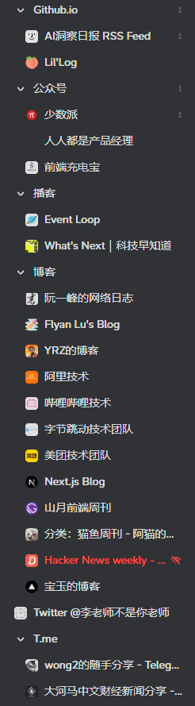

# 行进#001 | 信息茧房、信息洪流与RSS

我的朋友F之前给我展示了他的B站使用时间，在2025年的上半年使用总时间为 1200+ 小时：这真的很多了，半年取 150 天，那每天平均 8 小时。
我们说一天应该划分为 3 个部分：8 小时睡觉、8 小时工作、剩下 8 小时留给自己 —— F留给自己的时间全拿来看B站了。

上面只是个粗略的统计，不考虑到F晚上后台放ASMR，或者是工作时分屏看B站。但是这足以证明，一个软件 + 一套推荐算法，真的能让一个人困在信息的漩涡里。

我们很容易将此归咎于个人的沉迷，但背后其实是一场精心设计的"围猎"。要理解我们为何深陷其中，需要追溯到本世纪初一个精准的预言。

早在2001年，当互联网的个性化前景还如同晨曦般美好时，美国法学家凯斯·桑斯坦（Cass Sunstein）就在他的著作《网络共和国》（Republic.com）中，描绘了一个名为"我的日报"（The Daily Me）的未来：一个完全根据个人偏好定制的媒体世界。他预见，当技术允许我们完美过滤掉所有不感兴趣、不认同的信息时，我们将亲手为自己编织一个"信息茧房"（Information Cocoon）。

这并非危言耸听，而是对人性与商业逻辑的深刻洞察。

信息茧房的根本推手，是我们这个时代的黄金——"注意力"。在互联网商业模式中，我们并非客户，而是产品。平台将我们的在线时长打包售卖给广告商，其商业上的至高目的，就是尽可能地延长我们的停留时间。

为此，算法被设计成一位最懂你的"仆人"。它利用心理学上强大的"确认偏误"（Confirmation Bias）——即我们天生倾向于寻找、解释和记忆那些能证实我们既有信念的信息。当你点赞一篇观点鲜明的文章，算法便心领神会，为你推送更多相似的观点。这创造了一种极其舒适的体验：你的想法被不断肯定，你的品味被反复赞美，仿佛整个世界都在为你点头。

这便是信息茧房的"好处"，也是它最危险的诱惑所在。它提供了一种虚假的安全感和社群归属感，将我们从复杂的、充满异议的真实世界中暂时抽离出来，进入一个和谐、可控的认知舒适区。对于在现实中感到边缘或不被理解的群体，这种"飞地审议"（Enclave Deliberation）甚至能帮助他们凝聚共识、发展观点。

然而，这份"甜蜜"的代价是高昂的。

首先，它导致**个体的认知固化**。长期单向度的信息输入，会让我们视野日益狭隘，逐渐丧失对复杂问题的理解能力。我们以为自己通过手机屏幕看到了世界，实际上只是在无尽地审视一面由数据构成的、反射自身偏见的镜子。批判性思维、接纳异见的耐心，都在这种日复一日的"肯定"中被慢慢消磨。

与信息茧房相伴相生的，是"信息洪流"——那些短促、强烈、碎片化的内容。它们像精神上的"甜食"，持续刺激我们的大脑释放多巴胺，带来短暂的快感，让我们对需要专注和耐心的深度阅读愈发不耐。我们变得焦躁，总担心错过什么（FOMO），却又说不出自己到底获得了什么。信息的涌现又会带来大量的错误信息，这些信息反而又会作为某种推手来遮蔽一些真正重要的信息——信息正在成为操盘手的一个武器。

更深远地，当无数个封闭的"茧房"同时存在，整个社会便面临*部落化和群体极化的风险*。当不同群体之间缺乏共同的信息基础和交流渠道，公共对话的"共同语言"便会消失。社会不再是一个可以争论但仍共享基本事实的广场，而是变成了无数个互相隔绝、甚至敌对的"部落"。误解、对立和仇恨在此间滋生，社会共识的达成变得异常艰难。

我所失去的，不仅仅是时间，更是思考的深度、心灵的宁静，以及作为一个健全公民参与公共生活的能力。

一些研究或许认为"信息茧房"的威力被夸大了，人们依然会通过多种渠道接触信息。但我们无法否认，算法的强大引力正在深刻地重塑我们的信息消费习惯。面对这股力量，与其争论其强度，不如思考如何主动应对。

幸好，这里有一个近乎原始的解决方案：**RSS**。

将 RSS 仅仅视为一个工具，就太小看它了。它更像是一种宣言，一种数字生活方式上的"断舍离"。它代表着一种从"被动投喂"到"主动选择"的权力回归。

使用 RSS 的过程，本身就是一种对抗算法的修行：

1.  **你亲手构建世界**：你的信息源不再由某个神秘的算法决定，而是由你亲自挑选、授权。你订阅李医生的医学博客，也订阅王教授的历史专栏；你关注严肃的新闻通讯，也关注一个有趣的漫画家。这个列表，就是你认知世界的蓝图，它反映了你的好奇心和求知欲，而不是算法为你贴上的"标签"。

2.  **从"沉迷"到"阅读"**：RSS 阅读器没有无限滚动的瀑布流，没有"点赞"和"评论"带来的社交压力。它只是一个安静的收件箱。信息静静地躺在那里，等待你的检阅。你可以从容地浏览标题，决定哪些值得你花时间。这让信息消费回归了"阅读"的本质，而非"刷"的动作。是不是有点像秘书整理好资料后，老板再去审阅？

3.  **夺回心智的主权**：从算法的"舒适区"迁移到 RSS，起初是有些"麻烦"的。你需要去发现和筛选那些值得信赖的信息源。但这个过程，恰恰是重建你独立思考能力的开始。它强迫你去思考："我相信谁？什么对我来说是重要的？我想成为一个怎样的人？"

信息消费，本该像精心布置一个属于自己的书房，而不是被动地站在一个嘈杂的广场上，任由别人把各种传单塞进你的手里。

在这个时代，做一个清醒的少数派或许是奢侈的，但搭建你自己的 RSS 列表，就是迈向这种奢侈的第一步。这无关技术，关乎自由。

::: details 关于我订阅了什么:
and 以下是我订阅的一些栏目，每天更新在5条文章左右：

:::

