# 操作系统课后实践作业 1
::: tip 文章信息
Written by [Q-thrive](https://github.com/Qthrive) in 2025.3.11 

Reprinted by Bolaxious , Reproduction is permitted by permission

:::
::: warning 注意
- 虚拟机安装自行搜索教程
- 虚拟盘分配空间最好大于等于 `100 GB`
- 内存空间推荐大于等于 `4G`
- CPU内核分配大于等于 `8核`
:::
## 优麒麟内核编译
### 优麒麟版本选择
**22.04**增强版

**下载地址:** `https://mirrors.huaweicloud.com/ubuntukylin-cdimage/`  

**官网下载太慢所以选择华为镜像网站**  
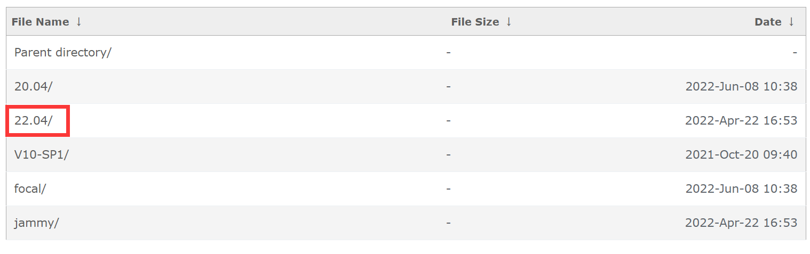

### 编译新内核
**在虚拟机上装好优麒麟后，可以开始进行新内核的编译**  
****
#### 一、查看内核版本  
**在终端输入命令：** `uname -r`  
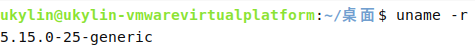
****
#### 二、安装编译需要的工具
**安装gcc、gdb、bison、flex、libncurses5-dev、libssl-dev、libidn11以及虚拟机的必备工具**  
**终端输入：**  
`sudo apt install gcc gdb bison flex libncurses5-dev libssl-dev libidn11 build-essential fakeroot dwarves libelf-dev xz-utils bc liblz4-tool debhelper`  

**出现问题**  
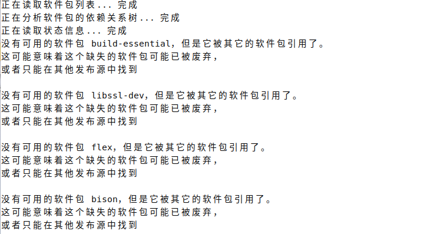

**解决方式**  
`sudo apt-get update`


**解决效果**  
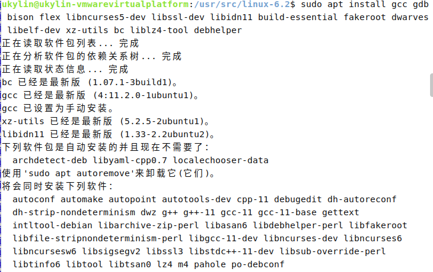  
****
#### 三、下载内核源代码
**从网上下载kernel源代码。**

官网：`https://www.kernel.org/` （下载速度慢）  
镜像网站：
`https://cdn.kernel.org/pub/linux/kernel/`（推荐）

**进入网站**  


**选择6.2.tar.xz**  
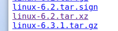  
**右键复制链接地址**  
`https://cdn.kernel.org/pub/linux/kernel/v6.x/linux-6.2.tar.xz`
**在/usr/src打开终端输入：**（在对应文件夹下打开终端）  
`sudo wget https://cdn.kernel.org/pub/linux/kernel/v6.x/linux-6.2.tar.xz`（下载到当前文件夹）  
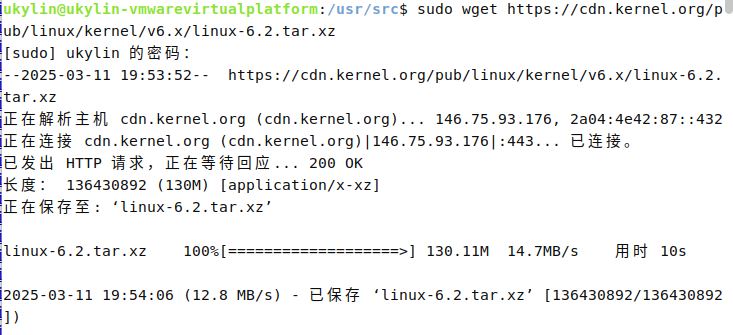  
`sudo tar -xf linux-6.2.tar.xz`（解压缩）  
`sudo rm linux-6.2.tar.xz`（删除压缩包）  

****
#### 四、编译安装
将目前内核的配置拷贝到新内核的源码目录下，作为新内核的配置文件。其中，需要进入配置文件.config，查看一下 .config 文件是否变化，将CONFIG_SYSTEM_TRUSTED_KEYS和CONFIG_SYSTEM_REVOCATION_KEYS的内容删除（保留双引号）。  
**进入源码目录**  
`cd /usr/src/linux-6.2`  
**拷贝**  
`sudo cp -v /boot/config-$(uname -r) .config`  
**或者直接`sudo make menuconfig`**  
****
#### 五、个性化配置
**输入命令：** `sudo make menuconfig`  
出现如下界面： 
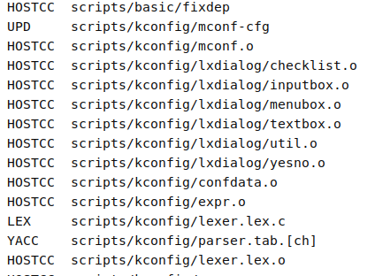  
**随即进入个性化设置界面，随便选一个按回车进入**  
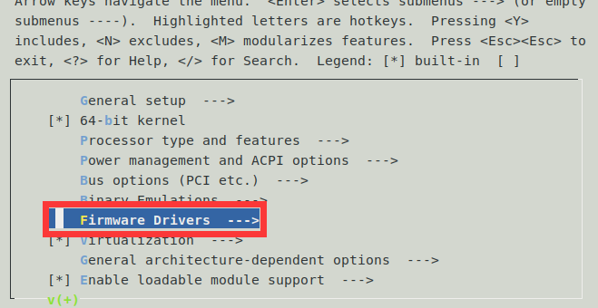
**`M`表示作为模块引入，`*`表示包含在内核，` `表示不包含**  
**通过按`m` `y` `n`来切换**  
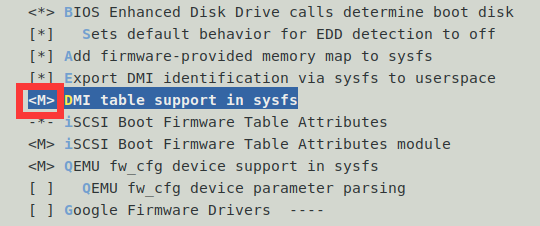  
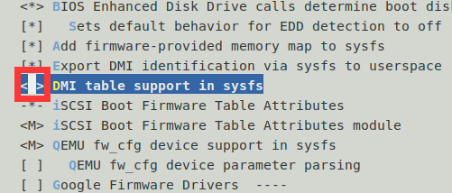  
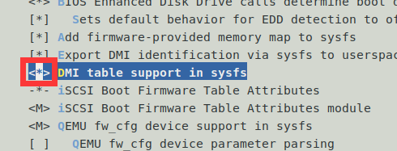  
**作为演示，不做更改**  
**查看config，用/搜索**  
`sudo vim .config`  
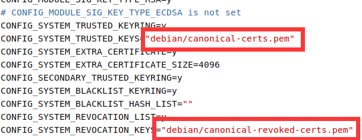  

**发现引号内有内容，需要清除**  
**进行修改（delete）**   
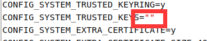  
按下 `Esc` 键确保进入命令模式，输入 `:` 进入底行模式，然后输入 `wq` 并按下回车键。即**write and quit**保存并退出  
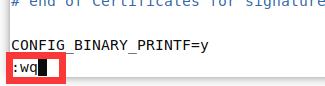
****
#### 六、编译及安装内核  
**使用deb包安装**  
在源码目录`/usr/src/linux-6.2`打开终端，使用make命令`sudo make bindeb-pkg -jn`编译内核，同时借助 `-jn` 加快编译速度。其中，`n`是要生成的作业数，通常的做法是每个处理器产生一个或两个作业，**最多不超过分配总核数的两倍**，也可以用`-j$(nproc)`，可以查看虚拟机硬件配置中的处理器总分配内核数。此阶段比较耗时。 
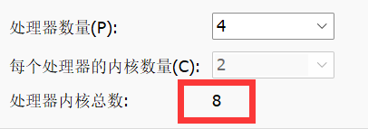   
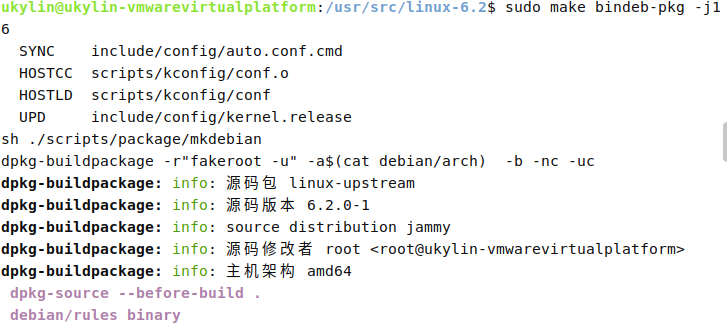  
**执行完成，dbg包不重要，而生成时间长，故手动终止**
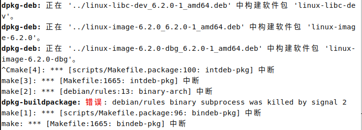
执行完成之后，在源码目录的上层会生成4个文件：  
```
linux-image-6.2.0-dbg_6.2.0-1_amd64.deb
linux-libc-dev_6.2.0-1_amd64.deb
linux-image-6.2.0_6.2.0-1_amd64.deb
linux-headers-6.2.0_6.2.0-1_amd64.deb
```  
**删除dbg包**  
`cd ..`  
`sudo rm linux-image-6.2.0-dbg_6.2.0-1_amd64.deb`

**安装新内核**  
`sudo dpkg -i *.deb`  
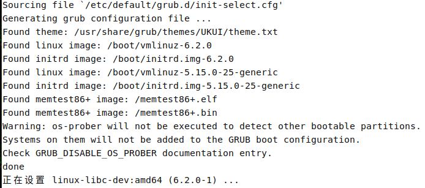  

**更新grub**  
`sudo update-grub`  
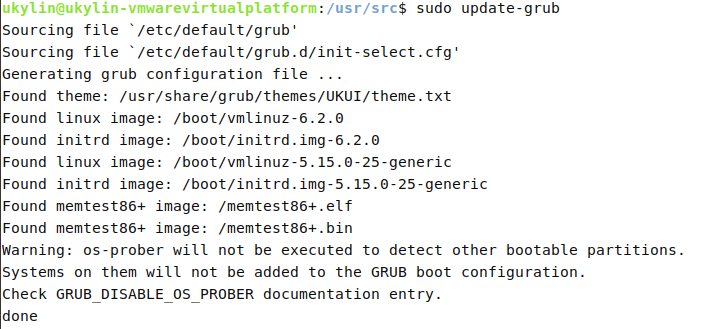  

**重启**  
`sudo reboot now`  

**查看当前内核版本**  
`uname -r`  
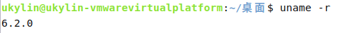  
****
#### 七、内核的切换  
**开机或重启时一直按Shift键，直到出现以下界面**  
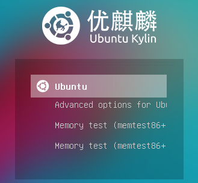  
**向下选择Advanced options**  
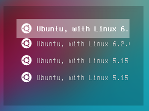  
**选择需要的内核回车启动即可**  


## 编写shell脚本  
### 一、新建文本文件  
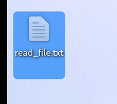  

### 二、编写脚本  
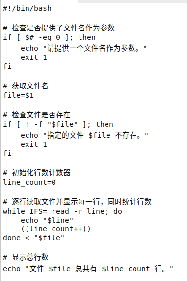  
**改后缀名为sh**  
  

### 三、修改权限  
**在终端输入：** `chmod +x read_file`  
  

### 四、运行脚本  
**测试文件如图**  
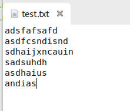  

**运行脚本：** `./read_file.sh test.txt`  
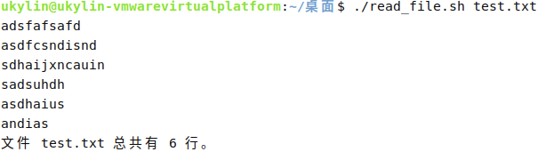

