# 操作系统原理上机试验 1
::: tip 文章信息
Written by [Q-thrive](https://github.com/Qthrive) in 2025.3.27

Reprinted by Bolaxious , Reproduction is permitted by permission
:::
## 添加系统调用
- int Max(int , int, int ) ; 
- int GetPID( ); 
- char * GetCMD( ); 

**修改文件**
- ID：/usr/src/linux-6.2/arch/x86/entry/syscalls/syscall_64.tbl
  
- 系统调用函数声明：/usr/src/linux-6.2/include/linux/syscalls.h
  
- 系统调用：/usr/src/linux-6.2/kernel/sys.c

- ID声明：/usr/src/linux-6.2/include/uapi/asm-generic/unistd.h
> **注意事项：**
> - 本教程在[操作系统课后实践作业1](https://mengbooo.github.io/BemoDB/posts/os/homework/Q_hw_1/Q_hw_1.html)的基础上进行
> - 请确保在原系统内核中进行下列操作
> - 下列操作均在/usr/src/linux-6.2文件夹的终端中进行
> - 插入的代码均在文件底部
> - 在编辑界面`Shift`+`G`可以快速到达文件底部  

#### 一、更新系统调用表  
- **打开syscall_64.tbl**  
  `sudo vim arch/x86/entry/syscalls/syscall_64.tbl`  
- **添加系统调用**  
  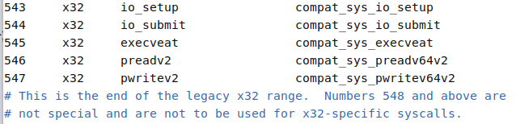
  根据文件内容，可以将调用接在`547`号系统调用后面（使用`insert`）  
  ```c
  548   64  Max            sys_Max
  549   64  GetPID         sys_GetPID
  550   64  GetCMD         sys_GetCMD
  ```  
  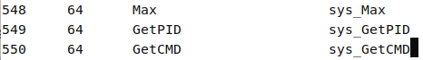  

- **保存文件**  
按下`ESC`再按下`:`输入`wq`回车退出（后续不再赘述）

#### 二、更新头文件（函数声明）  
- **打开syscalls.h**  
  `sudo vim include/linux/syscalls.h`  

- **插入声明**  
  ```c
  asmlinkage long sys_Max(int a,int b,int c);
  asmlinkage long sys_GetPID(void);
  asmlinkage long sys_GetCMD(void);
  ```  
  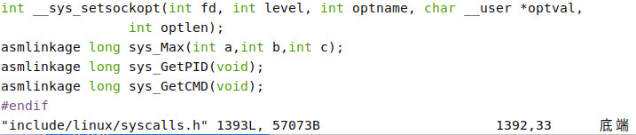
- **保存文件**  
  

#### 三、添加系统调用  
- **打开sys.c**  
  `sudo vim kernel/sys.c`   

- **添加函数**  
  ```c
  SYSCALL_DEFINE3(Max,int,a,int,b,int,c)
  {
    if(a>b) b=a;
    if(b>c) c=b;
    return c;
  }
  SYSCALL_DEFINE0(GetPID)
  {
    return current->pid;
  }
  SYSCALL_DEFINE0(GetCMD)
  {
    printk("Program:%s\n" , current ->comm) ;
    return 0;
  }
  ```
  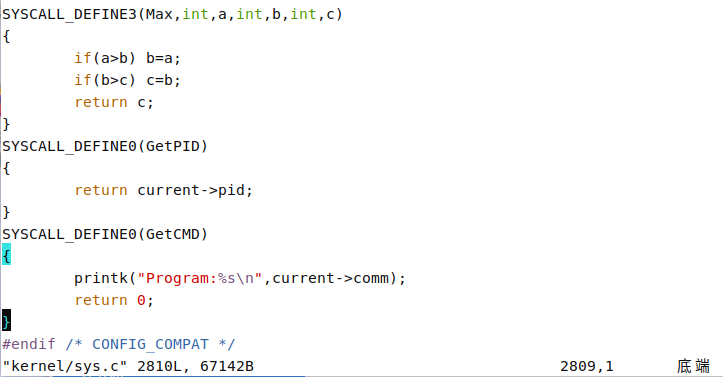

- **保存文件**  

#### 四、更新ID声明  
- **打开unistd.h**  
  `sudo vim include/uapi/asm-generic/unistd.h`   
- **添加声明**  
  ```c
  #define __NR_Max 548
  SYSCALL(__NR_Max, sys_Max)

  #define __NR_GetPID 549
  SYSCALL(__NR_GetPID, sys_GetPID)

  #define __NR_GetCMD 550
  SYSCALL(__NR_GetCMD, sys_GetCMD)
  ```
  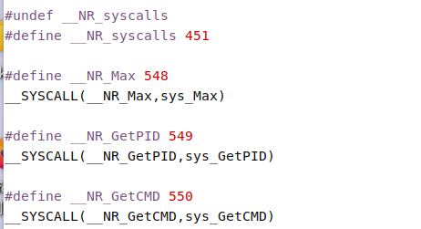


#### 五、再次编译
- **清除旧编译文件**  
  ```shell
  sudo make mrproper
  sudo make clean
  sudo make menuconfig
  ```
  完成后直接保存退出
- **检查`.config`文件**  
  `sudo vim .config`
  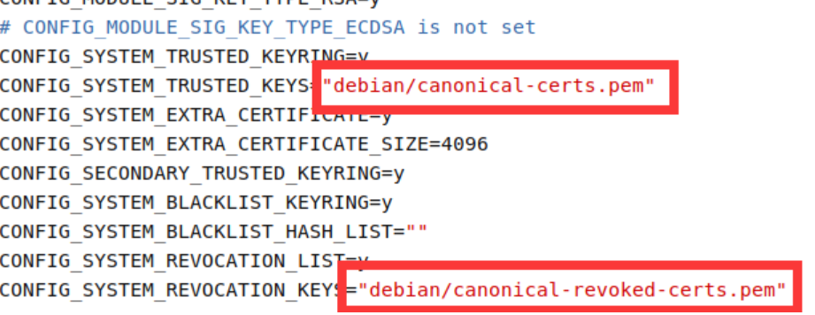  
  发现此处引号有内容，需要清除，然后保存（没有的话直接退出）

- **安装模块**  
  `sudo make modules_install`  

#### 六、清除旧内核文件  
- **检查内核文件**  
  `ls /boot`  
  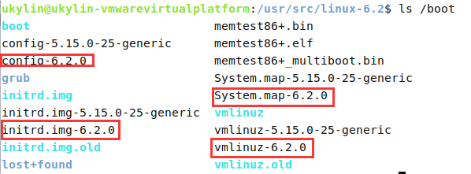  
- **删除旧内核文件**  
  `sudo rm /boot/config-6.2.0 /boot/initrd.img-6.2.0 /boot/System.map-6.2.0 /boot/vmlinuz-6.2.0`  
  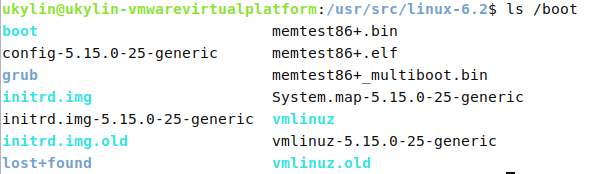  
#### 七、使用新内核  
- **安装内核**
  `sudo make install`  
  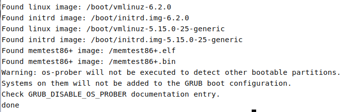
- **更新引导程序**  
  `sudo update-grub`  
- **重启**  
  `sudo reboot now`  
- **检查当前内核**  
  在桌面打开终端
  `uname -r`  
  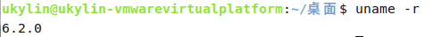
> 如果重启后不是新内核，请再次重启，并在重启过程中一直按`ESC`键，直到出现如下界面  
> 
> 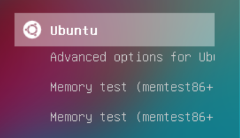  
> 向下选择Advanced options  
> 
> 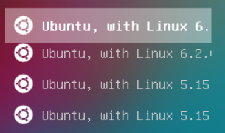  
> 然后选择新内核回车启动即可

#### 八、测试新增的系统调用
- **创建文件**  
  仍在桌面终端进行  
  `sudo vim test.c`
- **`insert`输入**
  ```c
  #include <unistd.h>
  #include <sys/syscall.h>
  #include <stdio. h>
  int main()
  {
    long a,b;

    a = syscall(548,8,95,56) ;
    printf("8 95 56中的最大值是: %ld\n",a);

    b = syscall(549);
    printf("当前进程id: %ld\n",b);

    syscall(550); // 由于printk，此处不会在终端输出
  }
  ```  
  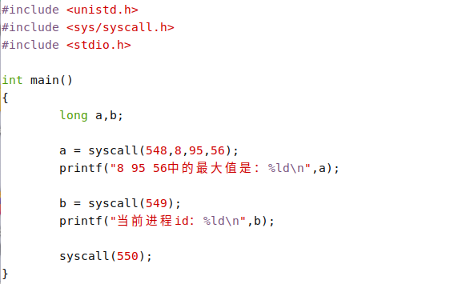
- **编译运行**  
  ```
  sudo gcc -o test test.c 
  sudo ./test
  ```  
  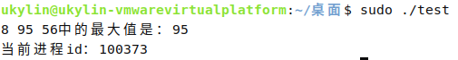  
- **查看程序名称**  
  `sudo dmesg -wH | grep "test"`  
  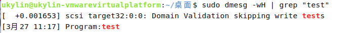  

#### 九、可能出现的错误  
- **内核安装失败**  
  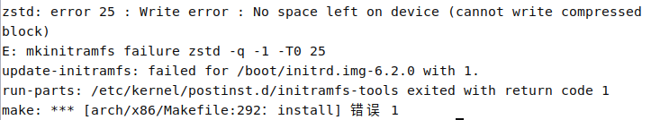  
  **解决方式**  
  > 先删除旧内核文件后再安装
- **没有规则可制作目标**  
  
  **解决方式**  
  > 删除`.config`文件中的两处引号内容  
  >   


## 编写“算命大师”脚本程序
- **写入脚本** 
  `sudo vim fortune.sh`   
  ```bash
  #!/bin/bash

  # 设置颜色
  RED='\033[0;31m'
  GREEN='\033[0;32m'
  YELLOW='\033[0;33m'
  NC='\033[0m' # 无颜色

  # 生肖数组（按顺序对应0-11）
  zodiac_animals=("猴" "鸡" "狗" "猪" "鼠" "牛" "虎" "兔" "龙" "蛇" "马" "羊")

  # 星座日期范围
  constellations=(
      "摩羯座:12-22,1-19"   "水瓶座:1-20,2-18"   "双鱼座:2-19,3-20"
      "白羊座:3-21,4-19"    "金牛座:4-20,5-20"   "双子座:5-21,6-21"
      "巨蟹座:6-22,7-22"    "狮子座:7-23,8-22"   "处女座:8-23,9-22"
      "天秤座:9-23,10-23"   "天蝎座:10-24,11-22" "射手座:11-23,12-21"
  )

  # 欢迎界面
  echo -e "${YELLOW}***********************************************"
  echo "          欢迎来到算命大师 v1.0"
  echo "  输入格式：YYYY-MM-DD 或 YYYY/MM/DD 或 YYYYMMDD"
  echo "          输入exit退出程序"
  echo -e "***********************************************${NC}"

  # 日期验证函数
  validate_date() {
      local date_str=$1
      # 支持多种分隔符和纯数字格式
      if [[ $date_str =~ ^([0-9]{4})([-/]?)([0-9]{2})\2([0-9]{2})$ ]]; then
          year=${BASH_REMATCH[1]}
          month=${BASH_REMATCH[3]}
          day=${BASH_REMATCH[4]}
      elif [[ $date_str =~ ^[0-9]{8}$ ]]; then
          year=${date_str:0:4}
          month=${date_str:4:2}
          day=${date_str:6:2}
      else
          return 1
      fi

      # 检查月份范围
      if ! ((1 <= 10#$month && 10#$month <= 12)); then
          return 1
      fi

      # 检查日期范围
      local max_day
      case $month in
          04|06|09|11) max_day=30 ;;
          1)  
              # 简单闰年判断（可扩展）
              if (( (year % 4 == 0 && year % 100 != 0) || year % 400 == 0 )); then
                  max_day=29
              else
                  max_day=28
              fi
              ;;
          *) max_day=31 ;;
      esac

      ((1 <= 10#$day && 10#$day <= max_day)) || return 1
      return 0
  }

  # 主循环
  while true; do
      read -p "请输入出生日期（格式：YYYY-MM-DD，输入exit退出）： " input

      # 退出条件
      if [[ $input == exit ]]; then
          echo -e "${GREEN}感谢使用，祝您好运！${NC}"
          break
      fi

      # 验证日期
      if ! validate_date "$input"; then
          echo -e "${RED}错误：无效的日期格式或日期不存在，请重新输入！${NC}"
          continue
      fi

      # 计算生肖
      zodiac_index=$((year % 12))
      zodiac=${zodiac_animals[$zodiac_index]}

      # 计算星座
      for const in "${constellations[@]}"; do
          name=${const%%:*}
          dates=${const#*:}
          start_date=${dates%,*}
          end_date=${dates#*,}
          
          # 解析开始日期
          start_month=${start_date%-*}
          start_day=${start_date#*-}
          # 解析结束日期
          end_month=${end_date%-*}
          end_day=${end_date#*-}

          # 处理跨年星座（如摩羯座）
          if [[ $start_month -gt $end_month ]]; then
              if (( (month > start_month || (month == start_month && day >= start_day)) || 
                    (month < end_month || (month == end_month && day <= end_day)) )); then
                  constellation=$name
                  break
              fi
          else
              if (( (month > start_month || (month == start_month && day >= start_day)) && 
                    (month < end_month || (month == end_month && day <= end_day)) )); then
                  constellation=$name
                  break
              fi
          fi
      done

      # 显示结果
      echo -e "\n${YELLOW}***********************************************"
      echo -e "  出生日期：${year}年${month}月${day}日"
      echo -e "  生肖属相：${GREEN}${zodiac}${NC}"
      echo -e "  星座运势：${GREEN}${constellation}${NC}"
      echo -e "***********************************************${NC}\n"
  done
  ```
- **添加执行权限**  
  `chmod +x fortune.sh`
- **运行脚本**  
  `./fortune.sh`  
  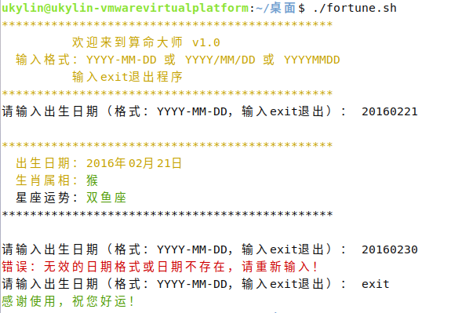

## 编写“算命大师”bat批处理程序  
- **新建文件**  
  在桌面新建`fortune.txt`  
  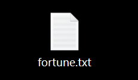  
- **写入脚本**  
  ```bat
  @echo off
  chcp 65001 >nul
  setlocal enabledelayedexpansion

  :START
  echo =========================================
  echo          欢迎使用算命大师
  echo =========================================
  echo 请按格式输入您的出生日期（示例：1990-01-01）
  echo -----------------------------------------

  set "input="
  set /p "input=请输入出生日期(exit退出): "

  REM 检查是否退出
  if /i "!input!"=="exit" (
      echo 感谢使用算命大师，再见！
      timeout /t 2 >nul
      exit /b
  )

  REM 验证日期格式是否正确
  echo !input!| findstr /r "^[0-9][0-9][0-9][0-9]-[0-1][0-9]-[0-3][0-9]$" >nul
  if %errorlevel% neq 0 (
      echo 输入格式错误！请使用YYYY-MM-DD格式
      goto :ERROR
  )

  REM 分解年月日
  for /f "tokens=1,2,3 delims=-" %%a in ("!input!") do (
      set "year=%%a"
      set "month=%%b"
      set "day=%%c"
  )

  REM 转换为数值并去掉前导零
  set /a year=!year!
  set /a month=1!month!-100
  set /a day=1!day!-100

  REM 检查基本范围
  if !month! lss 1 (
      echo 月份必须在1-12之间！
      goto :ERROR
  )
  if !month! gtr 12 (
      echo 月份必须在1-12之间！
      goto :ERROR
  )

  if !day! lss 1 (
      echo 日期超出范围！
      goto :ERROR
  )
  if !day! gtr 31 (
      echo 日期超出范围！
      goto :ERROR
  )

  REM 检查闰年
  set /a "leap=0"
  set /a "y4=year%%4"
  set /a "y100=year%%100"
  set /a "y400=year%%400"
  if !y4! equ 0 if !y100! neq 0 set /a "leap=1"
  if !y400! equ 0 set /a "leap=1"

  REM 检查每月天数
  set "maxday=31"
  if !month! equ 4 set "maxday=30"
  if !month! equ 6 set "maxday=30"
  if !month! equ 9 set "maxday=30"
  if !month! equ 11 set "maxday=30"
  if !month! equ 2 (
      if !leap! equ 1 (
          set "maxday=29"
      ) else (
          set "maxday=28"
      )
  )

  if !day! gtr !maxday! (
      echo 此月份只有!maxday!天，输入日期无效！
      goto :ERROR
  )

  REM 计算属相
  set /a shuxiang=(year-1900)%%12
  if !shuxiang!==0 set "animal=鼠"
  if !shuxiang!==1 set "animal=牛"
  if !shuxiang!==2 set "animal=虎"
  if !shuxiang!==3 set "animal=兔"
  if !shuxiang!==4 set "animal=龙"
  if !shuxiang!==5 set "animal=蛇"
  if !shuxiang!==6 set "animal=马"
  if !shuxiang!==7 set "animal=羊"
  if !shuxiang!==8 set "animal=猴"
  if !shuxiang!==9 set "animal=鸡"
  if !shuxiang!==10 set "animal=狗"
  if !shuxiang!==11 set "animal=猪"

  REM 计算星座
  if !month!==1  if !day! leq 20 set "xingzuo=摩羯座"
  if !month!==1  if !day! geq 21 set "xingzuo=水瓶座"
  if !month!==2  if !day! leq 19 set "xingzuo=水瓶座"
  if !month!==2  if !day! geq 20 set "xingzuo=双鱼座"
  if !month!==3  if !day! leq 20 set "xingzuo=双鱼座"
  if !month!==3  if !day! geq 21 set "xingzuo=白羊座"
  if !month!==4  if !day! leq 20 set "xingzuo=白羊座"
  if !month!==4  if !day! geq 21 set "xingzuo=金牛座"
  if !month!==5  if !day! leq 21 set "xingzuo=金牛座"
  if !month!==5  if !day! geq 22 set "xingzuo=双子座"
  if !month!==6  if !day! leq 21 set "xingzuo=双子座"
  if !month!==6  if !day! geq 22 set "xingzuo=巨蟹座"
  if !month!==7  if !day! leq 22 set "xingzuo=巨蟹座"
  if !month!==7  if !day! geq 23 set "xingzuo=狮子座"
  if !month!==8  if !day! leq 23 set "xingzuo=狮子座"
  if !month!==8  if !day! geq 24 set "xingzuo=处女座"
  if !month!==9  if !day! leq 23 set "xingzuo=处女座"
  if !month!==9  if !day! geq 24 set "xingzuo=天秤座"
  if !month!==10 if !day! leq 23 set "xingzuo=天秤座"
  if !month!==10 if !day! geq 24 set "xingzuo=天蝎座"
  if !month!==11 if !day! leq 22 set "xingzuo=天蝎座"
  if !month!==11 if !day! geq 23 set "xingzuo=射手座"
  if !month!==12 if !day! leq 21 set "xingzuo=射手座"
  if !month!==12 if !day! geq 22 set "xingzuo=摩羯座"

  REM 显示结果
  echo.
  echo =========================================
  echo            算命大师结果
  echo =========================================
  echo 出生日期：!input!
  echo 您的属相：!animal!
  echo 您的星座：!xingzuo!
  echo =========================================
  echo 按任意键继续算命...
  pause >nul
  goto :START

  :ERROR
  echo 按任意键继续...
  pause >nul
  goto :START
  ```
- **保存**  
  `CTRL`+`S`并修改文件后缀为`bat`  
  
- **双击运行**  
  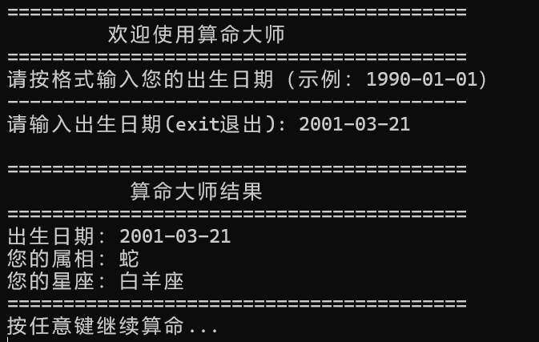
  
