# 操作系统原理上机试验 2
::: tip 文章信息
Written by [Q-thrive](https://github.com/Qthrive) in 2025.4.8

Reprinted by Bolaxious , Reproduction is permitted by permission
:::
> **注意：**
> 涉及到编译内核的部分，由于之前做过两次实验，笔者写得比较简略，具体可参考前两篇内容  
> [操作系统课后实践作业 1](https://mengbooo.github.io/BemoDB/posts/os/homework/Q_hw_1/Q_hw_1.html)  
> [操作系统原理上机试验 1](https://mengbooo.github.io/BemoDB/posts/os/experiment/Q_ex_1/sys-1.html)

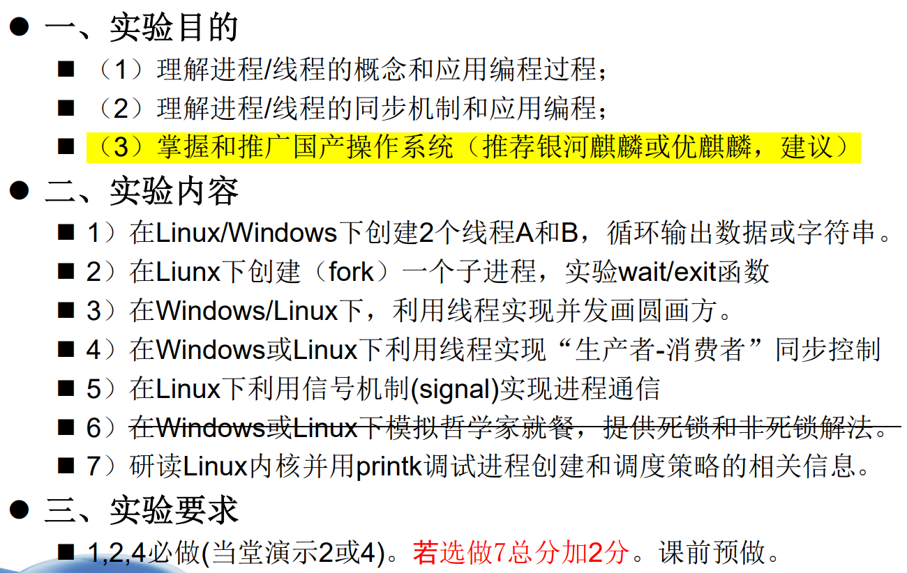

### 一、创建线程循环输出数据  

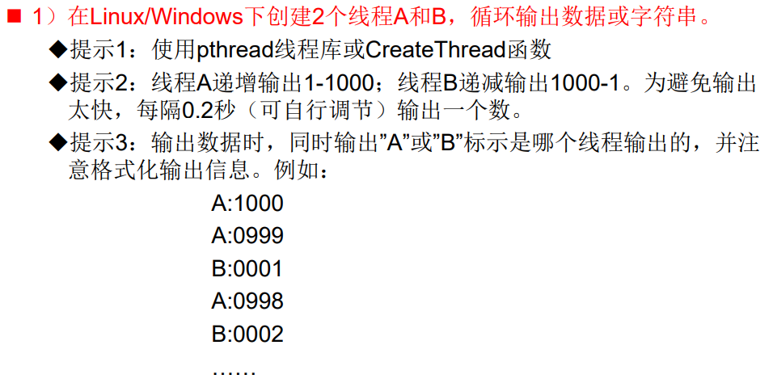
- 创建代码文件
    ```c
    #include <stdio.h>
    #include <pthread.h>
    #include <unistd.h>

    // 线程 A 的函数
    void* threadA(void* arg) {
        for (int i = 1; i <= 1000; i++) {
            printf("A:%04d\n", i);
            fflush(stdout);
            usleep(200000); // 暂停 0.2 秒
        }
        return NULL;
    }

    // 线程 B 的函数
    void* threadB(void* arg) {
        for (int i = 1000; i >= 1; i--) {
            printf("B:%04d\n", i);
            fflush(stdout);
            usleep(200000); // 暂停 0.2 秒
        }
        return NULL;
    }

    int main() {
        pthread_t thread_a, thread_b;

        // 创建线程 A
        if (pthread_create(&thread_a, NULL, threadA, NULL) != 0) {
            perror("pthread_create A");
            return 1;
        }

        // 创建线程 B
        if (pthread_create(&thread_b, NULL, threadB, NULL) != 0) {
            perror("pthread_create B");
            return 1;
        }

        // 等待线程 A 结束
        if (pthread_join(thread_a, NULL) != 0) {
            perror("pthread_join A");
            return 1;
        }

        // 等待线程 B 结束
        if (pthread_join(thread_b, NULL) != 0) {
            perror("pthread_join B");
            return 1;
        }

        return 0;
    }    
    ```

- 运行代码观察输出  
 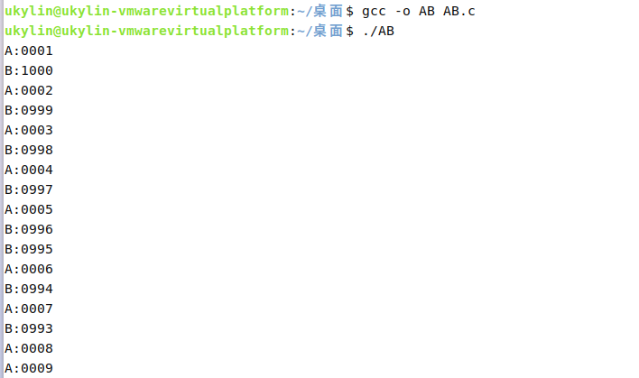

### 二、fork函数  
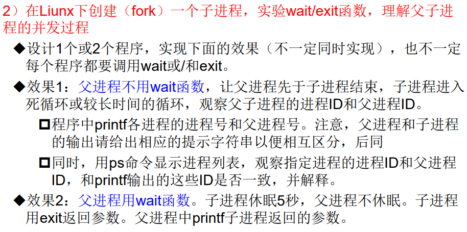
#### 1. 父进程不用wait函数  
- 写入代码  
    ```c
    #include <stdio.h>
    #include <unistd.h>
    #include <sys/types.h>

    int main() {
        pid_t pid = fork();

        if (pid < 0) {
            perror("fork");
            return 1;
        } else if (pid == 0) {
            // 子进程
            printf("子进程: 进程 ID = %d, 父进程 ID = %d\n", getpid(), getppid());
            while (1) {
                // 死循环
                sleep(1);
            }
        } else {
            // 父进程
            printf("父进程: 进程 ID = %d, 子进程 ID = %d\n", getpid(), pid);
        }

        return 0;
    }    
    ```

- 运行观察结果  
  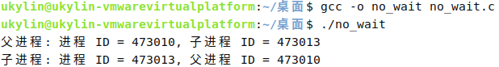  
  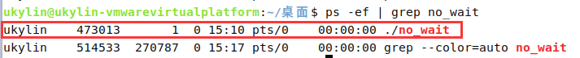

- **解释**  
      
    **父进程刚创建子进程时** ：在 `printf` 输出中，父进程会打印自己的进程 ID 以及子进程的进程 ID，子进程会打印自己的进程 ID 和父进程的进程 ID。此时使用 `ps -ef` 命令查看进程列表，这些 ID 是一致的。因为在这个时刻，子进程的父进程就是创建它的父进程，`getppid()` 函数获取的就是创建它的父进程的 ID。 

    **父进程结束后** ：父进程结束后，子进程会变成孤儿进程，此时使用 `ps -ef` 命令查看子进程的父进程 ID 会发现它变为了 1（`init` 进程的 ID）。而子进程之前通过 `getppid()` 打印的父进程 ID 是创建它的父进程的 ID，这就产生了不一致。原因是当父进程先于子进程结束时，子进程会被 `init` 进程收养，`init` 进程会成为子进程新的父进程。


#### 2. 父进程使用wait函数  
- 写入代码
    ```c
    #include <stdio.h>
    #include <unistd.h>
    #include <sys/types.h>
    #include <sys/wait.h>

    int main() {
        pid_t pid = fork();

        if (pid < 0) {
            perror("fork");
            return 1;
        } else if (pid == 0) {
            // 子进程
            printf("子进程: 进程 ID = %d, 父进程 ID = %d\n", getpid(), getppid());
            sleep(5);
            exit(123);
        } else {
            // 父进程
            printf("父进程: 进程 ID = %d, 子进程 ID = %d\n", getpid(), pid);
            int status;
            wait(&status);
            if (WIFEXITED(status)) {
                printf("父进程: 子进程返回的参数是 %d\n", WEXITSTATUS(status));
            }
        }

        return 0;
    }    
    ```

- 运行观察结果  
  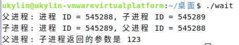  

  下一步的命令要在**新的终端**中输入，并且要在子进程休眠的**5秒内运行**

  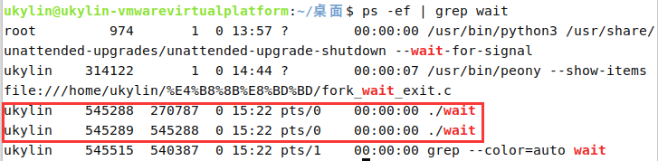  
- **解释**  
  
    **子进程运行期间** ：在子进程休眠的 5 秒内，使用 `ps -ef` 命令查看进程列表，子进程的进程 ID 和父进程 ID 与 `printf` 输出的是一致的。因为在子进程结束之前，它的父进程一直是创建它的父进程，`getppid()` 函数获取的就是正确的父进程 ID。 

    **子进程结束后** ：子进程结束后，它会从进程列表中消失，所以此时无法再通过 `ps -ef` 命令查看子进程的信息。而父进程会通过 `wait` 函数获取子进程的退出状态并打印子进程返回的参数。整个过程中，只要子进程存在，其进程 ID 和父进程 ID 的信息在 `printf` 输出和 `ps -ef` 命令的输出中是一致的。
  

### 三、生产者-消费者  
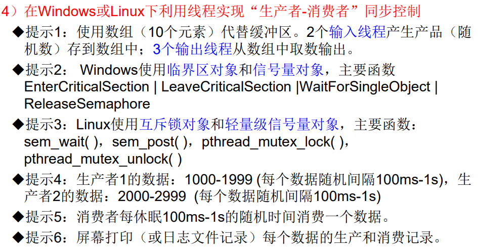  
- 编写代码  
    ```c
    #include <stdio.h>
    #include <stdlib.h>
    #include <pthread.h>
    #include <semaphore.h>
    #include <unistd.h>
    #include <time.h>

    #define BUFFER_SIZE 10

    // 缓冲区
    int buffer[BUFFER_SIZE];
    // 缓冲区索引
    int in = 0;
    int out = 0;
    // 互斥锁
    pthread_mutex_t mutex;
    // 信号量
    sem_t empty;
    sem_t full;

    // 生产者 1 线程函数
    void* producer1(void* arg) {
        int data = 1000;
        while (data <= 1999) {
            // 随机休眠 100ms - 1s
            int sleep_time = (rand() % 900 + 100) * 1000;
            usleep(sleep_time);

            sem_wait(&empty);
            pthread_mutex_lock(&mutex);

            buffer[in] = data;
            printf("生产者 1 生产数据: %d\n", data);
            in = (in + 1) % BUFFER_SIZE;

            pthread_mutex_unlock(&mutex);
            sem_post(&full);

            data++;
        }
        return NULL;
    }

    // 生产者 2 线程函数
    void* producer2(void* arg) {
        int data = 2000;
        while (data <= 2999) {
            // 随机休眠 100ms - 1s
            int sleep_time = (rand() % 900 + 100) * 1000;
            usleep(sleep_time);

            sem_wait(&empty);
            pthread_mutex_lock(&mutex);

            buffer[in] = data;
            printf("生产者 2 生产数据: %d\n", data);
            in = (in + 1) % BUFFER_SIZE;

            pthread_mutex_unlock(&mutex);
            sem_post(&full);

            data++;
        }
        return NULL;
    }

    // 消费者线程函数
    void* consumer(void* arg) {
        while (1) {
            // 随机休眠 100ms - 1s
            int sleep_time = (rand() % 900 + 100) * 1000;
            usleep(sleep_time);

            sem_wait(&full);
            pthread_mutex_lock(&mutex);

            int data = buffer[out];
            printf("消费者消费数据: %d\n", data);
            out = (out + 1) % BUFFER_SIZE;

            pthread_mutex_unlock(&mutex);
            sem_post(&empty);
        }
        return NULL;
    }

    int main() {
        srand(time(NULL));

        // 初始化互斥锁和信号量
        pthread_mutex_init(&mutex, NULL);
        sem_init(&empty, 0, BUFFER_SIZE);
        sem_init(&full, 0, 0);

        // 创建线程
        pthread_t producer_thread1, producer_thread2;
        pthread_t consumer_thread1, consumer_thread2, consumer_thread3;

        pthread_create(&producer_thread1, NULL, producer1, NULL);
        pthread_create(&producer_thread2, NULL, producer2, NULL);
        pthread_create(&consumer_thread1, NULL, consumer, NULL);
        pthread_create(&consumer_thread2, NULL, consumer, NULL);
        pthread_create(&consumer_thread3, NULL, consumer, NULL);

        // 等待线程结束
        pthread_join(producer_thread1, NULL);
        pthread_join(producer_thread2, NULL);
        // 由于消费者线程是无限循环，这里可以手动终止程序

        // 销毁互斥锁和信号量
        pthread_mutex_destroy(&mutex);
        sem_destroy(&empty);
        sem_destroy(&full);

        return 0;
    }    
    ```

- 编译运行  
  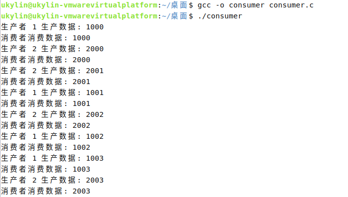
  

### 四、哲学家就餐  
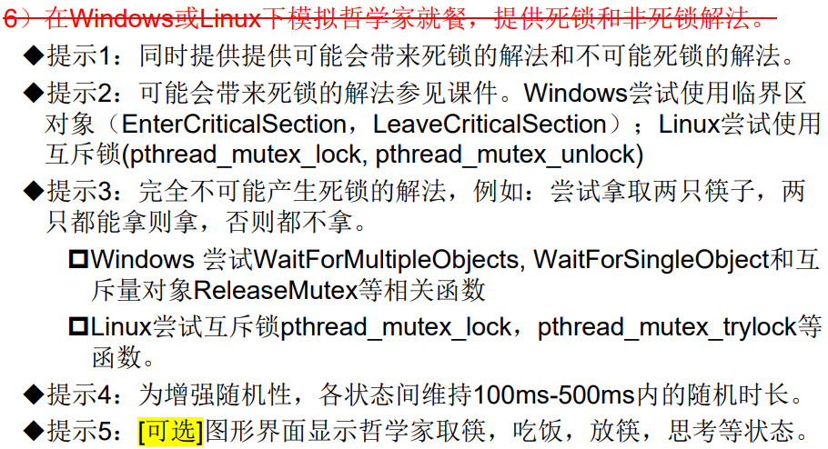  

#### 1. 可能死锁方案  
- 写入代码  
    ```c
        #include <stdio.h>
    #include <pthread.h>
    #include <unistd.h>
    #include <stdlib.h>
    #include <time.h>

    #define N 5

    pthread_mutex_t chopsticks[N];

    // 随机睡眠 100ms - 500ms
    void random_sleep() {
        int ms = rand() % 401 + 100;
        usleep(ms * 1000);
    }

    // 哲学家线程函数
    void* philosopher(void* num) {
        int id = *(int*)num;
        int left = id;
        int right = (id + 1) % N;

        while (1) {
            printf("哲学家 %d 正在思考\n", id);
            random_sleep();

            printf("哲学家 %d 饿了，尝试拿起筷子\n", id);
            pthread_mutex_lock(&chopsticks[left]);
            printf("哲学家 %d 拿起了左边的筷子\n", id);
            pthread_mutex_lock(&chopsticks[right]);
            printf("哲学家 %d 拿起了右边的筷子，开始就餐\n", id);

            random_sleep();

            pthread_mutex_unlock(&chopsticks[right]);
            printf("哲学家 %d 放下了右边的筷子\n", id);
            pthread_mutex_unlock(&chopsticks[left]);
            printf("哲学家 %d 放下了左边的筷子，结束就餐\n", id);
        }
        return NULL;
    }

    int main() {
        srand(time(NULL));
        pthread_t threads[N];
        int ids[N];

        // 初始化互斥锁
        for (int i = 0; i < N; i++) {
            pthread_mutex_init(&chopsticks[i], NULL);
        }

        // 创建哲学家线程
        for (int i = 0; i < N; i++) {
            ids[i] = i;
            pthread_create(&threads[i], NULL, philosopher, &ids[i]);
        }

        // 等待线程结束（这里不会结束）
        for (int i = 0; i < N; i++) {
            pthread_join(threads[i], NULL);
        }

        // 销毁互斥锁
        for (int i = 0; i < N; i++) {
            pthread_mutex_destroy(&chopsticks[i]);
        }

        return 0;
    }    
    ```

- 运行结果  
  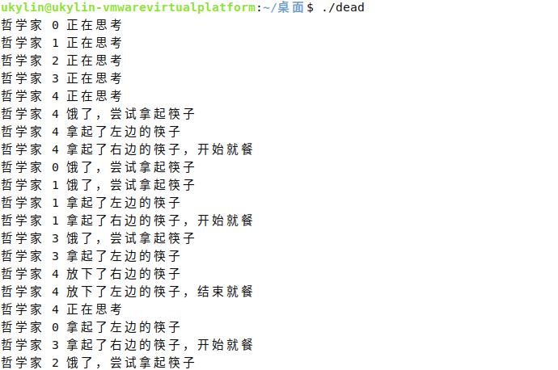
  想要观察到死锁，可能需要等待很长时间，因此下面修改代码，使得必然发生死锁，观察效果

#### 2. 必然死锁方案  
- 代码
    ```c
    #include <stdio.h>
    #include <pthread.h>
    #include <unistd.h>
    #include <stdlib.h>
    #include <time.h>

    #define N 5

    pthread_mutex_t chopsticks[N];
    pthread_mutex_t start_mutex;

    // 哲学家线程函数
    void* philosopher(void* num) {
        int id = *(int*)num;
        int left = id;
        int right = (id + 1) % N;

        // 等待所有线程都准备好
        pthread_mutex_lock(&start_mutex);
        pthread_mutex_unlock(&start_mutex);

        while (1) {
            printf("哲学家 %d 饿了，尝试拿起筷子\n", id);
            pthread_mutex_lock(&chopsticks[left]);
            printf("哲学家 %d 拿起了左边的筷子\n", id);
            pthread_mutex_lock(&chopsticks[right]);
            printf("哲学家 %d 拿起了右边的筷子，开始就餐\n", id);

            // 模拟就餐时间
            sleep(1);

            pthread_mutex_unlock(&chopsticks[right]);
            printf("哲学家 %d 放下了右边的筷子\n", id);
            pthread_mutex_unlock(&chopsticks[left]);
            printf("哲学家 %d 放下了左边的筷子，结束就餐\n", id);
        }
        return NULL;
    }

    int main() {
        pthread_t threads[N];
        int ids[N];

        // 初始化互斥锁
        for (int i = 0; i < N; i++) {
            pthread_mutex_init(&chopsticks[i], NULL);
        }
        pthread_mutex_init(&start_mutex, NULL);
        pthread_mutex_lock(&start_mutex);

        // 创建哲学家线程
        for (int i = 0; i < N; i++) {
            ids[i] = i;
            pthread_create(&threads[i], NULL, philosopher, &ids[i]);
        }

        // 释放锁，让所有线程同时开始
        pthread_mutex_unlock(&start_mutex);

        // 等待线程结束（这里不会结束）
        for (int i = 0; i < N; i++) {
            pthread_join(threads[i], NULL);
        }

        // 销毁互斥锁
        for (int i = 0; i < N; i++) {
            pthread_mutex_destroy(&chopsticks[i]);
        }
        pthread_mutex_destroy(&start_mutex);

        return 0;
    }    
    ```
- **实现原理**  
  **消除随机性**，让所有哲学家**同时拿起**左边的筷子，然后都等待右边的筷子，从而形成死锁。 

- 运行效果  
  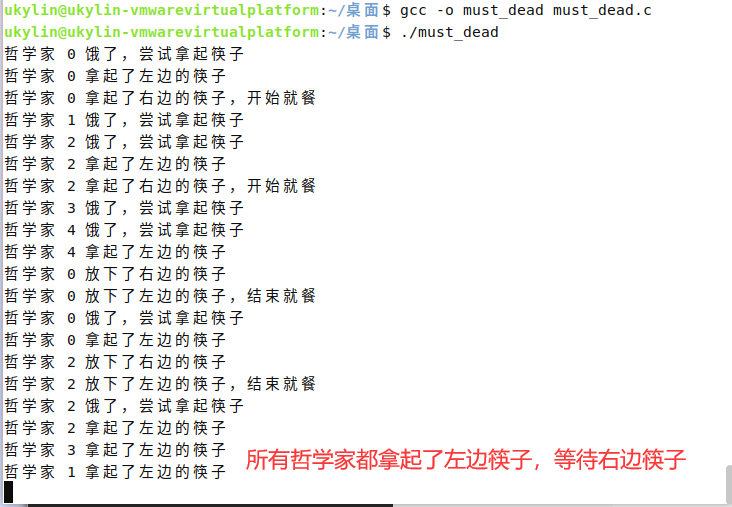
  
#### 3. 不可能死锁方案  
- 写入代码  
    ```c
    #include <stdio.h>
    #include <pthread.h>
    #include <unistd.h>
    #include <stdlib.h>
    #include <time.h>

    #define N 5

    pthread_mutex_t chopsticks[N];

    // 随机睡眠 100ms - 500ms
    void random_sleep() {
        int ms = rand() % 401 + 100;
        usleep(ms * 1000);
    }

    // 哲学家线程函数
    void* philosopher(void* num) {
        int id = *(int*)num;
        int left = id;
        int right = (id + 1) % N;

        while (1) {
            printf("哲学家 %d 正在思考\n", id);
            random_sleep();

            printf("哲学家 %d 饿了，尝试拿起筷子\n", id);
            if (pthread_mutex_trylock(&chopsticks[left]) == 0) {
                if (pthread_mutex_trylock(&chopsticks[right]) == 0) {
                    printf("哲学家 %d 拿起了两只筷子，开始就餐\n", id);
                    random_sleep();
                    pthread_mutex_unlock(&chopsticks[right]);
                    printf("哲学家 %d 放下了右边的筷子\n", id);
                } else {
                    pthread_mutex_unlock(&chopsticks[left]);
                    continue;
                }
                pthread_mutex_unlock(&chopsticks[left]);
                printf("哲学家 %d 放下了左边的筷子，结束就餐\n", id);
            }
        }
        return NULL;
    }

    int main() {
        srand(time(NULL));
        pthread_t threads[N];
        int ids[N];

        // 初始化互斥锁
        for (int i = 0; i < N; i++) {
            pthread_mutex_init(&chopsticks[i], NULL);
        }

        // 创建哲学家线程
        for (int i = 0; i < N; i++) {
            ids[i] = i;
            pthread_create(&threads[i], NULL, philosopher, &ids[i]);
        }

        // 等待线程结束（这里不会结束）
        for (int i = 0; i < N; i++) {
            pthread_join(threads[i], NULL);
        }

        // 销毁互斥锁
        for (int i = 0; i < N; i++) {
            pthread_mutex_destroy(&chopsticks[i]);
        }

        return 0;
    }    
    ```
- 运行结果  
  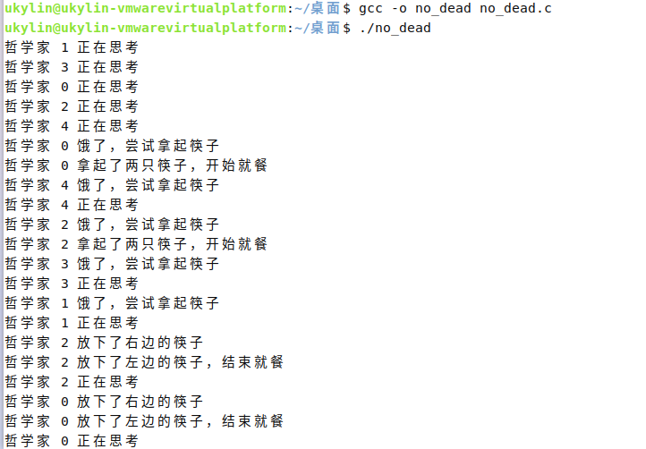  

### 五、printk调试内核  
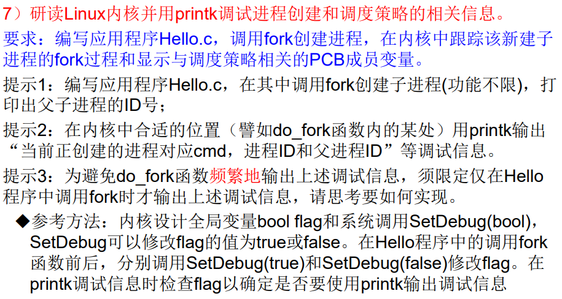  

#### 1、更新系统调用表  
- **打开syscall_64.tbl**  
  `sudo vim arch/x86/entry/syscalls/syscall_64.tbl`  
- **添加系统调用**  
  
  根据文件内容，可以将调用接在`547`号系统调用后面（使用`insert`）  
  ```c
  548   64  SetDebug          sys_SetDebug
  ```  
  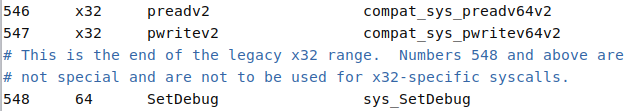  

- **保存文件**  
按下`ESC`再按下`:`输入`wq`回车退出（后续不再赘述）

#### 2、更新头文件（函数声明）  
- **打开syscalls.h**  
  `sudo vim include/linux/syscalls.h`  

- **插入声明**  
  ```c
  asmlinkage long sys_SetDebug(int flag);
  ```  
  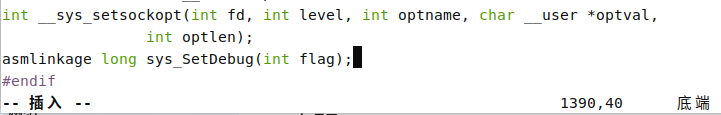
- **保存文件**  
  

#### 3、添加系统调用  
- **打开sys.c**  
  `sudo vim kernel/sys.c`   

- **添加函数**  
    ```c
    bool flag = false;

    SYSCALL_DEFINE1(SetDebug, int, value) {
        flag = (value != 0);
        return 0;
    }
    ```
  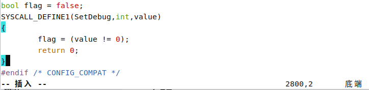

- **保存文件**  

#### 4、更新ID声明  
- **打开unistd.h**  
  `sudo vim include/uapi/asm-generic/unistd.h`   
- **添加声明**  
    ```c
    #define __NR_SetDebug 548
    SYSCALL(__NR_SetDebug, sys_SetDebug)
    ```
  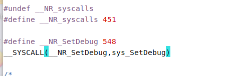

#### 5、修改fork.c文件  
- **打开fork.c**  
  `sudo vim kernel/fork.c`  
- **增加调试信息**（`copy_process`函数，在`return p;`之前）  
    ```c
    extern bool flag; // 文件开头

    // ···中间代码

    if (flag) {
        printk(KERN_INFO "当前正创建的进程对应 cmd: %s, 进程 ID: %d, 父进程 ID: %d\n",
               p->comm, task_pid_nr(p), task_pid_nr(p->parent));
        printk(KERN_INFO "调度策略: %d\n", p->policy);
        printk(KERN_INFO "静态优先级: %d\n", p->static_prio);
        printk(KERN_INFO "正常优先级: %d\n", p->normal_prio);
        printk(KERN_INFO "实时优先级: %d\n", p->rt_priority);
    }
    ```  
    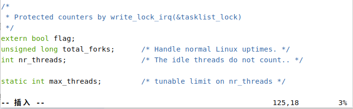  
    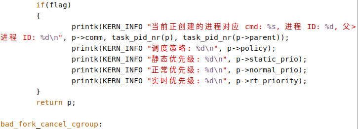

- **可能出现的错误**  
  如果`extern bool flag;`直接放在`if(flag)`之前，可能会出现以下警告  
  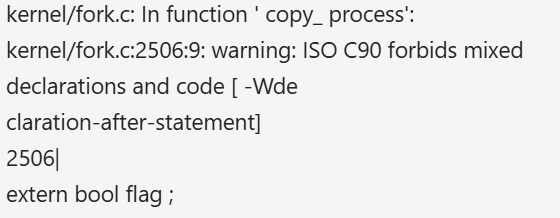    
  **原因：**  
  在代码里存在**混合声明和代码**的情况，而 ISO C90 标准不允许这么做。在 ISO C90 标准中，变量声明必须放在代码块的开头部分，不能穿插在可执行代码之间。

#### 6、重新编译并安装内核
- **编译**  
  `sudo make -j16`（基于8核处理器）  

- **安装模块**  
  `sudo make modules_install`  

- **检查旧内核文件**  
  `ls /boot`  
  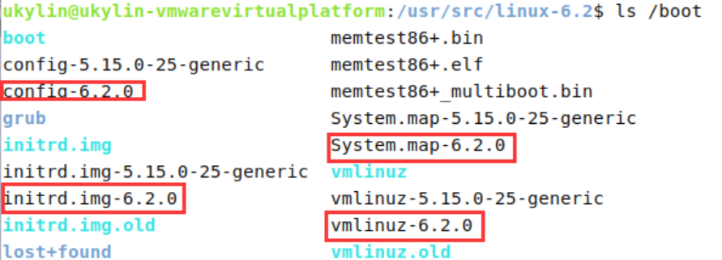  

- **删除旧内核文件**  
  `sudo rm /boot/config-6.2.0 /boot/initrd.img-6.2.0 /boot/System.map-6.2.0 /boot/vmlinuz-6.2.0`  
  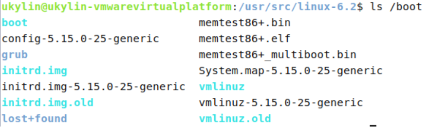  

- **安装内核**  
  `sudo make install`  
  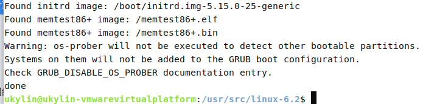

- **更新引导程序**  
  `sudo update-grub`  

- **重启**  
  `sudo reboot now`  

#### 7、编写用户空间程序hello.c  
- **代码**  
    ```c
    #include <stdio.h>
    #include <unistd.h>
    #include <sys/syscall.h>

    #define __NR_SetDebug 548  // 自定义系统调用号，需要和内核中定义的一致

    // 定义 SetDebug 系统调用函数
    void SetDebug(int flag) {
        syscall(__NR_SetDebug, flag);
    }

    int main() {
        pid_t pid;

        // 开启调试信息输出
        SetDebug(1);

        // 创建子进程
        pid = fork();

        if (pid < 0) {
            perror("fork");
            return 1;
        } else if (pid == 0) {
            // 子进程
            printf("子进程 ID: %d, 父进程 ID: %d\n", getpid(), getppid());
        } else {
            // 父进程
            printf("父进程 ID: %d, 子进程 ID: %d\n", getpid(), pid);
        }

        // 关闭调试信息输出
        SetDebug(0);

        return 0;
    }
    ```

- **编译运行**  
  ```bash
  gcc -o hello hello.c  
  ./hello
  ```
  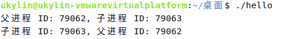

- **查看调试信息**  
  `sudo dmesg -c`  
  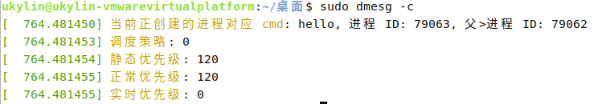
  
  
    


