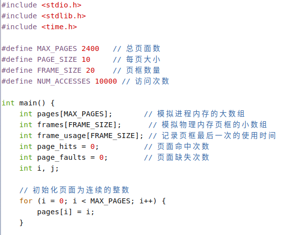
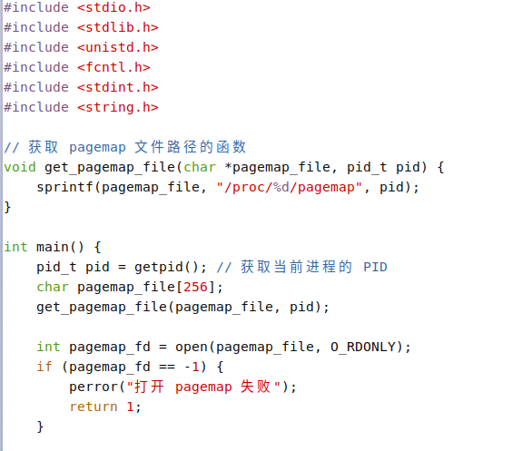
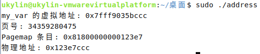

# 操作系统原理上机试验 3
::: tip 文章信息
Written by [Q-thrive](https://github.com/Qthrive) in 2025.5.19

Reprinted by Bolaxious , Reproduction is permitted by permission
:::
## 一、实现LRU算法
### 1. 创建文件并写入代码
- **创建文件**：  
  在桌面打开终端，输入`touch lru.c`  
- **写入代码**：
  接着输入`sudo vim lru.c`  
  输入代码：
  ```c
    #include <stdio.h>
    #include <stdlib.h>
    #include <time.h>

    #define MAX_PAGES 2400   // 总页面数
    #define PAGE_SIZE 10     // 每页大小
    #define FRAME_SIZE 20    // 页框数量
    #define NUM_ACCESSES 10000 // 访问次数

    int main() {
        int pages[MAX_PAGES];       // 模拟进程内存的大数组
        int frames[FRAME_SIZE];      // 模拟物理内存页框的小数组
        int frame_usage[FRAME_SIZE]; // 记录页框最后一次的使用时间
        int page_hits = 0;          // 页面命中次数
        int page_faults = 0;        // 页面缺失次数
        int i, j;

        // 初始化页面为连续的整数
        for (i = 0; i < MAX_PAGES; i++) {
            pages[i] = i;
        }

        // 初始化页框
        for (i = 0; i < FRAME_SIZE; i++) {
            frames[i] = -1; // -1 表示页框为空
            frame_usage[i] = 0;
        }

        // 模拟页面访问 (模拟一定的局部性)
        int current_time = 0;
        int current_page_group_start = 0; // 当前页面组的起始页号
        int group_size = 10;             // 页面组的大小

        for (i = 0; i < NUM_ACCESSES; i++) {
            int page_num;

            // 更有可能访问当前页面组内的页面
            if (rand() % 10 < 8) { // 80% 的概率访问当前组
                page_num = current_page_group_start + rand() % group_size;
                if (page_num >= MAX_PAGES / PAGE_SIZE) {
                    page_num = current_page_group_start; // 防止越界
                }
            } else { // 20% 的概率访问随机页面
                page_num = rand() % (MAX_PAGES / PAGE_SIZE);
            }

            // 检查页面是否已在页框中 (页面命中)
            int found = 0;
            for (j = 0; j < FRAME_SIZE; j++) {
                if (frames[j] == page_num) {
                    found = 1;
                    page_hits++;
                    frame_usage[j] = current_time++; // 更新使用时间
                    break;
                }
            }

            // 页面缺失
            if (!found) {
                page_faults++;

                // 找到最近最久未使用的页框
                int lru_frame_index = 0;
                int min_usage_time = frame_usage[0];
                for (j = 1; j < FRAME_SIZE; j++) {
                    if (frame_usage[j] < min_usage_time) {
                        min_usage_time = frame_usage[j];
                        lru_frame_index = j;
                    }
                }

                // 替换最近最久未使用的页框
                frames[lru_frame_index] = page_num;
                frame_usage[lru_frame_index] = current_time++;
            }

            // 打印帧状态（调试用）
            // printf("Frames: ");
            // for (j = 0; j < FRAME_SIZE; j++) {
            //     printf("%d ", frames[j]);
            // }
            // printf("\n");
        }

        printf("\n页面命中: %d\n页面缺失: %d\n", page_hits, page_faults);
        printf("命中率: %.2f%%\n", (float)page_hits / NUM_ACCESSES * 100);

        return 0;
    }
  ```
  

### 2. 编译运行
- **编译**  
  `gcc -o lru lru.c`
- **运行**  
  `./lru`
  

## 二、计算物理地址
### 1. 创建文件写入代码
- **创建文件**：  
  在桌面打开终端，输入`touch address.c`  
- **写入代码**：
  接着输入`sudo vim address.c`  
  输入代码：
  ```c
    #include <stdio.h>
    #include <stdlib.h>
    #include <unistd.h>
    #include <fcntl.h>
    #include <stdint.h>
    #include <string.h>

    // 获取 pagemap 文件路径的函数
    void get_pagemap_file(char *pagemap_file, pid_t pid) {
        sprintf(pagemap_file, "/proc/%d/pagemap", pid);
    }

    int main() {
        pid_t pid = getpid(); // 获取当前进程的 PID
        char pagemap_file[256];
        get_pagemap_file(pagemap_file, pid);

        int pagemap_fd = open(pagemap_file, O_RDONLY);
        if (pagemap_fd == -1) {
            perror("打开 pagemap 失败");
            return 1;
        }

        // 示例：获取一个变量的虚拟地址
        int my_var = 10;
        uintptr_t virtual_address = (uintptr_t)&my_var;
        printf("my_var 的虚拟地址: %p\n", (void*)virtual_address);

        // 计算页号
        uintptr_t page_size = sysconf(_SC_PAGESIZE);
        uintptr_t page_number = virtual_address / page_size;
        printf("页号: %lu\n", page_number);

        // 读取 pagemap 条目
        off_t offset = page_number * 8; // 每个条目 8 字节
        if (lseek(pagemap_fd, offset, SEEK_SET) == -1) {
            perror("lseek 失败");
            close(pagemap_fd);
            return 1;
        }

        uint64_t pagemap_entry;
        if (read(pagemap_fd, &pagemap_entry, 8) != 8) {
            perror("读取 pagemap 失败");
            close(pagemap_fd);
            return 1;
        }

        printf("Pagemap 条目: 0x%lx\n", pagemap_entry);

        // 从 pagemap 条目中提取信息
        if (pagemap_entry & (1ULL << 63)) {
            uint64_t pfn = pagemap_entry & ((1ULL << 55) - 1); // 物理帧号
            uint64_t physical_address = pfn * page_size + (virtual_address % page_size);
            printf("物理地址: 0x%lx\n", physical_address);
        } else {
            printf("页面不在物理内存中\n");
        }

        close(pagemap_fd);
        return 0;
    }
  ```
  
  

### 2. 编译运行
- **编译**  
  `gcc -o address address.c`
- **运行**（用管理员权限运行）  
  `sudo ./address`
  
  