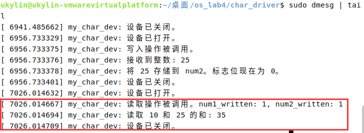
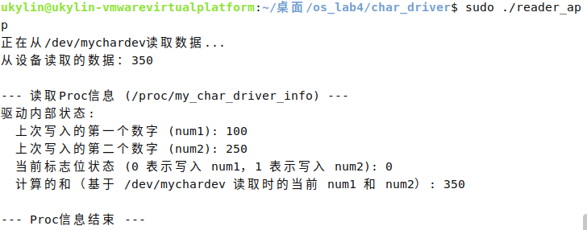

# 操作系统原理上机试验 4
::: tip 文章信息
Written by [Q-thrive](https://github.com/Qthrive) in 2025.5.19

Reprinted by Bolaxious , Reproduction is permitted by permission
::: 
## 一、编写内核模块  
### 1. 编写内核模块代码（hello_module.c）  
- **创建.c文件**  
  直接在桌面终端依次输入以下命令：  
  `mkdir os_lab4`  
  `cd os_lab4`  
  `mkdir module_hello`  
  `cd module_hello`  
  `nano hello_module.c`（建议直接将c文件传入虚拟机，后同）    
- **输入代码**  
  ```c  
  #include <linux/init.h>      
  #include <linux/module.h>    
  #include <linux/kernel.h>    

  static int __init hello_init(void) {
      printk(KERN_INFO "内核模块已经初始化！\n"); 
      return 0; 
  }

  static void __exit hello_exit(void) {
      printk(KERN_INFO "已经从内核模块退出！\n");
  }

  module_init(hello_init); 
  module_exit(hello_exit); 

  MODULE_LICENSE("GPL");
  MODULE_AUTHOR("ukylin");
  MODULE_DESCRIPTION("一个简单的内核模块示例");
  ```
- **保存文件**  
  依次按下`CTRL + O`,`ENTER`,`CTRL + X`
- **创建Makefile文件**  
  输入命令：  
  `nano Makefile`
- **写入**  
  ```makefile
  obj-m += hello_module.o

  all:
      make -C /lib/modules/$(shell uname -r)/build M=$(PWD) modules

  clean:
      make -C /lib/modules/$(shell uname -r)/build M=$(PWD) clean
  ```  
- **保存文件**  
  依次按下`CTRL + O`,`ENTER`,`CTRL + X`    

### 2. 编译运行  
- **编译**  
  `make`  
  完成后输出及文件夹文件如下图所示：    
      
    
- **装载模块**    
  `sudo insmod hello_module.ko`  
- **观察输出**    
  `sudo dmesg | tail`   
      
- **卸载模块**    
  `sudo rmmod hello_module`    
- **观察输出**    
  `sudo dmesg | tail`    
    


## 二、字符设备驱动程序    
### 1. 编写代码    
- **创建文件**  
  在之前基础上接着输入以下命令：  
  `cd ..`  
  `mkdir char_driver`    
  `nano char_driver.c`  
- **写入代码**     
  依次按下`CTRL + O`,`ENTER`,`CTRL + X`来保存  
  ```c  
  #include <linux/module.h>
  #include <linux/fs.h>           // 用于 file_operations 结构体
  #include <linux/uaccess.h>      // 用于 copy_to_user、copy_from_user
  #include <linux/miscdevice.h>   // 用于 misc_register、misc_deregister
  #include <linux/slab.h>         // 用于 kmalloc、kfree（若字符串需要动态分配）

  // 用于存储两个数字和一个标志位的全局变量
  static int num1 = 0;
  static int num2 = 0;
  static int flag = 0; // 0 表示下一次写入到 num1，1 表示下一次写入到 num2
  static bool num1_written = false;
  static bool num2_written = false;

  // 设备打开函数
  static int my_open(struct inode *inode, struct file *file) {
      printk(KERN_INFO "my_char_dev: 设备已打开。\n");
      return 0;
  }

  // 设备释放函数
  static int my_release(struct inode *inode, struct file *file) {
      printk(KERN_INFO "my_char_dev: 设备已关闭。\n");
      return 0;
  }

  // 读取函数：计算和并返回给用户
  static ssize_t my_read(struct file *file, char __user *buf, size_t count, loff_t *ppos) {
      char result_str[32]; // 用于存储和的字符串缓冲区
      int sum_val;
      int len;

      printk(KERN_INFO "my_char_dev: 读取操作被调用。num1_written: %d, num2_written: %d\n", num1_written, num2_written);


      if (*ppos > 0) return 0; // 基本检查，防止同一调用的多次读取（若未其他处理）

      if (num1_written && !num2_written) { // 仅写入了一个数字
          sum_val = num1;
          printk(KERN_INFO "my_char_dev: 读取单个数字: %d\n", num1);
      } else if (num1_written && num2_written) { // 两个数字均已写入
          sum_val = num1 + num2;
          printk(KERN_INFO "my_char_dev: 读取 %d 和 %d 的和: %d\n", num1, num2, sum_val);
      } else { // 尚未写入任何数字
          printk(KERN_INFO "my_char_dev: 尚未写入任何数字。\n");
          len = sprintf(result_str, "尚未写入任何数字。\n");
          if (copy_to_user(buf, result_str, len)) {
              return -EFAULT;
          }
          *ppos += len;
          return len;
      }

      len = sprintf(result_str, "%d\n", sum_val);

      if (copy_to_user(buf, result_str, len)) {
          printk(KERN_ERR "my_char_dev: 无法将和复制到用户空间。\n");
          return -EFAULT; // 错误地址
      }
      *ppos += len; // 推进位置
      return len;   // 读取的字节数
  }

  // 写入函数：接收来自用户的整数
  static ssize_t my_write(struct file *file, const char __user *buf, size_t count, loff_t *ppos) {
      char kbuf[32]; // 用于保存用户数据的内核缓冲区
      long temp_num;
      int ret;

      printk(KERN_INFO "my_char_dev: 写入操作被调用。\n");

      if (count == 0 || count >= sizeof(kbuf)) return -EINVAL; // 基本验证

      if (copy_from_user(kbuf, buf, count)) {
          printk(KERN_ERR "my_char_dev: 无法从用户空间复制数据。\n");
          return -EFAULT;
      }
      kbuf[count] = '\0'; // 字符串空终止

      ret = kstrtol(kbuf, 10, &temp_num); // 字符串转换为长整型
      if (ret != 0) {
          printk(KERN_ERR "my_char_dev: 无效的整数格式: %s, 错误: %d\n", kbuf, ret);
          return -EINVAL; // 无效参数
      }

      printk(KERN_INFO "my_char_dev: 接收到整数: %ld\n", temp_num);

      if (flag == 0) {
          num1 = (int)temp_num;
          num1_written = true;
          printk(KERN_INFO "my_char_dev: 将 %d 存储到 num1。标志位现在为 1。\n", num1);
          flag = 1;
      } else {
          num2 = (int)temp_num;
          num2_written = true;
          printk(KERN_INFO "my_char_dev: 将 %d 存储到 num2。标志位现在为 0。\n", num2);
          flag = 0;
      }
      return count; // 写入的字节数
  }

  // 文件操作结构体
  static const struct file_operations my_fops = {
      .owner = THIS_MODULE,
      .open = my_open,
      .release = my_release,
      .read = my_read,
      .write = my_write,
  };

  // 杂项设备结构体
  static struct miscdevice my_misc_device = {
      .minor = MISC_DYNAMIC_MINOR, // 请求动态次设备号
      .name = "mychardev",         // /dev/ 下的设备名
      .fops = &my_fops,
  };

  // 模块初始化函数
  static int __init my_driver_init(void) {
      int ret;
      ret = misc_register(&my_misc_device);
      if (ret) {
          printk(KERN_ERR "my_char_dev: 杂项设备注册失败。\n");
          return ret;
      }
      printk(KERN_INFO "my_char_dev: 字符设备驱动已注册。设备: /dev/mychardev\n");
      // 重置状态
      num1_written = false;
      num2_written = false;
      flag = 0;
      return 0;
  }

  // 模块退出函数
  static void __exit my_driver_exit(void) {
      misc_deregister(&my_misc_device);
      printk(KERN_INFO "my_char_dev: 字符设备驱动已注销。\n");
  }

  module_init(my_driver_init);
  module_exit(my_driver_exit);

  MODULE_LICENSE("GPL");
  MODULE_AUTHOR("ukylin");
  MODULE_DESCRIPTION("用于操作系统实验4的字符设备驱动。");
  ```  
- **创建Makefile**    
  `nano Makefile`    
  依次按下`CTRL + O`,`ENTER`,`CTRL + X`来保存  

  ```Makefile  
  obj-m += char_driver.o

  all:
      make -C /lib/modules/$(shell uname -r)/build M=$(PWD) modules

  clean:
      make -C /lib/modules/$(shell uname -r)/build M=$(PWD) clean
  ```  

### 2. 装载准备工作 
- **编译**    
  `make`  
      
      
- **编写测试写入文件**    
  `nano writer_app.c`    
  依次按下`CTRL + O`,`ENTER`,`CTRL + X`来保存    

  ```c  
  #include <stdio.h>
  #include <stdlib.h>
  #include <fcntl.h>
  #include <unistd.h>
  #include <string.h>
  #include <errno.h>

  #define DEVICE_PATH "/dev/mychardev"

  int main(int argc, char *argv[]) {
      int fd;
      char write_buf[32];
      int num_to_write;

      if (argc < 2) {
          fprintf(stderr, "用法: %s <要写入的整数>\n", argv[0]);
          return 1;
      }

      num_to_write = atoi(argv[1]);
      snprintf(write_buf, sizeof(write_buf), "%d", num_to_write);

      fd = open(DEVICE_PATH, O_WRONLY);
      if (fd < 0) {
          perror("打开设备进行写入失败");
          return errno;
      }

      printf("正在向 %s 写入值: %s\n", write_buf, DEVICE_PATH);
      ssize_t bytes_written = write(fd, write_buf, strlen(write_buf));
      if (bytes_written < 0) {
          perror("向设备写入数据失败");
          close(fd);
          return errno;
      }

      printf("成功写入 %zd 字节。\n", bytes_written);
      close(fd);
      return 0;
  }
  ```  
- **编译测试写入文件**    
  `gcc writer_app.c -o writer_app`    
- **编写测试读出文件**    
  `nano reader_app.c`    
  依次按下`CTRL + O`,`ENTER`,`CTRL + X`来保存    

  ```c
  #include <stdio.h>
  #include <stdlib.h>
  #include <fcntl.h>
  #include <unistd.h>
  #include <errno.h>

  #define DEVICE_PATH "/dev/mychardev"
  #define BUFFER_LENGTH 256

  int main() {
      int fd;
      char read_buf[BUFFER_LENGTH];
      ssize_t bytes_read;

      fd = open(DEVICE_PATH, O_RDONLY);
      if (fd < 0) {
          perror("打开设备进行读取失败");
          return errno;
      }

      printf("正在从 %s 读取数据...\n", DEVICE_PATH);
      bytes_read = read(fd, read_buf, BUFFER_LENGTH -1);
      if (bytes_read < 0) {
          perror("从设备读取数据失败");
          close(fd);
          return errno;
      }

      read_buf[bytes_read] = '\0'; // 字符串空终止
      printf("从设备读取到的数据: %s", read_buf); // 驱动会添加换行符

      close(fd);
      return 0;
  }
  ```  
- **编译测试读出文件**    
  `gcc reader_app.c -o reader_app`    

### 3. 装载运行  
- **装载**    
  `sudo insmod char_driver.ko`  
- **写入**  
  `sudo ./writer_app 10`  
  `sudo ./writer_app 25`    
      
- **查看打印信息**    
  `sudo dmesg | tail`    
      
- **读出**    
  `sudo ./reader_app`    
      
- **查看打印信息**    
  `sudo dmesg | tail`    
    
- **卸载模块**  
  `sudo rmmod char_driver`  

## 三、拓展（选做部分）  
### 1. 修改char_driver.c  
- **重新创建**  
  `nano char_driver.c`    
  依次按下`CTRL + O`,`ENTER`,`CTRL + X`来保存  
  ```c  
  #include <linux/module.h>
  #include <linux/fs.h>           // 用于 file_operations 结构体
  #include <linux/uaccess.h>      // 用于 copy_to_user、copy_from_user
  #include <linux/miscdevice.h>   // 用于 misc_register、misc_deregister
  #include <linux/slab.h>         // 用于 kmalloc、kfree（若字符串需要动态分配）
  #include <linux/proc_fs.h>      // proc 文件系统所需
  #include <linux/seq_file.h>     // seq_file 接口所需
  #include <linux/version.h>     // 用于检查内核版本

  // 用于存储两个数字和一个标志位的全局变量
  static int num1 = 0;
  static int num2 = 0;
  static int flag = 0; // 0 表示下一次写入到 num1，1 表示下一次写入到 num2
  static bool num1_written = false;
  static bool num2_written = false;

  #define PROC_FILENAME "my_char_driver_info" // proc 文件的名称

  // proc 文件操作的前置声明
  static int my_proc_show(struct seq_file *m, void *v);
  static int my_proc_open(struct inode *inode, struct file *file);

  // 定义 proc 文件的操作（针对新内核的 proc_ops 结构体）
  #if LINUX_VERSION_CODE >= KERNEL_VERSION(5,6,0)
  static const struct proc_ops my_proc_fops = {
      .proc_open = my_proc_open,
      .proc_read = seq_read, // 使用标准的 seq_read 进行读取
      .proc_lseek = seq_lseek,
      .proc_release = single_release, // 使用标准的 single_release
  };
  #else
  // 针对旧内核的 file_operations 结构体
  static const struct file_operations my_proc_fops = {
      .owner = THIS_MODULE,
      .open = my_proc_open,
      .read = seq_read,
      .llseek = seq_lseek,
      .release = single_release,
  };
  #endif

  // 当读取 proc 文件时调用此函数
  static int my_proc_show(struct seq_file *m, void *v) {
      int sum_val = 0;
      bool sum_calculable = false;

      seq_printf(m, "驱动内部状态:\n");
      if (num1_written) {
          seq_printf(m, "  上次写入的第一个数字 (num1): %d\n", num1);
      } else {
          seq_printf(m, "  第一个数字 (num1): 尚未写入\n");
      }

      if (num2_written) {
          seq_printf(m, "  上次写入的第二个数字 (num2): %d\n", num2);
      } else {
          seq_printf(m, "  第二个数字 (num2): 尚未写入\n");
      }
      
      seq_printf(m, "  当前标志位状态 (0 表示写入 num1，1 表示写入 num2): %d\n", flag);

      if (num1_written && !num2_written) {
          sum_val = num1;
          sum_calculable = true;
      } else if (num1_written && num2_written) {
          sum_val = num1 + num2;
          sum_calculable = true;
      }

      if (sum_calculable) {
          seq_printf(m, "  计算的和（基于 /dev/mychardev 读取时的当前 num1 和 num2）: %d\n", sum_val);
      } else {
          seq_printf(m, "  计算的和: 数据不足，无法计算 /dev/mychardev 读取时的和。\n");
      }
      return 0;
  }

  // 当打开 proc 文件时调用此函数
  static int my_proc_open(struct inode *inode, struct file *file) {
      // single_open 会分配一个 seq_file 结构体并注册显示函数
      return single_open(file, my_proc_show, NULL);
  }

  // 设备打开函数
  static int my_open(struct inode *inode, struct file *file) {
      printk(KERN_INFO "my_char_dev: 设备已打开。\n");
      return 0;
  }

  // 设备释放函数
  static int my_release(struct inode *inode, struct file *file) {
      printk(KERN_INFO "my_char_dev: 设备已关闭。\n");
      return 0;
  }

  // 读取函数：计算和并返回给用户
  static ssize_t my_read(struct file *file, char __user *buf, size_t count, loff_t *ppos) {
      char result_str[64]; // 用于存储和的字符串缓冲区
      int sum_val;
      int len;

      printk(KERN_INFO "my_char_dev: 读取操作被调用。num1_written: %d, num2_written: %d\n", num1_written, num2_written);

      if (*ppos > 0) return 0;

      if (num1_written && !num2_written) {
          sum_val = num1;
          printk(KERN_INFO "my_char_dev: 读取单个数字: %d\n", num1);
      } else if (num1_written && num2_written) {
          sum_val = num1 + num2;
          printk(KERN_INFO "my_char_dev: 读取 %d 和 %d 的和: %d\n", num1, num2, sum_val);
      } else {
          printk(KERN_INFO "my_char_dev: 尚未写入任何数字。\n");
          len = sprintf(result_str, "尚未向 /dev/mychardev 写入任何数字。\n");
          if (copy_to_user(buf, result_str, len)) {
              return -EFAULT;
          }
          *ppos += len;
          return len;
      }

      len = sprintf(result_str, "%d\n", sum_val);

      if (copy_to_user(buf, result_str, len)) {
          printk(KERN_ERR "my_char_dev: 无法将和复制到用户空间。\n");
          return -EFAULT;
      }
      *ppos += len;
      return len;
  }

  // 写入函数：接收来自用户的整数
  static ssize_t my_write(struct file *file, const char __user *buf, size_t count, loff_t *f_pos) {
      char kbuf[32];
      long temp_num;
      int ret;

      printk(KERN_INFO "my_char_dev: 写入操作被调用。\n");

      if (count == 0 || count >= sizeof(kbuf)) return -EINVAL;

      if (copy_from_user(kbuf, buf, count)) {
          printk(KERN_ERR "my_char_dev: 无法从用户空间复制数据。\n");
          return -EFAULT;
      }
      kbuf[count] = '\0';

      ret = kstrtol(kbuf, 10, &temp_num);
      if (ret != 0) {
          printk(KERN_ERR "my_char_dev: 无效的整数格式: %s, 错误: %d\n", kbuf, ret);
          return -EINVAL;
      }
      
      printk(KERN_INFO "my_char_dev: 接收到整数: %ld\n", temp_num);

      if (flag == 0) {
          num1 = (int)temp_num;
          num1_written = true;
          printk(KERN_INFO "my_char_dev: 将 %d 存储到 num1。标志位现在为 1。\n", num1);
          flag = 1;
      } else {
          num2 = (int)temp_num;
          num2_written = true;
          printk(KERN_INFO "my_char_dev: 将 %d 存储到 num2。标志位现在为 0。\n", num2);
          flag = 0;
      }
      return count;
  }

  // 字符设备的文件操作结构体
  static const struct file_operations my_dev_fops = {
      .owner = THIS_MODULE,
      .open = my_open,
      .release = my_release,
      .read = my_read,
      .write = my_write,
  };

  // 杂项设备结构体
  static struct miscdevice my_misc_device = {
      .minor = MISC_DYNAMIC_MINOR,
      .name = "mychardev",
      .fops = &my_dev_fops, // 此处使用设备的 fops
  };

  // 模块初始化函数
  static int __init my_driver_init(void) {
      int ret;

      // 注册杂项设备
      ret = misc_register(&my_misc_device);
      if (ret) {
          printk(KERN_ERR "my_char_dev: 杂项设备注册失败。\n");
          return ret;
      }
      printk(KERN_INFO "my_char_dev: 字符设备驱动已注册。设备: /dev/mychardev\n");

      // 创建 proc 入口
      if (proc_create(PROC_FILENAME, 0444, NULL, &my_proc_fops) == NULL) {
          printk(KERN_ERR "my_char_dev: 无法创建 /proc/%s 入口。\n", PROC_FILENAME);
          misc_deregister(&my_misc_device); // 若 proc 创建失败，清理杂项设备
          return -ENOMEM;
      }
      printk(KERN_INFO "my_char_dev: proc 入口 /proc/%s 创建成功。\n", PROC_FILENAME);

      num1_written = false;
      num2_written = false;
      flag = 0;
      return 0;
  }

  // 模块退出函数
  static void __exit my_driver_exit(void) {
      // 删除 proc 入口
      remove_proc_entry(PROC_FILENAME, NULL);
      printk(KERN_INFO "my_char_dev: proc 入口 /proc/%s 已删除。\n", PROC_FILENAME);

      // 注销杂项设备
      misc_deregister(&my_misc_device);
      printk(KERN_INFO "my_char_dev: 字符设备驱动已注销。\n");
  }

  module_init(my_driver_init);
  module_exit(my_driver_exit);

  MODULE_LICENSE("GPL");
  MODULE_AUTHOR("ukylin");
  MODULE_DESCRIPTION("为操作系统实验4设计的带 proc 接口的字符设备驱动。");
  ```  

### 2. 重新编译并装载    
- **清除旧文件**  
  `make clean`  
- **重新编译**  
  `make`    
    
- **装载新编译的模块**  
  `sudo insmod char_driver.ko`  

### 3.修改测试文件  
- **writer_app.c**  
    ```c  
    #include <stdio.h>
    #include <stdlib.h>
    #include <fcntl.h>
    #include <unistd.h>
    #include <string.h>
    #include <errno.h> 

    #define DEVICE_PATH "/dev/mychardev"
    #define PROC_INFO_PATH "/proc/my_char_driver_info" // 新增：proc文件路径
    #define PROC_BUFFER_SIZE 128                       // 新增：读取proc文件的缓冲区大小

    // 新增函数：用于读取并显示proc文件内容
    void display_proc_info() {
        int proc_fd;
        char buffer[PROC_BUFFER_SIZE]; // 缓冲区
        ssize_t bytes_read;

        printf("\n--- 读取Proc信息 (%s) ---\n", PROC_INFO_PATH); // PROC_INFO_PATH 应该已经在文件顶部定义了
        proc_fd = open(PROC_INFO_PATH, O_RDONLY);
        if (proc_fd < 0) {
            perror("打开proc信息文件失败");
            // 即使打开失败，也打印结束标记，保持输出格式一致性
            printf("--- Proc信息结束 ---\n");
            return;
        }

        // 循环读取proc文件的所有内容
        while ((bytes_read = read(proc_fd, buffer, PROC_BUFFER_SIZE - 1)) > 0) {
            buffer[bytes_read] = '\0'; // 对读取到的块进行空字符终止
            printf("%s", buffer);      // 打印当前读取到的块
        }

        // 检查read调用是否因为错误而结束循环
        if (bytes_read < 0) {
            perror("从proc信息文件读取时发生错误");
        }
        // 如果bytes_read == 0，说明已到达文件末尾，是正常结束

        printf("\n--- Proc信息结束 ---\n"); // 确保在所有内容打印完毕后显示结束标记
        close(proc_fd);
    }

    int main(int argc, char *argv[]) {
        int fd;
        char write_buf[32];
        int num_to_write;

        if (argc < 2) {
            fprintf(stderr, "用法：%s <要写入的整数>\n", argv[0]);
            return 1;
        }

        num_to_write = atoi(argv[1]);
        snprintf(write_buf, sizeof(write_buf), "%d", num_to_write);

        fd = open(DEVICE_PATH, O_WRONLY);
        if (fd < 0) {
            perror("打开设备进行写操作失败");
            return errno;
        }

        printf("正在向%s写入值：%s\n", DEVICE_PATH, write_buf);
        ssize_t bytes_written = write(fd, write_buf, strlen(write_buf));
        
        // 先关闭设备文件，再读取proc信息
        close(fd); // 关闭字符设备

        if (bytes_written < 0) {
            perror("向设备写入数据失败");
            // 即使写入失败，也尝试显示proc信息，可能有助于调试
            display_proc_info();
            return errno;
        }

        printf("成功写入%zd字节。\n", bytes_written);

        // 在应用程序快结束时读出相关文件信息并显示出来
        display_proc_info();

        return 0;
    }
    ```  
- **reader_app.c**  
    ```c  
    #include <stdio.h>
    #include <stdlib.h>
    #include <fcntl.h>
    #include <unistd.h>
    #include <string.h> 
    #include <errno.h>  

    #define DEVICE_PATH "/dev/mychardev"
    #define READER_BUFFER_LENGTH 256 // 原有的读取字符设备缓冲区

    #define PROC_INFO_PATH "/proc/my_char_driver_info" // 新增：proc文件路径
    #define PROC_BUFFER_SIZE 128                       // 新增：读取proc文件的缓冲区大小

    // 新增函数：用于读取并显示proc文件内容 
    void display_proc_info() {
        int proc_fd;
        char buffer[PROC_BUFFER_SIZE]; // 缓冲区
        ssize_t bytes_read;

        printf("\n--- 读取Proc信息 (%s) ---\n", PROC_INFO_PATH); // PROC_INFO_PATH 应该已经在文件顶部定义了
        proc_fd = open(PROC_INFO_PATH, O_RDONLY);
        if (proc_fd < 0) {
            perror("打开proc信息文件失败");
            // 即使打开失败，也打印结束标记，保持输出格式一致性
            printf("--- Proc信息结束 ---\n");
            return;
        }

        // 循环读取proc文件的所有内容
        while ((bytes_read = read(proc_fd, buffer, PROC_BUFFER_SIZE - 1)) > 0) {
            buffer[bytes_read] = '\0'; // 对读取到的块进行空字符终止
            printf("%s", buffer);      // 打印当前读取到的块
        }

        // 检查read调用是否因为错误而结束循环
        if (bytes_read < 0) {
            perror("从proc信息文件读取时发生错误");
        }
        // 如果bytes_read == 0，说明已到达文件末尾，是正常结束

        printf("\n--- Proc信息结束 ---\n"); // 确保在所有内容打印完毕后显示结束标记
        close(proc_fd);
    }

    int main() {
        int fd;
        char read_buf[READER_BUFFER_LENGTH];
        ssize_t bytes_read_dev; // 区分从设备读取的字节数

        fd = open(DEVICE_PATH, O_RDONLY);
        if (fd < 0) {
            perror("打开设备进行读操作失败");
            return errno;
        }

        printf("正在从%s读取数据...\n", DEVICE_PATH);
        bytes_read_dev = read(fd, read_buf, READER_BUFFER_LENGTH - 1);
        
        // 先关闭设备文件，再读取proc信息
        close(fd); // 关闭字符设备

        if (bytes_read_dev < 0) {
            perror("从设备读取数据失败");
            // 即使读取失败，也尝试显示proc信息
            display_proc_info();
            return errno;
        }

        read_buf[bytes_read_dev] = '\0'; // 空终止字符串
        printf("从设备读取的数据：%s", read_buf); // 驱动可能已包含换行符

        // 在应用程序快结束时读出相关文件信息并显示出来
        display_proc_info();

        return 0;
    }
    ```  
- **编译**  
  `gcc writer_app.c -o writer_app`  
  `gcc reader_app.c -o reader_app`  

- **运行（用管理员权限，否则出错）**  
    

  `sudo ./writer_app 100`  
    
  `sudo ./writer_app 250`  
    

  `sudo ./reader_app`  
    

## 四、总结  
本次实验内容充实，覆盖了从简单的内核模块到具有基本功能的字符设备驱动，再到可选的proc接口实现。通过动手实践，不仅完成了实验要求，也对Linux设备驱动开发的关键环节有了切身体会，为后续更深入学习操作系统内核及相关技术打下了良好基础。