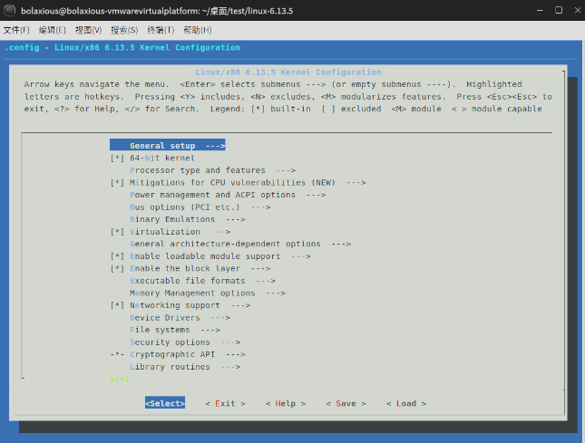

# 操作系统课后实践作业 1

```yaml
- 作业题目：操作系统课后实践作业_1
- 日期：2025/3/6
```

> 配置：
> - VMware workstation pro 17.6.3 
> - ubuntukylin-22.04-pro-amd64
> - Linux 6.13.5 内核

下载地址：

 - [CDS Repository - /var/www/public/stage/session-120/cds/vmw-desktop](https://softwareupdate.vmware.com/cds/vmw-desktop/)
 - [mirrors.huaweicloud.com/ubuntukylin-cdimage/22.04/](https://mirrors.huaweicloud.com/ubuntukylin-cdimage/22.04/)
 - [https://cdn.kernel.org/pub/linux/kernel/v6.x/linux-6.13.5.tar.xz](https://cdn.kernel.org/pub/linux/kernel/v6.x/linux-6.6.8.tar.xz)

> 

## TODO

- 在优麒麟中编译Linux新内核
- 在优麒麟中编写一个shell，读取并显示指定文件的每一行并统计总的行数

## 准备

- 下载VMware、优麒麟镜像文件、linux内核文件
- 配置环境
- 检查系统信息 belike：


## 编写统计行数shell脚本

cl.sh / test.txt 分别如下：

```bash
#!/bin/bash#
if [ $# -eq 0 ]; then
    echo "input url:"
    exit 1
fi

# 定义文件路径变量，这里使用相对路径
file="$1"

# 检查文件是否存在
if [ ! -f "$file" ]; then
    echo "$file doesn't exist"
    exit 1
fi

# 统计行数
line_num=0
while read -r line; do
    echo "$line"
    ((line_num++))done < "$file"

echo "line_count: $line_num"
```

```bash
wadwa
awd1123wad
wwwssww
awdwaffwww
123a
```

运行结果如图：


## 编译Linux 6.13.5 内核

 [https://cdn.kernel.org/pub/linux/kernel/v6.x/linux-6.13.5.tar.xz](https://cdn.kernel.org/pub/linux/kernel/v6.x/linux-6.6.8.tar.xz)  这是镜像站推荐下载的最新版本的内核。

### 安装工具和依赖

```bash
sudo apt-get update
sudo apt-get install build-essential libncurses-dev bison flex libssl-dev libelf-dev
```


### 获取内核源码

我们就在当前的test文件夹中执行之后的所有操作，从镜像站获取Linux 6.13.5 内核源码压缩包：

```bash
sudo wget https://cdn.kernel.org/pub/linux/kernel/v6.x/linux-6.13.5.tar.xz
```

进行解压：

```bash
sudo tar -xf linux-6.13.5.tar.xz
```


### 备份当前内核配置

以防在新内核编译过程中出现问题，可以恢复到原来的配置。

```bash
sudo cp /boot/config-$(uname -r) /boot/config-$(uname -r).bak
```

### 配置内核

进入解压后内核文件夹，然后配置，我使用默认配置故而直接exit了

```bash
cd linux-6.13.5
sudo make menuconfig
```




### 编译内核

执行下面的命令，等待编译完成，结束。

```bash
sudo make -j$(nproc)
```

