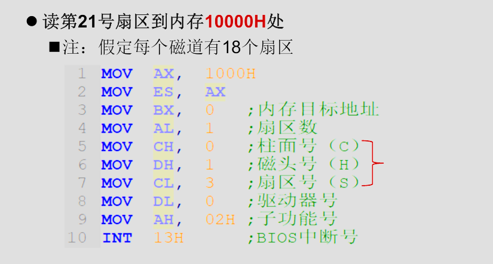

# 复习纲要

这里是 Bolaxious 的操作系统复习纲要，教材为《操作系统原理（慕课版）》（苏曙光），分九个章节：概述、硬件基础、用户界面、进程管理、死锁、进程调度、存储管理、设备管理、文件管理。

## 概要

操作系统提供了这些直观的基本功能：提供操作界面、控制程序运行、管理系统资源、配置系统参数、监控系统状态、工具软件集合。

### 定义

操作系统是一个大型的程序系统，它负责计算机系统软件/硬件资源的分配；控制和协调并发活动；提供用户接口，使用户获得良好的工作环境。简而言之就是：**管理调度资源、提供用户接口。**


上图展示了操作系统的地位。

这也就要求并赋予了操作系统以特性：具有同时处理多个任务的能力、为多个并发任务提供资源共享、具有处理随机事件(中断)的能力，简言之就是：**并发性、共享性、不确定性**

至于发展历史，我们在此略过。

### 功能

资源管理是操作系统的主要任务，从这个观点来分析操作系统的功能可以分为四个基本功能：处理机管理、存储管理、设备管理、文件管理

#### 处理机管理/进程管理

我们先要了解“进程”的概念：

OS 会在任何时候和任何地点暂停或继续任何程序的运行。在并发环境下，“程序”不足以描述程序的运行过程并确保运行结果的正确，故而我们需要引入进程来确保程序的独立运行。

处理机的具体功能包括：

- 进程控制：创建，暂停，唤醒，撤销
- 进程调度：调度策略，优先级
- 进程通信：进程间通信

#### 存储管理/内存管理

具体功能包括：

- 内存分配
- 内存共享
- 内存保护
- 内存扩充
- 虚拟内存

#### 设备管理

设备管理的具体功能包括：

- 设备的分配和回收
- 设备的驱动机制/传输控制
- 为应用提供统一接口访问设备
  - 设备无关性
- 高效存取设备/缓冲机制

#### 文件管理

文件管理为用户提供统一的文件存取接口，高效组织存储空间，提高存取效率，实现信息共享和存取控制。

我们可以这样理解：文件是设备的抽象

具体功能包括：

文件用户接口

- 存储空间管理
- 文件的操作
- 目录的操作
- 存取权限管理

### 性能

我们可以从下面几个指标来评价操作系统的性能

- 吞吐率
  - 在单位时间内处理信息的能力。
- 资源利用率
  - 设备(CPU)使用的频度
- 响应能力
  - 从接收数据到输出结果的时间间隔。
- 可移植性
  - 改变硬件环境仍能正常工作的能力:代码修改量（为了适配新的硬件需要做一定的修改工作，也就是移植，如果抽象和通用的接口多，那么代码修改量就会小很多，可移植性就越高）
- 可靠性
  - 发现、诊断和恢复系统故障的能力。

### 发展历史

操作系统发展的四个典型阶段

- 手工操作(无操作系统)（40 年代-50 年代初）
- 单道批处理系统（ 50 年代）
- 多道批处理系统（60 年代初）
- 分时操作系统（60 年代中-至今）

手工操作时期，用户依靠卡片/纸带和计算机交互，CPU 利用率低、用户独占且缺少交互；

单道批处理系统随着 IBM7094 晶体管计算机而出现，它的工作过程是管理员将多个作业输入到磁盘形成作业队列；监控程序（操作系统）依次自动处理磁盘中每个作业：装入—运行—撤出—装入—运行—撤出并循环；运行完毕，通知用户取结果，不过这种方式仍然效率较低。

多道批处理系统进行了改进：内存中存放多道程序,当某道程序因为某种原因（例
如请求 I/O 时）不能继续运行时，监控程序/OS 便调度另一道程序投入运行，这样使 CPU 尽量处于忙碌状态，提高系统效率。多道技术是现代操作系统的雏形。

::: tip

- 时分：分成多个时段：不同程序错开时段使用。
- 空分：分成多个单元：不同程序使用不同单元。
  :::

分时操作系统的核心概念是“时间片”（较短的时间长度），主机以很短的时间片为单位，把 CPU 轮流分配给各个终端(作业)使用，直到全部作业被运行完。Unix/Linux/Windows 都是分时操作系统。

分时操作系统目前有了更多的衍化：实时操作系统/嵌入式操作系统、微机操作系统（PC 机操作系统）、多处理机操作系统、网络操作系统、分布式操作系统、嵌入式操作系统。

### 逻辑结构

逻辑结构也就是 OS 的设计和实现思路，分为：整体式结构、层次式结构、微内核结构。

#### 整体式结构 OS

整体式结构以模块为基本单位构建，每个模块都有特定的功能。Unix/Linux 就是典型的整体式 OS。


整体式结构的优点如下：

- 模块设计、编码和调试独立
- 模块之间可以自由调用

#### 层次式结构

层次式结构将操作系统的功能模块按调用次序排若干层，保证各层单向依赖或单向调用。


分层原则如下：

- 最底层：硬件相关
- 最顶层：用户策略/用户交互
- 中间层：按调用次序/消息传递顺序
- 较低层：共性的、活跃的服务

优点是：

- 结构清晰，避免循环调用。
- 整体问题局部化，系统的正确性容易保证。
- 有利于操作系统的移植、维护、扩充。

#### 微内核结构（客户/服务器结构）

`操作系统 = 微内核 + 核外服务器`


微内核体积较小，完成的是操作系统基本的核心功能和服务；

核外服务器完成OS的绝大部分功能，等待应用程序提出服务请求。它由若干服务器或进程共同构成。

## 硬件基础

计算机的硬件结构主要包括：CPU、内存、外设，三者通过地址/数据/控制三条总线相连接，3条总线通过时序变换执行指令，从而实现程序的执行。

而操作系统依赖的最基本硬件为：CPU、内存、时钟、中断。

### CPU与CPU的态

CPU（Central Processing Unit）即中央处理器，它的功能主要是按照一定的逻辑流程分析和执行指令流。

CPU再逻辑上可以划分为3个单元：分别为控制单元、运算单元和寄存器单元


为CPU设定态的目的在于为系统建立安全机制，不同的态支持程序使用不同的指令集和资源。故而我们需要了解一下操作系统需要考虑的安全问题，才能更好的理解设计态的理由。

::: tip 操作系统需要考虑的安全问题

目前OS的多道程序设计技术的特点是：多进程并发/资源共享，所以我们需要考虑到：

- 防止进程的信息被非法访问
- 防止进程随意存取系统资源
- 防止进程修改系统安全机制

提出的解决策略为：

- 对于软件，分级/分类（例如分为可信软件和不可信软件）
  - 对于可信软件
    - 可以修改安全保护机制
    - 可以存取系统资源
    - 拥有普通指令集 + 特权指令集
- 对于硬件，分模式（设置访问屏障）
  - 模式（态）：描述指令使用和资源访问的权限
::: 
::: tip 特权级

Intel x86架构的CPU支持 Ring0~3 的特权级，权限逐次降低，Unix/Linux/Windows 只使用了0和3两种特权级。

:::
对于CPU的态，分类为3种：

- 核态(Kernel mode)
  - 能够访问所有资源和执行所有指令
  - 管理程序/OS内核
- 用户态 (User mode,目态)
  - 仅能访问部分资源，其它资源受限
- 管态(Supervisor mode)，它介于核态和用户态之间。

通过设置模式位表示态，CPU就能通过它来进行权限判断，从而保证系统安全。

用户态和核态之间的转换：
- 用户态向核态转换
  - 用户请求OS提供服务
  - 用户进程产生错误（内部中断）
  - 用户态企图执行特权指令
  - 发生中断
- 核态向用户态转换的情形
  - 一般是中断返回：IRET

特权指令包括：
- 涉及外部设备的输入/输出指令
- 修改特殊寄存器的指令
- 改变机器状态的指令

### 内存

内存也叫主存，分为只读存储器-ROM、随机存储器-RAM和高速缓存存储器-Cache三种。

ROM主要存BIOS之类的系统程序（因为它不可读）

RAM是内存条。

Cache位于CPU和内存之间，用来缓存内存中的某一小部分数据。

### 时钟

计算机设置有一个硬件定时器，能够定时向处理器发出时间信号，帮助处理一些依赖时间概念的地方。

### 中断机制

中断是指CPU对突发的外部事件的反应过程或机制，CPU收到外部信号（中断信号）后，停止当前工作，转去处理该外部事件，处理完毕后回到原来工作的中断处（断点）继续原来的工作。

中断包括一些概念如：中断源、中断类型、断点、现场、现场处理，不过记不住，不写了。

中断响应过程如下：

- 识别中断源
- 保护断点
- 保护现场(中断服务程序的前段)
- 中断服务程序(主体)
- 恢复现场(中断服务程序的末段)
- 中断返回(恢复断点)

引入中断机制目的在于实现并发、实现实时处理、和自动处理故障。

### BIOS

BIOS（基本输入输出系统）是被固化到计算机中的一组程序，提供最基础最直接的硬件操控，它的主要功能有以下四个：

- 加电自检和初始化
- 设置CMOS参数
- 基本输入输出服务
- 加载并引导操作系统启动

#### 加电自检和初始化

加电自检（Power On Slef-Test，POST）初始化基本硬件（CPU、内存、显卡），自检若由严重错误则停机、不严重故障则给出提示。

#### CMOS设置

计算机加电引导过程中通过特殊热键进入到CMOS设置程序中，设置基本的系统参数：系统日期、时间、系统口令等等。

#### 基本输入输出服务

BIOS主要是为应用程序、操作系统提供硬件接口服务，例如显示字符串、读写磁盘等等。

基本输入输出处理程序是通过中断服务指令的形式来实现的，每组服务都有一个专门的中断号，BIOS使用的中断类型号为10H ~ 1FH，每组服务又分为不同子功能，用子功能编号标识。

`使用案例：使用INT 13H软盘I/O类服务中的02H子功能读取软盘第21个扇区的内容到内存1000h：0000h处`




#### 加载并引导操作系统启动


### 操作系统的启动过程

从加电到用户工作环境准备好的过程分为三个阶段：初始引导、核心初始化、系统初始化，它们做的工作分别为：把OS内核装入内存并使之开始工作接管计算机系统、OS内核初始化系统的核心数据、为用户使用系统作准备，使系统处于待命状态


这里简略了Linux的启动过程，包括MBR、GRUB的一些概念。

### 计算机虚拟化/虚拟机

PPT上没有，略过。

### 操作系统的生成

指根据硬件环境和用户需要，配置和构建操作系统的过程。

::: tip
这里包括一个[Linux编译内核并安装内核的实验](https://mengbooo.github.io/BemoDB/posts/os/experiment/Q_ex_1/sys-1.html)
:::

## 用户界面

用户环境是指计算机用户工作的软件环境，包括命令行环境、桌面环境、相关的用户使用手册。

### 用户界面概念

操作系统提供给用户控制计算机的机制(用户接口)，可分为操作界面（操作命令、批处理命令、图形用户界面）和系统调用（是提供给程序员在编程时使用的接口，取得操作系统服务的唯一途径）


### 操作界面

分为：

- 图形用户接口/GUI
- 操作命令（普通命令）
- 批处理与脚本程序(bat、shell)

::: tip Linux典型命令

:::

::: tip shell编程指南
Bash:https://blog.csdn.net/qq_26690505/article/details/109361345
:::

这里省略了重定向和管道命令，它们是特殊的操作命令，可以结合常规的操作命令来实现一些特殊的效果和功能。

### 系统调用

系统调用(System Call，System Service Call)是操作系统内核为应用程序提供的服务/函数。例如：printf、exit、INT 21H等等


系统调用都有唯一的编号，通过类似 SVC N 的指令来调用第N号系统调用，例如：

- DOS ： INT 21H + AH
- Linux ： INT 80H + EAX

INT XXH 为SVC指令，AH/EAX为系统调用的编号N。

下图是系统调用的执行过程：


下图是Linux系统调用的工作原理：


## 进程管理

进程是操作系统进行资源分配和调度的基本单位，它是操作系统的执行实体。

### 进程概念Process

多道批处理系统和分时系统的核心思想都是让CPU尽可能地被利用，故而程序的顺序执行效率太低而被淘汰，采用程序的并发执行才能保证利用率。

但是程序运行在并发环境中有几个问题：

- 运行过程不稳定
- 失去封闭性：共享资源和共享变量的开放性可能导致运行结果的错误
- 不可再现性：并发程序的相对运行速度不受应用程序控制，导致结果往往不可预测
  
这也就是说，程序的概念不足以描述运行过程并保证结果正确，所以我们需要引入进程这一概念，描述程序动态执行的过程以及一些特征，对运行过程施加制约和管理。

我们定义：进程时程序在某个数据集合上的依次运行活动（数据集合：软硬件环境/多个进程共存共享的环境），它有几个特点：

- 动态性：进程是动态生成和消亡的，它是系统运行的最小单位
- 并发性：进程可以同其它进程一起向前推进
- 异步性：进程按照各自速度向前推进
- 独立性：进程是系统调度的基本单位

Windows中可以通过任务管理器查看进程信息，Linux中可以通过`ps aux`查看进程信息。

进程与程序的区别：
- 动态与静态
  - 进程是动态的：程序的一次执行过程
  - 程序是静态的：一组指令的有序集合
- 暂存与长存
  - 进程是暂存的：在内存驻留
  - 程序是长存的：在介质上长期保存
- 程序和进程的对应
  - 一个程序可能有多个进程。

### 进程状态与转换

大多数操作系统把进程分为3种状态：

1. 运行态（Running）：进程正在执行
2. 就绪态（Ready）：进程已在内存中，等待被调度
3. 阻塞态（Blocked）：进程正在等待某一事件的发生


有些操作系统为了进行更精确的控制引入了两个新的状态：新建状态（new）和终止状态（exit），它的进程状态如下：


当系统负荷很高时，进程可能需要“挂起”，反向操作就是“解挂”，有了这两种操作，定义的阻塞状态和就绪状态就会各自分为两种状态：


Linux系统中，进程的状态如图：


### 进程控制块

我们必须设计一个有效的数据结构来满足进程的管理和控制，这个数据结构也就是进程控制块(Process Control Block，PCB)，用来描述进程的状态、资源、和相关进程的关系。


进程存在期间PCB都与之相随：进程 = 程序 + PCB

### Linux进程控制块

Linux进程控制块被定义为 task_struct ，是一个结构体，被称为任务结构体，它包含如下信息：


Linux和进程标识相关的成员变量有：

- pid：进程标识符
- ppid：父进程标识符
- pgid：进程组标识符
- uid：用户标识符
- gid：用户组标识符


### 进程控制

操作系统需要提供各种控制手段，在进程生存全期间，控制进程的全部行为，四个典型的进程控制步骤：创建进程、撤销进程、阻塞进程、唤醒进程。

#### 创建进程

用来创建一个具有指定标识（ID）的新进程，并为其分配资源，参数包括：进程标识ID、进程起始地址、CPU上下文等等

创建进程的过程如下：


#### 撤销进程

用于撤销一个指定的进程，收回进程所占有的资源，撤销该进程的PCB，一般发生在正常结束、异常结束、外界干预

它的实现过程如下：


#### 阻塞进程

停止进程执行，变为阻塞，一般发生在：请求系统服务、启动某种操作、新数据尚未到达的时机

实现过程如下：


#### 唤醒进程

唤醒处于阻塞队列当中的某个进程。一般是在系统服务由不满足到满足、I/O操作完成、新数据到达的时机发生

#### 原语

进程控制的操作要么完全成功要么完全失败，故而必须采用特殊方式实现，也就是“原语”，它是由若干条指令组成的一段小程序，要么完全成功要么完全失败不可被中断。

操作系统通过创建原语 | 撤消原语 | 阻塞原语 | 唤醒原语来实现对进程的控制。

### Windows进程控制

Windows 除了用户通过用户界面启动进程外还可以通过系统API函数来创建进程，例如 system()/WinExec()/ShellExecute() 能将参数中指明的应用程序运行起来，上面的三个函数最终都会调用最底层的 CreateProcess() 函数来创建进程。

结束进程则可以通过 ExitProcess() 、TerminateProcess() 等函数来实现。

### Linux进程控制

在Linux创建进程使用 fork() 函数，此外还有 clone() 和 execve() 函数。

``` 
pif_t fork(void);
```

fork函数采用写时复制机制来创建新进程，可以理解为子进程为父进程的复制但做了一些修改，父进程和子进程并发运行。在子进程中 pid 为 0，父进程中 pid 为子进程的进程号。接下来我们看两个例子。


应该先后输出两个字符串

``` 
Hello World!
How are you?
```

也有可能反序输出，因为用户无法控制并发的父子进程到底是谁先执行各自的 printf 语句，也有可能因为缓冲区的原因导致父子进程的输出交错在一起


父进程先输出子进程后输出则结果为 bcac

总而言之，fork() 就是让操作系统“克隆”当前进程，生成一个几乎一样的子进程，然后父子进程各自继续往下执行代码，通过返回值来区分谁是谁。所以这就保证了进程能够执行特定的代码。

而exec函数族则保证了子进程能够执行特定的程序：

::: tip exec函数族
exec函数族(包括若干系列函数)
- 功能
  - 在子进程空间运行指定的“可执行程序”
- 步骤
  - 根据文件名找到相应的可执行程序。
  - 可执行程序的内容填入子进程的地址空间
- 返回
  - exec调用成功：进入新进程且不再返回。
  - exec调用失败：继续从调用点向下执行。
:::

使用 exec 函数，在子进程中就能保证执行不同的程序，并发服务器依托的就是这个特性。

此外还有一个函数 vfork(),它和 fork() 的区别在于 vfork() 创建的子进程是共享父进程的地址空间的，父进程会被挂起，直到子进程调用 exec() 或 exit() 函数。vfork() 适用于创建一个新进程并立即执行 exec() 函数的场景。下面两张图很好的解释了 vfork() 和 fork() 的区别：


#### fork 函数的实现


fork函数的实现过程如下：


::: details 源码分析
### 分析图中的源代码

图中展示的是 `fork()` 系统调用的实现部分，具体是一个汇编代码片段。我们结合这段代码来讲解 `fork()` 的实现细节。

---

#### **代码片段分析**

```asm
_sys_fork:
    call _find_empty_process
    testl %eax, %eax
    js 1f
    push %gs
    pushl %esi
    pushl %edi
    pushl %ebp
    pushl %eax
    call _copy_process
    addl $20, %esp
1:  ret
```

#### **逐行解析**

1. **`call _find_empty_process`**
   - 调用 `_find_empty_process` 函数。
   - 这个函数的作用是为新进程分配一个空闲的进程控制块（PCB）。在操作系统中，进程控制块是描述进程状态的核心数据结构。
   - 如果成功找到一个空闲的 PCB，返回值会存储在寄存器 `%eax` 中。

2. **`testl %eax, %eax`**
   - 检查 `%eax` 是否为零。
   - `testl` 是一个逻辑与操作，用于检测 `%eax` 的值是否有效。
   - 如果 `%eax` 为零，表示没有找到空闲的 PCB，或者发生了错误。

3. **`js 1f`**
   - `js` 是条件跳转指令，检查 `%eax` 的符号位（最高位）。
   - 如果 `%eax` 是负数（即发生了错误），跳转到标号 `1:` 处。
   - 如果 `%eax` 是正数或零（正常情况），继续执行后续代码。

4. **保存寄存器**
   ```asm
   push %gs
   pushl %esi
   pushl %edi
   pushl %ebp
   pushl %eax
   ```
   - 这些指令将当前进程的寄存器值压入栈中。
   - 具体包括：
     - `%gs`: 段寄存器，用于访问全局变量。
     - `%esi`, `%edi`, `%ebp`, `%eax`: 通用寄存器。
   - 这一步是为了保存父进程的上下文，以便在创建子进程后恢复父进程的状态。

5. **`call _copy_process`**
   - 调用 `_copy_process` 函数。
   - 这是 `fork()` 实现的核心部分，负责复制父进程的所有资源到子进程中，包括：
     - 虚拟内存空间（共享页面，使用写时复制技术）。
     - 打开的文件描述符。
     - 信号处理等。
   - `_copy_process` 返回后，子进程已经创建完成。

6. **恢复栈**
   ```asm
   addl $20, %esp
   ```
   - 将栈指针 `%esp` 向上移动 20 字节，恢复之前保存的寄存器值。
   - 因为之前保存了 5 个寄存器（`%gs`, `%esi`, `%edi`, `%ebp`, `%eax`），每个寄存器占用 4 字节，所以总共需要恢复 20 字节。

7. **`ret`**
   - 返回到调用 `_sys_fork` 的地方。
   - 如果是父进程，返回子进程的 PID；如果是子进程，返回 0。

---

#### **整体流程总结**

1. **查找空闲进程**：
   - 调用 `_find_empty_process` 找到一个空闲的进程控制块（PCB）。
   - 如果找不到空闲的 PCB 或者发生错误，直接返回。

2. **保存父进程上下文**：
   - 将父进程的寄存器值（如 `%gs`, `%esi`, `%edi`, `%ebp`, `%eax`）压入栈中，保存当前状态。

3. **复制进程**：
   - 调用 `_copy_process`，复制父进程的所有资源到子进程中。
   - 子进程和父进程几乎完全相同，但它们有自己的独立地址空间和进程 ID。

4. **恢复父进程状态**：
   - `_copy_process` 返回后，恢复父进程的寄存器值，继续执行后续代码。

5. **返回结果**：
   - 父进程返回子进程的 PID。
   - 子进程返回 0。

---

#### **关键点**

- **写时复制（Copy-on-Write, CoW）**：
  - 在现代操作系统中，`fork()` 并不会立即复制父进程的所有内存，而是采用写时复制技术。
  - 父进程和子进程共享相同的虚拟内存页，直到某个进程尝试修改这些页时，才会真正复制。

- **并发执行**：
  - 父进程和子进程是并发执行的，因此输出顺序可能不确定。

---

### **结合代码的运行结果**

根据图中的代码，`fork()` 的实现可以总结为以下步骤：

1. 查找空闲的进程控制块。
2. 保存父进程的上下文。
3. 复制父进程的所有资源到子进程中。
4. 恢复父进程的上下文。
5. 返回子进程的 PID 给父进程，返回 0 给子进程。

最终，父进程和子进程会并发执行，分别打印不同的内容。

---

### **最终答案**

图中的代码展示了 `fork()` 系统调用的核心实现步骤，包括查找空闲进程、保存父进程上下文、复制进程资源以及恢复父进程状态。通过这些步骤，操作系统成功创建了一个新的子进程，并实现了父子进程的区分。
:::

再给出一个案例：


程序运行步骤：
- 父进程调用 fork() 创建子进程。
- 子进程执行 getpid() 获取自己的 PID 并打印，然后休眠 10 秒。
- 父进程调用 wait(NULL) 等待子进程结束，并获取子进程的 PID，然后打印。
- 父进程调用 exit(0) 结束程序。

故而 pid_1 等于 pid_2。

#### sleep() 休眠进程


#### exit() 结束进程


#### wait() 等待进程


pid = -1 表示等待任意子进程结束

### 线程

进程和进程之间是并发运行的，而在进程内部则是串行运行的，如果我们要实现两个任务：画一个圆和画一个方的并发执行，在目前的概念认知上我们需要编写两个程序分别完成，但是如果需要在一个程序内且需要并发，则需要引入线程的概念。

线程是进程内创建的可运行模块/指令序列，能执行指定的任务。进程内可以定义多个线程。线程和线程可以并发运行。

大多数操作系统都支持多线程，Windows 和 Linux 都是如此。

线程提供了更好的细粒度，管理成本更低，线程间的通信更容易。

所以回到上面的问题，我们该如何创建线程？

#### Windows 中创建线程

使用 CreateThread(TaskFunction) 函数创建线程，并指定任务


需要功能并发、提升用户体验、改善程序结构、发挥多核 CPU 性能时使用线程。

线程现在是操作系统的基本调度单位，故而我们可以拆分进程为“线程组 + 资源集”。


#### Linux 中创建线程

Linux 的线程分为 内核线程和用户线程。

- 对于内核线程/Kernel Thread
  - 使用 kthread_create() 创建
  - 创建/运行/撤销均在内核内完成，由内核驱动
  - 只在内核空间运行


- 对于用户线程/User Thread
  - 使用 pthread 线程库创建/管理，也可以使用 clone() 函数来创建


::: tip 远程线程
远程线程（Remote Thread）是指在一个进程中创建一个线程，但该线程的执行环境位于另一个进程的地址空间中。这种技术允许一个进程在另一个进程的上下文中执行代码，从而实现跨进程的操作。

使用 CreateRemoteThread() 函数创建远程线程
:::

### 进程间相互制约关系

并发环境下程序失去了封闭性，故而需要引入进程的互斥关系和同步关系保证数据的正确性。

#### 互斥关系

多个进程共享具有独占性的资源时必须确保各进程互斥地存取资源，即确保没有任何两个进程同时存取资源。

存取资源：相关区域的读/写操作，进程应互斥访问这些区域。

#### 同步关系

若干合作进程为了共同完成一个任务，需要相互协调运行步伐：一个进程A开始某个操作之前要求另一个进程B必须已经完成另一个操作，否则进程A只能等待。

这也就是说合作进程中某个操作能否进行需要某个前提条件满足，所以互斥关系实际上也是一种特殊的同步关系。

### 同步机制/锁机制

1. 当进程的某个操作不能执行时（即运行条件不满足时）能让该进程立即暂停执行；
2. 当暂停的操作条件一旦满足时，能被立即唤醒继续运行。
3. 同步进制在实现上需要满足原子性。

::: tip 临界资源和临界区
临界资源（Critical Resource）就是多个线程或进程都想用的一个东西 ，但这个东西一次只能被一个人用

临界区（Critical Section）就是程序中访问“临界资源”的那段代码 。为了防止别人同时使用资源，这段代码要保证同一时间只有一个线程能执行它。
:::

同步机制很大一部分就是操作临界资源和临界区，对于硬件可以通过中断屏蔽、测试设置、交换指令来实现，这里略过；而在软件上可以通过锁机制和信号量来实现。

#### 锁机制


::: tip 设计临界区访问机制的四个原则
- 忙则等待：临界区忙时，其它进程必须在临界区外等待
- 空闲让进：当无进程处于临界区时，任何有权进程可进入临界区
- 有限等待：进程进入临界区的请求应在有限时间内得到满足
- 让权等待：等待进程放弃CPU
:::

锁机制不满足第四个原则，故而会导致死锁。故而引入信号量解决这个问题

### 信号量与P-V操作

信号量借鉴了公共交通的信号灯概念，用于控制进程的访问权限。


信号量机制对它的核心数据结构(S,Q)定义了两种操作：P操作和V操作。两个操作的描述如下：


可以简单理解为，P操作让进程停下来，V操作让进程继续运行，S的增加代表临界资源被释放，S的减少代表临界资源被占用。


#### 进程流图

进程流图是对P-V操作的简化描述，知道怎么分析即可。

这里给出一个例子：


1. 初始状态：S2 = 0，S3 = 0，P2 和 P3 被阻塞。
2. P1 执行后：S2 = 1，S3 = 1，P2 和 P3 被唤醒。
3. P2 执行后：S2 = 0，S3 = 1。
4. P3 执行后：S2 = 0，S3 = 0。

### 经典同步问题

#### 生产者-消费者问题


#### 读者-写者问题


此外这里还有PPT上的几个题目，这里略过

### Windows/Linux同步机制与应用/进程通信

PPT上相关内容不多，略过。

## 死锁

承接上面的经典同步问题，我们有一个哲学家就餐问题如下：


如果我们尝试用线程去实现哲学家的生活：


死锁指的是两个或多个进程无限期地等待永远不会发生的条件的一种系统状态。【结果：每个进程都永远阻塞】

而在哲学家就餐问题中，每个哲学家都无限期地等待邻座放下筷子！而邻座没有吃完之前不会放下筷子！而邻座缺一只筷子永远都无法吃完！

::: tip 资源概念/分类
资源概念：竞争使用，数量有限，共享
- 可抢占资源
  - 可以被多个进程同时访问
  - 被一个进程占用后，在该进程使用完之前，可以被其
他进程抢占，但是并不影响相关进程的运行结果。
  - CPU和内存
- 不可抢占资源
  - 被一个进程占用后，除非该进程已使用完并释放了它，其
他进程不能强行抢占该资源。
  - 大多数硬件资源和软件资源。
:::

死锁发生的原因就包括：系统资源有限导致的竞争、并发进程的推进顺序不当

关于死锁的一些结论：
- 陷入死锁的进程至少是2个
  - 两个或以上进程才会出现死锁
- 参与死锁的进程至少有2个已经占有资源
- 参与死锁的所有进程都在等待资源
- 参与死锁的进程是当前系统中所有进程的子集
- 死锁会浪费大量系统资源，甚至导致系统崩溃

### 必要条件

- 互斥条件
资源具有独占性，进程互斥使用资源。

- 不剥夺条件
资源被访问完之前(即在释放前)不能被其他进程剥夺。

- 部分分配条件
进程所需资源逐步分配，需要时临时申请（等待分配）。占有一些资源，同时申请新资源。

- 环路条件
多个进程构成环路：环中每个进程已占用的资源被前一进程申请，而自己所需新资源又被环中后一进程所占用。例如在就餐问题中如果人数为4人则会破坏环路。

### 死锁的处理

一般从以下四个方面解决死锁问题：
- 死锁预防
  - 破坏死锁的必要条件之一
  - 例如：不剥夺条件：允许进程抢占资源
- 死锁避免
  - 破坏死锁的必要条件之一
  - 例如：银行家算法
- 死锁检测
  - 允许死锁发生，定期检测死锁
  - 例如：资源分配图算法
- 死锁恢复
  - 允许死锁发生，检测后采取措施
  - 例如：撤销进程、抢占资源

其实都是围绕破坏死锁的必要条件来进行的。

## 进程调度（处理机调度）


