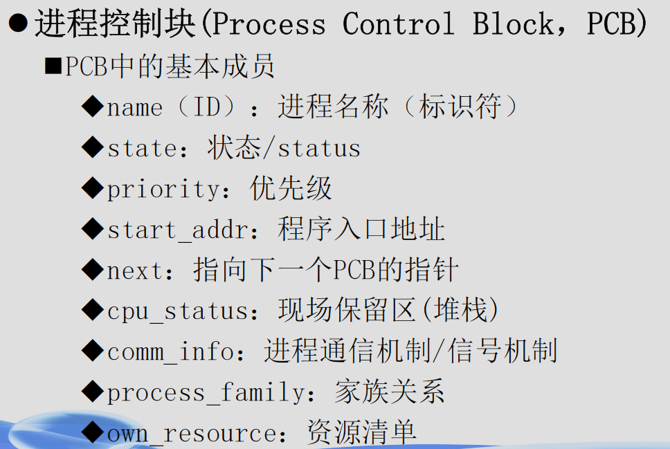
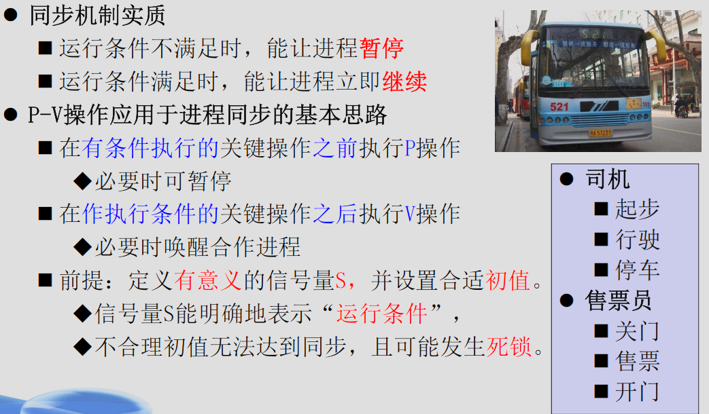
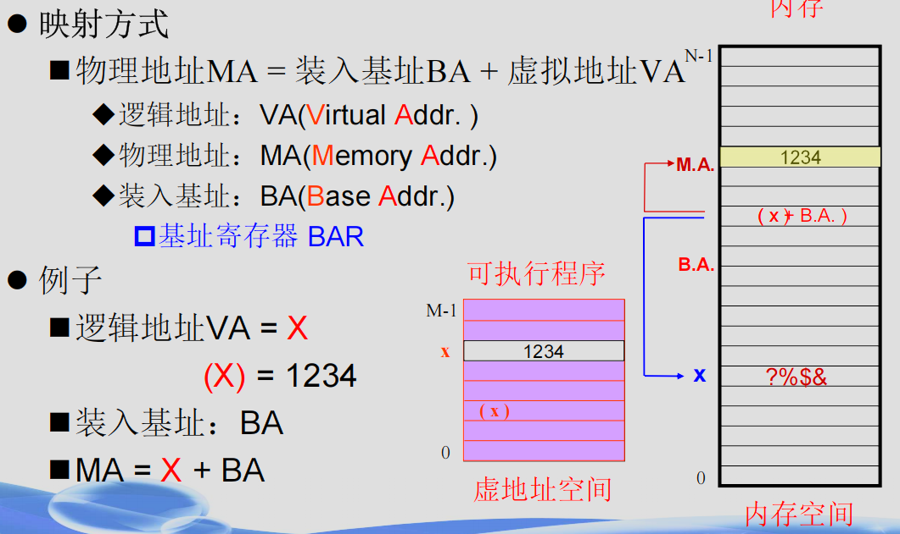
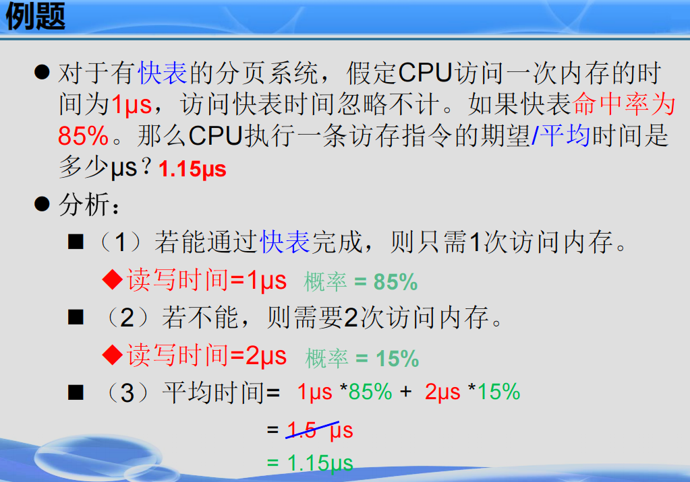
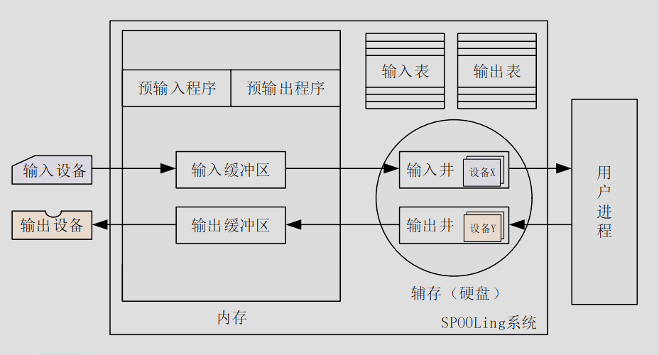
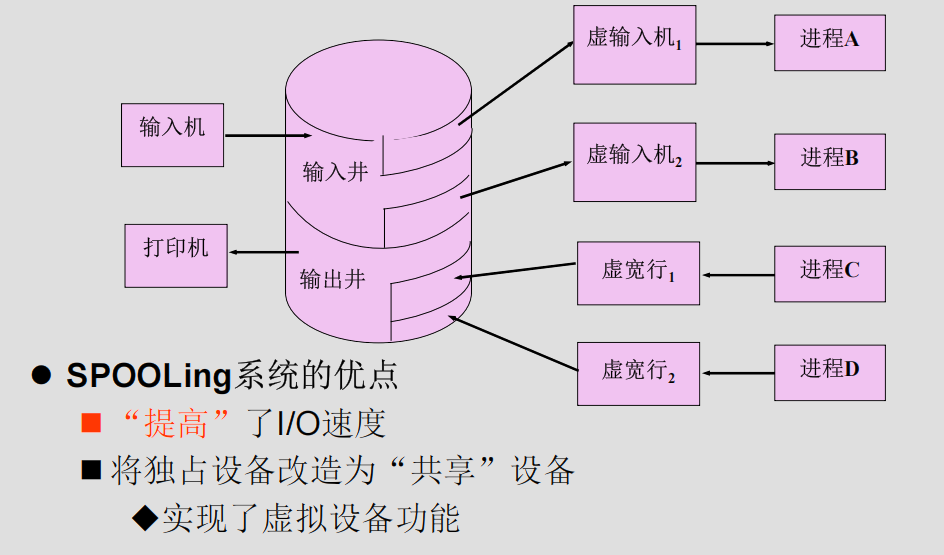

# 复习纲要

这里是 Bolaxious 的操作系统复习纲要，教材为《操作系统原理（慕课版）》（苏曙光），分九个章节：概述、硬件基础、用户界面、进程管理、死锁、进程调度、存储管理、设备管理、文件管理。

## 概要

操作系统提供了这些直观的基本功能：提供操作界面、控制程序运行、管理系统资源、配置系统参数、监控系统状态、工具软件集合。

### 定义

操作系统是一个大型的程序系统，它负责计算机系统软件/硬件资源的分配；控制和协调并发活动；提供用户接口，使用户获得良好的工作环境。简而言之就是：**管理调度资源、提供用户接口。**


上图展示了操作系统的地位。

这也就要求并赋予了操作系统以特性：具有同时处理多个任务的能力、为多个并发任务提供资源共享、具有处理随机事件(中断)的能力，简言之就是：**并发性、共享性、不确定性**

至于发展历史，我们在此略过。

### 功能

资源管理是操作系统的主要任务，从这个观点来分析操作系统的功能可以分为四个基本功能：处理机管理、存储管理、设备管理、文件管理

#### 处理机管理/进程管理

我们先要了解“进程”的概念：

OS 会在任何时候和任何地点暂停或继续任何程序的运行。在并发环境下，“程序”不足以描述程序的运行过程并确保运行结果的正确，故而我们需要引入进程来确保程序的独立运行。

处理机的具体功能包括：

- 进程控制：创建，暂停，唤醒，撤销
- 进程调度：调度策略，优先级
- 进程通信：进程间通信

#### 存储管理/内存管理

具体功能包括：

- 内存分配
- 内存共享
- 内存保护
- 内存扩充
- 虚拟内存

#### 设备管理

设备管理的具体功能包括：

- 设备的分配和回收
- 设备的驱动机制/传输控制
- 为应用提供统一接口访问设备
  - 设备无关性
- 高效存取设备/缓冲机制

#### 文件管理

文件管理为用户提供统一的文件存取接口，高效组织存储空间，提高存取效率，实现信息共享和存取控制。

我们可以这样理解：文件是设备的抽象

具体功能包括：

文件用户接口

- 存储空间管理
- 文件的操作
- 目录的操作
- 存取权限管理

### 性能

我们可以从下面几个指标来评价操作系统的性能

- 吞吐率
  - 在单位时间内处理信息的能力。
- 资源利用率
  - 设备(CPU)使用的频度
- 响应能力
  - 从接收数据到输出结果的时间间隔。
- 可移植性
  - 改变硬件环境仍能正常工作的能力:代码修改量（为了适配新的硬件需要做一定的修改工作，也就是移植，如果抽象和通用的接口多，那么代码修改量就会小很多，可移植性就越高）
- 可靠性
  - 发现、诊断和恢复系统故障的能力。

### 发展历史

操作系统发展的四个典型阶段

- 手工操作(无操作系统)（40 年代-50 年代初）
- 单道批处理系统（ 50 年代）
- 多道批处理系统（60 年代初）
- 分时操作系统（60 年代中-至今）

手工操作时期，用户依靠卡片/纸带和计算机交互，CPU 利用率低、用户独占且缺少交互；

单道批处理系统随着 IBM7094 晶体管计算机而出现，它的工作过程是管理员将多个作业输入到磁盘形成作业队列；监控程序（操作系统）依次自动处理磁盘中每个作业：装入—运行—撤出—装入—运行—撤出并循环；运行完毕，通知用户取结果，不过这种方式仍然效率较低。

多道批处理系统进行了改进：内存中存放多道程序,当某道程序因为某种原因（例
如请求 I/O 时）不能继续运行时，监控程序/OS 便调度另一道程序投入运行，这样使 CPU 尽量处于忙碌状态，提高系统效率。多道技术是现代操作系统的雏形。

::: tip

- 时分：分成多个时段：不同程序错开时段使用。
- 空分：分成多个单元：不同程序使用不同单元。
  :::

分时操作系统的核心概念是“时间片”（较短的时间长度），主机以很短的时间片为单位，把 CPU 轮流分配给各个终端(作业)使用，直到全部作业被运行完。Unix/Linux/Windows 都是分时操作系统。

分时操作系统目前有了更多的衍化：实时操作系统/嵌入式操作系统、微机操作系统（PC 机操作系统）、多处理机操作系统、网络操作系统、分布式操作系统、嵌入式操作系统。

### 逻辑结构

逻辑结构也就是 OS 的设计和实现思路，分为：整体式结构、层次式结构、微内核结构。

#### 整体式结构 OS

整体式结构以模块为基本单位构建，每个模块都有特定的功能。Unix/Linux 就是典型的整体式 OS。


整体式结构的优点如下：

- 模块设计、编码和调试独立
- 模块之间可以自由调用

#### 层次式结构

层次式结构将操作系统的功能模块按调用次序排若干层，保证各层单向依赖或单向调用。


分层原则如下：

- 最底层：硬件相关
- 最顶层：用户策略/用户交互
- 中间层：按调用次序/消息传递顺序
- 较低层：共性的、活跃的服务

优点是：

- 结构清晰，避免循环调用。
- 整体问题局部化，系统的正确性容易保证。
- 有利于操作系统的移植、维护、扩充。

#### 微内核结构（客户/服务器结构）

`操作系统 = 微内核 + 核外服务器`


微内核体积较小，完成的是操作系统基本的核心功能和服务；

核外服务器完成OS的绝大部分功能，等待应用程序提出服务请求。它由若干服务器或进程共同构成。

## 硬件基础

计算机的硬件结构主要包括：CPU、内存、外设，三者通过地址/数据/控制三条总线相连接，3条总线通过时序变换执行指令，从而实现程序的执行。

而操作系统依赖的最基本硬件为：CPU、内存、时钟、中断。

### CPU与CPU的态

CPU（Central Processing Unit）即中央处理器，它的功能主要是按照一定的逻辑流程分析和执行指令流。

CPU再逻辑上可以划分为3个单元：分别为控制单元、运算单元和寄存器单元


为CPU设定态的目的在于为系统建立安全机制，不同的态支持程序使用不同的指令集和资源。故而我们需要了解一下操作系统需要考虑的安全问题，才能更好的理解设计态的理由。

::: tip 操作系统需要考虑的安全问题

目前OS的多道程序设计技术的特点是：多进程并发/资源共享，所以我们需要考虑到：

- 防止进程的信息被非法访问
- 防止进程随意存取系统资源
- 防止进程修改系统安全机制

提出的解决策略为：

- 对于软件，分级/分类（例如分为可信软件和不可信软件）
  - 对于可信软件
    - 可以修改安全保护机制
    - 可以存取系统资源
    - 拥有普通指令集 + 特权指令集
- 对于硬件，分模式（设置访问屏障）
  - 模式（态）：描述指令使用和资源访问的权限
::: 
::: tip 特权级

Intel x86架构的CPU支持 Ring0~3 的特权级，权限逐次降低，Unix/Linux/Windows 只使用了0和3两种特权级。

:::
对于CPU的态，分类为3种：

- 核态(Kernel mode)
  - 能够访问所有资源和执行所有指令
  - 管理程序/OS内核
- 用户态 (User mode,目态)
  - 仅能访问部分资源，其它资源受限
- 管态(Supervisor mode)，它介于核态和用户态之间。

通过设置模式位表示态，CPU就能通过它来进行权限判断，从而保证系统安全。

用户态和核态之间的转换：
- 用户态向核态转换
  - 用户请求OS提供服务
  - 用户进程产生错误（内部中断）
  - 用户态企图执行特权指令
  - 发生中断
- 核态向用户态转换的情形
  - 一般是中断返回：IRET

特权指令包括：
- 涉及外部设备的输入/输出指令
- 修改特殊寄存器的指令
- 改变机器状态的指令

### 内存

内存也叫主存，分为只读存储器-ROM、随机存储器-RAM和高速缓存存储器-Cache三种。

ROM主要存BIOS之类的系统程序（因为它不可读）

RAM是内存条。

Cache位于CPU和内存之间，用来缓存内存中的某一小部分数据。

### 时钟

计算机设置有一个硬件定时器，能够定时向处理器发出时间信号，帮助处理一些依赖时间概念的地方。

### 中断机制

中断是指CPU对突发的外部事件的反应过程或机制，CPU收到外部信号（中断信号）后，停止当前工作，转去处理该外部事件，处理完毕后回到原来工作的中断处（断点）继续原来的工作。

中断包括一些概念如：中断源、中断类型、断点、现场、现场处理，不过记不住，不写了。

中断响应过程如下：

- 识别中断源
- 保护断点
- 保护现场(中断服务程序的前段)
- 中断服务程序(主体)
- 恢复现场(中断服务程序的末段)
- 中断返回(恢复断点)

引入中断机制目的在于实现并发、实现实时处理、和自动处理故障。

### BIOS

BIOS（基本输入输出系统）是被固化到计算机中的一组程序，提供最基础最直接的硬件操控，它的主要功能有以下四个：

- 加电自检和初始化
- 设置CMOS参数
- 基本输入输出服务
- 加载并引导操作系统启动

#### 加电自检和初始化

加电自检（Power On Slef-Test，POST）初始化基本硬件（CPU、内存、显卡），自检若由严重错误则停机、不严重故障则给出提示。

#### CMOS设置

计算机加电引导过程中通过特殊热键进入到CMOS设置程序中，设置基本的系统参数：系统日期、时间、系统口令等等。

#### 基本输入输出服务

BIOS主要是为应用程序、操作系统提供硬件接口服务，例如显示字符串、读写磁盘等等。

基本输入输出处理程序是通过中断服务指令的形式来实现的，每组服务都有一个专门的中断号，BIOS使用的中断类型号为10H ~ 1FH，每组服务又分为不同子功能，用子功能编号标识。

`使用案例：使用INT 13H软盘I/O类服务中的02H子功能读取软盘第21个扇区的内容到内存1000h：0000h处`


#### 加载并引导操作系统启动


### 操作系统的启动过程

从加电到用户工作环境准备好的过程分为三个阶段：初始引导、核心初始化、系统初始化，它们做的工作分别为：把OS内核装入内存并使之开始工作接管计算机系统、OS内核初始化系统的核心数据、为用户使用系统作准备，使系统处于待命状态


这里简略了Linux的启动过程，包括MBR、GRUB的一些概念。

### 计算机虚拟化/虚拟机

PPT上没有，略过。

### 操作系统的生成

指根据硬件环境和用户需要，配置和构建操作系统的过程。

::: tip
这里包括一个[Linux编译内核并安装内核的实验](https://mengbooo.github.io/BemoDB/posts/os/experiment/Q_ex_1/sys-1.html)
:::

## 用户界面

用户环境是指计算机用户工作的软件环境，包括命令行环境、桌面环境、相关的用户使用手册。

### 用户界面概念

操作系统提供给用户控制计算机的机制(用户接口)，可分为操作界面（操作命令、批处理命令、图形用户界面）和系统调用（是提供给程序员在编程时使用的接口，取得操作系统服务的唯一途径）


### 操作界面

分为：

- 图形用户接口/GUI
- 操作命令（普通命令）
- 批处理与脚本程序(bat、shell)

::: tip Linux典型命令

:::

::: tip shell编程指南
Bash:https://blog.csdn.net/qq_26690505/article/details/109361345
:::

这里省略了重定向和管道命令，它们是特殊的操作命令，可以结合常规的操作命令来实现一些特殊的效果和功能。

### 系统调用

系统调用(System Call，System Service Call)是操作系统内核为应用程序提供的服务/函数。例如：printf、exit、INT 21H等等


系统调用都有唯一的编号，通过类似 SVC N 的指令来调用第N号系统调用，例如：

- DOS ： INT 21H + AH
- Linux ： INT 80H + EAX

INT XXH 为SVC指令，AH/EAX为系统调用的编号N。

下图是系统调用的执行过程：


下图是Linux系统调用的工作原理：


## 进程管理

进程是操作系统进行资源分配和调度的基本单位，它是操作系统的执行实体。

### 进程概念Process

多道批处理系统和分时系统的核心思想都是让CPU尽可能地被利用，故而程序的顺序执行效率太低而被淘汰，采用程序的并发执行才能保证利用率。

但是程序运行在并发环境中有几个问题：

- 运行过程不稳定
- 失去封闭性：共享资源和共享变量的开放性可能导致运行结果的错误
- 不可再现性：并发程序的相对运行速度不受应用程序控制，导致结果往往不可预测
  
这也就是说，程序的概念不足以描述运行过程并保证结果正确，所以我们需要引入进程这一概念，描述程序动态执行的过程以及一些特征，对运行过程施加制约和管理。

我们定义：进程时程序在某个数据集合上的依次运行活动（数据集合：软硬件环境/多个进程共存共享的环境），它有几个特点：

- 动态性：进程是动态生成和消亡的，它是系统运行的最小单位
- 并发性：进程可以同其它进程一起向前推进
- 异步性：进程按照各自速度向前推进
- 独立性：进程是系统调度的基本单位

Windows中可以通过任务管理器查看进程信息，Linux中可以通过`ps aux`查看进程信息。

进程与程序的区别：
- 动态与静态
  - 进程是动态的：程序的一次执行过程
  - 程序是静态的：一组指令的有序集合
- 暂存与长存
  - 进程是暂存的：在内存驻留
  - 程序是长存的：在介质上长期保存
- 程序和进程的对应
  - 一个程序可能有多个进程。

### 进程状态与转换

大多数操作系统把进程分为3种状态：

1. 运行态（Running）：进程正在执行
2. 就绪态（Ready）：进程已在内存中，等待被调度
3. 阻塞态（Blocked）：进程正在等待某一事件的发生


有些操作系统为了进行更精确的控制引入了两个新的状态：新建状态（new）和终止状态（exit），它的进程状态如下：


当系统负荷很高时，进程可能需要“挂起”，反向操作就是“解挂”，有了这两种操作，定义的阻塞状态和就绪状态就会各自分为两种状态：


Linux系统中，进程的状态如图：


### 进程控制块

我们必须设计一个有效的数据结构来满足进程的管理和控制，这个数据结构也就是进程控制块(Process Control Block，PCB)，用来描述进程的状态、资源、和相关进程的关系。



进程存在期间PCB都与之相随：进程 = 程序 + PCB

### Linux进程控制块

Linux进程控制块被定义为 task_struct ，是一个结构体，被称为任务结构体，它包含如下信息：


Linux和进程标识相关的成员变量有：

- pid：进程标识符
- ppid：父进程标识符
- pgid：进程组标识符
- uid：用户标识符
- gid：用户组标识符


### 进程控制

操作系统需要提供各种控制手段，在进程生存全期间，控制进程的全部行为，四个典型的进程控制步骤：创建进程、撤销进程、阻塞进程、唤醒进程。

#### 创建进程

用来创建一个具有指定标识（ID）的新进程，并为其分配资源，参数包括：进程标识ID、进程起始地址、CPU上下文等等

创建进程的过程如下：


#### 撤销进程

用于撤销一个指定的进程，收回进程所占有的资源，撤销该进程的PCB，一般发生在正常结束、异常结束、外界干预

它的实现过程如下：


#### 阻塞进程

停止进程执行，变为阻塞，一般发生在：请求系统服务、启动某种操作、新数据尚未到达的时机

实现过程如下：


#### 唤醒进程

唤醒处于阻塞队列当中的某个进程。一般是在系统服务由不满足到满足、I/O操作完成、新数据到达的时机发生

#### 原语

进程控制的操作要么完全成功要么完全失败，故而必须采用特殊方式实现，也就是“原语”，它是由若干条指令组成的一段小程序，要么完全成功要么完全失败不可被中断。

操作系统通过创建原语 | 撤消原语 | 阻塞原语 | 唤醒原语来实现对进程的控制。

### Windows进程控制

Windows 除了用户通过用户界面启动进程外还可以通过系统API函数来创建进程，例如 system()/WinExec()/ShellExecute() 能将参数中指明的应用程序运行起来，上面的三个函数最终都会调用最底层的 CreateProcess() 函数来创建进程。

结束进程则可以通过 ExitProcess() 、TerminateProcess() 等函数来实现。

### Linux进程控制

在Linux创建进程使用 fork() 函数，此外还有 clone() 和 execve() 函数。

``` 
pif_t fork(void);
```

fork函数采用写时复制机制来创建新进程，可以理解为子进程为父进程的复制但做了一些修改，父进程和子进程并发运行。在子进程中 pid 为 0，父进程中 pid 为子进程的进程号。接下来我们看两个例子。


应该先后输出两个字符串

``` 
Hello World!
How are you?
```

也有可能反序输出，因为用户无法控制并发的父子进程到底是谁先执行各自的 printf 语句，也有可能因为缓冲区的原因导致父子进程的输出交错在一起


父进程先输出子进程后输出则结果为 bcac

总而言之，fork() 就是让操作系统“克隆”当前进程，生成一个几乎一样的子进程，然后父子进程各自继续往下执行代码，通过返回值来区分谁是谁。所以这就保证了进程能够执行特定的代码。

而exec函数族则保证了子进程能够执行特定的程序：

::: tip exec函数族
exec函数族(包括若干系列函数)
- 功能
  - 在子进程空间运行指定的“可执行程序”
- 步骤
  - 根据文件名找到相应的可执行程序。
  - 可执行程序的内容填入子进程的地址空间
- 返回
  - exec调用成功：进入新进程且不再返回。
  - exec调用失败：继续从调用点向下执行。
:::

使用 exec 函数，在子进程中就能保证执行不同的程序，并发服务器依托的就是这个特性。

此外还有一个函数 vfork(),它和 fork() 的区别在于 vfork() 创建的子进程是共享父进程的地址空间的，父进程会被挂起，直到子进程调用 exec() 或 exit() 函数。vfork() 适用于创建一个新进程并立即执行 exec() 函数的场景。下面两张图很好的解释了 vfork() 和 fork() 的区别：


#### fork 函数的实现


fork函数的实现过程如下：


::: details 源码分析
### 分析图中的源代码

图中展示的是 `fork()` 系统调用的实现部分，具体是一个汇编代码片段。我们结合这段代码来讲解 `fork()` 的实现细节。

---

#### **代码片段分析**

```asm
_sys_fork:
    call _find_empty_process
    testl %eax, %eax
    js 1f
    push %gs
    pushl %esi
    pushl %edi
    pushl %ebp
    pushl %eax
    call _copy_process
    addl $20, %esp
1:  ret
```

#### **逐行解析**

1. **`call _find_empty_process`**
   - 调用 `_find_empty_process` 函数。
   - 这个函数的作用是为新进程分配一个空闲的进程控制块（PCB）。在操作系统中，进程控制块是描述进程状态的核心数据结构。
   - 如果成功找到一个空闲的 PCB，返回值会存储在寄存器 `%eax` 中。

2. **`testl %eax, %eax`**
   - 检查 `%eax` 是否为零。
   - `testl` 是一个逻辑与操作，用于检测 `%eax` 的值是否有效。
   - 如果 `%eax` 为零，表示没有找到空闲的 PCB，或者发生了错误。

3. **`js 1f`**
   - `js` 是条件跳转指令，检查 `%eax` 的符号位（最高位）。
   - 如果 `%eax` 是负数（即发生了错误），跳转到标号 `1:` 处。
   - 如果 `%eax` 是正数或零（正常情况），继续执行后续代码。

4. **保存寄存器**
   ```asm
   push %gs
   pushl %esi
   pushl %edi
   pushl %ebp
   pushl %eax
   ```
   - 这些指令将当前进程的寄存器值压入栈中。
   - 具体包括：
     - `%gs`: 段寄存器，用于访问全局变量。
     - `%esi`, `%edi`, `%ebp`, `%eax`: 通用寄存器。
   - 这一步是为了保存父进程的上下文，以便在创建子进程后恢复父进程的状态。

5. **`call _copy_process`**
   - 调用 `_copy_process` 函数。
   - 这是 `fork()` 实现的核心部分，负责复制父进程的所有资源到子进程中，包括：
     - 虚拟内存空间（共享页面，使用写时复制技术）。
     - 打开的文件描述符。
     - 信号处理等。
   - `_copy_process` 返回后，子进程已经创建完成。

6. **恢复栈**
   ```asm
   addl $20, %esp
   ```
   - 将栈指针 `%esp` 向上移动 20 字节，恢复之前保存的寄存器值。
   - 因为之前保存了 5 个寄存器（`%gs`, `%esi`, `%edi`, `%ebp`, `%eax`），每个寄存器占用 4 字节，所以总共需要恢复 20 字节。

7. **`ret`**
   - 返回到调用 `_sys_fork` 的地方。
   - 如果是父进程，返回子进程的 PID；如果是子进程，返回 0。

---

#### **整体流程总结**

1. **查找空闲进程**：
   - 调用 `_find_empty_process` 找到一个空闲的进程控制块（PCB）。
   - 如果找不到空闲的 PCB 或者发生错误，直接返回。

2. **保存父进程上下文**：
   - 将父进程的寄存器值（如 `%gs`, `%esi`, `%edi`, `%ebp`, `%eax`）压入栈中，保存当前状态。

3. **复制进程**：
   - 调用 `_copy_process`，复制父进程的所有资源到子进程中。
   - 子进程和父进程几乎完全相同，但它们有自己的独立地址空间和进程 ID。

4. **恢复父进程状态**：
   - `_copy_process` 返回后，恢复父进程的寄存器值，继续执行后续代码。

5. **返回结果**：
   - 父进程返回子进程的 PID。
   - 子进程返回 0。

---

#### **关键点**

- **写时复制（Copy-on-Write, CoW）**：
  - 在现代操作系统中，`fork()` 并不会立即复制父进程的所有内存，而是采用写时复制技术。
  - 父进程和子进程共享相同的虚拟内存页，直到某个进程尝试修改这些页时，才会真正复制。

- **并发执行**：
  - 父进程和子进程是并发执行的，因此输出顺序可能不确定。

---

### **结合代码的运行结果**

根据图中的代码，`fork()` 的实现可以总结为以下步骤：

1. 查找空闲的进程控制块。
2. 保存父进程的上下文。
3. 复制父进程的所有资源到子进程中。
4. 恢复父进程的上下文。
5. 返回子进程的 PID 给父进程，返回 0 给子进程。

最终，父进程和子进程会并发执行，分别打印不同的内容。

---

### **最终答案**

图中的代码展示了 `fork()` 系统调用的核心实现步骤，包括查找空闲进程、保存父进程上下文、复制进程资源以及恢复父进程状态。通过这些步骤，操作系统成功创建了一个新的子进程，并实现了父子进程的区分。
:::

再给出一个案例：


程序运行步骤：
- 父进程调用 fork() 创建子进程。
- 子进程执行 getpid() 获取自己的 PID 并打印，然后休眠 10 秒。
- 父进程调用 wait(NULL) 等待子进程结束，并获取子进程的 PID，然后打印。
- 父进程调用 exit(0) 结束程序。

故而 pid_1 等于 pid_2。

#### sleep() 休眠进程


#### exit() 结束进程


#### wait() 等待进程


pid = -1 表示等待任意子进程结束

### 线程

进程和进程之间是并发运行的，而在进程内部则是串行运行的，如果我们要实现两个任务：画一个圆和画一个方的并发执行，在目前的概念认知上我们需要编写两个程序分别完成，但是如果需要在一个程序内且需要并发，则需要引入线程的概念。

线程是进程内创建的可运行模块/指令序列，能执行指定的任务。进程内可以定义多个线程。线程和线程可以并发运行。

大多数操作系统都支持多线程，Windows 和 Linux 都是如此。

线程提供了更好的细粒度，管理成本更低，线程间的通信更容易。

所以回到上面的问题，我们该如何创建线程？

#### Windows 中创建线程

使用 CreateThread(TaskFunction) 函数创建线程，并指定任务


需要功能并发、提升用户体验、改善程序结构、发挥多核 CPU 性能时使用线程。

线程现在是操作系统的基本调度单位，故而我们可以拆分进程为“线程组 + 资源集”。


#### Linux 中创建线程

Linux 的线程分为 内核线程和用户线程。

- 对于内核线程/Kernel Thread
  - 使用 kthread_create() 创建
  - 创建/运行/撤销均在内核内完成，由内核驱动
  - 只在内核空间运行


- 对于用户线程/User Thread
  - 使用 pthread 线程库创建/管理，也可以使用 clone() 函数来创建


::: tip 远程线程
远程线程（Remote Thread）是指在一个进程中创建一个线程，但该线程的执行环境位于另一个进程的地址空间中。这种技术允许一个进程在另一个进程的上下文中执行代码，从而实现跨进程的操作。

使用 CreateRemoteThread() 函数创建远程线程
:::

### 进程间相互制约关系

并发环境下程序失去了封闭性，故而需要引入进程的互斥关系和同步关系保证数据的正确性。

#### 互斥关系

多个进程共享具有独占性的资源时必须确保各进程互斥地存取资源，即确保没有任何两个进程同时存取资源。

存取资源：相关区域的读/写操作，进程应互斥访问这些区域。

#### 同步关系

若干合作进程为了共同完成一个任务，需要相互协调运行步伐：一个进程A开始某个操作之前要求另一个进程B必须已经完成另一个操作，否则进程A只能等待。

这也就是说合作进程中某个操作能否进行需要某个前提条件满足，所以互斥关系实际上也是一种特殊的同步关系。

### 同步机制/锁机制

1. 当进程的某个操作不能执行时（即运行条件不满足时）能让该进程立即暂停执行；
2. 当暂停的操作条件一旦满足时，能被立即唤醒继续运行。
3. 同步进制在实现上需要满足原子性。

::: tip 临界资源和临界区
临界资源（Critical Resource）就是多个线程或进程都想用的一个东西 ，但这个东西一次只能被一个人用

临界区（Critical Section）就是程序中访问“临界资源”的那段代码 。为了防止别人同时使用资源，这段代码要保证同一时间只有一个线程能执行它。
:::

同步机制很大一部分就是操作临界资源和临界区，对于硬件可以通过中断屏蔽、测试设置、交换指令来实现，这里略过；而在软件上可以通过锁机制和信号量来实现。

#### 锁机制


::: tip 设计临界区访问机制的四个原则
- 忙则等待：临界区忙时，其它进程必须在临界区外等待
- 空闲让进：当无进程处于临界区时，任何有权进程可进入临界区
- 有限等待：进程进入临界区的请求应在有限时间内得到满足
- 让权等待：等待进程放弃CPU
:::

锁机制不满足第四个原则，故而会导致死锁。故而引入信号量解决这个问题

### 信号量与P-V操作

信号量借鉴了公共交通的信号灯概念，用于控制进程的访问权限。


信号量机制对它的核心数据结构(S,Q)定义了两种操作：P操作和V操作。两个操作的描述如下：


可以简单理解为，P操作让进程停下来，V操作让进程继续运行，S的增加代表临界资源被释放，S的减少代表临界资源被占用。




#### 进程流图

进程流图是对P-V操作的简化描述，知道怎么分析即可。

这里给出一个例子：


1. 初始状态：S2 = 0，S3 = 0，P2 和 P3 被阻塞。
2. P1 执行后：S2 = 1，S3 = 1，P2 和 P3 被唤醒。
3. P2 执行后：S2 = 0，S3 = 1。
4. P3 执行后：S2 = 0，S3 = 0。

### 经典同步问题

#### 生产者-消费者问题


#### 读者-写者问题


此外这里还有PPT上的几个题目，这里略过

### Windows/Linux同步机制与应用/进程通信

PPT上相关内容不多，略过。

## 死锁

承接上面的经典同步问题，我们有一个哲学家就餐问题如下：


如果我们尝试用线程去实现哲学家的生活：


死锁指的是两个或多个进程无限期地等待永远不会发生的条件的一种系统状态。【结果：每个进程都永远阻塞】

而在哲学家就餐问题中，每个哲学家都无限期地等待邻座放下筷子！而邻座没有吃完之前不会放下筷子！而邻座缺一只筷子永远都无法吃完！

::: tip 资源概念/分类
资源概念：竞争使用，数量有限，共享
- 可抢占资源
  - 可以被多个进程同时访问
  - 被一个进程占用后，在该进程使用完之前，可以被其
他进程抢占，但是并不影响相关进程的运行结果。
  - CPU和内存
- 不可抢占资源
  - 被一个进程占用后，除非该进程已使用完并释放了它，其
他进程不能强行抢占该资源。
  - 大多数硬件资源和软件资源。
:::

死锁发生的原因就包括：系统资源有限导致的竞争、并发进程的推进顺序不当

关于死锁的一些结论：
- 陷入死锁的进程至少是2个
  - 两个或以上进程才会出现死锁
- 参与死锁的进程至少有2个已经占有资源
- 参与死锁的所有进程都在等待资源
- 参与死锁的进程是当前系统中所有进程的子集
- 死锁会浪费大量系统资源，甚至导致系统崩溃

### 必要条件

- 互斥条件
资源具有独占性，进程互斥使用资源。

- 不剥夺条件
资源被访问完之前(即在释放前)不能被其他进程剥夺。

- 部分分配条件
进程所需资源逐步分配，需要时临时申请（等待分配）。占有一些资源，同时申请新资源。

- 环路条件
多个进程构成环路：环中每个进程已占用的资源被前一进程申请，而自己所需新资源又被环中后一进程所占用。例如在就餐问题中如果人数为4人则会破坏环路。

### 死锁的处理

一般从以下四个方面解决死锁问题：
- 死锁预防
  - 破坏死锁的必要条件之一
  - 例如：不剥夺条件：允许进程抢占资源
- 死锁避免
  - 破坏死锁的必要条件之一
  - 例如：银行家算法
- 死锁检测
  - 允许死锁发生，定期检测死锁
  - 例如：资源分配图算法
- 死锁恢复
  - 允许死锁发生，检测后采取措施
  - 例如：撤销进程、抢占资源

其实都是围绕破坏死锁的必要条件来进行的。

## 进程调度（处理机调度）

所有进程共享一个CPU，以合适的策略从众多的处于就绪状态的进程中选择一个进程运行，这个过程称为进程调度。

### 调度概念

调度在广义上是指在一个队列中按照某种策略从中选择一个最合适的个体进行处理。

按照调度的层次或原因可以分为

- 长程调度（调度磁盘上的作业到内存中处理）
- 中程调度（短期调节系统的负荷，把进程在内存和磁盘交换空间之间进行对换）
- 短程调度（进程的运行、就绪、阻塞3个基本状态间的转换由短程调度完成，尤其是从就绪进程队列选择一个合适的进程来运行）
- I/O调度（指当I/O设备可用时，调度相应的等待队列里的进程来使用该设备W）。


### 调度的宏观原则

- 响应速度尽可能快 交互程序 CPU切换频繁
- 进程处理的时间尽可能短 特定进程优先 后台程序
- 系统吞吐量尽可能大 CPU有效工作时间多
- 资源利用率尽可能高
- 对所有进程要公平 部分进程饥饿
- 避免饥饿
- 避免死锁

上述部分原则之间存在自相矛盾，实际上，操作系统会根据特定的应用场景采取这种的方式来采纳这些原则。


### 调度的时间性能测度

评价调度的性能除了宏观原则，也用周转时间和带权周转时间来评价，下面的两图介绍了4个测量指标：


### 作业调度算法

典型的作业调度算法有三种：

- 先来先服务（FCFS）：按照作业到达的时间先后顺序进行调度，简单易实现，但是只考虑作业等候时间不考虑作业大小/晚来的作业会等待较长时间/不利于晚来但是很短的作业

- 最短作业优先（SJF）：选择时间最短的作业，能有效减少平均周转时间，忽视了作业等待时间/早来的长作业会长时间等待（也就是饥饿现象）

::: tip 响应比
响应比指的是作业的响应时间和与运行时间的比值 = 1 + 等待时间 / 运行时间 = 加权周转时间（即时的）
::: 

- 响应比高者优先调度：调度作业时计算作业列表中每个作业的响应比，选择响应比最高的作业优先投入运行。有利于短作业/有利于等待已久的长作业。每次调度时重新计算和比较剩余作业的响应比

### 进程调度算法

典型的进程调度算法由以下4种：

- 循环轮转调度法
- 优先数调度算法
- 可变时间片轮转调度法
- 多重时间片循环调度法

#### 循环轮转调度法

把所有就绪进程按先进先出的原则排成队列。新来进程加到队列末尾。

进程以时间片q为单位轮流使用CPU。刚刚运行了一个时间片的进程排到队列末尾，等候下一轮调度。队列逻辑上是环形的。


优点在于：保证每个就绪过程都能得到CPU的使用机会；每个进程等待（N-1）*q时间片后就能重新获得CPU。

但是如果时间片q太大，则交互性差，就会退化到先来先服务（FCFS）调度算法；如果q太小，进程频繁切换，系统开销会增加。

改进：

- 时间片的大小可变（可变时间片轮转调度法）
- 组织多个就绪队列（多重时间片循环调度法）

这里就不作对上面说的两种调度算法的介绍了，核心思想就是上面的两个改进。

#### 优先数调度算法

该算法根据进程优先数将CPU分配给最高的进程。

::: tip 进程优先数
进程优先数 = 静态优先数 +动态优先数

其中，静态优先数是在进程创建时确定，在整个进程运行期间不再改变；动态优先数再进程运行期间可以改变。

- 静态优先数的确定
  - 基于进程所需的资源多少
  - 基于程序运行时间的长短
  - 基于进程的类型(IO/CPU，前台/后台，核心/用户)
- 动态优先数的确定
  - 当进程使用CPU超过一定时长时；
  - 当进程等待时间超过一定时长时；
  - 当进行I/O操作后；
:::

#### 调度方式

调度方式指的是当一进程正在CPU上运行时，若有更高优先级的进程进入就绪，系统如何对待新进程（分配CPU）

分为非抢占方式和抢占方式

- 非抢占方式：新进程进入就绪队列后，等待当前进程运行完毕后或发生某事件而“完成”或“阻塞”状态时再调度新进程
- 抢占方式：新进程进入就绪队列后，立即中断当前进程，将CPU分配给新进程

### Linux进程调度

Linux的进程调度基于优先级调度，支持普通进程也支持实时进程（实时进程优先于普通进程），普通进程公平使用CPU时间。

::: tip 实时进程
是指需要在严格的时间限制内完成的进程。其响应时间和执行时间必须满足特定的时限要求，否则可能会导致系统故障或严重后果（例如工业控制、医疗设备、航空航天等场景）。
:::

task_struct 结构体是 Linux 内核中描述进程的核心数据结构，包含了进程的状态、优先级、调度策略等信息。


关于 schedule 调度函数的部分这里略过。

## 内存管理

存储管理是操作系统的核心功能，它负责管理计算机的主存储器（ROM、RAM）还负责管理外存储器（硬盘、软盘）。

这一章节的主要内容是内存管理的功能、物理内存管理、虚拟内存管理、Linux存储管理、保护模式。重点需要掌握地址映射、虚拟内存、页式管理、段式管理、保护模式内存管理机制。

### 存储管理的功能

存储管理系统主要包括4个主要功能：

- 地址映射
- 存储扩充/虚拟存储
- 内存分配
- 存储保护

#### 多级存储体系

理想的存储系统应该有以下几个特点：

- 容量大
- 存取速度快
- 信息永久保存
- 成本低

计算机的存储体系如图：


::: tip 辅存支援内存的基本思路

辅存支援内存的基本思路是将辅存中的一部分内容调入内存中，供CPU使用。辅存中的内容可以是程序、数据或文件等。

如果是放到原来位置的话，优点在于程序简单但是可能导致地址冲突

如果是放到新位置的话，优点在于可以避免地址冲突，但是需要地址映射。

于是引入地址重定位（地址重映射），重新确定指令中目标数据的正确地址，新的地址与目标程序的实际放置位置有关
:::

#### 地址映射

地址映射指的是把程序中的地址（虚拟地址,虚地址,逻辑地址,相对地址）变换成真实的内存地址（实地址,物理地址,绝对地址）的过程。

虚拟地址/源程序地址指的一般是：地址/变量/标号/函数名。


而地址映射分为几种方式：固定地址映射/静态地址映射/动态地址映射，三种方式依次介绍：

##### 固定地址映射

固定地址映射是在编程或编译时确定逻辑地址和物理地址映射关系。

特点：
- 程序加载时必须加载到指定的内存区域（容易产生地址冲突，运行失败）
- 不能适应多道程序环境

##### 静态地址映射

静态地址映射是程序装入时由操作系统完成逻辑地址到物理地址的映射。

这就需要保证程序再运行之前所有的地址都绑定到主存。

映射方式如下：



特点：
- 程序运行之前就需要确定映射关系
- 程序占用连续的内存空间
- 程序装入后不能移动，如果移动则必须放回原来位置

##### 动态地址映射

动态地址映射在程序执行过程中把逻辑地址转换为物理地址。

它的映射方式为：物理地址MA = 装入基址BA + 虚拟地址VA ；其中装入基址为基址寄存器BAR提供的一个固定偏移量。

实现动态地址映射的思路如下：


简单总结就是：

- 动态地址映射 的核心是通过基址寄存器（BAR）将虚拟地址（VA）转换为物理地址（MA）。
- 基址寄存器（BAR） 存储了程序或段的基址（BA），是地址转换的关键。
- 段式存储管理 将程序划分为多个段，每个段独立管理，支持不连续的内存分配。
- 切换进程时 ，操作系统会同时切换基址寄存器（BAR），确保新进程使用正确的基址进行地址转换。

特点： 
- 程序占用的内存空间可动态变化（若程序移动则需要及时更新基址BA）
- 程序不要求占用连续的内存空间（但是需要记录每段放置的基址BA）
- 便于多个进程共享代码（共享代码作为独立的一段存放）

缺点是需要硬件支持（内存管理单元：MMU），软件比较复杂

#### 存储扩充/虚拟存储

存储扩充用来解决两个问题：

- 程序过大或过多时，内存不够无法运行
- 多个程序并发时地址冲突无法运行

对于问题一，借助辅存在逻辑上扩充内存，解决内存不足
- 迁入：装入将要运行的部分到内存（从辅存临时调入内存）
- 迁出：把不运行的部分暂存到辅存上（尽量腾空内存）

实现虚拟存储的前提是：
- 有适量容量的内存
- 有足够大的辅存
- 有地址变换机构

可以采用页式虚拟存储和段式虚拟存储，这里先略过。

#### 内存分配

内存分配是指操作系统为进程分配内存空间的过程。代码/数据/堆栈等等

需要解决的问题有三种：

- 放置策略
  - 程序/模块调入到内存哪个/哪些区域
- 调入策略
  - 什么时机把即将要运行的程序/模块调入内存
  - 预调策略/请调策略
- 淘汰策略
  - 迁出（淘汰）哪些程序/模块以腾出内存空间

#### 存储保护

保证内存中的多道程序只能在给定区域活动，并且互不干扰。

- 防止访问越界
- 防止访问越权

可以通过界址寄存器/存储键保护来实现。

- 界址寄存器
  - 上限地址寄存器/下限地址寄存器
    - 程序访问内存时硬件自动将目的地址与下限寄存器和上限寄存器中界限比较，判断是否越界？
  - 基址寄存器和限长寄存器
  - 适于连续物理分区中的情形

- 存储键保护
  - 每个存储单元都有一个存储键，程序访问内存时硬件自动将目的地址与存储键进行比较，判断是否越权
  - 适于非连续物理分区中的情形

也可以通过段式虚拟内存管理和页式虚拟内存管理来实现。这里先略过，后面再谈

### 物理内存管理

物理内存管理有四种方法：单一区存储管理（不分区存储管理）、分区存储管理、内存覆盖技术、内存交换技术

#### 单一区存储管理

单一区存储管理是指将整个内存作为一个整体来管理，用户区不分区，完全被一个程序占用。

优点在于简单不需要复杂硬件支持，缺点是程序占用整个内存导致内存浪费、利用率低；较为适用于单用户单任务OS如DOS、嵌入式系统

#### 分区存储管理

把用户区分为若干大小不等的分区供不同程序使用，有固定分区和动态分区两种分区方法。

对于固定分区存储管理，分区大小在系统启动时就已经确定，分区数目也固定。每个分区只能运行一个程序。缺点是浪费内存、大程序可能无法运行、程序过多无法运行。

动态分区再程序装入时动态创建分区，分区和程序大小相等，程序结束时收回占用分区重新分配，但是这会导致内存碎片（例如20K的程序结束后装入17K的程序，内存中会有3K的碎片无法使用）

所以动态分区需要解决的问题有：分区的选择/分配/回收，内存碎片的处理

对于分区的选择，引入空闲区表来描述内存空闲区的位置和大小，有三种依托于此表的放置策略：

- 首次适应法：从空闲区表的头部开始，选择第一个满足要求的空闲区（尽量保留高地址空间），这个方法的前提是空闲区表按照**地址递增**的顺序排列。
- 最佳适应法：选择第一个满足要求的最小空闲区（尽量保留大的空闲区），这个方法的前提是空闲区表按照**大小递增**的顺序排列。
- 最坏适应法：选择最大的空闲区（尽量保留小的空闲区），这个方法的前提是空闲区表按照**大小递减**的顺序排列。

对于内存碎片的问题采用以下方法解决：

- 规定门限值：分割空闲区时，若剩余部分小于门限值，则不分割，而是全部分配给用户
- 内存拼接：将所有空闲区集中一起构成一个大的空闲区
  - 拼接的时机？
    - 释放区回收的时候（拼接频率过大，系统开销大）
    - 系统找不到足够大的空闲区时（空闲区的管理复杂）
    - 定期（管理复杂）
  - 拼接的缺点？
    - 消耗系统资源
    - 离线拼接
    - 重新定义作业
- 把程序拆为几个部分装入不同分区进而充分利用碎片

至于覆盖（Overlay）技术和对换（Swap）技术，这里先略过。

### 虚拟内存管理

对于上面所提到的分区内存管理方式，在程序太大或太多时将无法运行。

故而我们引入页式内存管理，希望在小内存中运行大程序/多个程序，也就是减少程序运行对内存的需求。

这种方法中将程序和内存都划分为等大大小（例如4KB）的小片，程序以页面为单位装入页框，内存则以页框为单位使用，如下图所示：


在任何有限时段内程序的运行活动一般局限在有限范围内，所以仅把程序的局部装入内存中（也就是把当前时段设计的部分页面装入内存中）可以使得程序短暂运行，在运行过程中逐步装入新页面。这样就保证了有限时段内程序只占用了少量的内存，**关键在于需要及时地装入将运行页面。**


页式虚拟内存管理需要解决的问题有：
- 虚拟地址VA如何组织或表达？
- 虚拟地址如何转化为物理地址MA？

对于第一个问题：虚拟地址VA为线性表达，从0开始，VA分为页号P和页内偏移W

::: tip P和W
页号P = VA/页大小

页内偏移W = VA%页大小

例子：VA = 2500; 页面大小1KB

则`P = 2500 / 1024 = 2 ；W = 2500 % 1024 = 452`
:::
::: warning P和W的另一种计算方法（移位和位与）

:::

#### 地址映射过程

为了实现也是页式地址映射，系统建立页面映射表（页表）用来记录进程的页号和对应的页框号，也登记含存取权限在内的其它特性。

分页系统首先会从页式虚拟地址计算出相应的页号P和页内偏移地址W，其次以页号P为索引去检索页表找到页框号P'，然后按照下面的公式计算出物理地址MA：

`MA = P' * 页大小 + W`

具体的计算例子可以看教材的205页。

#### 缺页中断

当进程访问的虚拟地址不在内存时，产生缺页中断，程序被迫临时中断。

缺页中断处理会立即将所缺页面装入内存，页面会从硬盘中拷贝到内存，I/O操作导致了耗时较长，降低了程序实时性。

在实际的页表中，还会有中断位I和辅存地址，访问位和修改位的属性，它们的作用如下：


根据这些属性，缺页中断处理程序把所缺的页从页表指出的辅存地址调入内存的某个页框中，并更新页表中该页对应的页框号以及修改中断位I为0。


::: tip 缺页率（中断率）
缺页率 f = 缺页率 / 访问页面总次数

命中率 = 1 – f
:::

#### 淘汰策略

选择淘汰哪一页的规则称为淘汰策略。

::: tip 页面抖动
是指页面在内存和辅存之间频繁交换的现象，页面抖动会导致系统效率下降
:::

好的淘汰策略应该考虑以下因素：
- 页面抖动较少
- 具有较低的缺页率

常用的淘汰算法有：
1. 最佳算法 OPT
 
思想：淘汰不再需要或最远将来才会用到的页面
 


这种算法理论上最佳，实践中无法实现

2. 先进先出 FIFO

思想：淘汰在内存中停留时间最长的页面


这种算法实现简单，且在进程按顺序访问地址空间时抖动较少，缺页率较低；但是对于一些特定的访问序列，分配页框越多缺页率越高。

3. 最近最久未使用 LRU

思想：淘汰最长时间内不再被访问的页面


该算法的实现在硬件上依托于移位寄存器R，软件上可以利用页表访问位，具体实现略过

4. 最不经常使用 LFU

思想：选择到当前时间为止被访问次数最少的页面

#### 页式内存管理

影响缺页次数的因素有以下几种：
- 淘汰算法
- 分配给进程的页框数（页框越少，越容易产生缺页）
- 页本身大小（页越小，越容易产生缺页）
  - 对于页的大小选择：通常式2的整数次幂：1KB、2KB、4KB等
  - 页面太大浪费内存
  - 页面太小页表长度增加，换页频繁，系统效率降低
- 程序的编制方法

### /proc文件系统

`/proc` 文件系统是 Linux 中的一种虚拟文件系统，它不存储实际数据，而是提供一个访问内核运行状态的接口，让用户可以通过查看文件的方式实时获取系统信息（如 CPU、内存、进程等），也可以通过修改某些文件来调整内核参数，常用于系统监控、调试和性能优化。

这里包含一个实验任务，略过

#### 快表机制

页表可以放在内存中，也可以放在Cache（联想存储器）中，优点是速度快，缺点是算法复杂、硬件复杂、成本高、容量小，因此放在Cache里的页表也称为快表。

快表是普通页表（慢表）的部分内容的复制（一般是频繁访问的条目），地址映射时优先访问快表,若在快表中找到所需数据，则称为“命中”，没有命中时，需要访问慢表，同时更新快表：合理的页面调度策略能使快表具有较高命中率




#### 页面共享

页面共享能节省大量的系统空间。


页面共享机制，在页表中填上被共享代码（共享页框）的页框号，当进程需要访问共享页框时，系统直接将其调入内存，而不用再分配新的页框（共享代码/共享页框在内存中只有一份1存储）

#### 二级页表


由上图所示，一级页表机制会带了这些问题，故而引入二级页表机制。

二级页表机制的基本方法式把页表本身按照页面大小分成若干个页面，每个页面就是一个小页表（可以分散存放），为了对小页表进行管理和索引查找，另设置一个称为页目录（PD）的表，基址记录在页目录寄存器PDR中。

虚拟内存管理的目标
- 使得大的程序能在较小的内存中运行；
- 使得多个程序能在较小的内存中运行（能容纳下）；
- 使得多个程序并发运行时地址不冲突（方便,高效） ；
- 使得内存利用效率高：无碎片,共享方便

此外这里还有对`多级页表/反置页表/驻留集`的介绍，略过。

### 段式存储管理

页式系统有以下几个不足之处：页面划分无逻辑含义、页的共享不灵活、页内内存碎片。

所以提出了另一种存储管理方式：段式存储管理。

段式存储管理把程序的逻辑地址划分为多个段，每个段有自己的段名，长度不定，进程由多个段组成。


段式内存管理以段位单位装入，每段分配连续的内存（段与段之间不要求相邻），引入段表支持地址映射，用于记录每段在内存中映射的位置：

- 段号S ：段的编号（唯一的）
- 段长L ：该段的长度
- 基地址B ：段在内存中的地址

#### 段式地址的映射机制

段式系统的虚拟地址：

- 段式虚拟地址VA包括段号S和段内偏移W
- VA：（S，W）

段式地址映射过程：
1. 逻辑地址VA分离出（S，W）
2. 以S为索引查询段表，查询该段基地址B和长度L
3. 物理地址MA = B + W


段表的扩充：
- 基本字段：段号，长度，基址
- 扩展字段：中断位，访问位，修改位，R/W/X

段的共享：
- 共享段在内存中只有一份，多个进程可以共享
- 需要共享的模块都可以设置为单独的段
- 共享段写入相关进程的段表

段式系统的缺点：
- 段需要连续的存储空间
- 段的最大尺寸收到内存大小的限制
- 在辅存中管理可变尺寸的段比较困难

#### 段式和页式的比较

地址空间的区别：
- 页式系统：一维地址空间
- 段式系统：二维地址空间
  
段与页的区别
- 段长可变 vs 页面大小固定
- 段的划分有意义 vs 页面无意义
- 段方便共享 vs 页面不方便共享（相对）
- 段用户可见 vs 页面用户不可见
- 段偏移有溢出 vs 页面偏移无溢出

### 段页式存储管理

段页式存储管理在段式存储管理中结合了页式存储管理技术：在段中划分页面：


#### 段页式地址的映射机制

段页式地址由三部分组成：段号S、页号P和页内位移W。

段页式地址的映射机构：
- 同时采用段表和页表实现地址映射
  - 系统为每个进程建立一个段表,每个段建立一个页表
  - 段表给出每段的页表基地址和页表长度，页表给出段内每页对应的页框


#### i386和Linux存储管理

i386 是 Intel 处理器的一个经典架构，属于 32 位 x86 架构的一部分。它支持分段和分页两种存储管理机制，允许程序使用虚拟地址，并通过段寄存器和页表将地址转换为物理地址，从而实现多任务、保护和虚拟内存等功能。

Linux 在 i386 架构上实现了基于分页的虚拟内存管理机制，主要使用页目录和页表来将进程的线性地址转换为物理地址。Linux 尽量简化了对分段机制的使用，基本采用平坦（flat）段模型，即代码段和数据段都从 0 开始，覆盖整个 4GB 地址空间，从而更专注于灵活高效的分页管理。

总的来说，i386 提供了硬件层面的存储管理支持，包括段机制和页机制；而 Linux 利用这些硬件特性，构建了以分页为核心的虚拟内存系统，实现了进程隔离、按需分配、页面交换等功能，提高了系统的稳定性和资源利用率。

具体如何实现的略过。

## 设备管理（I/O管理）

设备管理是操作系统的重要组成部分。这章主要内容是：设备管理概述、设备驱动程序、缓冲技术、设备分配、SPOOL技术。重难点是理解“设备是文件”的概念/掌握Linux设备驱动程序开发技术/掌握缓冲的作用和Linux缓冲实现机制。

### 设备管理概述

设备/外部设备/外设/I/O设备指的是除了CPU和内存之外的部件，它们通过接口连接到CPU的三总线。

#### 设备的分类

按交互对象分类：
- 与人交互：显示设备、键盘、鼠标、打印机
- 与CPU交互：磁盘、磁带、传感器、控制器
-  计算机间交互：网卡、调制解调器

按交互方向分类：
- 输入设备：鼠标、键盘、扫描仪、传感器
- 输出设备：显示设备、打印机、控制器
- 双向设备：硬盘、软盘、网卡、调制解调器

按数据传输速率：
- 低速(KB)：键盘、鼠标、MODEM、传感器
- 中速(MB) ：打印机、串口、软盘
- 高速(GB) ：网卡、硬盘、显卡

而如果按照信息组织特征分类：

- 字符设备
  - 传输的基本单位是字符。例：键盘、串口
- 块设备
  - 传输的基本单位是块(Block)。例：硬盘
  - 一般支持文件系统
- 网络设备
  - 采用socket套接字接口访问
  - 在全局空间有唯一名字，如eth0、eth1

#### 设备管理的功能

设备管理有3个目标：提高设备读写效率、提高设备利用率、为用户提供统一接口。

那么也就是要实现：设备缓冲机制、设备分配（设备调度）、实现设备对用户透明。

设备管理有以下几个功能：

- 状态跟踪
  - 记录设备的属性、状态、接口、进程访问信息，依托于设备控制块（DCB）这个数据结构实现。
- 设备分配
  - 按相应算法把设备分配给请求该设备的进程，并把未分到设备的进程放入设备等待队列。
- 设备映射
  - 把应用程序中的逻辑设备转换到真实的物理设备，即实现设备的逻辑名到物理名的转换
    - 设备物理名：Linux中指的是实际安装设备的主/次设备号；Windows中指的是内核空间的设备名或GUID
    - 设备逻辑名（友好名）：指的是用户编程时使用的名字（文件名/设备文件名），例如Linux中的 `/dev/test` Windows中的 `\\.\PhysicalDrive0`
  - 保证设备独立性/设备无关性
    - 用户程序中使用`统一接口`访问设备，而不用考虑物理设备的特殊结构或操作方式。
- 缓冲区管理
  - 开辟和管理I/O缓冲区，隔离CPU和外设
  - 提高读写效率
- 设备控制/驱动
  - 为应用程序提供设备操作接口，把来自应用的操作请求转为对设备的I/O操作指令，采用文件接口操作（open、read、write、close）
  - “文件是设备的抽象”

### 设备驱动

PPT给出了利用接口机制实现设备驱动的过程，这里略过。

#### 驱动程序在系统中的地位

设备驱动程序是硬件设备的接口程序，直接控制硬件各种操作，向上为文件系统接口提供服务，向下执行I/O指令控制硬件设备工作：


驱动程序接口有三类：面向用户程序、面向I/O管理器、面向设备。

对于面向用户程序的接口提供下面这些功能：

- 设备的打开与释放
- 设备的读写操作
- 设备的控制操作
- 设备的中断处理
- 设备的轮询处理

面向I/O管理器的接口则包含这些功能：

- 注册函数
  - module_init()函数在加载驱动程序时调用，用于初始化驱动程序
  - insmod命令在系统启动时调用，用于加载驱动程序
- 注销函数
  - module_exit()函数在卸载驱动程序时调用，用于释放驱动程序资源
  - rmmod命令在系统关闭时调用，用于卸载驱动程序
- 必需的数据结构
  - file_operations
  - 设备数组

对于面向设备的接口，主要是提供设备驱动程序对设备的操作指令，如读、写、控制等。

驱动程序工作在内核态，应用程序工作在用户态，驱动程序通过系统调用接口向操作系统发出请求，操作系统通过设备驱动程序的接口向设备发出指令。

### 缓冲技术

缓冲的作用有三：

- 连接不同数据传输速度的设备
  - 例如：CPU和设备之间传输数据，内存中增加缓冲区则可以提高CPU和设备之间的速度差距。
- 协调数据记录大小的不一致
  - 进程之间或CPU与设备之间的数据记录大小不一致，进程是结构化数据，设备是字节流或者非结构数据，需要增加缓冲区协调。
- 正确执行应用程序的语义拷贝
  - 例子：利用write( Data, Len)向磁盘写入数据Data，需要确保写入磁盘的Data是write调用时刻的Data
    - 可以等待内核写完磁盘再返回（实时性差）
    - 仅等内核写完内存即返回（实时性好）

#### Linux缓冲机制应用

Linux缓冲机制应用依托于块设备，典型的块设备包括硬盘、软盘、RAM等，Linux会在内存开辟告诉缓冲区并采用提前读/延后写。即进程读时，其所需数据已被提前读到了缓冲区中，不需要启动外设去执行读操作；进程写时，数据先存在缓冲区，等到特定事件发生或足够时间后（已延迟），再启动外设完成写入。

而对于高速缓冲区则可以按块分为缓冲块与磁盘块对应，使用缓冲头描述缓冲块。

这里的bread函数和file_read函数略过

#### 缓冲的组成形式：


#### 缓冲的实现

缓冲的实现有四种方式：

- 单缓冲

缓冲区仅有1个单元


- 双缓冲

缓冲区有2个单元，一个缓冲区用于CPU读，另一个缓冲区用于CPU写


- 环形缓冲

在双缓冲的基础上增加了更多的单元，并让首尾两个单元在逻辑上相连。


- 缓冲池

缓冲池包含多个缓冲区，可供若干个进程共享，可以支持输入/输出，这样可以提高缓冲区利用率，减少内存浪费。

### I/O控制

设备的内部结构和工作原理存在差异，所以需要使用不同的I/O控制方法来实现设备的控制：

- 无条件传送方式（同步传送）
  - 进行I/O时无需查询外设状态，直接进行。
  - 主要用于外设时序固定且已知的场合。
  - 当程序执行I/O指令【IN/OUT/MOV】时，外设必定已为传送数据做好了准备。
- 查询方式（异步传送，循环测试I/O）
  - 传送数据前，先检测外设状态，直到外设准备好才开始传送。I/O操作由程序/ CPU发起并等待完成
- 中断方式
  - 外设数据准备好或准备好接收时，产生中断信号，CPU收到中断信号后，停止当前工作，执行数据传输。完成数据传输后继续原来工作：适合少量数据低速传输
- 通道方式
  - 通道是控制外设与内存之间数据传输的专门部件。有独立的指令系统（ 通道处理机，I/O处理机），既能受控于CPU，又能独立于CPU。故而：传输过程无需CPU参与（除传输初始化和结束工作），以内存为中心，实现内存与外设直接数据交互。提高CPU与外设的并行程度
- DMA方式
  - 以内存为中心，依托DMA控制器/DMA Controller(DMAC)实现内存与外设直接数据交互，不需要CPU介入，适合大量数据高速传输。

### 设备分配

::: tip 设备分类
- 独占设备
  - 不可抢占设备（普通外设或资源）
  - 使用时独占，释放后才能被其它进程申请到。
  - 先申请，后使用（主动）
- 共享设备
  - 可抢占设备(CPU[分时]，内存[分区] ，硬盘[分区])
  - 允许多个作业或进程同时使用。
  - 不申请，直接用（被动 + 主动）
- 虚拟设备
  - 借助虚拟技术，在共享设备上模拟的独占设备，具有独占设备的逻辑特点。（虚拟技术指的是在一类物理设备上模拟另一类物理设备的技术,借助辅存的部分存储区域模拟独占设备）
:::

设备分配有以下三种方法：

- 独享分配
- 共享分配
- 虚拟分配

#### 独享分配

针对独占设备。

流程：申请→占用→释放
- 指进程使用设备之前先申请，申请成功开始使用，直到使用完再释放。
- 若设备已经被占用，则进程会被阻塞，被挂入设备对应的等待队列等待设备可用之时被唤醒。

#### 共享分配

针对共享设备。（例如硬盘）

当进程申请使用共享设备时，操作系统能立即为其分配共享设备的一块空间（空分方式），不让进程产生阻塞。共享分配随时申请，随时可得。

#### 虚拟分配

当进程申请**独占设备**时将对应**虚拟设备**分配给它。

- 首先，采用共享分配为进程分配虚拟设备；
- 其次，将虚拟设备与对应的独占设备关联。

进程运行中仅与虚拟设备交互，提高了运行效率。

例如SPOOLing系统，SPOOLing是虚拟技术和虚拟分配的实现，实现外部设备同时联机操作 | 假脱机输入/输出



对于SPOOLing系统的结构，我们从硬件和软件上分析：

硬件上：

- 输入井和输出井
  - 磁盘上开辟的两个存储区域
    - 输入井模拟脱机输入时的磁盘
    - 输出井模拟脱机输出时的磁盘
- 输入缓冲区和输出缓冲区
  - 内存中开辟的存储区域
    - 输入缓冲区：暂存输入数据，以后再传送到输入井。
    - 输出缓冲区：暂存输出数据，以后再传送到输出设备。

软件上：

- 预输入程序
  - 控制信息从独占设备输入到辅存，模拟脱机输入的卫星机；
- 输入表
  - 独占设备↔虚拟设备
- 缓输出程序
  - 控制信息从辅存输出到独占设备，模拟脱机输出的卫星机；
- 输出表
  -  独占设备↔虚拟设备
- 井管理程序
  - 控制用户程序和辅存之间的信息交换



### Windows 设备驱动

略过

### 设备阻塞工作模式

设备具有阻塞工作模式和非阻塞模式:


## 文件系统

文件系统是操作系统的重要组成部分，它负责管理文件和目录，并为用户提供统一的接口。这章内容主要是文件和文件系统的概念、文件结构、存储空间管理、索引节点、虚拟文件系统VFS；重点要学会文件的逻辑结构和物理结构，掌握索引节点（inode）

### 文件和文件系统概念

文件是计算机系统存放信息的一种形式，由若干信息项有序构成；文件具有唯一的文件名，用户可以通过读写指针来存取文件的信息项。

下图是文件的分类：


管理文件的机构称为文件系统，它能实现文件的创建、撤消、读写、修改、复制和存取控制等，方便用户以文件名存取文件；管理文件存储设备的空间和存取，高效利用存储空间和缩短存取文件时间。

### 文件结构

#### 文件的逻辑结构

文件的逻辑结构是指文件数据再逻辑上的组织方法，根据逻辑结构的不同分为记录式文件和流式文件，它们的介绍如下：


现代OS把文件当流式文件，由应用解释

#### 文件的存取方法

文件存取方式指的是用户读写文件信息项的方式，可以分为顺序存取和随机存取两种方式，定义如下图：


#### 文件的物理结构

文件物理结构指的是文件在存储设备上的存储结构，强调合理利用存储空间，缩短I/O时间。文件的物理结构类型有三种：连续文件、串联文件、索引文件。

连续文件指文件存放在连续的存储块中，文件的存储块顺序与逻辑块顺序一致且连续。文件目录记录文件长度(块数)和首个存储块号


串联文件存放在离散的存储块中，每个存储块包含一个链接指针记录下一个存储块位置，文件目录记录文件首个存储块号。


这里还有一个对FAT文件系统的介绍，略过

索引文件存放在不连续的存储块中，系统建立索引表记录文件逻辑块和存储块的对应关系，“索引文件 = 索引表 + 数据区”，文件目录记录文件名和对应的索引表。


### 磁盘存储空间管理

为了给用户文件分配适当的磁盘存储空间，系统需要管理和记录磁盘空间使用情况。方法有三：

- 空闲文件
  
空闲文件是连续的空闲存储块组成的特殊文件。存储设备上所有的空闲文件就代表了存储设备上
的全部空闲空间。空闲文件目录是为所有空闲文件建立的目录用于记录空闲文件的首块号和存储块数(或其他方式)

- 空闲块链

把所有空闲存储块用链表链接在一起。当申请空闲块时，从链表头部摘取空闲块；当回收存储块时，把空闲块加在链表尾部。

- 位示图

是一块特殊内存区域，每一位(bit)对应一个存储块，值1表示存储块空闲，0表示已占用。


### 文件目录

文件目录实现“按名存取”：系统根据文件名能找到指定文件。它依托的数据结构是文件目录项，记录文件的文件名、存放地址、属性、大小、建立时间、修改时间、文件存取权限等


此处还有两例，略过

目录文件是文件目录的实现，由文件目录项构成。

文件目录结构有以下几种：


::: tip 文件全名
从根目录到文件为止整个通路上所有目录、子目录和文件的名字用”/”顺序连接构成的字符串称为文件全名。

路径名有两个表达方式：
- 绝对路径：从根目录开始，以”/”分隔各个目录和文件名，如”/usr/local/bin/ls”
- 相对路径：从当前目录开始，以”.”或”..”表示当前目录和父目录，如”./test”、”../usr/local”
:::

### 文件和目录的操作

文件操作：
- 创建文件
- 写文件
- 读文件
- 文件定位
- 删除文件
- 截短文件
- 属性设置和读取

目录操作：
- 创建目录
- 删除目录

对文件的访问系统首先要检查访问权限
- 仅允许执行 (E)。
- 仅允许读 (R)。
- 仅允许写 (W)
- 仅允许在文件尾写 (A)
- 仅允许对文件进行修改（U）
- 允许改变文件的存取枚限（C）
- 允许取消文件（D）
- 权限可进行组合

### Linux索引文件/i_node

在Linux文件系统中，**i节点（Inode，索引节点）** 是一个非常核心的概念。它用于存储文件的元数据信息，而不是文件名或文件内容本身。

#### 一、什么是 i_node（索引节点）

**i节点（Inode）** 是 Unix/Linux 文件系统中用来描述文件属性和位置的数据结构。每个文件或目录都有一个唯一的 i 节点号，这个号码在整个文件系统中是唯一的。

##### i 节点包含的信息有：

| 类型 | 描述 |
|------|------|
| 文件类型 | 普通文件、目录、符号链接、设备文件等 |
| 权限 | 所属用户（User）、所属组（Group）、其他（Others）的读/写/执行权限 |
| 所有者 | 文件的拥有者（UID）和所属组（GID） |
| 时间戳 | 包括 inode 修改时间（ctime）、最后访问时间（atime）、最后修改时间（mtime） |
| 文件大小 | 文件的实际字节数 |
| 数据块指针 | 指向磁盘上实际存储文件内容的数据块（block）地址 |
| 链接数 | 表示有多少个硬链接指向该 inode |

> **注意：i 节点不包含文件名！**  
> 文件名和 i 节点号之间的映射关系保存在**目录文件**中。

---

#### 二、i节点的工作原理

1. **文件创建时**：
   - 系统会为文件分配一个唯一的 i 节点号。
   - 将文件的元数据（如权限、所有者、大小等）存入对应的 i 节点。
   - 文件内容被写入到若干个数据块中。
   - 目录项将文件名与 i 节点号关联起来。

2. **访问文件时**：
   - 用户通过文件名访问文件。
   - 系统查找目录文件，找到对应的 i 节点号。
   - 根据 i 节点找到文件的元数据和数据块，从而读取或操作文件。

3. **删除文件时**：
   - 删除文件名与 i 节点的链接。
   - 如果链接数变为 0，且没有进程正在使用该文件，则释放 i 节点和对应的数据块。

---

#### 三、i节点的特点

- **唯一性**：在一个文件系统内，i 节点号是唯一的。
- **无文件名**：i 节点不记录文件名，只记录文件的属性和数据块位置。
- **支持硬链接**：多个文件名可以指向同一个 i 节点（即硬链接）。
- **限制数量**：i 节点数量在文件系统创建时固定，因此即使磁盘空间未满，也可能因为 i 节点耗尽而无法新建文件。

---

#### 四、查看 i 节点信息

你可以使用以下命令查看文件或目录的 i 节点号：

```bash
ls -i filename
```

例如：

```bash
$ ls -i myfile.txt
123456 myfile.txt
```

上面的 `123456` 就是该文件的 i 节点号。

你也可以查看整个文件系统的 i 节点使用情况：

```bash
df -i
```

---

#### 五、i节点的应用场景

1. **硬链接**：
   - 多个文件名共享同一个 i 节点，不会复制文件内容。
   - 命令：`ln source_file link_name`

2. **恢复误删文件**：
   - 如果文件被删除但仍有进程打开它，可以通过 i 节点恢复其内容。

3. **文件系统维护**：
   - 查看 i 节点使用情况以避免资源耗尽。
   - 修复损坏的 i 节点（如使用 `fsck` 工具）。

---

#### 六、常见问题

##### Q: 为什么有时磁盘还有空间却不能创建新文件？

A: 可能是因为 i 节点已用完。可以用 `df -i` 查看。

##### Q: 如何查找占用大量 i 节点的目录？

A: 可以使用如下命令：

```bash
find /path/to/dir -type f -printf "%h\n" | sort | uniq -c | sort -n
```

---

#### 总结

| 内容 | 说明 |
|------|------|
| i 节点作用 | 存储文件的元数据和数据块位置 |
| 不含内容 | 文件名、文件内容 |
| 特性 | 支持硬链接、唯一编号、有限数量 |
| 查看方式 | `ls -i`、`df -i` |
| 应用 | 硬链接、文件恢复、性能优化等 |

---

### 虚拟文件系统VFS

VFS是覆盖在逻辑文件系统之上面向操作系统的一个接口层，它对每个逻辑文件系统的实现细进行抽象，使得不同的文件系统在Linux核心以及其他进程看来，都是相同的。


目标：
- 统一接口：让应用程序无需关心具体使用的是哪种文件系统。
- 支持多种文件系统：允许挂载和管理本地或网络文件系统。
- 提高可扩展性：方便新增新的文件系统类型。

对通用的数据结构和操作函数的解释这里略过。