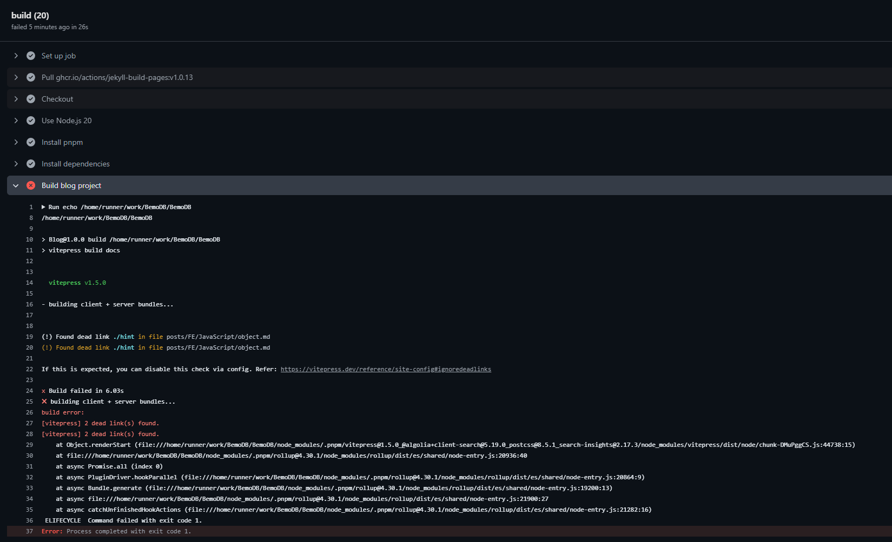

# Vitepress 内含 deadlink 导致部署失败


::: danger
Vitepress 会在检测到 md 文件中含有无效的链接的时候导致 GitHub pages 打包报错或者部署失败。
:::
1. 去指向的md文件中进行检查。
2. 设置 Vitepress 属性 ignoredeadlinks 为 true 可忽略报错:
``` typescript
export default defineConfig({
  ignoreDeadLinks: true
})
```