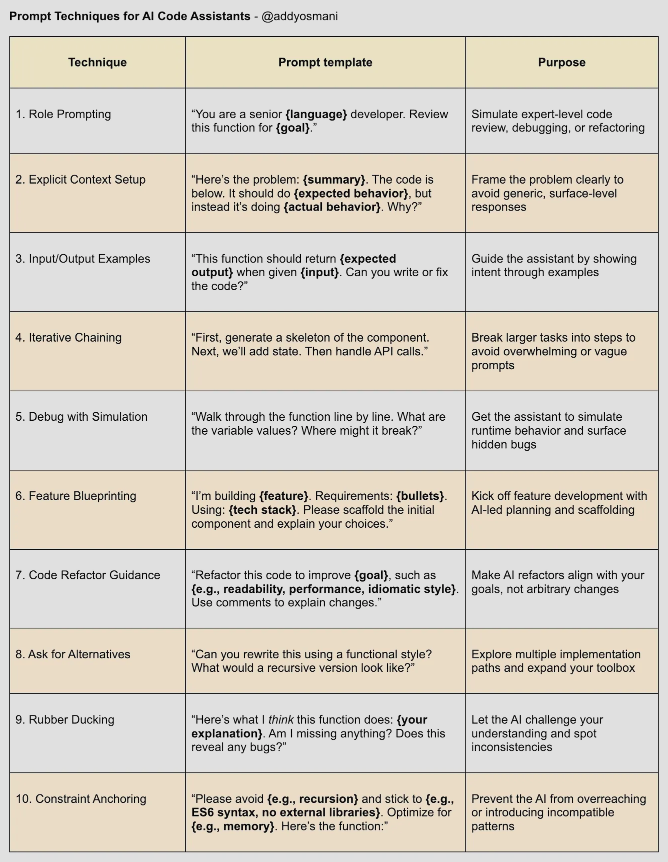

# 转载#004 | 程序员的提示工程实战手册
::: tip 文章信息
Origin url : https://addyo.substack.com/p/the-prompt-engineering-playbook-for

translated & reprinted by Bolaxious in 2025.6.26
:::

开发者们正日益依赖 AI 编码助手来加速日常工作流程。这些工具可以自动完成函数、建议错误修复，甚至生成整个模块或最小可行产品 (MVP)。然而，正如我们许多人所学到的，AI 输出的质量很大程度上取决于你提供的提示（prompt）的质量。换句话说，提示工程已成为一项基本技能。一个措辞不当的请求可能会产生不相关或通用的答案，而一个精心设计的提示则能生成周到、准确甚至富有创意的代码解决方案。本文将实用地探讨如何系统地为常见的开发任务构建有效的提示。

AI 结对程序员功能强大但并非魔术——除了你告诉它们或作为上下文包含的信息外，它们对你的特定项目或意图一无所知。你提供的信息越多，输出就越好。我们将提炼出关键的提示模式、可重复的框架以及与开发者产生共鸣的难忘示例。你将看到优秀提示与糟糕提示及其 AI 实际响应的并排比较，并附有评论以理解为什么一个成功而另一个失败。这里有一个速查表供你入门：



有效代码提示的基础
给 AI 编码工具提供提示有点像与一个非常字面化、有时知识渊博的协作者交流。为了获得有用的结果，你需要清晰地设置场景，并指导 AI 你想要什么以及你想要如何实现。

以下是支撑本手册中所有示例的基础原则：

提供丰富的上下文。始终假设 AI 对你的项目一无所知，除非你提供。包括相关细节，如编程语言、框架和库，以及所涉特定函数或代码片段。如果存在错误，提供确切的错误消息并描述代码应该做什么。具体性和上下文是模糊建议与精确、可操作解决方案之间的区别。实际上，这意味着你的提示可能包含一个简短的设置，例如：“我有一个使用 Express 和 Mongoose 的 Node.js 函数，它应该通过 ID 获取用户，但它抛出了 TypeError。这是代码和错误……” 你提供的设置越多，AI 需要猜测的就越少。

明确你的目标或问题。模糊的查询会导致模糊的答案。与其问“我的代码为什么不工作？”，不如明确你需要什么洞察。例如：“这个 JavaScript 函数返回 undefined 而不是预期结果。给定以下代码，你能帮我查明原因并如何修复吗？” 这种问法更有可能产生有用的答案。一个调试的提示公式是：“它预期做 [预期行为]，但给定 [示例输入] 时却做 [当前行为]。bug 在哪里？” 同样，如果你想进行优化，请请求特定类型的优化（例如：“如何提高此排序函数处理 10k 项的运行时性能？”）。具体性指导 AI 的关注点。

分解复杂任务。在实现新功能或解决多步骤问题时，不要将整个问题一次性全部输入到一个巨大的提示中。通常更有效的方法是将工作分解成小块并迭代。例如：“首先，为产品列表页面生成一个 React 组件骨架。接下来，我们将添加状态管理。然后，我们将集成 API 调用。” 每个提示都建立在前一个的基础上。通常不建议一次性请求一个大的完整功能；相反，从一个高层目标开始，然后迭代地请求每个部分。这种方法不仅使 AI 的响应集中且易于管理，还反映了人类如何逐步构建解决方案。

包含输入/输出示例或预期行为。如果你能用示例说明你想要什么，那就这样做。例如：“给定数组 [3,1,4]，此函数应返回 [1,3,4]。” 在提示中提供一个具体示例有助于 AI 理解你的意图并减少歧义。这类似于给一个初级开发者一个快速测试用例——它澄清了需求。在提示工程术语中，这有时被称为“少样本提示”，即你向 AI 展示一个要遵循的模式。即使是一个正确行为的示例也能显著指导模型的响应。

利用角色或人物。许多病毒式提示示例中流行的一种强大技术是要求 AI “扮演”某个特定人物或角色。这可以影响答案的风格和深度。例如，“扮演一位资深 React 开发者，审查我的代码是否存在潜在错误”或“你是一名 JavaScript 性能专家。优化以下函数。” 通过设定一个角色，你促使助手采纳相关的语调——无论是严格的代码审查员、对初级开发者的热心老师，还是寻找漏洞的安全分析师。社区共享的提示已通过此方法取得了成功，例如“扮演一名 JavaScript 错误处理程序，为我调试此函数。数据显示无法从 API 调用正确渲染。” 在我们自己的使用中，我们仍然必须提供代码和问题细节，但角色扮演提示可以产生更结构化和专家级别的指导。

迭代并完善对话。提示工程是一个互动过程，而非一劳永逸。开发者通常需要审查 AI 的第一个答案，然后提出后续问题或进行更正。如果解决方案不太正确，你可能会说：“那个解决方案使用了递归，但我更喜欢迭代方法——你能再试一次不使用递归吗？” 或者，“很好，现在你能改进变量名并添加注释吗？” AI 会记住聊天会话中的上下文，因此你可以逐步引导它达到期望的结果。关键在于将 AI 视为你可以指导的伙伴——第一次尝试时追求进步而非完美。

保持代码清晰和一致性。这最后一个原则有点间接但非常重要，对于处理你的代码上下文的工具而言。编写清晰、结构良好的代码和注释，甚至在 AI 发挥作用之前。有意义的函数和变量名、一致的格式化和文档字符串不仅使你的代码对人类更容易理解，也为 AI 提供了关于你正在做什么的更强烈的线索。如果你展示了一种一致的模式或风格，AI 将会继续它。将这些工具视为极其细心的初级开发者——它们从你的代码和注释中获取每一个线索。

牢记这些基本原则，让我们深入探讨具体的场景。我们将从调试开始，这可能是最直接的用例：你的代码行为不端，而你希望 AI 帮助找出原因。

代码调试的提示模式
调试是 AI 助手的一个自然契合点。它就像有一个不仅能听，还能给出建议的橡皮鸭。然而，成功很大程度上取决于你如何向 AI 呈现问题。以下是如何系统地提示以帮助查找和修复 bug：

1. 清晰描述问题和症状。开始你的提示，描述哪里出了问题以及代码应该做什么。始终包括确切的错误消息或不正确的行为。例如，与其仅仅说“我的代码不工作”，你可能会提示：“我有一个 JavaScript 函数，它应该计算数字数组的总和，但它返回 NaN (非数字) 而不是实际总和。这是代码：[包含代码]。它应该为像 [1,2,3] 这样的数字数组输出一个数字（总和），但我得到 NaN。这个 bug 的原因可能是什么？” 这个提示指定了语言、预期行为、观察到的错误输出，并提供了代码上下文——所有这些都是关键信息。提供结构化的上下文（代码 + 错误 + 预期结果 + 你尝试过什么）为 AI 提供了一个坚实的起点。相比之下，像“我的函数为什么不工作？”这样的通用问题只会产生微薄的结果——模型在没有上下文的情况下只能提供最一般的猜测。

2. 对于棘手的 bug，使用分步或逐行方法。对于更复杂的逻辑 bug（没有明显的错误消息但输出错误），你可以提示 AI 逐步执行代码。例如：“逐行遍历此函数，并在每个步骤中跟踪 total 的值。它没有正确累加——逻辑在哪里出错？” 这是一个橡皮鸭调试提示的示例——你实际上是在要求 AI 模拟人类可能通过打印或调试器进行的调试过程。这样的提示通常会揭示细微的问题，例如变量未重置或条件逻辑不正确，因为 AI 会在每个步骤中明确状态。如果你怀疑代码的某个部分，你可以放大：“解释这里的 filter 调用正在做什么，以及它是否可能排除了比预期更多的项目。” 让 AI 扮演解释角色可以在解释过程中发现 bug。

3. 如果可能，提供最小可重现示例。有时你的实际代码库很大，但 bug 可以在一个小片段中演示。如果你能提取或简化仍然能重现问题的代码，那就这样做并将其提供给 AI。这不仅使 AI 更容易集中注意力，也迫使你澄清问题（这本身通常是一个有用的练习）。例如，如果你在一个深度嵌套的函数调用中遇到 TypeError，尝试用几行可以共享的代码重现它。目标是用最少的代码隔离 bug，对错误进行假设，测试它，然后迭代。你可以让 AI 参与其中，说：“这是一个经过精简但仍会触发错误的代码片段 [包含片段]。为什么会发生此错误？” 通过简化，你消除了噪音并帮助 AI 找出问题。（这种技术反映了许多资深工程师的建议：如果你不能立即找到 bug，简化问题空间。如果你向 AI 呈现一个更小的情况，它可以协助进行分析。）

4. 提出重点问题和后续问题。在提供上下文后，直接询问你需要什么通常很有效，例如：“什么可能导致此问题，我该如何修复？” 这会邀请 AI 诊断并提出解决方案。如果 AI 的第一个答案不清楚或部分有用，请毫不犹豫地提出后续问题。你可以说：“那个解释有道理。你能告诉我如何修复代码吗？请提供更正后的代码。” 在聊天设置中，AI 具有对话历史记录，因此它可以直接输出修改后的代码。如果你正在使用像 VS Code 或 Cursor 中的 Copilot 这样的内联工具而没有聊天，你可能会在代码上方写一条注释，例如 // BUG: returns NaN, fix this function 并查看它是如何自动完成的——但总的来说，交互式聊天会产生更彻底的解释。另一个后续模式：如果 AI 提供了修复，但你不明白原因，请问“你能解释一下为什么那个更改解决了问题吗？” 这样你下次就能学到东西，并且可以双重检查 AI 的推理是否正确。

现在，让我们通过一个具体示例来说明这些调试提示原则，展示一个糟糕的提示与改进后的提示以及 AI 响应的差异：

调试示例：糟糕提示与改进提示
假设我们有一个简单的 Node.js 函数，旨在将用户对象列表转换为按用户 ID 查找的映射。然而，它抛出了一个错误。这是有 bug 的代码：

```javascript
// 有 bug 的函数：将用户数组转换为按 ID 映射
function mapUsersById(users) {
  const userMap = {};
  for (let i = 0; i <= users.length; i++) {  
    // 注意：使用 <= 将导致最后一次迭代越界
    const user = users[i];
    userMap[user.id] = user;
  }
  return userMap;
}

// 示例用法：
const result = mapUsersById([{ id: 1, name: "Alice" }]);
```
这段代码应该遍历 users 数组并构建一个以用户 ID 为键的对象。然而，存在一个 bug：循环使用了 `i <= users.length` 而不是 `i < users.length`。这将在最后一次迭代中导致 `users[i]` 为 `undefined`，可能导致运行时错误（例如，尝试访问 `undefined` 的属性 `id`）。让我们看看 AI 助手如何响应关于此问题的两种不同提示。

❌ 糟糕的提示：“我的 mapUsersById 函数为什么不工作？”

AI 对糟糕提示的响应（模拟）：

*在没有更多信息的情况下很难说。你确定函数是用正确的用户数组调用的吗？也许问题是 users 为空或不是数组，导致循环没有正确执行。也可能是设置 userMap 属性时出错。请确保每个用户都有一个 id 属性。如果 users 是 undefined 或 null，那也会导致它不工作。*

分析：这个答案非常模糊。提示除了函数名之外没有提供任何细节，因此 AI 正在猜测一般原因（“也许数组为空或不是数组”、“确保每个用户都有 id”）。它没有识别出实际的 bug。这是当问题没有充分说明时你会得到的响应——模型只能重复常见的调试技巧。作为开发者，这并不是很有帮助，因为它没有解决真正的错误。提示中缺乏上下文和具体性导致了一个通用的答案（本质上是 AI 等同于“你试过关闭并重新打开它吗？”）。这与社区建议一致，即模糊的提示会导致不相关或通用的答案。

✅ 改进的提示：“我有一个 JavaScript 函数 `mapUsersById`，它应该将用户对象数组转换为按用户 ID 为键的映射（对象）。但是，当我运行它时，它抛出了一个错误。例如，当我传递 `[{id: 1, name: "Alice"}]` 时，我得到 `TypeError: Cannot read property 'id' of undefined`。这是函数代码：

```javascript
function mapUsersById(users) {
  const userMap = {};
  for (let i = 0; i <= users.length; i++) {  
    const user = users[i];
    userMap[user.id] = user;
  }
  return userMap;
}
```
它应该返回 `{"1": {id: 1, name: "Alice"}}`。bug 是什么，我该如何修复它？”

AI 对改进提示的响应（模拟）：

*错误 `Cannot read property 'id' of undefined` 表明在某个时候，`user` 是 `undefined`，然后你尝试访问 `user.id`。查看你的循环，问题在于循环边界。你正在使用 `i <= users.length`。如果 `users.length` 为 1（数组中有一个用户），循环将以 `i = 0` 和 `i = 1` 运行。当 `i` 为 1 时，`users[1]` 是 `undefined`（因为数组中唯一的索引是 0）。因此，`user` 在该迭代中变为 `undefined`，并且 `user.id` 抛出 `TypeError`。修复方法是将循环条件更改为 `i < users.length`，以便 `i` 从 0 到 `users.length-1`。例如：

```javascript
for (let i = 0; i < users.length; i++) {
  const user = users[i];
  userMap[user.id] = user;
}
```
这样，`i` 将是第一个（也是唯一的）元素的 0，然后循环停止。通过此更改，你的函数将不再遇到 `undefined` 用户，并且应该按预期工作，对于给定输入返回 `{"1": {id: 1, name: "Alice"}}`。*

分析：这个响应直接指出了 bug（循环中使用了 <=）并解释了为什么它会导致 `user` 为 `undefined`。然后，它提供了正确的代码解决方案（`i < users.length`）并确认了预期结果。改进后的提示之所以成功，是因为它遵循了我们的原则：它指定了语言（JavaScript），描述了函数的功能，包含了确切的错误消息和示例输入，甚至提供了代码片段。注意 AI 如何使用错误消息作为线索来关注循环边界——一个有针对性的提示使 AI 能够进行真正的解决问题，有效地模拟人类调试器会如何思考：“`undefined` 从哪里来？很可能来自循环索引。” 这是详细提示好处的具体演示。

其他调试策略：除了识别明显的 bug 之外，你还可以使用提示工程来获得更深入的调试帮助：

询问潜在原因。如果你真的被难住了，你可以稍微扩大问题范围：“这段代码中 `TypeError: cannot read property 'foo' of undefined` 可能有哪些原因？” 同时附上代码。模型可能会列出一些场景（例如对象未初始化、竞争条件、错误的变量作用域等）。这可以为你提供你没有考虑过的调查角度。这就像与同事进行头脑风暴。

“问橡皮鸭”——即向 AI 解释你的代码。这听起来可能违反直觉（为什么要向助手解释？），但编写解释的行为可以澄清你自己的理解，然后你可以让 AI 验证或批评它。例如：“我将解释这个函数正在做什么：[你的解释]。鉴于此，我的推理是否正确，以及它是否揭示了 bug 所在？” AI 可能会发现你解释中的一个缺陷，从而指向实际的 bug。这种技术利用 AI 作为积极的橡皮鸭，它不仅会听，还会做出回应。

让 AI 创建测试用例。你可以问：“你能提供几个可能破坏此函数测试用例（输入）吗？” 助手可能会提出你没有想到的边缘情况（空数组、极大的数字、空值等）。这对于调试和生成未来的健壮性测试都很有用。

扮演代码审查员。作为直接“调试此”提示的替代方案，你可以说：“扮演一名代码审查员。这里有一个代码片段，它的行为不如预期。审查它并指出任何可能导致问题的错误或不良实践：[代码]”。这会使 AI 进入批判模式。许多开发者发现，将请求表述为代码审查会产生非常彻底的分析，因为模型会评论代码的每个部分（通常在这样做时，它会发现 bug）。事实上，一个提示工程技巧是明确要求 AI 表现得像一个一丝不苟的审查员。这不仅可以发现当前的 bug，还可以发现其他问题（例如可能缺少空值检查），这可能很有用。

总之，在使用 AI 助手进行调试时，细节和方向是你的朋友。提供场景、症状，然后提出有针对性的问题。正如我们上面所看到的，一个“它不工作，帮帮我！”的糟糕提示与一个精确的调试提示之间有着天壤之别。接下来，我们将转向另一个主要用例：重构和改进现有代码。

重构和优化的提示模式
重构代码——使其更简洁、更快或更符合惯例，而不改变其功能——是 AI 助手可以大放异彩的领域。它们已经接受了大量代码的训练，其中包括许多结构良好、优化后的解决方案示例。然而，要有效利用这些知识，你的提示必须澄清“更好”在你的情况下意味着什么。以下是如何提示进行重构任务：

1. 明确说明你的重构目标。“重构此代码”本身过于开放。你是想提高可读性？降低复杂性？优化性能？使用不同的范式或库？AI 需要一个目标。一个好的提示会框定任务，例如：“重构以下函数以提高其可读性和可维护性（减少重复，使用更清晰的变量名）。” 或者“优化此算法的速度——它在大型输入上太慢了。” 通过说明具体目标，你可以帮助模型决定应用哪些转换。例如，告诉它你关心性能可能会导致它使用更高效的排序算法或缓存，而专注于可读性可能会导致它将函数分解成更小的函数或添加注释。如果你有多个目标，请列出它们。Strapi 指南中的一个提示模板甚至建议列举问题：“我想解决的问题：1) [性能问题]，2) [代码重复]，3) [过时的 API 使用]。” 这样，AI 就确切知道要修复什么。请记住，它不会固有地知道你认为代码中的问题是什么——你必须告诉它。

2. 提供必要的代码上下文。重构时，你通常会在提示中包含需要改进的代码片段。重要的是要包含你想要重构的完整函数或部分，有时如果相关，还要包含一些周围的上下文（例如函数的用法或相关代码，这可能会影响你如何重构）。还要提及语言和框架，因为“惯用法”代码在 Node.js 和 Deno 之间，或 React 类组件和函数组件之间有所不同。例如：“我有一个用类编写的 React 组件。请将其重构为使用 Hooks 的函数组件。” AI 将应用典型步骤（使用 useState、useEffect 等）。如果你只是说“重构这个 React 组件”而不澄清风格，AI 可能不知道你明确想要 Hooks。

如果相关，请包含版本或环境详细信息。例如，“这是一个 Node.js v14 代码库”或“我们正在使用 ES6 模块”。这会影响 AI 是否使用某些语法（如 import/export 与 require），这是正确重构的一部分。如果你想确保它不会引入不兼容的东西，请提及你的约束。

3. 鼓励解释以及代码。从 AI 主导的重构中学习（并验证其正确性）的一个好方法是要求解释更改。例如：“请提供代码的重构版本，并解释你所做的改进。” 这甚至内置在我们引用的提示模板中：“……建议重构代码并解释你的更改。” 当 AI 提供解释时，你可以评估它是否理解了代码并达到了你的目标。解释可能会说：“我将两个相似的循环合并为一个以减少重复，并且我使用了一个字典以加快查找速度，”等等。如果解释中听起来有什么不对劲，那是一个需要仔细检查代码的危险信号。简而言之，利用 AI 的解释能力作为一种保障——这就像让 AI 对其自身的重构执行代码审查。

4. 使用角色扮演来设定高标准。如前所述，要求 AI 扮演代码审查员或资深工程师可能非常有效。对于重构，你可能会说：“扮演一位经验丰富的 TypeScript 专家，并重构此代码以符合最佳实践和现代标准。” 这通常不仅会产生表面更改，还会产生更深刻的改进，因为 AI 会努力达到“专家”的形象。一个流行的提示指南示例是让 AI 扮演导师：“扮演一位经验丰富的 Python 开发者，指导一名初级开发者。提供解释并编写文档字符串。重写代码以优化它。” 在那种情况下，结果是 AI 使用了更高效的数据结构（集合来去除重复）并为最初使用循环的函数提供了一行解决方案。角色扮演帮助它不仅重构，而且解释为什么新方法更好（在这种情况下，使用集合是众所周知的唯一性优化）。

现在，让我们通过一个重构示例来了解提示如何影响结果。我们将使用一个 JavaScript (Node.js) 场景，其中我们有一些不理想的代码，我们希望对其进行改进。

重构示例：糟糕提示与改进提示
假设我们有一个函数，它进行两次数据库调用并执行一些处理。它能正常工作，但不够美观——存在重复代码，并且难以阅读。我们希望重构它以提高清晰度和效率。这是原始代码：

```javascript
// 原始函数：获取两个列表并处理它们（需要重构）
async function getCombinedData(apiClient) {
  // 获取用户列表
  const usersResponse = await apiClient.fetch('/users');
  if (!usersResponse.ok) {
    throw new Error('Failed to fetch users');
  }
  const users = await usersResponse.json();
  // 获取订单列表
  const ordersResponse = await apiClient.fetch('/orders');
  if (!ordersResponse.ok) {
    throw new Error('Failed to fetch orders');
  }
  const orders = await ordersResponse.json();
  // 组合数据（将用户与订单匹配）
  const result = [];
  for (let user of users) {
    const userOrders = orders.filter(o => o.userId === user.id);
    result.push({ user, orders: userOrders });
  }
  return result;
}
```
这段代码中的问题：我们看到用户和订单的获取逻辑重复（可以重构为辅助函数或循环），缺乏错误细节（只有一个通用错误消息），而且它可能可以并行运行获取以提高速度。让我们看看两种提示方法：

❌ 提示 1 (未充分说明)： “重构上面的 `getCombinedData` 函数。”

AI 对提示 1 的响应：

*当然。这是 `getCombinedData` 的重构版本：

```javascript
async function getCombinedData(apiClient) {
  // 并行获取用户和订单
  const [usersResponse, ordersResponse] = await Promise.all([
    apiClient.fetch('/users'),
    apiClient.fetch('/orders')
  ]);
  if (!usersResponse.ok || !ordersResponse.ok) {
    throw new Error('Failed to fetch data');
  }
  const [users, orders] = await Promise.all([
    usersResponse.json(),
    ordersResponse.json()
  ]);
  // 通过 userId 将订单映射以实现高效查找
  const ordersByUser = {};
  for (const order of orders) {
    if (!ordersByUser[order.userId]) {
      ordersByUser[order.userId] = [];
    }
    ordersByUser[order.userId].push(order);
  }
  // 组合数据
  return users.map(user => ({
    user,
    orders: ordersByUser[user.id] || []
  }));
}
```
我并行获取了用户和订单以提高性能。我还整合了错误处理，并使用映射（ordersByUser）按用户分组订单，这使得组合步骤更清晰且可能更快。*

分析：这实际上是一个相当不错的重构，达到了几项改进：并行获取、按用户分组订单以提高效率、使用 `.map` 更清晰地组合并默认为空数组。AI 还解释了它所做的事情。那么为什么我们将此提示标记为未充分说明或“糟糕”呢？在这种情况下，AI 恰好做出了很好的选择，但由于提示是开放式的，它做了很多假设。它假设应该提高性能（并行请求，这是一个明智的改变，但如果并行在这里不安全怎么办？），并且它将错误处理更改为通用消息“Failed to fetch data”，这在合并错误时失去了哪个调用失败的特异性。

通用“重构此”提示的风险在于，AI 可能会进行更改，从而以意想不到的方式改变行为。在这里，合并错误处理可能可以接受，也可能不接受，这取决于要求。助手还进行了结构性更改（使用字典对订单进行分组）——这很好，可能更好，但如果我们有特定的约束（例如希望流式传输结果或保持内存使用低），我们没有通知它。因此，尽管结果看起来不错，但 AI 对“重构”的解释与我们想要的恰好一致，这有点幸运。这说明了未充分说明的提示有时在简单情况下可以获得好的结果，但对于复杂代码，它可能会朝着不希望的方向发展，或者错过你关心的某些改进。

✅ 提示 2 (目标导向)： “重构上面的 `getCombinedData` 函数，以消除重复代码并提高性能。具体来说：(1) 避免重复用户和订单的获取逻辑——也许使用辅助函数或将它们一起获取。(2) 如果可能，并行获取两个列表。(3) 保留每个获取的错误处理（我们想知道哪个调用失败）。(4) 改进数据的组合，可能通过使用更高效的结构进行查找而不是嵌套循环。提供重构后的代码并附带解释更改的注释。”

AI 对提示 2 的响应：

*当然！这是 `getCombinedData` 的改进版本，并进行了请求的重构：

```javascript
async function getCombinedData(apiClient) {
  // 1. 并行获取用户和订单以提高性能
  const [usersResponse, ordersResponse] = await Promise.all([
    apiClient.fetch('/users'),
    apiClient.fetch('/orders')
  ]);

  // 2. 分别处理错误以知道哪个调用失败
  if (!usersResponse.ok) {
    throw new Error('Failed to fetch users');
  }
  if (!ordersResponse.ok) {
    throw new Error('Failed to fetch orders');
  }

  // 并行解析 JSON 响应
  const [users, orders] = await Promise.all([
    usersResponse.json(),
    ordersResponse.json()
  ]);

  // 3. 使用 ordersByUser 的查找映射以实现高效匹配
  const ordersByUser = orders.reduce((map, order) => {
    if (!map[order.userId]) {
      map[order.userId] = [];
    }
    map[order.userId].push(order);
    return map;
  }, {});

  // 4. 使用查找映射组合数据
  return users.map(user => ({
    user,
    orders: ordersByUser[user.id] || []  // 如果用户没有订单，则为空数组
  }));
}
```
更改解释：

并行获取：我使用了 `Promise.all` 同时获取用户和订单（第 1 点）。

保留单独的错误处理：我保留了对 `usersResponse.ok` 和 `ordersResponse.ok` 的单独检查，以便任何错误都清楚地表明哪个获取失败（第 2 点）。

并行 JSON 解析：还使用了 `Promise.all` 进行 `response.json()` 调用，这是一个小的改进。

高效组合：我创建了一个 `ordersByUser` 映射而不是嵌套循环（第 3 点）。这会将订单按 `userId` 在一次遍历中分组。然后我遍历用户以构建结果，以 O(1) 时间从映射中提取每个用户的订单（第 4 点）。这更高效和简洁。*

分析：这个响应直接解决了所有指定的目标。代码被重构得更简洁、更快，并且根据要求保留了单独的错误消息。AI 的解释确认了我们列出的每一点，这表明它仔细遵循了提示说明。这是一个很好的结果，因为我们作为提示者，定义了“重构”在此上下文中的含义。通过这样做，我们引导 AI 生成了一个符合我们需求的解决方案，并最大限度地减少了来回沟通。如果 AI 忽略了其中一点（例如它仍然合并了错误处理），我们可以很容易地再次提示：“看起来不错，但请确保用户和订单的错误消息保持不同。”——然而，在这种情况下，由于我们的提示很彻底，所以没有必要。

这个例子演示了一个关键的教训：当你清楚自己想要改进什么时，请明确说明。AI 擅长遵循指令，但它不会读心术。一个宽泛的“让这变得更好”可能适用于简单的事情，但对于复杂的代码，你通过列举“更好”对你意味着什么才能获得最佳结果。这与社区洞察力一致，即清晰、结构化的提示会显著改善结果。

其他重构技巧：

分步重构：如果代码非常大或你有很多更改，你可以一次解决一个。例如，首先要求 AI “为可读性重构”（侧重于重命名、拆分函数），然后稍后“优化此函数中的算法”。这可以防止一次性给模型太多指令，并允许你逐步验证每个更改。

询问其他方法：也许 AI 的第一个重构有效，但你对不同的角度感到好奇。你可以问：“你能用另一种方式重构它吗，也许使用函数式编程风格（例如数组方法而不是循环）？” 或者“这里使用递归而不是迭代方法怎么样，只是为了比较？” 这样，你可以评估不同的解决方案。这就像与同事进行头脑风暴，讨论多种重构选项。

将重构与解释结合起来学习模式：我们提到了这一点，但值得强调——将 AI 用作学习工具。如果它以巧妙的方式重构代码，请研究输出和解释。你可能会发现以前没有使用过的新 API 或技术（例如使用 reduce 来构建映射）。这是要求解释的原因之一：它将答案变成一个迷你教程，加强你对最佳实践的理解。

验证和测试：在任何 AI 生成的重构之后，务必运行你的测试或使用示例输入尝试代码。AI 可能会无意中引入细微的 bug，特别是当提示没有指定重要约束时。例如，在我们的重构中，如果原始代码有意分离获取错误以进行日志记录，但我们没有提及日志记录，则合并后的错误可能用处不大。在审查中捕获这些是我们的职责。AI 也可以通过编写测试来提供帮助——你可以要求“为重构后的函数生成几个单元测试”，以确保它在预期输入下表现相同。

至此，我们已经涵盖了调试和重构——改进现有代码。下一步是使用 AI 协助实现新功能或生成新代码。我们将探讨如何有效地为这种场景提供提示。

现代调试场景
React Hook 依赖项问题
❌ 糟糕的提示："我的 useEffect 运行不正常。"

✅ 增强的提示：

我有一个 React 组件用于获取用户数据，但它导致了无限重渲染。这是我的代码：

```javascript
const UserProfile = ({ userId }) => {
  const [user, setUser] = useState(null);
  const [loading, setLoading] = useState(true);
  
  useEffect(() => {
    fetchUser(userId).then(setUser).finally(() => setLoading(false));
  }, [userId, setUser, setLoading]); // 问题在这里
  
  return loading ? <div>Loading...</div> : <div>{user?.name}</div>;
};
```
预期行为：`userId` 更改时应该只获取一次用户数据。
实际行为：组件无限重渲染。
控制台错误："Warning: Maximum update depth exceeded"

什么导致了无限循环以及我如何修复依赖数组？

为什么这有效：提供了精确的代码、错误消息、预期行为与实际行为，并专注于一个通常被误解的特定 React 模式。

现代状态架构
❌ 糟糕的提示："为我的 Next.js 电子商务应用构建状态管理。"

✅ 增强的提示：

我正在构建一个 Next.js 14 电子商务应用，需要设计状态管理架构。以下是我的要求：

组件：

*   产品列表页面（需要：产品数组、过滤器、分页）
*   购物车（需要：购物车商品、总计、配送信息）
*   用户认证（需要：用户个人资料、认证状态、偏好设置）
*   实时通知（需要：提示消息、错误状态）

技术限制：

*   Next.js 14 与 App Router 和 Server Components
*   TypeScript 严格模式
*   用于 SEO 的服务器端数据获取
*   用于购物车/用户操作的客户端交互性
*   状态应在导航中持久化

我应该使用：

*   每个领域（购物车、认证、通知）的 Zustand 存储
*   用于服务器状态的 React Query/TanStack Query + 用于客户端状态的 Zustand
*   带切片的单个 Zustand 存储

请提供一个推荐的架构，并附带代码示例，展示如何构建存储并与 Next.js App Router 模式集成。

为什么这有效：真实的场景，具有特定的技术栈、清晰的需求，并请求架构指导和实现细节。

实现新功能的提示模式
AI 代码助手最令人兴奋的用途之一是帮助你从零开始编写新代码或将新功能集成到现有代码库中。这可能包括生成 React 组件的样板代码，或在 Express 应用中编写新的 API 端点。这里的挑战通常是这些任务是开放式的——实现一个功能有多种方法。代码生成的提示工程旨在引导 AI 生成符合你需求和风格的代码。以下是实现此目的的策略：

1. 从高层指令开始，然后深入细化。首先用简单的语言概述你想要构建的内容，并可能将其分解成更小的任务（类似于我们之前关于分解复杂任务的建议）。例如，假设你想要在现有 Web 应用中添加搜索栏功能。你可能首先提示："概述一个计划，在我的 React 应用中添加一个搜索功能，该功能通过名称过滤产品列表。产品是从 API 获取的。"

AI 可能会给你一个循序渐进的计划："1. 添加一个用于搜索查询的输入字段。2. 添加状态以保存查询。3. 根据查询过滤产品列表。4. 确保不区分大小写，等等。" 一旦你有了这个计划（你可以通过 AI 的帮助进行完善），你就可以用有针对性的提示来处理每个要点。

例如："好的，实现步骤 1：创建一个 SearchBar 组件，其中包含一个更新 `searchQuery` 状态的输入。" 之后，"实现步骤 3：给定 `searchQuery` 和产品数组，过滤产品（名称不区分大小写匹配）。" 通过分解功能，你可以确保每个提示都具体，并且响应易于管理。这也反映了迭代开发——你可以在构建时测试每个部分。

2. 提供相关上下文或参考代码。如果你正在向现有项目添加功能，向 AI 展示该项目中如何完成类似事情会有很大帮助。例如，如果你已经有一个与你想要的功能类似的组件，你可以说："这是一个现有的 `UserList` 组件（代码……）。现在创建一个类似的 `ProductList` 组件，但包含一个搜索栏。"

AI 将会看到模式（也许你使用了某些库或样式约定）并应用它们。打开相关文件或在提示中引用它们提供了上下文，从而产生更具项目特定性和一致性的代码建议。另一个技巧：如果你的项目使用特定的编码风格或架构（例如 Redux 用于状态管理或某个 CSS 框架），请提及。例如："我们使用 Redux 进行状态管理——将搜索状态集成到 Redux 存储中。"

一个训练有素的模型会生成与 Redux 模式等一致的代码。本质上，你正在向 AI 教授你项目的环境，以便它可以定制输出。一些助手甚至可以将你的整个存储库作为上下文来获取信息；如果使用这些助手，请确保你将其指向存储库中类似的模块或文档。

如果开始新事物但你有偏好的方法，你也可以提及："我想使用函数式编程风格（无外部状态，使用数组方法）来实现这一点。" 或者，"确保遵循 MVC 模式并将逻辑放在控制器中，而不是视图中。" 这些是资深工程师可能会提醒初级开发者的细节，而在这里，你是资深工程师告诉 AI。

3. 使用注释和 TODO 作为内联提示。在 IDE 中直接使用 Copilot 时，一种有效的工作流程是编写描述你需要的下一段代码的注释，然后让 AI 自动完成。例如，在 Node.js 后端，你可能会写：`// TODO: Validate the request payload (ensure name and email are provided)`，然后开始下一行。Copilot 通常会理解意图并生成执行该验证的代码块。这之所以有效，是因为你的注释实际上是一个自然语言提示。但是，如果 AI 误解了，请准备好编辑生成的代码——一如既往，验证其正确性。

4. 提供预期输入/输出或用法的示例。与我们之前讨论的类似，如果你要求 AI 实现一个新函数，请包含一个关于它将如何使用的快速示例或一个简单的测试用例。例如："在 JavaScript 中实现一个 `formatPrice(amount)` 函数，该函数接受一个数字（如 2.5）并返回一个以美元格式化的字符串（如 $2.50）。例如，`formatPrice(2.5)` 应该返回 `'$2.50'`。"

通过提供这个示例，你约束了 AI 生成与该示例一致的函数。没有示例，AI 可能会假设其他格式或货币。差异可能很细微但很重要。Web 上另一个例子："实现一个记录请求的 Express 中间件。例如，对 `/users` 的 GET 请求应该将 'GET /users' 记录到控制台。" 这清楚地表明了输出应该是什么样子。在提示中包含预期行为充当 AI 将尝试满足的测试。

5. 当结果不是你想要的时，用更详细或更严格的提示重写。第一次尝试生成新功能通常不会一击即中。也许代码可以运行，但不是惯用的，或者它遗漏了一个要求。不要沮丧，把 AI 当作一个提交初稿的初级开发人员——现在你需要给出反馈。例如，"解决方案有效，但我更喜欢你使用内置的数组 `filter` 方法而不是 `for` 循环。" 或者，"你能将生成的组件重构为使用 React Hooks 进行状态管理而不是类组件吗？我们的代码库都是函数式组件。" 你还可以添加新的约束："另外，确保函数以 O(n) 或更好的时间运行，因为 n 可能很大。" 这种迭代提示非常强大。一个真实的场景：一位开发者要求 LLM 生成使用 JS 画布库绘制冰淇淋锥的代码，但它一直给出不相关的输出，直到他们用更多细节和上下文完善了提示。教训是，不要一次尝试就放弃。找出提示中缺少或误解的地方并加以澄清。这是提示工程的精髓——每次调整都可以引导模型更接近你的设想。

让我们通过一个示例场景来说明功能实现提示：构建一个带 AI 辅助的 React 组件。

功能实现示例：在 AI 协助下构建 React 组件
假设我们有一个 React 应用程序，我们想添加一个新组件：一个带有搜索过滤器和排序下拉菜单的产品列表。这是 Web 应用程序中一个相当典型的功能。为简洁起见，我们将重点关注此组件中搜索功能的提示。

初始提示（功能请求）："创建一个名为 `ProductList` 的 React 函数组件，该组件显示产品列表并包含一个文本输入，用于按名称过滤产品。该组件应：从 `/api/products` 获取产品数组（假设它返回 `{id, name, ...}` 的 JSON 数组），将其存储在状态中，并允许用户在搜索框中键入以按名称过滤显示的产品（不区分大小写匹配）。在简单的 `<ul>` 中显示过滤后的列表以及产品名称。包含基本的错误处理（例如，如果 API 调用失败则显示错误消息）和获取时的加载状态。"

这是一个很长的提示，但很具体。让我们假设我们将其提供给聊天中的 LLM。

AI 的响应（它可能产生内容的摘要）：AI 可能会输出一个 `ProductList` 组件，类似于：

```javascript
import React, { useState, useEffect } from 'react';

function ProductList() {
  const [products, setProducts] = useState([]);
  const [search, setSearch] = useState('');
  const [loading, setLoading] = useState(true);
  const [error, setError] = useState(null);

  useEffect(() => {
    async function fetchProducts() {
      try {
        const res = await fetch('/api/products');
        if (!res.ok) throw new Error('Network response was not ok');
        const data = await res.json();
        setProducts(data);
      } catch (err) {
        console.error('Failed to fetch products:', err);
        setError('Failed to load products.');
      } finally {
        setLoading(false);
      }
    }
    fetchProducts();
  }, []);

  const handleSearchChange = (e) => {
    setSearch(e.target.value);
  };

  // 根据搜索查询过滤产品（不区分大小写）
  const filteredProducts = products.filter(product =>
    product.name.toLowerCase().includes(search.toLowerCase())
  );

  if (loading) return <div>Loading products...</div>;
  if (error) return <div>{error}</div>;

  return (
    <div className="product-list">
      <input 
        type="text" 
        placeholder="Search products" 
        value={search} 
        onChange={handleSearchChange} 
      />
      <ul>
        {filteredProducts.map(prod => (
          <li key={prod.id}>{prod.name}</li>
        ))}
      </ul>
    </div>
  );
}

export default ProductList;
```
（如果我们要求，可能还会附带一些代码中的注释，解释每个部分。）

现在，让我们分析这个结果并考虑提示的改进：

假设上面的代码返回了，但我们的项目使用上下文或全局存储进行数据获取，而不是在组件内部获取。这是我们没有指定的事情。AI 选择在 `useEffect` 中获取。如果我们倾向于使用自定义 Hook 或上下文，我们应该暗示这一点。因此，我们可以完善我们的提示："实际上，在我们的应用程序中，我们使用一个自定义 Hook `useProducts()`，它已经处理了获取。请重构组件以使用 `useProducts` Hook，而不是直接调用 `fetch`。" AI 将进行调整，也许会假设 `useProducts` 返回 `{ products, loading, error }` 并相应地简化组件。

另一个改进：也许我们意识到我们还需要一个排序下拉菜单（我们最初没有提及）。我们现在可以扩展对话："很好，现在添加一个下拉菜单，用于按名称（A-Z 或 Z-A）排序产品。下拉菜单应允许用户选择升序或降序，并且列表应在过滤后相应地排序。" 因为 AI 具有现有代码的上下文，它可以插入一个排序状态并调整渲染。我们提供了一个明确的新要求，它将尝试满足它，可能会添加类似：

```javascript
const [sortOrder, setSortOrder] = useState('asc');
// ... 一个用于 sortOrder 的 select input ...
// 并在渲染之前对 filteredProducts 进行排序：
const sortedProducts = [...filteredProducts].sort((a, b) => {
  if (sortOrder === 'asc') return a.name.localeCompare(b.name);
  else return b.name.localeCompare(a.name);
});
```
（加上下拉菜单 UI）。

通过这样迭代，一个功能接一个功能，我们模拟了与 AI 的开发周期。这比最初尝试一次性提示整个复杂组件的所有功能要有效得多。它减少了错误，并允许在需求变得更清晰时进行中期修正。

如果 AI 犯了一个细微的错误（例如它忘记使搜索过滤器不区分大小写），我们只需指出："使搜索不区分大小写。" 它将调整过滤器以使用小写比较（在我们的伪输出中它已经做到了，但如果不是，它会修复）。

这个例子表明，使用 AI 实现功能完全是关于增量开发和提示细化。一条 Twitter 推文可能会惊呼某人如何通过不断地为每个部分提示 LLM 来构建一个小应用程序——这本质上就是这种方法：构建、审查、细化、扩展。每个提示都像是你开发过程中的一个提交。

功能实现的其他提示：

让 AI 脚手架，然后你填写具体细节：有时让 AI 生成一个粗略的结构，然后你进行调整会很有用。例如，"生成一个用于用户注册的 Node.js Express 路由骨架，包含验证和错误处理。" 它可能会生成一个带有占位符的通用路由。然后你可以填写特定于你应用程序的实际验证规则或数据库调用。AI 帮你省去了编写样板代码的时间，如果你需要处理敏感的自定义逻辑，则由你来处理。

询问边缘情况处理：在生成功能时，你可能会提示 AI 考虑边缘情况："我们应该为这个功能考虑哪些边缘情况（以及你能在代码中处理它们吗）？" 例如，在搜索示例中，一个边缘情况可能是"当用户输入时产品尚未加载怎么办？"（尽管我们的代码通过加载状态处理了这个问题）或"如果两个产品具有相同的名称怎么办？"（不是大问题，但也许值得提及）。AI 可能会提及诸如空结果处理、非常大的列表（可能需要为搜索输入进行防抖）等。这是利用 AI 训练中常见的陷阱的一种方式。

文档驱动开发：有些人采取了一种巧妙的方法，即首先编写文档字符串或用法示例，然后让 AI 实现该函数以匹配。例如：

```javascript
/**
 * 返回第 n 个斐波那契数。
 * @param {number} n - 斐波那契序列中的位置（0 索引）。
 * @returns {number} 第 n 个斐波那契数。
 * 
 * 示例：fibonacci(5) -> 5  (序列：0,1,1,2,3,5,…)
 */
function fibonacci(n) {
  // ... 实现
}
```
如果你编写上述注释和函数签名，LLM 可能会正确地填充实现，因为注释准确描述了要做什么，甚至给出了一个示例。这种技术确保你首先用文字澄清功能（这通常是一个好习惯），然后 AI 将其用作规范来编写代码。

涵盖了调试、重构和新代码生成的提示策略后，让我们将注意力转向代码提示工程中一些常见的陷阱和反模式。了解这些将帮助你避免在无益的交互上浪费时间，并在 AI 没有提供你所需内容时快速调整。

常见提示反模式及如何避免
并非所有提示都是平等的。到目前为止，我们已经看到了许多有效提示的例子，但认识反模式——导致 AI 响应不佳的常见错误——同样具有指导意义。

以下是一些常见的提示失败以及如何修复它们：

反模式：模糊的提示。这是经典的"它不工作，请修复它"或"编写一些做 X 的东西"而没有足够的细节。我们看到了一个这样的例子，当问题"我的函数为什么不工作？"得到一个无用的答案时。模糊的提示迫使 AI 猜测上下文，通常会导致通用建议或不相关的代码。修复方法很简单：添加上下文和具体细节。如果你发现自己提出了一个问题，而答案感觉像一个魔术 8 球的回答（"你有没有尝试检查 X？"），请停下来并用更多细节（错误消息、代码摘录、预期与实际结果等）重新组织你的查询。一个好的做法是阅读你的提示并问自己："这个问题是否适用于几十种不同的场景？" 如果是，那就太模糊了。使其具体到只适用于你的场景。

反模式：过载的提示。这是相反的问题：要求 AI 一次做太多事情。例如，"生成一个完整的 Node.js 应用，包含身份验证、React 前端和部署脚本。" 甚至在较小的范围内，"一次性修复这 5 个 bug 并添加这 3 个功能。" AI 可能会尝试，但你很可能会得到一个混乱或不完整的结果，或者它可能会忽略请求的某些部分。即使它解决了所有问题，响应也会很长且更难验证。补救措施是拆分任务。优先排序：一次只做一件事，正如我们之前强调的那样。这使得更容易发现错误并确保模型保持专注。如果你发现自己写了一段包含多个"和"的指令，请考虑将其分解成单独的提示或顺序步骤。

反模式：缺少问题。有时用户会提供大量信息，但从未清楚地提出问题或说明他们需要什么。例如，倾倒一个大型代码片段，然后只说"这是我的代码。" 这可能会使 AI 感到困惑——它不知道你想要什么。始终包含一个明确的要求，例如"识别上述代码中的任何错误"、"解释这段代码的作用"或"完成代码中的 TODOs"。一个提示应该有一个目的。如果你只是提供文本而没有问题或指令，AI 可能会做出不正确的假设（例如总结代码而不是修复代码等）。确保 AI 知道你为什么向它展示一些代码。即使是简单的补充，例如"这段代码有什么问题？"或"请继续实现这个函数。"也能给它方向。

反模式：模糊的成功标准。这是一个微妙的问题——有时你可能会要求进行优化或改进，但你没有定义成功的样子。例如，"让这个函数更快。" 哪个指标更快？如果 AI 不知道你的性能约束，它可能会对无关紧要的东西进行微优化，或者使用理论上更快但实际上可以忽略不计的方法。或者"让这段代码更简洁"——"更简洁"是主观的。我们通过明确说明目标来解决这个问题，例如"减少重复"或"改进变量名"等。修复方法：量化或限定改进。例如，"优化这个函数以线性时间运行（当前版本是二次的）"或"重构这个函数以删除全局变量并使用类。" 基本上，明确你正在通过重构或功能解决什么问题。如果你把它留得太开放，AI 可能会解决一个与你关心的问题不同的问题。

反模式：忽略 AI 的澄清或输出。有时 AI 可能会回复一个澄清问题或一个假设。例如："你使用的是 React 类组件还是函数组件？"或"我假设输入是一个字符串——请确认。" 如果你忽略这些并只是重申你的请求，你就会错过改进提示的机会。AI 正在发出信号，它需要更多信息。始终回答它的问题或完善你的提示以包含这些细节。此外，如果 AI 的输出明显有误（例如它误解了问题），不要只是原封不动地重试相同的提示。花点时间调整你的措辞。也许你的提示有一个模棱两可的短语或遗漏了重要的东西。把它当作对话——如果一个人误解了，你会以不同的方式解释；对 AI 也是如此。

反模式：风格多变或不一致。如果你不断改变提问方式或混合不同的格式，模型可能会感到困惑。例如，在指令中在第一人称和第三人称之间切换，或者以令人困惑的方式混合伪代码和实际代码。尝试在单个提示中保持一致的风格。如果你提供示例，请确保它们清晰地划定（对代码使用 Markdown 三重反引号，对输入/输出示例使用引号等）。一致性有助于模型正确解析你的意图。此外，如果你有偏好的风格（例如 ES6 与 ES5 语法），请始终提及，否则模型可能在一个提示中建议一种方式，然后在稍后建议另一种方式。

反模式：模糊引用，如"上述代码"。在聊天中使用时，如果你说"上述函数"或"上一个输出"，请确保引用清晰。如果对话很长，你说"重构上述代码"，AI 可能会失去跟踪或选择错误的片段进行重构。更安全的方法是再次引用代码或明确命名你想要重构的函数。模型具有有限的注意力窗口，尽管许多 LLM 可以引用对话的先前部分，但再次提供明确的上下文可以帮助避免混淆。如果自代码显示以来经过了一些时间（或几条消息），这一点尤其如此。

最后，当出现问题时，这里有一种重写提示的策略：

确定 AI 响应中缺少或不正确的内容。它是否解决了不同的问题？它是否产生了错误或不适合的解决方案？例如，也许你要求使用 TypeScript 解决方案，但它提供了纯 JavaScript。或者它编写了一个递归解决方案，而你明确要求迭代。找出差异。

在新提示中添加或强调该要求。你可能会说："解决方案应该用 TypeScript 编写，而不是 JavaScript。请包含类型注解。" 或者，"我提到我想要一个迭代解决方案——请避免递归并使用循环。" 有时，在提示中字面上使用"注意："或"重要："之类的短语来强调关键约束会有所帮助（模型没有情感，但它确实会权衡某些措辞以表明重要性）。例如："重要：不要使用任何外部库。"或"注意：代码必须在浏览器中运行，因此不能使用 Node 特定的 API。"

如果需要，进一步分解请求。如果 AI 在复杂的请求上反复失败，请尝试先请求一小部分。或者提出一个可能阐明情况的问题："你明白我说的 X 是什么意思吗？" 模型可能会复述它认为你所说的意思，如果它错了，你可以纠正它。这是元提示——讨论提示本身——有时可以解决误解。

如果线程卡住了，考虑重新开始。有时，经过多次尝试后，对话可能会陷入混乱状态。重新开始一个新会话（或暂时清除聊天历史记录）并根据之前的失败制定一个更精细的请求，从头开始提示可能会有所帮助。模型不介意重复，新的上下文可以消除之前消息中积累的任何混乱。

通过了解这些反模式及其解决方案，你将更快地即时调整你的提示。开发人员的提示工程在很大程度上是一个迭代的、反馈驱动的过程（就像任何编程任务一样！）。好消息是，你现在拥有大量的模式和示例工具包可供借鉴。

总结
提示工程既是一门艺术，也是一门科学——正如我们所看到的，它正迅速成为与 AI 代码助手合作的开发人员的必备技能。通过精心设计清晰、上下文丰富的提示，你本质上是在教 AI 你需要什么，就像你培训人类团队成员或向同行解释问题一样——从而获得更有针对性的帮助。在本文中，我们探讨了如何系统地处理调试、重构和功能实现的提示：

我们学会了向 AI 提供与向同事寻求帮助时相同的信息：代码应该做什么，它如何行为不端，相关的代码片段等等——从而获得更有针对性的帮助。

我们看到了与 AI 迭代的力量，无论是逐行遍历函数的逻辑，还是通过多个提示细化解决方案（例如将递归解决方案转换为迭代解决方案，然后改进变量名）。耐心和迭代将 AI 变成真正的结对程序员，而不是一次性代码生成器。

我们利用角色扮演和人物来提升响应水平——将 AI 视为代码审查员、导师或特定技术栈的专家。这通常会产生更严谨、解释更丰富的输出，这不仅解决了问题，而且在此过程中教育了我们。

对于重构和优化，我们强调了定义"好"是什么样子（无论是更快、更简洁、更符合惯例等），AI 表明它在指导下可以应用已知的最佳实践（例如并行化调用、消除重复、正确处理错误）。这就像访问了无数代码审查员的集体智慧——但你必须提出正确的问题才能利用它。

我们还演示了在 AI 协助下逐步构建新功能，表明即使复杂的任务也可以分解并一次一个提示地解决。AI 可以提供样板代码，建议实现，甚至在提示下突出边缘情况——充当一位随时可用的知识渊博的协开发者。

在此过程中，我们识别了要避免的陷阱：保持提示既不太模糊也不太繁重，始终明确我们的意图和约束，并在 AI 输出不符合目标时准备好进行调整。我们引用了糟糕提示的具体示例，并看到了微小的更改（例如包含错误消息或预期输出）如何显著改善结果。

当你将这些技术融入到你的工作流程中时，你可能会发现与 AI 的协作变得更加直观。你将形成一种感觉，知道哪种措辞能获得最佳结果，以及当模型偏离轨道时如何引导它。请记住，AI 是其训练数据的产物——它看到了许多代码和问题解决的示例，但由你来指导哪些示例现在是相关的。本质上，你设置了上下文，AI 则会执行。

值得注意的是，提示工程是一种不断发展的实践。开发人员社区不断发现新技巧——一个巧妙的单行提示或结构化模板可以突然在社交媒体上走红，因为它解锁了人们以前没有意识到的能力。请关注这些讨论（在 Hacker News、Twitter 等上），因为它们可以激发你自己的技术。但也不要害怕自己尝试。将 AI 视为一个灵活的工具——如果你有一个想法（"如果我让它绘制我的架构的 ASCII 图呢？"），就去尝试一下。你可能会对结果感到惊讶，即使失败了，也无伤大雅——你已经了解了模型的局限性或需求。

总而言之，提示工程使开发人员能够从 AI 助手中获得更多。它是令人沮丧的体验（"这个工具没用，它给了我废话"）与高效的体验（"这感觉就像与一位为我编写样板代码的专家进行结对编程"）之间的区别。通过应用我们所涵盖的策略手册——从提供详尽的上下文到调整 AI 的风格和思维——你可以将这些以代码为中心的 AI 工具变成你开发工作流程的真正扩展。最终结果不仅是你的编码速度更快，而且通常在此过程中你会获得新的见解和模式（当 AI 解释事物或建议替代方案时），从而提升你自己的技能。

最后，请记住，提示是一种迭代对话。以与与另一位工程师沟通时相同的清晰度、耐心和彻底性来对待它。这样做，你会发现 AI 助手可以显著增强你的能力——帮助你更快地调试，更智能地重构，并更轻松地实现功能。

祝你提示愉快，编码愉快！

